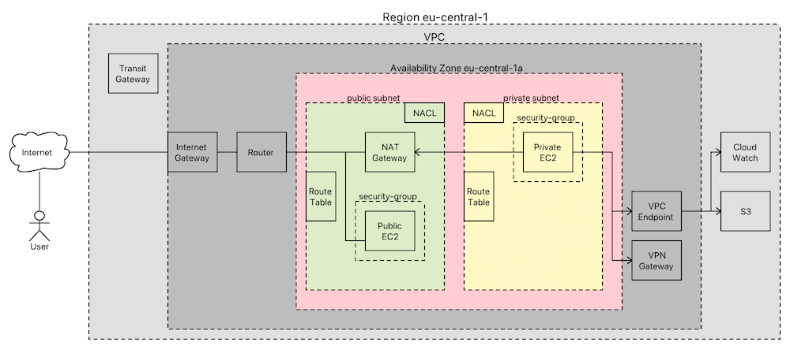

# AWS Netzwerk Knowhow

* [Stephane Marek](https://www.udemy.com/course/aws-certified-solutions-architect-associate-saa-c02/learn/lecture/13528534#overview)
* [Digital Cloud Training](https://www.youtube.com/channel/UCZGGwqjk5jfO4vN1SOCJ2ew)

Wenn man eine neue EC2 Instanz startet, so kann man das **OHNE** all die Sachen zu wissen, da die Default-Konfiguration (angelegt bei der Account Erstellung) schon so ausgelegt ist, daß das alles reibungslos funktioniert. Will man allerdings eine halbwegs professionelle (= sicher, performant) anbieten, dann **MUSS** man sich damit beschäftigen.

Hier sieht man auch sehr schön, warum man beim Starten einer EC2 Instanz die Security-Group, das Subnet, das VPC, ... angeben muß.

---

## VPC - Virtual Private Cloud

* [Stephane Marek](https://www.udemy.com/course/aws-certified-solutions-architect-associate-saa-c02/learn/lecture/13528538#overview)

Die Virtual Privat Cloud ist das Ziel einer jeden Anwendung ... hier wird sie gehostet. Mit dem VPC wird das Internet (= Public Cloud ... Ingress - einkommender Traffic, Egress - ausgehender Traffic) verbunden. Als Anwendungshoster kann ich mich für ein oder mehrere VPC entscheiden. Meistens hat man aber auch verschiedene Hosting-Umgebungen (Development, Test, Staging, Production), die man voneinander durch Nutzung verschiedener VPCs voneinander trennen möchte.

* ein VPC liegt in einer Region, deckt aber alle Availability Zones (AZ) dieser Region ab
  * die Subnets liegen dann in unterschiedlichen AZs
* jeder AWS Account kommt schon vorkonfiguriert mit (um den Einstieg zu erleichtern) ... im Produktionsumfeld sollte alle Komponenten selbst konfigurieren
  * Default-VPC ... ohne VPC geht nix
    * Internet-Zugang vorhanden (Inbound + Outbound)
    * alle EC2 erhalten public IP-addresses ... ready-to-go
    * Route Table vorkonfiguriert
    * DHCP vorkonfiguriert
    * Network ACL vorkonfiguriert
  * Default-Subnets in allen Availability Zones
  * Subnet NACLs
  * Security Groups
  * Internet Gateway
  * Route Table
* besitzt einen oder mehrere CIDR-Ranges und vergibt **PRIVATE** IP-Adressen aus dem 172.xxx.xxx.xxx Netz für die darin befindlichen Netzwerkkomponenten (z. B. EC2-Instanzen)
* IP-Ranges von VPC sollten sich nach Möglichkeit nicht überlagern, damit man später noch ALLE VPCs miteinander verbinden kann (Eindeutigkeit)
* definiert DNS Einstellungen
* konfiguriert einen Flow Log (zur Problemanalyse)

### CIDR

* [CIDR Calculator](https://www.ipaddressguide.com/cidr)

CIDR-Notation Bedeutung

* `192.168.0.0/32`
  * alle 32 Bits sind fest => nur eine einzige IP-Adresse ist in der Range: `192.168.0.0`
* `192.168.0.0/16`
  * die ersten 16 Bits sind fest (`192.168`) und die anderen Variable - Range: `192.168.0.0` - `192.168.255.255`
* `192.168.0.0/30`
  * 30 Stellen sind fest, 2 sind frei => 2^2 = 4 IP-Adressen - Range `192.168.0.0` - `192.168.0.3`

### VPC Peering

* [Stephane Maarek](https://www.udemy.com/course/aws-certified-solutions-architect-associate-saa-c02/learn/lecture/13528554#overview)

* Verbindung zweier VPCs, um den Zusammenschluss zu simulieren (funktioniert natürlich nur, wenn die privaten IP-Adressen nicht überlappen)
  * **Einsatzbereich:** VPCs unterschiedlicher Regionen oder gar Accounts verbinden
* die Route Tables müssen nachgepflegt werden, um den Traffic in das andere VPC über die VPC-Peering-Connection zu routen

### VPC Endpoints (aka AWS PrivateLink)

* [Stephane Maarek](https://www.udemy.com/course/aws-certified-solutions-architect-associate-saa-c02/learn/lecture/13528556#overview)
* eigene Services als VPC Endpoint bereitstellen [Stephane Maarek](https://www.udemy.com/course/aws-certified-solutions-architect-associate-saa-c02/learn/lecture/18078439#overview)

Hosted Services wie S3, DynamoDB, CloudWatch, SNS, ... sind natürlich öffentlich erreichbar und könnten darüber - bei entsprechender Outgoing/Ingoing-Traffic-Konfiguration in den Security-Groups und NACLs - problemlos von einer EC2 Instanz in einem private Network genutzt werden.

**ABER:** das ist natürlich nicht optimal, denn warum sollte man das AWS-Ecosystem verlassen, um den Traffic dann durche öffentliche Internet zu routen (Latenz, Angriffsvektoren). Außerdem kommt es ohne große Konfiguration (NAT-Gateway, Router, Internet-Gateway) aus, sondern kann direkt aus einem private Network genutzt werden (nur die VPC Endpoint Konfiguration wird benötigt).

Die Lösung sind VPC-Endpoints:

* Interface Endpoints
  * hier konfiguriert man "nur" ein Elastic-Network-Interface (= virtuelle Netzwerkkarte) und eine Security-Group darum
  * unterstützt von den meisten AWS Services
* Gateway Endpoints
  * hier muß man die Routing Tables anpassen

---

## Subnet

* gebunden an ein VPC
* gebunden an eine Availability Zone (z. B. eu-central-1a)
* hat einen CIDR-Block ... der muß eine Teilmenge des VPC sein
* typischerweises verwendet man public (wenige IP-Adressen) und private (viele IP-Adressen) Subnetze
* typischerweises hat man pro Availability Zone, die man abdecken möchte, ein private und ein public Subnetz
* Subnetze müssen entsprechend konfiguriert werden, um aus dem Internet erreichbar zu sein
  * für public Ressourcen: Internet Gateway
  * für private Ressourcen (in private Networks): Bastion Host
    * zumindest ssh Zugriff ist hier für Admins erforderlich
* später werden wir weitere Komponenten (z. B. EC2 Instanz) über das zugewiesene Subnet positionieren und so über verschiedene Availability Zones verteilen und Zugriffe managen
* public Subnets sollten auch public IP-Adressen erhalten (sonst werden sie ja von einem User nicht in mein VPC geroutet) ... das muss man aber explizit konfigurieren

---

## Internet Gateway (IGW)

* [Stephan Marek](https://www.udemy.com/course/aws-certified-solutions-architect-associate-saa-c02/learn/lecture/13528544#overview)

* IGW stellt - in Verbindung mit einer Route Table und einem Router - den Zugang zum Internet dar ... also die Grenze zwischen Virtual-PRIVATE-Cloud (VPC) und World-Wide-Web
* von AWS wird sichergestellt, dass es hochverfügbar (skaliert horizontal, Redundanz) ist
* VPC und IGW haben eine 1:1 Beziehung
* ein IGW ohne Route Table hat keinen Wert

---

## Route Table

* regelt das Routing in einem VPC und/oder einem Subnet
* da man private und public Subnets hat, sollte man auch private Route Table (für die privaten Subnetze) und eine Public Route Table (für die public Subnetze) haben

---

## NAT Instance

> **deprecated by NAT Gateway (seit Ende 2020), die AWS-managed sind, höhere Bandbreite und Verfügbarkeit haben**

* erlaubt EC2 Instanzen aus privaten Subnetzen auf das Internet zuzugreifen ... braucht man schon allein, um die Packages des Betriebssystems/Toolings up-to-date zu halten ... also **IMMER**
  * letztlich auch über Router, Route Table und Internet Gateway
  * es wird ein spezielles Amazon Linux AMI bereitgestellt, das als EC2 Instanz im Public-Subnetz deployed wird
* NAT Instance muss im Public Subnetz laufen
  * es agiert als Vermittlungsstelle zwischen WWW und Private Network
    * da die NAT Instance die Sender-IP-Adresse verändert muss die Einstellung "Source-and-Destination-Check" auf der EC2 Instanz des private Networks disabled werden muss
* braucht eine Elastic IP Adresse (= feste IP-Adresse) ... damit die Responses auf Requests auch wieder ankommen
* ein privates Subnetz verwendet Route Table, um den Traffic über die NAT Instance zu routen

---

## NAT Gateway (NATGW)

* [Stephan Marek](https://www.udemy.com/course/aws-certified-solutions-architect-associate-saa-c02/learn/lecture/13528550#overview)

* wird verwendet, um einer privaten Komponente (z. B. EC2 Instanz) Zugriff auf das Internet zu ermöglichen
  * die Route Table muss dazu entsprechend konfiguriert werden
* muss in einem separaten Subnet betrieben werden als eine EC2 Instanz, die es verwenden will
* High-Availability in EINER Availibility Zone
  * ABER: ist gebunden an EINE Availibility Zone => pro AZ ein NAT-Gateway erforderlich
* verwendet eine Elastic IP (feste IP-Adresse)
* braucht ein Internet Gateway (genauso wie eine *NAT Instance*)
* managed by AWS (im Gegensatz zu NAT Instance)
  * man muss keine Security-Groups managen
  * keine OS Patches, Software Installationen
* es wird keine Security-Group gebraucht

> Bastion Hosts sind mit einem NAT Gateway nicht möglich, da man keinen ssh-Zugriff auf das NATGW hat

---

## Security Group (SG)

* [Stephane Maarek](https://www.udemy.com/course/aws-certified-solutions-architect-associate-saa-c02/learn/lecture/26098134#learning-tools)

* Security Groups regeln den Inbound und Outbound Zugriff auf AWS Resourcen (z. B. EC2, Load-Balancers) ... also im Prinzip eine Firewall. Best-Practice ist ALLE AWS Ressourcen von einer Security Group zu umschließen und damit den Zugriff abzusichern. Eine Security Group filtert den Traffic ... wohingegen eine Route Table den Traffic umlenkt, aber keine Authorisierungskontrolle mehr macht.
* EINE Security Group kann für viele Ressourcen verwendet werden - eine Ressource kann viele Security-Groups zugeordnet haben.
* Security Groups sind stateful (im Gegensatz zum NACL), d. h.
  * wenn ein Incoming-Request durch die Security-Group gelassen wurde, dann wird die Response ungeprüft durchgelassen
  * wenn eine Outgoing-Request durch die Security-Group gelassen wurde, dann wird die Response ungeprüft durchgelassen
* eine Security Group erlaubt ausschließlich ALLOW rules ... weil alles andere by default verboten ist

---

## Network Access Control List (NACL)

* [Stephane Maarek](https://www.udemy.com/course/aws-certified-solutions-architect-associate-saa-c02/learn/lecture/13528552#overview)

* ein NACL schirmt den Traffic eines (oder mehrerer) ganzer Subnetze ab (im Gegensatz zur Security Group, die nur eine Ressource abschirmt) ... you see: NACLs können wiederverwendet werden
  * Ephemeral Ports sind in diesem Kontext wichtig, denn die NACLs müssen den Rückweg einer Connection durchlassen ... hierbei handelt es sich um einen beliebigen Port, den der Client beim Aufbau der Verbindung für die Antwort anbietet
* NACL sind stateless (im Gegensatz zur Security Group), d. h.
  * wenn ein Incoming-Request durch die NACL gelassen wurde, dann wird die Response trotzdem nochmals geprüft
  * wenn eine Outgoing-Request durch die NACL gelassen wurde, dann wird die Response trotzdem nochmals geprüft
* ein NACL pro Subnetz
* die Default-NACL erlaubt ALLEN eingehenden und ausgehenden Traffic ... convenience Konfiguration, um die AWS-User-Experience nicht zu zerstören
  * will man NACLs anpassen, dann sollte man **NICHT** die Default-NACL anpassen, sondern eine neue erzeugen und dem Subnet zuweisen
  * ein NACL erlaut ALLOW und DENY Rules (im Gegensatz zur Security Group)

---

## Bastion Hosts

* [Stephane Maarek](https://www.udemy.com/course/aws-certified-solutions-architect-associate-saa-c02/learn/lecture/13528558#overview)

Für den Zugriff auf eine Ressource (z. B. EC2 Instanz) muss sie public sein. Viele Ressourcen werden aber i. a. im private Network versteckt, um Angriffspunkte zu vermeiden. Hier kommen Bastion Hosts ins Spiel, die im Public Subnet laufen und den Zugriff auf das Private Subnet erlauben.

Für diesen Einsatzbereich muss der Bastion Host natürlich vollkommen sicher sein. Deshalb wird man hier den Zugriff nur auf eine bestimmte IP-Range einschränken (z. B. aus einem Firmen-VPN ... und selbst da vielleicht nur für OPS-Admins).

---

## DNS

* [Stephane Maarek](https://www.udemy.com/course/aws-certified-solutions-architect-associate-saa-c02/learn/lecture/13531254#overview)

* DNS-Resolving wird auf VPC-Ebene eingestellt
* AWS stellt einen Route53-DNS-Server unter 169.254.169.253 (public IP!!!) zur Verfügung. Auf diese Weise werden
  * Internet-Names (z. B. www.heise.de) aufgelöst ... wenn eine EC2 Instanz beispielsweise Zugriff braucht
  * public EC2 Instanznamen (z. B. `ec2-52-57-251-205.eu-central-1.compute.amazonaws.com`) auf die IP-Adresse (z. B. `52.57.251.205`) aufgelöst
  * private EC2 Instanznamen (z. B. `web.mycompany.private`) wird auf die private IP-Adresse (z. B. `172.31.46.59` augelöst), um intern auch mit sprechenden Domain-Names zu arbeiten (Route53 Hosted Zones)
* man kann auch einen Custom-DNS-Server starten

### Route53

> Der Name leitet sich aus dem Standard-Port für DNS-Server (53) ab.

Hier lassen sich Private Hosted Zones einrichten, mit dem sich DNS-Namen im eigenen VPC vergeben und auflösen lassen.

---

## Elastic Network Interface (ENI)

* [Stephane Maarek](https://www.udemy.com/course/aws-certified-solutions-architect-associate-saa-c02/learn/lecture/18077955#learning-tools)

Hierbei handelt es sich um die virtuallen Netzwerkkarten einer Ressource.

Das besondere daran ist, daß man sie zur Laufzeit einfach einer anderen EC2 Instanz zuordnen kann, um beispielsweise Fail-over abzubilden (die IP-Adresse bleibt dabei erhalten und der Traffic wird einfach auf eine andere Instanz umgeleitet).

---

## Transit Gateway

---

## Direct Connect (DX)

* [Stephane Maarek](https://www.udemy.com/course/aws-certified-solutions-architect-associate-saa-c02/learn/lecture/13531250#overview)

* private Connection vom Corporate Datacenter ins AWS VPC
  * Zugriff auf Public UND Private AWS Ressourcen
* typischer Aspekt bei Cloud-OnPrem-Integrationsszenarien
* verwendet ein Virtual Private Gateway (VGW) am AWS VPC

---

## Virtual Private Gateway (VGW)

* [Stephane Maarek](https://www.udemy.com/course/aws-certified-solutions-architect-associate-saa-c02/learn/lecture/13528560#overview)

Wird verwendet, um Corporate Networks per VPN mit einem AWS VPC zu verbinden.

### AWS VPN CloudHub

hier lassen sich sogar verschiedene Corporate Standorte über VPN via Virtual Private Gateway (VGW) verbinden.

---

## Troubleshooting

Bei der manuellen Konfiguration (aber auch bei einer Konfiguration via [Terraform](terraform.md)) können sich schnell Fehler einschleichen. AWS stellt ein paar Debugging-Tools zur Verfügung.

### VPC Rechability Analyzer

* [Stephane Maarek](https://www.udemy.com/course/aws-certified-solutions-architect-associate-saa-c02/learn/lecture/28874542#overview)

Mit diesem Tool lassen sich Probleme in der Kommunikationskonfiguration (Subnetze, NACL, Security-Groups, ENI, ...) analysieren, ohne daß dabei Kommunikation stattfindet (d. h. das funktioniert auch in Produktivumgebungen sehr gut). Man bekommt hier sehr detailierte Informationen über das Problem und kann daraus häufig direkt eine Lösung ableiten.

Der Nachteil der AWS Console oder auch Configuration-as-Code ist, daß durch die Verwendung von IDs beim referenzieren der "Code" sehr schwer lesbar ist und so Fehler sehr schwer zu entdecken sind. Zudem ist die Konfiguration häufig weit verstreut und die Konzepte (z. B. NACL vs Security Group = stateless vs stateful) nicht im Detail nicht immer geläufig sind.

> **ABER:** es kostet pro Analyse

### Network Access Analyzer

...

### VPC Flow Logs

* [Stephane Maarek](https://www.udemy.com/course/aws-certified-solutions-architect-associate-saa-c02/learn/lecture/28874566#overview)

Daten werden nach S3 oder CloudWatch geschrieben.
