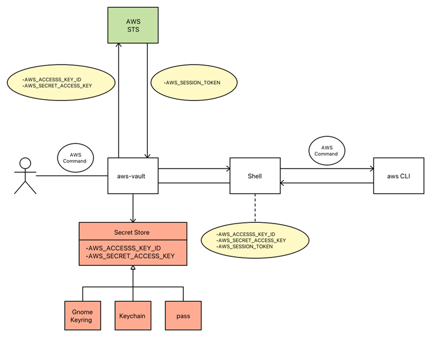

# aws-vault

* [github.com](https://github.com/99designs/aws-vault)

Für die Authentifizierung bei AWS-CLI tools (z. B. [aws cli](aws-cli.md), [kubectl mit AWS-EKS](kubernetes.md), [eksctl](aws-eks.md)) benötigt man credentials in Form von 

* `AWS_ACCESS_KEY_ID`
* `AWS_SECRET_ACCESS_KEY`

Die kann ma in seiner `~/.aws/credentials` unverschlüsselt speichern. Zum Rumspielen ist das geeignet ... für den Einsatz im Enterprise-Umfeld aber ein echtes nogo. Zudem möchte man in diesem Umfeld auch 2-Factor-Authentifizierung verwenden. Man kommt hier nicht herum, in `~/.aws/config` entsprechende Profile zu definieren:

```
[profile developer@devstage]
region = eu-central-1
source_profile = mobi3006
role_arn = arn:aws:iam::123456789012:role/DevelopersAccessRole
mfa_serial = arn:aws:iam::987654321098:mfa/pie@my-email.com
```

`aws-vault` kann man so konfigurieren, dass der `pass` Passwortstore (oder auch die MacOS-Keychain) zur GPG-verschlüsselten Speicherung der Credentials in einer Datei auf der Festplatte verwendet wird. Der GPG-Key wird mit einer sicheren Passphrase geschützt.

Beim Kommando

```
aws-vault exec developer@devstage -- aws s3 ls
```

* GPG-Key freischalten per interaktiver Passphrase Eingabe
* die langlebigen Credentials `AWS_ACCESS_KEY_ID` und `AWS_SECRET_ACCESS_KEY` entschlüsseln
* 2FA-Token interaktiv entgegennehmen
* temporäre Credentials in Form von `AWS_ACCESS_KEY_ID` und `AWS_SECRET_ACCESS_KEY` erzeugen und in der Shell zur Verfügung stellen 

Letztlich stehen diese temporären Credentials dem Kommando `aws s3 ls` als Execution-Context zur Verfügung.



Dieser Ansatz hat nur einen kleine Haken:

> die Auto-Vervollständigungen der CLIs funktionieren auf diese Weise nicht mehr

Man muss also `aws s3 ls` mit der Autovervollständigung zusammenbasteln und dann `aws-vault exec developer@devstage -- ` davor hängen. Noch habe ich keine Lösung dafür gefunden.
