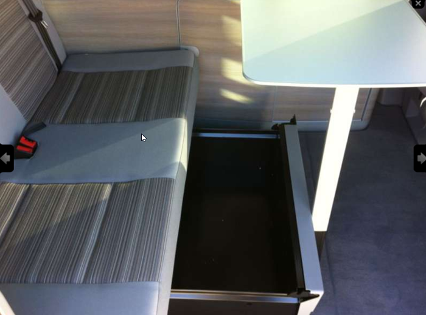
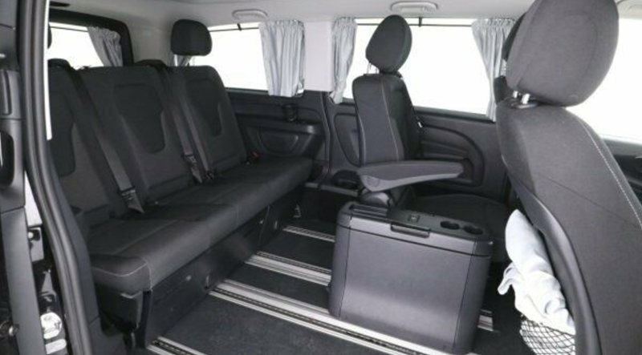

# Campingbus

Jetzt da unsere Kinder immer älter werden, die Flugreisen nicht mehr bezahlbar sind und wir das Campen langsam alle mögen (nicht alle im Zelt), suchen wir nach einer bezahlbaren Urlaubsalternative, die es uns ermöglicht, die Welt zu entdecken. Eine Pauschalreise im Hotel ist hier nicht wirklich geeignet (denn meistens liegt man nur am STrand oder Hotelpool und läßt sich im Hotel bekochen). Als Kind bin ich auch mit meinen Eltern durch Europa getourt und war begeistert - schöne Geschichten, an die ich mich noch 30 Jahre später gerne erinnere.

---

## Alternativen

### Dachzelt

* die Idee gefällt mir
* effizient - keine "Behinderung" im normalen Alltag
* wenig Platbedarf bei Lagerung
* günstig

### Zeltanhänger

* ähnlich wie ein Dachzelt auf einem Mini-Anhänger
* ich mag den Anhänger nicht ... man gewöhnt sich aber vielleicht dran
* hatte ich schon mal und fand es super
  * schnell aufgebaut
  * Stauraum im Anhänger
  * kann man sogar in der Garage abstellen

### Wohnwagen

* an Spießigkeit kaum zu überbieten (auch wenn es jetzt in [Deutschland Airstreams](https://www.airstream-germany.de/) gibt)
* ich will schon keinen Zeltanhänger ziehen ...
* braucht separaten Stellplatz
* wenn man mal was erleben will (wild am Strand übernachten, kurzentschlossen eine Übernachtung auf dem Parkplatz) ...

---

## Anforderungen

### Nutzung

* meistens wird das Auto im Alltag als PKW verwendet ... wir brauchen den Platz in 90% der Nutzungszeit
* 3-4 mal im Jahr Nutzung für den Urlaub (auch schlafen)
* 3-4 mal im Jahr ein verlängertes Wochenende
* Eltern schlafen im Auto - Kinder im Zelt - wir haben ein kleines 3-Kinder Wurfzelt, das in 60 Sekunden auf- und in 180 Sekunden abgebaut ist
  * wir werden im richtigen Urlaub IMMER einzusätzliches Zelt dabei haben, so daß das Auto auch noch für Ausflüge zur Verfügung steht
  * zur Not - bei Zwischenübernachtungen - kann man auch mal mit 2 Erwachsenen und 3 Kindern im Bus schlafen
* im unteren Bereich sollte man auch bequem schlafen können ... wir werden ja auch älter und der Weg nach oben wird dann vielleicht irgendwann doch beschwerlicher

### MUST-HAVE

* 5 Sitzplätze für Erwachsene ... lieber 6-7 (zumindest im Alltag)
* Aufstelldach
* gut motorisiert (ca. 150 PS Diesel)
  * vielleicht hängt man irgendwann mal was dran (Anhängerkupplung) - derzeit aber nicht (höchstens nachrüsten)
  * auch für die Wiederverkauf wichtig
* Park-Distance-Control
  * Rückfahrkamera
* toter Winkel Assistent
* Standheizung (Frühjahr, Herbst)
  * verlängert die Nutzungszeit sicherlich um 2 Monate
* Sitzheizung
* Bluetooth
  * Freisprecheinrichtung
  * Audio-Senke (auch für Navigationssystem am Handy)
* Privacy-Paket (getönte Scheiben hinten)
  * alternativ: Rollos
* im oberen Schlafbereich rechts/links Fliegengitter zur Durchlüftung
* Armlehnen Fahrer/Beifahrer

### NICE-TO-HAVE

* Doppelklimaanlage (damit es hinten auch kühl wird)
* austellbares Heckfenster
* im Aufstelldach nach vorne ein Fenster
* integrierte Schubladen unter der Rücksitzbank
* aufstellbarer Tisch

### DONT-HAVE

* festes Hochdach
* Küche/Spüle
  * niemand kocht in diesem Auto
* Toilette
* Dusche
* Navigationssystem oder großer Radio-Schnick-Schnack
* Multimedia-Support
  * fraglich wie lange das wirklich unterstützt wird ... bei einem Apple-Dienst vielleicht länger als bei einem Android-Dienst - dafür ist Apple sicherlich weniger offen (welche Apps werden unterstützt)
    * ich glaube, daß mein Handy/Tablet immer die aktuellere Software haben wird und auch leicht ausgetauscht werden kann - wichtig ist nur, daß der Ton auf die Auto-Lautsprecher ausgegeben werden kann (Bluetooth)
  * [Apple Carplay](https://www.youtube.com/watch?v=8Bf1sg_tSfM)
    * derzeit muß man noch eine USB-Verbindung herstellen
  * Android Auto
  * [MirrorLink](https://de.wikipedia.org/wiki/MirrorLink)
* Allrad-Antrieb
  * für den Wintereinsatz wäre das ganz nett, aber eigentlich haben wir im Flachland kaum Schnee und für eine Woche Skifahren pro Jahr lohnen sich die 3000 Euro Aufpreis nicht
  * Straßenlage soll allerdings grundsätzlich besser sein
    * Wiederverkauf könnte ein Argument sein - ich glaube aber kein wesentliches
* Automatik
  * im Stau ganz nett
  * ich bin mir nicht sicher, ob die dann auch noch bei höheren Laufleistungen nicht zickt

### DONT-KNOW

* LED-Scheinwerfer - sollen heller sein
* Markise
  * bei Kurzaufenthalten (1-2 Tage ... insbesondere bei Dauerregen - quasi als Vordach, um die Schuhe zumindest mal abstellen zu können) könnte ich mir sie recht nützlich vorstellen
  * bei längeren Aufenthalten wird man ein Zelt aufbauen und dann braucht man die Markise maximal für eine Überdachung zum Zelt

### Problemlösungen

* mobiler Kühlschrank
  * Kompressorkühlbox zwischen Fahrer und Beifahrer
* keine Einbauschränke - eher rausnehmbare Kisten/Einbauschränke
* separates Zelt, so daß man mit dem Auto noch wegfahren kann

### Fazit

Die typischen vollausgestatteter Camper ist für uns nicht interessant, da er mit Ausbau nicht den notwendigen Platz für 5-6 Erwachsenen bietet ... eher einen spartanischer Bus mit Hochstelldach.

---

## Abgasnormen

* [Wikipedia](https://de.wikipedia.org/wiki/Abgasnorm)

... wird ja immer wichtiger in Zukunft - wer will schon einzelne Städte meiden müssen, weil man nicht mehr rein darf :-(

Die meister Camper sind Diesel ... "In dieser Wagenklasse führt am Diesel kein Weg vorbei" ([autozeitung](https://www.autozeitung.de/vw-multivan-mercedes-v-klasse-peugeot-traveller-renault-trafic-test-192199.html))

* aktuell sind
  * Euro 6d (bis 120mg/km NOx)
  * Euro 6d temp (bis 168mg/km)

### AdBlue

> "Abhängig von der NOx-Konzentration und dem Motorzustand wird Adblue zur Reduktion zu Stickstoff, Kohlendioxid und Wasser eingebracht. Der Verbrauch an AdBlue liegt bei etwa 4 % bis 6 % des Kraftstoffverbrauchs[11] oder bei PKWs bis zu 8,5 Liter pro 1000 Kilometer." ([Wikipedia](https://de.wikipedia.org/wiki/AdBlue))

---

## Preisreduktion

* Schwerbehinderung
  * [BBAB](https://www.bbab.de/behindertenrabatt-beim-autokauf/behindertenrabatt-nach-marken/)
  * [ADAC](https://www.adac.de/-/media/adac/pdf/jze/preisnachlass-beim-neuwagenkauf-fuer-menschen-mit-behinderung.pdf?la=de-de)
  * allerdings muß man bedenken, daß die Hersteller/Händler teilweise bis zu 30% Rabatt ohne Schwerbehinderung gewähren ... keine Ahnung, ob das bei den Campern auch so ist
    * in einigen Foren wurde von 8-17% berichtet (aber schon ein paar Jahre her)
* EU-Import
  * ... aber genau schauen, wann das Fahrzeug gebaut wurde ... und wann dementsprechend die Herstellergarantie abläuft
* Lagerfahrzeug
  * ... aber genau schauen, wann das Fahrzeug gebaut wurde ... und wann dementsprechend die Herstellergarantie abläuft

---

## Finanzierung

Am besten man zahlt das Auto ohne Finanzierung ... bei > 40 TEUR kann sich das aber nicht jeder stemmen.

Derzeit bietet Mercedes einen Zins von 2,5% an (bei einer sehr hohen Tilgung - 4 Jahre bis zur Kompletttilgung - 800 Euro Monatsrate => 2000 Euro Zinsen über die Gesamtlaufzeit) ... der Bauzins liegt bei 1,5%.

Im Zeitalter von Negativzinsen macht die Aufnahme eines Kredits keinen Sinn, wenn man über genügend verfügbares Vermögen verfügt. Beim aktuell geringen Preisverfall bei VW-Bussen ist das vielleicht schon fast die bessere Anlage ;-)

### Leasing

> "Dank der niedrigen Monatsraten scheint es auf den ersten Blick auch günstiger zu sein, ein Auto zu leasen anstatt es zu finanzieren. Doch Verpflichtungen, Einschränkungen und mögliche Zusatzkosten am Laufzeitende könnten Ihnen dabei einen Strich durch die Rechnung machen. [...] Und welche Variante ist nun sinnvoll, wenn Sie ein Auto leasen möchten? Wir empfehlen Ihnen das Kilometer-Leasing, da hier das Risiko einer Nachzahlung kalkulierbar ist. So können Sie bereits im Vertrag die Weichen stellen, wenn Sie ungefähr wissen, wie intensiv Sie das Fahrzeug nutzen werden. Beim Restwert-Leasing dagegen überwiegen die Nachteile. Zum einen setzen einige Händler den Restwert bewusst unrealistisch hoch an, um so mit niedrigen Monatsraten werben zu können. Zum anderen kann sich die Marktlage innerhalb der Leasingdauer erheblich ändern, so dass der Restwert drastisch sinkt. Auch ein Unfall während der Leasingzeit hat Einfluss auf den Restwert. Entscheiden Sie sich am Vertragsende das Auto zu kaufen, kann es zudem sein, dass der Restwert nicht mit dem Kaufpreis übereinstimmt – Sie müssen dann also mehr für das Fahrzeug zahlen." ([Dr. Klein](https://www.drklein.de/auto-leasing.html))

* man wird nur als Halter im KFZ-Schein eingetragen ... Eigentümer bleibt der Leasing-Geber
* Anzahlung - häufig auch ohne
* monatliche feste Rate über meistens 2-4 Jahre
* nach der Leasingzeit:
  * Rückgabe
    * ACHTUNG: hier wird vermutlich jeder kleine Kratzer als grpßer Schaden bewertet
  * weiter leasen
  * kaufen (Leasingvertrag sollte dann eine Kaufoption beinhalten)

> "Unser Fazit: Wenn Sie das Fahrzeug nicht beruflich nutzen möchten, ist eine Finanzierung in den meisten Fällen besser als Auto-Leasing. Denn auch wenn die Monatsraten günstig klingen – nach Vertragsende ist das Fahrzeug noch lange nicht abgezahlt. Hier würden Sie noch eine hohe Abschlusszahlung leisten müssen, wenn Sie das Auto kaufen möchten. Im Gegensatz zum Autokredit: Hier zahlen Sie wahrscheinlich eine höhere Monatsrate, dafür ist das Auto aber nach der Vertragslaufzeit bezahlt und gehört Ihnen." ([Dr. Klein](https://www.drklein.de/auto-leasing.html))

Bei [leasingmarkt.de](https://www.leasingmarkt.de) habe ich mir einen sehr gut ausgestatteten (Standheizung, Einparkhilfe, Privacy) T6.1 angeschaut. Die reinen Nutzungskosten (keine Versicherung/Wartung) - eine Reparatur/Inspektions-Inklusion liegt bei 80 Euro pro Monat:

* bei 15.000 km Laufleistung:
  * 48 Monate ohne Anzahlung: 634 Euro x 48 = 30.400
  * 48 Monate mit 10.000 Euro Anzahlung: 426 x 48 + 10.000 = 30.400
  * 48 Monate mit 20.000 Euro Anzahlung: 218 x 48 + 20.000 = 30.400
* bei 10.000 km Laufleistung:
  * 48 Monate ohne Anzahlung: 590 Euro x 48 = 28.300
  * 36 Monate ohne Anzahlung: 673 Euro x 36 = 24.200

=> Anzahlung bringt gar nichts???

* 1,99% Sollzins:
* Bruttolistenpreis: 64.354,00 €
* Kaufpreis: 52.990,00 €

### Bank-Finanzierung

* hier kann man hohe Barzahler-Rabatte (10-20%) nutzen (im Gegensatz zum Leasing)

### Mieten

Bei [multicamper.de](https://multicamper.com/) kann man einen Camper für ca. 100 Euro/Tag mieten - die Firma ist gerade mal 10km von uns entfernt ... das wäre also sehr unproblematisch. Bei einer Nutzung von 4 Wochen im Jahr kommt man da auf 3000 Euro Miete. Im Vergleich zu einem Leasing mit 30.000 Euro in 4 Jahren könnten wir zum gleichen Preis 10 Jahre mieten.

### Fazit

In Anbetracht der aktuellen Diesel-Diskussion mit angedrohten/geplanten Fahrverboten und einer unsicher Zukunft macht ein Kauf keinen großen Sinn, weil

* wir nicht wissen, wie lange uns das Campen Spaß macht
* wir nicht unbedingt gezwungen sein wollen, einen Camping-Urlaub zu machen (hat man einen Camper für 50.000 Euro gekauft, dann muß man ihn auch für den Urlaub nutzen sonst rentiert es sich nicht)
* wie sich die Fahrverbote entwickeln
* wie sich die Kraftstoffpreise entwickeln
* wie sich Elektroautos entwickeln - vielleicht sind E-Autos (oder andere Energiequellen) in Zukunft auch für größere Strecken ausgelegt ... wir befinden uns gerade in einer Übergangsphase

Bewertung der Alternativen:

* Kauf:
  * ein Verkauf nach einigen Jahren kann also einen großen Verlust bedeuten
* Leasing:
  * im Vergleich zum Mieten macht es keinen Sinn (siehe Rechnung oben)
* Mieten
  * ist derzeit die beste Variante - sollten wir irgendwann einen neuen Alltagswagen brauchen, dann könnten wir allerdings über einen Kauf nachdenken. Vielleicht hat sich die Zukunft der Diesels bis dahin geklärt.

---

## VW California Beach - Bulli T5

Hier gibt es wohl große Probleme mit einer Dichtung, die zu großem Ölverbrauch führt und mittelfristig zu einem kaputten Motor.

---

## VW California Beach - Bulli T6

> Beach < Coast < Ocean ... Beach ist ohne Küche/Schränke ... [siehe hier](https://www.mieten-testen-kaufen.de/mieten/wohnmobile/vw-t6-california-beach/?file=files/cts-theme/pdf/VW-California/Der-neue-California-Der%20neue%20California.pdf)

Der T6 ist wohl nur ein T5-Upgrade und keine Neuentwicklung.

### Infos

* sehr teuer ... selbst 10 Jahre alte mit 200 TKM kosten noch über 20.000 Euro
* träges DSG (Automatik)
* 4,90m Länge
* [3-monatiger Auslieferungsstopp wegen zu hohen Schadstoffemissionen](https://www.autozeitung.de/lieferstopp-vw-192423.html)
* Ausbau von Sitzen ist nicht komfortabel ... die Sitze sind sehr schwer
  * "Beim Sitzausbau meine ich vor allem wenn die Sitzbank von hinten (6- Sitzer) nach vorne soll (5-Sitzer). Das ist bei mir leider öfter fällig und endete beim letzten Mal im Tobsuchtsanfall" ([motor-talk](https://www.motor-talk.de/forum/t6-oder-v-klasse-kaufhilfe-erbeten-t6233500.html?page=6))

### Preis

Unsere Ausstattung beim VW-Konfigurator:

* Beach - 150 PS: 53.500 Euro ... 55.000 Euro
  * Abgasnorm: 6dtemp
  * Privacy Paket
  * halbautomatische Klimaanlage 2-Zonen (bei Mercedes Aufpreis)
  * Halogen-Licht
    * Aufpreis LED: 2000 Euro
  * Extra - Sitzheizung: 500 Euro
  * Extra - Standheizung: 1800 Euro
  * Extra - Rückfahrkamera: 300 Euro
  * Aufpreise (optional):
    * Markise: 690 Euro
    * Gepäcksicherungsnetz: 250 Euro
    * Zusatzsitz: 580 Euro
    * Zulässiges Gesamtgewicht 3080kg: 1000 Euro

Bei Import-Fahrzeugen muß man die Ausstattung genau anschauen ... teilweise ist die Ausstattung anders - das kann zu Enttäuschungen führen.

---

## VW California Beach - T7

2021 soll das neue Modell auf Basis MQB (modularer Querbaukasten) auf den Markt kommen. Er bietet Vorteile für Volkswagen, da auf ihm eine Vielzahl von PKWs basieren werden (Caddy, Sharan, ...) - dadurch lassen sich Fahrzeuge günstiger bauen. Es bietet 48 Volt Bordnetz, auf dem Infotainment-Systeme aufsetzen.

Die Nutzlast wird allerdings geringer sein als bei den vorherigen Modellen (bis T6.1), so daß das alte Modell weiterhin für Nutzfahrzeuge (Transporter) weitergenutzt wird. Für Camper ist die Nutzlast aufgrund der Zuladung (u. a. Küche, Gepäck, Personen) von wichtiger Bedeutung. Beim Mercedes Marco Polo ist das für viele schon jetzt ein Argument für den VW-Bus T5/T6.

Den T7 wird es nicht als reinen E-Bus geben - das kommt erst mit dem ID Buzz, der 2022 auf den Markt kommt. Für Camper wäre das aufgrund der typischen Fahrleistung wahrscheinlich keine dauerhafte Lösung, aber ein PlugIn-Hybrid wäre vermutlich die beste Alternative - so könnte man in der Stadt elektrisch fahren und die Fahrverbote umgehen. 

---

## Mercedes Marco Polo

> MP Activity Edition < MP Activity < MP Horizon Edition < MP Horizon < Marco Polo ... [siehe hier](https://www.mieten-testen-kaufen.de/mieten/wohnmobile/mercedes-marco-polo/?file=files/cts-theme/pdf/Mercedes-Marco-Polo/Mercedes_Marco_Polo_2017.pdf)

### Infos

* Activity basiert auf Vito, ab Horizon basiert er auf der V-Klasse
* Edition Modelle haben bereits viele Extras drin
* teuer, aber günstiger als die VWs
* Ausbau von Westfalia
* 5,14m Länge
* Höhe
  * Activity: 1,98 m
  * Horizon / Marco Polo: 2,00 m
  * Grund der unterschiedlichen Höhen liegt daran, daß Activity auf Vito basiert und die anderen auf der V-Klasse
* Maximalgewicht: 3100 kg
  * Nutzlast
    * zwischen 670 und 1000 kg
      * Automatik verringert die Nutzlast um 250 kg
      * Allrad verringert die Nutzlast um 70 kg
* durch Tellerrost (oben) sind die beiden Liegeseiten voneinander entkoppelt (der andere kullert nicht weg)
  * Liegefläche oben 1,13 breit
  * Liegefläche unter 1,35 breit
* Ausbau von Sitzen ist nicht komfortabel ... aber hier gab es auch schon andere Meinungen ("Also das ist m.E. definitiv kein Makel der V-Klasse")
  * "bei der V-Klasse kann eine 3er-Sitzbank mit umlegbarem/herausnehmbaren äußeren Sitz konfiguriert werden" ([motor-talk.de](https://www.motor-talk.de/forum/t6-oder-v-klasse-kaufhilfe-erbeten-t6233500.html?page=5))
* die Variante mit einem Einzelsitz ist interessant

  

* bei mobile.de habe ich im August 2019 bei den Gebrauchtwagen ab 2016 insgesamt 103 Treffer erhalten ... nur 1 Wagen hatte ein Schaltgetriebe - 102 Automatik

### Preis

* [Schwerbehinderung-Rabatt](https://www.adac.de/-/media/adac/pdf/jze/preisnachlass-beim-neuwagenkauf-fuer-menschen-mit-behinderung.pdf?la=de-de) (mind. 50% GdB)
  * 15% auf Listenpreis
  * 2% zusätzlich auf Marco Polo
* je nach Ausstattung gibt es den mit
  * Vorderrad-Antrieb (nur bis 136 PS)
  * Hinterrad-Antrieb
  * Allrad-Antrieb
* Allrad => Automatik
  * damit verteuert sich der Activity (Edition gibt es so nicht) mit 136 PS um 8.000 Euro
  * Automatik gibts auch ohne Allrad
* Automatik kostet ca. 4000 Euro
* Allrad kostet ca. 4000 Euro
* Grundpreis - Schaltgetriebe
  * Activity - 200d - 136 PS: 48.200 Euro
    * CO2 Ausstoss: 179 g/km
  * Activity Edition - 200d - 136 PS: 46.500 Euro
  * Activity Edition - 220d - 163 PS: 50.500 Euro
    * allerdings mit Automatik (ohne gibts den nicht) ... somit kostet die Automatik keinen Aufpreis
  * Horizon Edition - 220d - 163 PS: 58.000 Euro
    * allerdings mit Automatik (ohne gibts den nicht)
    * CO2 Ausstoss: 161 g/km
* ACHTUNG: scheinbar gibt es den auch mit unterschiedlichen Gewichtsvarianten
* Unsere Ausstattung
  * Activity Edition 163 PS: Activity Edition 136 PS + 4000 Euro
    * dann ist die Automatik schon drin
    * gebraucht: 41.900 VB
      * 1 Jahr alt
      * 35 TKM
      * feste Anhängerkupplung
      * Park-Paket
      * Sitzheizung
      * 1 Zusatzeinzelsitz
      * Lordosenstützen vorne
      * Zusatzwärmetauscher hinten
      * Colorverglasung im Fond ... gegen Hitze/Blickschutz?!?
      * Abgasnorm Euro 6b
        * dachte die haben 6dtemp?!?
      * 3100 kg Maximalgewicht
      * OHNE Standheizung
  * Activity Edition 136 PS: 48.500 Euro ... 50.000 Euro
    * Abgasnorm: 6dtemp
    * Alufelgen
    * Colorverglasung im Fond ... gegen Hitze/Blickschutz?!?
    * Sitzheizung vorne
    * Lordosenstütze vorne
    * halbautomatische Klimaanlage vorne
    * klappbarer Tisch
    * Halogen-Licht
      * Aufpreis LED: 2000 Euro
    * Extra - Standheizung: 1800 Euro
      * **ACHTUNG:** man kann den ab Werk optional erhältlichen Zuheizer für 200 Euro zu einer vollwertigen Standheizung umbauen
    * Extra - Park-Paket (mit Rückfahrkamera): 300 Euro
    * Aufpreise (optional):
      * zusätzlicher Einzelsitz: 750 Euro
      * Gepäcksicherungsnetz: 250 Euro
      * 12V-Steckdose im Kofferraum: 60 Euro
      * Zurrösen für Schienensystem: 40 Euro
      * Totwinkel-Assistent: 570 Euro
      * zwei zusätzliche Schlüssel: 160 Euro
      * Teppichboden: 300 Euro
      * Akustikpaket (weniger Innengeräusche): 300 Euro
      * Zusatzwärmetauscher im Fond: 420 Euro
      * Klimaanlage im Fond: 720 Euro
      * Schlafauflage Bett unten: 400 Euro
      * Einfülldeckel Diesel in rot: 20 Euro

---

## Vergleich VW vs. Mercedes

### Pro VW

* VW ist deutlich leichter und hat somit die höhere Zuladung
* der unteren Schlafbereich ist zum Schlafen bequemer
  * fast plan
  * bessere Matratze
* cooler
* Raumnutzung angeblich effizienter
* mehr Ablagemöglichkeiten
* kürzer bei gleichem Innenraum
  * ABER: angeblich wurde der Mercedes 15cm länger gemacht, um die Sicherheit zu erhöhen - VW hat hier wohl Nachholbedarf
    * [VW T5 Crashtest von 2013 - mangelnder Fußgängerschutz, sonst gut](https://www.autobild.de/artikel/vw-t5-im-euro-ncap-crashtest-4471041.html)

### Pro Mercedes

* ein wenig günstiger
* im Fond bessere Sitze, die zum Liegen aber unbequemer sind
* eleganter
* als Fahrer noch mehr wie PKW (man sitzt niedriger)
* jüngeres Fahrzeug - VW T6 ist eigentlich ein T5 mit Facelifts (keine Neuentwicklung)
  * vielleicht sind damit aber auch alle Kinderkrankheiten beim VW beseitigt
* Ausbau von Sitzen ist bei beiden nicht komfortabel, aber
  * "bei der V-Klasse kann eine 3er-Sitzbank mit umlegbarem/herausnehmbaren äußeren Sitz konfiguriert werden [...] In der Tat ist da System mit den Einhaken und Einsetzen etwas anspruchsvoll, aber nur wenn man das System nicht kennt. Wenn man das einmal verstanden oder ordentlich erklärt bekommen hat, geht es meiner Meinung nach sehr einfach. Vor Allem sehr flexibel." ([motor-talk.de](https://www.motor-talk.de/forum/t6-oder-v-klasse-kaufhilfe-erbeten-t6233500.html?page=5))
  * die Sitze sind leichter ... insbesondere wenn man einen Einzelsitz hat

### Meinungen anderer

* "Der T6 ist eigentlich ein T5.3 und von der Entwicklung ein 15 Jahre altes Auto... Ich hatte im Multivan (fast immer) Abgasgeruch im Auto (Krümmerundichtigkeiten beim 5 Zylinder) und das grenzt an Körperverletzung. VW meinte, da bin ich ein Einzelfall...das TX-Board berichtet anders. Jedes Auto hat Licht & Schatten. Ich finde der T5/T6 ist toll, man sitzt höher und der Innenraum ist vom Nutzen und Variabilität durchdachter. In der V-Klasse sitzt man eher wie in einem größeren PKW, Diesel-Automatik kann MB am besten (mein Gefühl) und ich fahre entspannter, ruhiger damit." ([Motortalk - Blacktron2001](https://www.motor-talk.de/forum/t6-oder-v-klasse-kaufhilfe-erbeten-t6233500.html#commentlistJumpMarker))
* "gute Dauertestbewertung bei AMS und Autobild; während die T6/T5 und sonstige VW unserer Freude durchweg sehr defektanfällige Autos sind" ([Motortalk - SuperBausH
](https://www.motor-talk.de/forum/t6-oder-v-klasse-kaufhilfe-erbeten-t6233500.html#commentlistJumpMarker))

---

## Pössl Campster

### Infos

* seit 2017
* auf Citroen Basis
* fährt sich wie ein PKW
* sehr flexibel
  * bis zu 7 Sitzer
  * rausnehmbarer Küchenblock
* zwei Schiebetüren
* gefällt mir gut
* mit 1,99 Höhe kommt man in jedes Parkhaus und sogar auf die Parkplätze am Strand (meist auf 2m beschränkt)
* mit 1,92m sehr schmal (VW, Mercedes: 2,25m)
  * müßte man mal schauen, ob man da Platzangst bekommt
  * unser Galaxy ist auch nur 1,88 breit und 3 Personen nebeneinander passen gut
* Berichte:
  * [Autozeitung](https://www.autozeitung.de/neuer-poessl-campster-blue-hdi-193748.html)
  * "Tiefgaragentauglich, schnell und sparsam: Beim Fahren verhält sich der Campster fast wie ein Pkw. VW T6 und Mercedes V-Klasse fahren feiner, kosten aber auch mehr. Beim Campen verlangen der günstige Preis und das stadttaugliche Format Kompromisse bei Platz und Komfort. Mit Verdunkelungen und einem komfortableren Bett würde der Campster zu einem guten Camper für mehr als ein bis zwei Nächte." ([auto-motor-und-sport](https://www.auto-motor-und-sport.de/fahrbericht/poesl-campster-2018-fahrbericht-camping-bus-wohnmobil-1/))

### Berichte

* [Begeisterung](https://www.youtube.com/watch?v=kbEUxSYWceo)

---

## Pössl Vanster

* basiert auf Citroen Jumpy
* unter 30 TEUR

---

## Hymer Crosscamp

> Dieses Auto ist fast baugleich zum Pössl Campster, da die Basis (Citroen, Toyota) gleich ist und der Ausbau von Unternehmen (Pössl, Hymer) gemacht wurde, die beide zur Detleffs-Gruppe gehören.

### Infos

* siehe Crosscamp
* seit April 2019
* auf Toyota Verso Proace

### Berichte

* [Begeisterung](https://www.youtube.com/watch?v=90xEAe5nMtM)

---

## Opel Crosscamp

> Dieses Auto ist fast baugleich zum Pössl Campster, da die Basis (Citroen, Toyota) gleich ist und der Ausbau von Unternehmen (Pössl, Hymer) gemacht wurde, die beide zur Detleffs-Gruppe gehören.

---

## Ford Nugget

* gibt es mit Hochstelldach und festem Hochdach
* gibt es aber scheinbar nur mit Küche und Gedöns

---

## Adria Active - Renault Traffic

* sehr ähnlich zum Campster/Crosscamp
* ab 2020

---

## Hymer Car Sidney - Ducato

* Länge: 4,96
* Höhe: 2,35
* Breite: 2,05
* 4-5 Personen

* [Video](https://wwww.youtube.com/watch?v=OVQrRGj44gA)

---

## Eigenumbau vom Profi

* Spacecamper

---

## Zubehör

* Einbauküchen
  * z. B. im Schienensystem montiert
  * von Vanessa
* Liegeauflage
  * von Vanessa
* Kühlschrank
  * von Engel

---

## Testen

Für 40.000 Euro will ja keiner die Katze im Sack kaufen ...

* [Multicamper](https://multicamper.com/)
* https://www.mieten-testen-kaufen.de
* [Paul Camper](https://paulcamper.de/)
* [Roadsurfer](https://roadsurfer.com/de/)
  * nicht in unserer Gegend

---

## Tour de Benelux

Über Pfingsten wollten wir eigentlich einen VW-Bus mieten und über Belgien nach Holland touren. Leider hat uns Corona einen Strich durch die Rechnung gemacht.

## Tour de France

Für 2021 haben wir definitiv eine Tour in Europa geplant ... 2-3 Wochen, um das Der-Weg-ist-das-Ziel zu testen. Die Kinder sind schon Feuer und Flamme und wir wollen - nach einigen Jahren auf einem festen Stellplatz auf dem Campingplatz - mal was neues ausprobieren.

> Auf einer kleineren Vorab-Tour (verlängertes Wochenende) sollte wir erste Erfahrungen sammeln, um die Tour vorab zu optimieren. Vielleicht über Pfingsten 2021.

Die Planung startet im Sommer 2020 ... viel Zeit, um sich entsprechend vorzubereiten.

Ich bin ein Freund der Reduktion und Optimierung ... leben auf kleinsten Raum begeistert mich deshalb. Eine Art Entschlackung des Lebens. Zudem möchte ich meinen Kindern gern auch das echte Leben in fremden Ländern näherbringen ... und das geht eben nicht in einem 4-Sterne-Touristen-Bunker mit All-Inklusive. Stattdessen möchte ich morgens auf den Markt gehen, einen Espresso trinken, die Leute kennenlernen und lokale Spezialitäten auszuprobieren ... selber kochen spielt dabei eine wichtige Rolle. Kulturoffen. Diese Werte möchte ich meinen Kindern vermitteln.

### Fahrzeug

Ein VW-Bus ohne Küche mit Aufstelldach wäre unsere erste Wahl. Den Kauf eines solchen Fahrzeugs hatten wir ja schon mal erwogen.

> Ich könnte mir auch vorstellen, mal länger mit der Familie unterwegs zu sein - entweder mit Arbeiten als digitaler Nomade oder eben mit Sonderurlaub.

Das ermöglicht uns auch mal mit einem kleinen 3-Mann-Zelt (2 schlafen im Bus) eine Nacht zu verbringen, um dann am nächsten Tag schnell weiter zu fahren. Normalerweise würden wir sicher ein großes Zelt aufbauen, um den Bus dann vor Ort auch als Auto nutzen zu können.

### Zelt

Mit unserem 3-Mann-Zelt von Quechua sind wir sehr zufrieden, doch für eine VW-Bus-Tour ist ein größeres Zelt sicherlich´erforderlich.

Wir haben zwar ein ALDI-Zelt, doch hier sind schon einige Stangen gesplittert ... vielleicht können wir im SSV-2020 ein Schnäppchen machen.

### Luftmatratzen

Unser Luftmatratzen müssen auf jeden Fall ausgetauscht werden ... zumindest meine. Ich fühle mich beim Aufstehen wie ein 70jähriger. Die Oberschenkel schmerzen nach jeder Nacht.

Vielleicht ist ein Luftbett eine Alternative ... oder ein Feldbett, das aber mehr Platz verbraucht und vielleicht auch nicht so bequem ist.

### Internet

Die meisten Campingplätze bieten WLAN an ... Glücksache, ob das gut funktioniert - zudem sollte man über VPN nachdenken.

Vielleicht braucht es auch eine mobile Lösung ... lokale Prepaid-Karten, Roaming, ...

Mein [Slate](slate.md) könnte hier eine Rolle als Router spielen.

### Gepäck

Unser Ford Galaxy hat schon einen großen Kofferraum und wir sind in den letzten Jahren in einen vollausgestatteten Wohnwagen (mit Geschirr, 2 fertigen Schlafplätzen, volleingerichtete Küche) eingezogen. Das müssen wir dann selbst mitnehmen ... der Kofferraum war trotzdem schon voll.

Hier müssen wir sicher effizienter werden oder einen Dachgepäckträger verwenden.

### Navigation

Hier sind wir mit Online-Navigation (Google Maps, Waze) sehr gut bedient.
