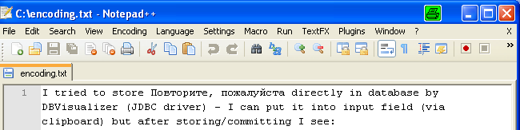
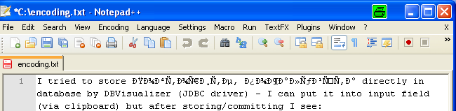

# Zeichenkodierung
Zeichenkodierung gehört zu den unangenehmen Themen der Softwareentwicklung. Über Rechner- und Systemgrenzen hinweg sind Probleme vorprogrammiert. Zeichencodierung spielt aber nicht nur im Umgang mit Dateien eine Rolle, sondern auch bei Netzwerkkommunikation (Sockets, Webservices) und HTML-Seiten.

In einer komplexen Anwendung ist das Thema Encoding sehr wichtig, spielt aber häufig - vollkommen zu unrecht - eine sehr untergeordnete Rolle. Häufig eskaliert die Situation dann beim Rollout der Anwendung - wenn sie also zum ersten mal auf einem anderen Betriebssystemen oder in einer anderen Kontinent genutzt wird.
Das Thema Encoding zieht sich durch das Frontend (HTML-Seiten), in die Netzwerkkommunikation (Webservices, Message-Orientierte Schnittstellen), in den Java-Code, bis in Dateien und Datenbanken (und sogar in den Datenbanktreiber). Man sollte sich also in diesem Bereich schon ein wenig auskennen ...

## Gute Quellen
* http://let.imperia.org/howto/de/unicode/
* http://toscho.de/2008/grundlagen-zeichenkodierung/
* http://openbook.galileocomputing.de/javainsel/javainsel_04_001.html#dodtpf9e801db-5792-4027-b227-959ce38b22cf

# Häufig verwendete Codierungen

* Wikipedia nach ASCII, Cp1251 (aka ANSI), Unicode, UTF-8, UTF-16, UTF-32 suchen
* http://openbook.galileocomputing.de/javainsel/javainsel_04_001.htm#mj71fbc84ad33a281b9352b0b19fae2fb2

## ASCII

Zu Beginn des Computerzeitalters verwendete man nur ASCII-Kodierung (im PC-Bereich) und EBCDIC-Kodierung (im Grossrechner-Bereich), bei der jedes Zeichen 1 Byte Speicherplatz brauchte. Somit war der Zeichensatz auf 128 (bei 7-Bit-ASCII) bzw. 256 verschiedene Zeichen beschränkt - damit konnte man viele Sprachen nicht unterstützen - es fehlten einfach Zeichen. Im ursprünglichen 7-Bit-ASCII gab es nicht mal Zeichen für die deutsche Sprache (Umlaute fehlten). Deshalb gab es sehr schnell den 8-Bit-ASCII. Schnell entwickelten sich Abwandlungen des ASCII-Codes, die man als sog. Codepages bezeichnet. Die "normalen" Schriftzeichen sind darin i. a. gleich (haben den gleichen Code), aber die Zeichen im hinteren Code-Bereich unterscheiden sich:

* http://de.wikipedia.org/wiki/Codepage_850

Seitdem reicht es nicht, wenn man von ASCII spricht - denn das kennzeichnet nur die 8-Bit Codierung. Entscheidend ist die Angabe der Codepage. Problematisch ist das, wenn man ASCII-Dateien austauschen will und die Anwender unterschiedliche Codepages verwenden (insbesondere wenn sie aus unterschiedlichen Ländern kommen oder unterschiedliche Betriebssysteme verwenden). Dann werden die Zeichen nämlich unterschiedlich dargestellt - das führte einige Zeit auch dazu, dass Norton-Commander (der verwendet die in einige Codepages als Rahmenelemente definierte Codes) keinen ordentlichen Rahmen mehr ausgeben konnte. Für Internationalisierung verwendet man am besten die Codepage 850.

## ANSI aka Windows Codepage 1251 (aka Cp1251)

Diese Codierung ist der Standard bei Windows-Systemen. Gegenüber ISO-8859-1 ist das Codeset leicht modifiziert.

## Unicode

Im ASCII-Zeichensatz waren nicht nur darstellbare Zeichen kodiert, sondern auch Steuerzeichen (von 00 bis 1F). Diese wurden von Bildschirmen und Druckern entsprechend interpretiert wurden. Das verringerte natürlich die Menge der darstellbaren Zeichen. Ausserdem gab es Sprachen, die im ASCII-Zeichensatz gar nicht berücksichtigt wurden (z. B. russisch, chinesisch).

Deshalb hat man Unicode eingeführt - es gibt verschiedene Unicode Zeichensätze. Ein (es gibt mehrere!!!) weit verbreiteter Unicode-Zeichensatz ist UTF-8 (Unicode Transformation Format), der bei XML angenommen wird, wenn kein "encoding" explizit angegeben ist. UTF-8 kann bis zu 4 Byte pro Zeichen zur Codierung verwenden - theoretisch wären damit 2^32 = 4.294.967.296 Zeichen codierbar (im Minimalfall werden 8 Bit verwendet). Daneben gibt es auch noch andere Unicode-Codierungen: UTF-16, UTF-32.
Eingeschränkt wird diese theoretische Zahl durch die Rückwärtskompatibilität zum ASCII-Code und die variable Länge der Zeichencodierung - dadurch verringert sich die tatsächlich codierbare Zeichenanzahl auf 1.114.112. Die ersten 128 Zeichen des ASCII Codes werden in UTF-8 genauso codiert (also mit einem Byte), d. h. eine mit 7-Bit-ASCII codierte Datei lässt sich problemlos mit einem Interpreter öffnen, der auf UTF-8 eingestellt ist. Andere Zeichen werden mit 2 oder 4 Bytes codiert, doch dazu braucht man natürlich Zeichentrenner, d. h. der Interpreter muss wissen wieviele Bytes zu einem Zeichen codiert werden. Das geschieht durch Bit-Muster (siehe Wikipedia):

    ein zwei Byte-Zeichen ist folgendermassen codiert (beginnt mit zwei Einsen): 110xxxxx 10xxxxxx
    ein drei Byte-Zeichen ist folgendermassen codiert (beginnt mit drei Einsen): 1110xxxx 10xxxxxx
    ein vier Byte-Zeichen ist folgendermassen codiert (beginnt mit vier Einsen): 1110xxxx 10xxxxxx

**Beispiel verschiedener Unicode-Codierungen:**

Das "süß" aus folgendem XML-Text

```xml
<x>süß</x>
```

wird folgendermassen codiert:

* ISO-8859-1: ``73 FC DF`
* UTF-16 (little endian): ``73 00 FC 00 DF 00``
* UTF-8: ``73 C3 BC C3 9F`` 
  * ACHTUNG: das ``s`` braucht nur 1 Byte, die Umlaute jeweils 2 Byte

Am besten man spielt mal mit einem guten Texteditor (Notepad++, Ultraedit) rum - hier kann man komfortabel zwischen den verschiedenen Codierungen umschalten.

Die Codierung entscheidet auch über die Größe der Datei (bzw. die übers Netz übertragenen Daten). Eine Datei mit 300 Zeichen "ü" hat in

* ASCII eine Größe von 300 Byte
* UTF-8-Codierung ohne Byte-Order-Mark eine Größe von 600 Byte
* UTF-8-Codierung mit Byte-Order-Mark (0xefbbbf) eine Größe von 603 Byte

## UTF-8

Bei diesem Encoding kann man tatsächlich eine Validierung durchführen. Wenn man also denkt, eine UTF-8 encodierte Resource erhalten zu haben, dann kann prüfen, ob es sich tatsächlich um eine als UTF-8 interpretierbare Nachricht handelt. Scheinbar sind nicht alle Bitkombinationen vergeben, so daß das möglich ist. Aber selbst wenn keine Verstösse gegen UTF-8 vorliegen, könnte es sich dennoch um eine andere Codierung handeln - es findet ja keine semantische Analyse statt.

---

# Probleme mit Codierungen
## Sender vs. Empfänger - unterschiedliche Interpretation
Dass es zu Problemen kommt, wenn eine Datei in ISO-8859-1-Codierung erstellt wurde (also ``73 FC DF`` in der Datei steht) und dann als UTF-16 interpretiert wird, sollte an vorigem Beispiel klar geworden sein.

## Implizite Codierungen
Leider wird die Situation dadurch erschwert, daß viele Dateien keine Information tragen, in welchem Format sie codiert wurden - insofern ist man auf Konvention oder Absprachen angewiesen. UTF-16 Dokumente haben eine solche Codierung innerhalb der Datei ... die sog. *Byte-Order-Mark* (sie beginnen mit den Hexwert ``0xFEFF``). XML-Dateien tragen die Codierung innerhalb der Nutzdaten (im XML), was aber evtl. von einigen Editoren unberücksichtigt bleibt (ein stinknormaler Editor wird das XML-Format nicht kennen ... es handelt sich für ihn nur um eine Textdatei ... er interpretiert den Inhalt nicht). Dadurch könnte eine XML-Datei die Kennzeichnung ``UTF-8`` haben (das ist übrigens der Standard, wenn eine XML-Datei keine Encoding-Information trägt), aber auf der Festplatte in UTF-16 oder ASCII mit Codepage 850 codiert sein.

## Explizite Codierungen
### Byte-Order-Mark
Dies ist eine Kennzeichnung, in welchem Zeichensatz die Datei codiert ist. Bei UTF-x kann man sie bei der Abspeicherung einfügen lassen (man kann es aber auch weglassen). Die Byte-Order-Mark steht am Anfang der Datei.

```
ef bb bf: für UTF-8
```

### Metadaten in XML-Dateien
Das Default-Encoding einer XML-Datei ist UTF-8. Man kann aber explizit auf andere Encodings wechseln:

```xml
<?xml version="1.0" encoding="ISO-8859-1">
```

### Metadaten in HTML-Dateien
```xml
<meta http-equiv="Content-Type" content="text/html; charset=UTF-8">
```

### Metadaten im eMail- oder im HTTP-Header
```
Content-Type: text/plain; charset="ISO-8859-1"
```

## Standard-Datei-Encoding: Windows vs. Linux
Die Standard-Encodings hängen u. a. vom Betriebssystem ab (Windows: CP1251, Unix UTF-8) ... kann dort aber sicher auch konfiguriert werden.

## Windows vs. Linux vs. Mac - Zeilenumbruch
* Wikipedia: http://en.wikipedia.org/wiki/Newline

Die Zeilenendemarkierung unterscheidet sich zwischen den Betriebssystemen:

* Windows: verwendet ein CarriageReturn und ein LineFeed Zeichen
* Linux: verwendet nur ein LineFeed
* Mac: verwendet nur CarriageReturn

Das führt dazu, daß eine unter Windows erstellte Datei (mit CarriageReturn und LineFeed Bytes - ``\r\n``, ``0x0D0A``) unter Linux mit ``^M`` (entspricht der Darstellung der CarriageReturn-Bytes, die nicht als Sonderzeichen erkannt werden) angezeigt wird. Eine Konvertierung kann beispielsweise mit dem Tool dos2unix (``dos2unix myfile.txt``) bzw. ``unix2dos`` (z. B. unter cygwin) erfolgen. 

### VCS
Verwendet man ein Versionskontrollsystem wie cvs, svn, ..., so sollte diese Umformatierung automatisch vom VCS-Client oder -Server vorgenommen werden (zudem gibts dann auch noch spezielle TODO's hinsichtlich Permissions).

### Java
Aus diesem Grund sollte man statt eines ``\n`` in Java-Code immer ``System.getProperty("line.separator")`` verwenden, weil dies unter Linux ``\n`` liefert und unter Windows ``\r\n``.

---

# Welche Codierung sollte man verwenden?
Klar kommt das auf den Anwendungsfall an. Aber in Mitteleuropa fährt man mit UTF-8 am besten (das ist ja auch der Standard, der bei einer XML-Datei angenommen wird, wenn kein Encoding angegeben ist), auch ISO-8859-1 ist für die westeuropäischen Sprachen vollkommen ausreichend (siehe Wikipedia).

---

# Default Datei-Encodings der Betriebssysteme
## Linux

Das Encoding von folgenden Umgebungsvariablen bestimmt:

* ``LC_ALL``
* ``LC_CTYPE``
* ``LANG`` (z. B. de_DE.UTF-8)

die häufig in ``/etc/profile.d/lang.sh`` gesetzt werden

## Windows

Start - Control Panel - Regional and Language

---

# Unicode-Zeichen im Editor eingeben

Hat man eine kyrillische Tastatur, dann sind auf den Tasten die entsprechenden Zeichen und das System ist entsprechend eingestellt, so daß direkt Unicode geschrieben wird. Hat man keine kyrillische Tastatur (weil man nur gelegentlich kyrillische Zeichen schreibt oder weil es sich sogar um ein Alphabet handelt, das aus mehr Elementen als Tasten besteht), dann kann man den Unicode über eine Tastenkombination eingeben:

* unter Microsoft Windows ist das Alt-X, d. h. man schreibt den Unicode in hexadezimaler Schreibweise und drückt dann Alt-X.

## Wie werden die Codierungen verwendet - Clipboard?
Das Windows-Clipboard unterstützt Unicode ... so kann man zumindest leicht mal z. B. kyrillische Zeichen (z. B. Повторите, пожалуйста) zum Testen seiner Software reinholen (einfach auf eine Chinesische Seite gehen, Zeichen kopieren und einfügen).

## Wie werden die Codierungen verwendet - Textdateien?
Textdateien verwenden zumeist ASCII/ANSI als Zeichensatz. Will man einen anderen Zeichensatz verwenden, so muss man das Encoding umstellen - gute Editoren wie beispielsweise Notepad++ unterstützen dies. Leider wird die Codierung in den meisten Fällen  nicht in der Datei abgespeichert (Ausnahme ByteOrderMark bei UTF-8, UTF-16, ... siehe oben) - stattdessen wird diese Information vom Benutzer gesetzt, so daß der Interpreter (z. B. Notepad++) dies entsprechend fürs Rendern der Dateiansicht umsetzen kann.

So sieht die Ansicht bei Encoding UTF-8 im Notepad++ aus:



So sieht sie aus, wenn man die gleiche Datei als ASCII/ANSI interpretiert (im Notepad++):



Ähnliche Probleme kann man beispielsweise auch haben, wenn man den Source-Code von Java-Klassen plattformübergreifend bearbeitet (neben dem Problem der unterschiedlichen Zeilenendemarkierung). Im Eclipse kann man beispielsweise die Codierung der Source-Files einstellen. Zumeist arbeitet man mit Windows-Entwicklern, die per Default die Windows-Default-Codierung (ANSI mit Codepage Cp1252).

## Wie werden die Codierungen verwendet - HTML/XML-Instanzen?
Am Anfang einer jeden XML-Instanz muss der verwendete Zeichensatz angegeben werden, damit ein Interpreter der Daten auch richtig interpretieren kann. ISO-8859-1 und UTF-8 ist für die meisten west- und nordeuropäischen Schriften (insbesondere Deutsch) geeignet.

```
<?xml version="1.0" encoding="ISO-8859-1">
```

Alle verwendeten Schriftzeichen müssen in dem angegeben Zeichensatz enthalten sein, sonst wird der Interpreter eine Fehlermeldung ausgeben. Wird kein Encoding angegeben, so ist UTF-8 bei XML der Default.

Das allein genügt aber noch nicht, denn der Texteditor oder besser die Software, mit der man das XML erzeugt, muss so eingestellt werden, daß auf Binärebene auch tatsächlich die Zeichen mit der entsprechenden zeichencodierung geschrieben werden.

Hat man keinen Editor, der eine direkte Eingabe spezieller Zeichen erlaubt, so kann man in HTML/XML auch eine Zeichencodierung per ``&#...;`` verwenden. Statt

```xml
<html>
    <body>
        Hallo🙀
    </body>
</html>
```

kann man auch alternativ (Achtung: dezimale und hexadezimale Schreibweise gemischt)

```
<html>
    <body>
        &#72;&#97;&#x6C;&#x6C;&#111;&#x1F640;
    </body>
</html>
```

schreiben. Gerendert durch einen HTML-Renderer führt beides zu "Hallo🙀"

Interessant ist hier, daß 🙀 tatsächlich nur ein Character in der Datei ist (in diesem Fall codiert auf Fileebene mit 4 Byte), aber ``&#x1F640;`` in der XML-Datei 8 Character sind. Erst durch die Prozessierung durch einen HTML/XML-Interpreter wird hierin das Zeichen 🙀 erkannt (weil der XML-Interpreter ein Preprozession der XML-Entities macht) und belegt dann deutlich weniger Speicher.

Will man im Content einer Seite XML/HTML-Code einbauen, dann muss man den XML-Parser austricksen. XML-Parser arbeiten mehrphasig:

* Phase 1: XML/HTML-Struktur erkennen und verarbeiten
* Phase 2: XML-Entities und Zeichencodierungen in den Elementinhalten ersetzen

Diese Phasen kann man ausnutzen, um im Elementcontent XML/HTML-Steuerzeichen als Inhalt einzubringen. Will man beispielsweise ``<html>`` im Content verwenden wie hier:

```xml
<html>
    <head>
        <title>Das ist ein <html>-Element
    ...
```

so sollte man das <html> mit XML-Entities oder Zeichencodierung escapen, damit es vom HTML-Parser nicht als Strukturelement verarbeitet wird:

```xml
<html>
    <head>
        <title>Das ist ein &lt;html&gt;-Element
    ...
```

**ACHTUNG:** wenn man den Ampersand oben mit ``&amp;`` escaped hätte (``&amp;#72;&amp;#97;&amp;#x6C;&amp;#x6C;&amp;#111;&amp;#x1F640;``), dann hätte der HTML-Interpreter keine Chance eine Zeichencodierung zu erkennen, so daß man folgendes gerendert bekäme:

```
&#72;&#97;&#x6C;&#x6C;&#111;&#x1F640;
```

Zudem kann man noch XML-Entities verwenden:

* http://en.wikipedia.org/wiki/List_of_XML_and_HTML_character_entity_references

## Wie werden die Codierungen verwendet - Java?
* http://www.torsten-horn.de/techdocs/encoding.htm
* http://www.wsoftware.de/practices/charsets.html

Java verwendet intern eine UTF-16 Codierung - deshalb ist der Datentyp char auch ein 2-Byte UTF-16 Wert (zwischen ``\u0000`` und ``\uffff``).

Davon unabhängig ist allerdings die Codierung der Source-Dateien - das wird vom Texteditor gesteuert (bei Eclipse findet man das unter *Settings - General - Workspace - Text File Encoding*), der sich wiederum am Betriebssystem orientiert (Windows Default Encoding ``Cp1252``, Unix Default Encoding ``UTF-8``). Hat man Unicode-Zeichen in seinen Code übernommen, hat aber das Encoding Cp1252 eingestellt, dann bekommt man eine Fehlermeldung ... das File-Encoding der Klasse muß korrigiert werden.

Java kennzeichnet Unicode Zeichen mit einem vorangestellten ``\u``, so daß man in Strings folgendes angeben, um ``Köln`` auszugeben (das ``ö`` entspricht ``00f6`` in ``UTF-16``):

```java
System.out.println("K\u00f6ln");
```

### Zeilenendemarkierung
Unter Java kann man Steuerzeichen ``\r`` (CarriageReturn) und ``\n`` (LineFeed) in Strings direkt verwenden:

```java
System.out.println("erste Zeile" + "\r\n" + "zweite Zeile");
```

ABER: Dieser Code passt natürlich nur für CarriageReturnLineFeed-Systeme wie Windows - unter Linux sieht diese Ausgabe schlechter aus (Grund: siehe oben). Zu diesem Zweck sollte man folgenden Code verwenden:

```java
System.out.println(
    "erste Zeile" + System.getProperty("line.separator") + 
    "zweite Zeile");
```

### Textdateien
* http://www.wsoftware.de/practices/charsets.html

Es ist ein gravierender Unterschied, ob man Binärdateien (z. B. Bilder) oder Textdateien mit Java-Klassen liest/schreibt. Bei Textdateien muss man ein entsprechendes Encoding angeben, damit die Daten entsprechend in das von Java verwendete Darstellungsformat (``UTF-16``) umgewandelt werden kann. Ausserdem spielt die Zeilenendemarkierung des Systems eine entscheidende Rolle, um beim ``in.readLine()``

```java
Reader r = 
    new InputStreamReader(
        new FileInputStream(textFileName), 
        "ISO-8859-1");
BufferedReader in = new BufferedReader(r);
while((line = in.readLine()) != null) {
    ...
}
```

auch tatsächlich eine Zeile zu lesen.

Binärdateien dürfen in keinster Weise umgewandelt werden - es gibt kein textuelles Encoding, sondern nur ein binäres ... das ist aber vom Binärformat abhängig. Aus diesem Grund verwendet man zur Verarbeitung von Textdateien und Binärdateien auch komplett unterschiedliche Klassen.

### Problem im Eclipse-Debugger
In der ``eclipse.ini`` und in der Ausführungsumgebung einer Anwendung kann man den Schalter ``file.encoding`` verwenden.

## Wie werden die Codierungen verwendet - Oracle?
Datenbanken verwenden für die Speicherung von Zeichenketten (z. B. Datentyp ``VARCHAR``) auch eine Codierung. Unter Oracle kann man das Characterset über

```
select value 
from NLS_DATABASE_PARAMETERS 
where parameter = 'NLS_CHARACTERSET';
```

in Erfahrung bringen.

Über 

```
alter database character set WE8MSWIN1252;
```

läßt sich das Encoding verändern (hierzu muss die Datenbank aber im restricted Mode gestartet sein - ``shutdown immediate; startup restricted; alter database character set WE8MSWIN1252; shutdown immediate, startup;``).

Oracle und Unicode: Empfehlung AL32UTF8

* http://docs.oracle.com/cd/E11882_01/server.112/e10897/install.htm
* http://repettas.wordpress.com/2008/05/16/oracle-unicode-character-sets/

## Wie werden die Codierungen verwendet - Microsoft SQLServer?
Der SQLServer verwendet in Version 2008 immer das ``UTF-16`` Encoding - man muss es also im Gegensatz zu Oracle nicht explizit angeben.

## Wie werden die Codierungen verwendet - Datenbanktreiber?
Auch der Datenbanktreiber spielt mit im Encoding-Konzert. In einem SQLServer JDBC 4.0 Treiber werden beispielsweise Strings per Default immer als Unicode versendet. Über den Parameter ``sendStringAsUnicode=false`` kann man die DataSource/Connection entsprechend konfigurieren, so daß die Daten als ASCII geschickt werden.

### Encoding und Performance - Exkurs
In einem Projekt hatte ich mal das Problem, daß die Defaulteinstellung ``sendStringAsUnicode=true`` zu Perfromanceproblemen gefügrt haben, weil nicht alle Attribute im Unicode-Format abgelegt wurden. Dies führte dazu, daß die auf diesen Attributen aufgebauten Indizes auf ASCII basierten. Wurden bei SELECT-Statements dann Unicode-Codierungen für die Werte in den WHERE-Clauses verwendet, dann konnte der Index nicht direkt verwendet werden. Stattdessen wurden teure Konvertierungen (``CONVERT_IMPLICIT``) auf dem Index vorgenommen.

## Wie werden Codierungen verwendet - Emails
In Emails findet man häufig folgendes

```
Content-Type: text/html
Content-Transfer-Encoding: base64
```

oder 

```
Content-Type: text/html
charset=UTF-8 
Content-Transfer-Encoding: quoted-printable
```

## Rendering - Anzeige am Bildschirm
Will man Zeichen am Bildschirm sichtbar machen, dann braucht man einen Font, der das Zeichen (= Glyphe - grafische Darstellung eines Schriftzeichens) auch enthält. Wird ein Text also nicht so dargestellt wie man das erwarten würde, dann könnte es auch an der fehlenden Glyphe im Font liegen (macht das Problem mit den Encodings nicht grad einfacher ;-)

### Problem in der Windows-Console
Erschwert wird die Encoding-Problematik durch die Windows-Console, die die Zeichen immer in ``Codepage 850`` (MS DOS Latin-1) interpretiert, so daß auf der Console (bei ``System.out.println``) unter Windows eine komische Darstellung zu sehen ist, obwohl innerhalb der Anwendung eigentlich alles in bester Ordnung ist (nur die Ausgabe ist grützig).

## URL-Encoding
* Wikipedia: https://de.wikipedia.org/wiki/URL-Encoding
* Online Encoder/Decoder: http://meyerweb.com/eric/tools/dencoder/

In einer Url (z. B. Request-Parameter eines HTTP-GET-Requests) [sind nur sehr wenige Zeichen direkt erlaubt](https://tools.ietf.org/html/rfc3986). Selbst Blanks und deutsche Umlaute dürfen nicht direkt enthalten sein, die meisten Unicode-Zeichen somit auch nicht. Zudem haben URL Schlüsselzeichen (z. B. ?, #, @), die nicht ohne weiteres in den Nutzdaten einer URL enthalten sein dürfen. Beispielsweise muß ein ``/`` im Parameter natürlich gequoted werden, weil das ``/`` in einer URL Teil der Sprache ist (``http://www.cachaca.de``). Im Url-Encoding wird daraus die typische "Prozentcodierung" ``%2F``.

Zu diesem Zweck müssen Zeichen ``urlencoded`` werden, wenn sie in URLs verwendet werden sollen (z. B. als Request-Parameter). Aus folgendem Text

```
Über den Wolken ist das Zeichen Pi: Π
```

wird somit:

```
%C3%9Cber%20den%20Wolken%20ist%20das%20Zeichen%20Pi%3A%20%CE%A0
```

Die verwendete %-Kodierung verwendet UTF-8 Codes:

* ``C39C`` ist die UTF-8-Codierung des Ü
* ``20`` ist die UTF-8-Codierung des Blanks
* ``3A`` ist die UTF-8-Codierung des Doppelpunkts
* ``CEA0`` ist die UTF-8-Codierung des Zeichens Π

## Base64 Encoding
* http://de.wikipedia.org/wiki/Base64
* Online Encoder/Decoder: http://www.ulimatbach.de/links/url_decoder.html

Base64 Encoding wird für die Codierung von Binärdaten verwendet, die man dann beispielsweise in einen HTTP-Request einhängen kann (um ein Dokument hochzuladen).

---

# Tools

* Online Konverter: http://kanjidict.stc.cx/recode.php
* Windows Tool charmap.exe - zeigt die Unicode-Codes der Unicode-Zeichen inkl. Glyphs in verschiedenen Zeichenformatierungen (Arial, Courier, ...)

---

# FAQ
**Frage:** Ich erzeuge eine XML-Instanz mit Ultraedit. Darin sind Umlaute enthalten - ein ``ü`` wird mit ``0xFC`` als ASCII abgespeichert. Ich habe die Datei dann an einen Kollegen verschickt, der sagte die Umlaute würden falsch dargestellt - das ``ü`` wird zu einem unausgefüllten Kästchen. Er hat mir die Datei dann zugeschickt und dort war das ``ü`` plötzlich als ``0x81`` codiert, was dann auch bei mir zu der von ihm geschilderten Kästchen-Darstellung führt (weil es vermutlich ein Steuerzeichen ist, dem in meiner und seiner Codepage kein ordentliches Zeichen zugeordnet ist). Was geht hier ab?

**Antwort:** Mein erster Gedanke war, dass der Kollege vielleicht ein 16-Bit-Unicode-Codierung geliefert hat, aber auch bei ihm waren die Zeichen nur in 8-Bit codiert. Das war also schon mal eine falsche Vermutung :-(
Mein Ultraedit speichert im ASCII-Code (8-Bit) der aktuellen Codepage ab. Wenn also ein ``ü`` dargestellt wird, dann schaut es in der aktuell auf dem System eingestellten Codepage nach und findet bei mir ``0xFC`` als entsprechenden Code.
Ein paar verzweifelte Minuten später meint der Kollege, es sei nicht meine Datei, die den Fehler verursacht, sondern die meiner Kollegin und bei der wird ``ü`` tatsächlich als ``0x81`` codiert und natürlich auch als ``ü`` dargestellt, sonst wärs ihr ja aufgefallen. Nach ein paar Stunden der verzweifelten Suche finde ich den Schalter *Ansicht - OEM-Zeichensatz* in Ultraedit. Und wenn das Häkchen sitzt, dann codiert er aus dem ``ü`` ein ``0x81``, ist der Schalter ungesetzt wird aus dem ``ü`` ein ``0xFC``.
Beim googeln finde ich dann heraus, dass der OEM-Zeichensatz die ``Codepage 437`` ist und tatsächlich ist dort unter ``0x81`` das dumme ``ü`` zu finden. Scheinbar wurde die von MS DOS verwendet und der Schalter in Ultraedit ist nur da, um solche alte Dateien noch lesen zu können. NA SUPER - da haben wir wohl wieder was gelernt (Gott sei Dank wurde die Forschungsarbeit bezahlt :-)

**Frage:** Kann ich unter Windows XP in kyrillisch schreiben?

**Antwort:** Windows XP ist unicode-enabled. Fonts bringen unter Windows mittlerweile eine Vielzahl von Glyphen (Zeichendarstellungen) für viele Sprachen mit - wenn jemand kyrillisch schreiben will, will er ja auch die kyrillischen Zeichen am Bildschirm sehen und nicht die 16-Bit-Hexcodes der Unicode-Codierung lesen. Das funktioniert also. Ein sehr vollständiger Font ist wohl der "Arial Unicode MS", der schon viele Glyphen für viele Sprachen mitbringt.

**Frage:** Ich verwende Ultraedit zur Editierung meiner XML-Dateien. Defaultmässig verwendet Ultraedit eine ASCII-Codierung. Über *Datei - Konvertieren* kann eine Konvertierung von ASCII nach Unicode (auch explizit nach UTF-8) durchgeführt werden. Leider wird UTF-16 (zwei Byte-Codierung für jedes Zeichen) erzeugt (variable Codierung mit 1 bis 4 Byte). Kann man auch UTF-8 codieren - ist ja schliesslich das geläufigste? Komischerweise wird bei einer Datei, die ein einziges ``a`` enthält, folgendes erzeugt: ``FF FE 61 00`` ... ``61 00`` kommt vom ``a`` (leider zwei Byte), aber ``FF FE``?

**Antwort:** ``FF FE`` ist die Byteorder-Mark, wie das wohl bei UTF-8 empfohlen ist (es ist nicht vorgeschrieben wie bei UTF-16, hilft einem Editor aber die Bytes richtig zu interpretieren). In der Hilfe zu *Der Befehl ASCII nach UTF-8 (Menü Datei - Konvertieren)* steht:

> "Mit dem Befehl lässt sich eine Datei vom ASCII-Format nach UTF-8 umwandeln. Das UTF-8-Format bleibt für die Datei auch beim Speichern erhalten, sofern Sie nicht ausdrücklich eine Konvertierung in ein anderes Format vornehmen. In der Statuszeile wird der Dateityp dann mit der vorangestellten Zeichenfolge "U8-" angezeigt. Intern wird die Datei als Unicode-Format behandelt und erst beim Speichern wieder in die UTF-8-Kodierung zurückverwandelt. Im HEX-Modus wird die Datei in ihrer aktuellen internen Darstellung angezeigt"

Leider hilft mir das auch nicht weiter, denn auch nach dem Speichern wird ist mein ``a`` mit zwei Byte codiert. Ich dachte es läge vielleicht an meiner veralteten Ultraedit-Version (10.00a von 2003 - wo Unicode vielleicht noch kein gängiger Use-Case war), aber auch ein Update auf 12.20 (2006) bringt keine Änderung.
Es sieht so aus als würde Ultraedit niemals UTF-8, sondern immer UTF-16 erzeugen (die generierte Byte-Order-Mark bei Konvertierung passt jedenfalls zu UTF-16).

**Frage:** Ich habe meine Datei als UTF-8 abgespeichert (mit einem Editor, der das auch wirklich kann - Eclipse) und sie dann in Subversion eingecheckt. Beim nächsten Update bekommt ich unter *Eclipse - Properties* zu dieser Datei das Encoding CP1252 angezeigt und meine Umlaute werden auch falsch dargestellt. Was ist hier los?

**Antwort:** Probiert mal mit dem SVN-Property ``svn:mime`` mit dem Wert ``text/plain;charset=utf-8`` oder mit ``application/octet-stream`` (das macht Eclipse/Subversive automatisch, wenn ich eine UTF-8-Datei mit Byte-Order-Mark hinzufügen will). Es kann nämlich sein, daß die Textdatei von Subversion anders codiert wird. Durch die explizite Angabe der Codierung wird das vielleicht verhindert.

**Frage:** Was bringt die Byte-Order-Mark bei UTF-8?

**Antwort:** Ein Editor, der die Datei nicht im Hex-Modus darstellen will (sondern in menschenlesbarer Form) kann die Codierung anhand der Byteorder-Mark erkennen und die Sonderzeichen auch "richtig" darstellen. Ich habe es mit Eclipse versucht:

* mit Byte-Order-Mark wird die Datei als in UTF-8 codiert erkannt und das ``ü`` (in UTF-8 als ``c3bc`` codiert) wird auch richtig dargestellt
* ohne Byte-Order-Mark wird die Datei als Windows-Standard-Codierung (Codepage Cp1252) interpretiert und dementsprechend falsch dargestellt, denn der Bytecode des codierten UTF-8 Zeichens (``c3bc``) wird in Cp1252 als ``Ä`` mit einem Viertel-Bruch dargestellt, weil es als Cp1252 [bzw. ISO-8859-1, das in diesem Bereich gleichwertig ist] - ``ü`` ist es nicht mehr zu erkennen). Wird man die Datei mit einem Editor unter Linux oder einem Unix-System öffnen, dann kommt vermutlich wieder eine andere Darstellung raus. Deshalb ist die Codierung in UTF-8 mit Byte-Order-Mark die beste - das ermöglicht jedem vernünftigen Editor die Datei richtig darzustellen.

**Frage:** Woher wissen Editoren/Parser/etc. in welcher Codierung eine Datei gespeichert ist und dementsprechend zu interpretieren ist?

**Antwort:** Bei XML-Dateien wird die Codierung i. a. direkt angeben (``<?xml version="1.0" encoding="UTF-8"?>``), bei einigen anderen Codierungen UTF-xy kann man sog. Byte-Order-Marks verwenden, die eine Codierung eindeutig identifiziert. Ansonsten muss man den Ersteller einer Ressource fragen oder muss es raten. Kommt die Datei von einem Microsoft-Windows-User, dann ist die Chance groß, daß die Datei in Cp1252 codiert ist und von einem anderen Microsoft-Windows-User problemlos angezeigt und auch bearbeitet werden kann. Ein Linux-User wird dann Probleme haben. Ähnliche Probleme ergeben sich häufig bei eMails, die betriebssystemübergreifend versendet werden.

**Frage:** Ich muß öfter ganze Texte in Unicode angeben und hab es satt die Unicode-Zeichen manuell rauszusuchen. Gibt es dafür nicht ein paar Tools?

**Antwort:** Klar, SUN liefert im JDK (im ``bin``-Verzeichnis) das Kommandozeilen-Tool ``native2ascii`` mit. Sicherlich gibt es auch entsprechende Eclipse-Plugins.

**Frage:** Wie komme ich - beispielsweise zum Testen - an fremde Zeichen, z. B. in Unicode-Zeichen.

**Antwort:** Am einfachsten ists natürlich, eine fremde Internetseite zu öffnen, aber auch das ist vielleicht gar nicht so einfach, wenn man in der Googlesuche nur Latin-Zeichen eingeben kann. Deshalb ists unter Windows am einfachsten, das Tool ``charmap.exe`` zu verwenden, um an den Unicode eines kyrillischen Zeichens zu kommen und das Zeichen auch gleich ins Clipboard (das kann solche Zeichen aufnehmen) zu kopieren (das kann man dann in die Googlesuche eingeben, um an weitere Zeichen oder gar längere Texte zu kommen).
