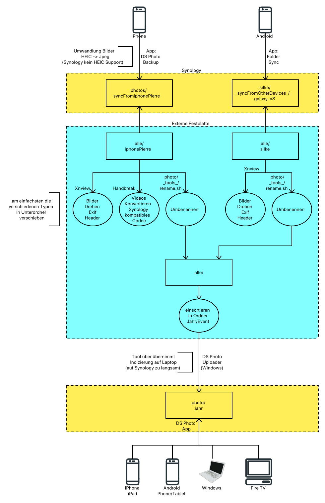
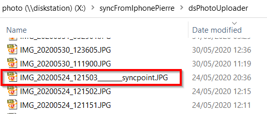
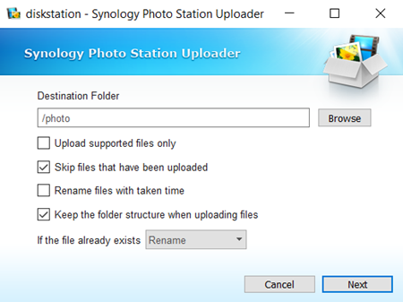
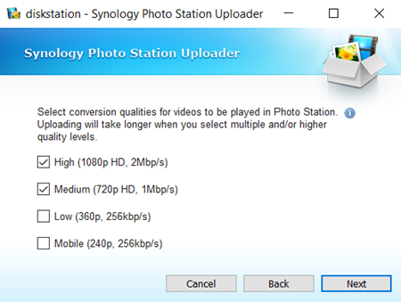

# Meine Foto- und Video-Sammlung bis 2023

Ich verwende im wesentlichen meine [Synology](synology.md) als Fileserver und die DS Photo App, um die Erinnerungen komfortabel über Tablets, Smartphones und Fire TV anzuschauen.

Problematisch ist, daß die Synchronisierung aufgrund meiner heterogenen Gerätelandschaft (Microsoft Windows, MacOS, Android, iOS, GoPro, Spiegelreflexkamera) unterschiedlich funktioniert und ich eine Synchronisierung über die Cloud aus verschiedenen Gründen ablehne (siehe unten).

## tl;dr

Der erste Use-Case, der in meiner Landschaft nicht paßt und mich überlegen läßt, mein iPhone durch Android Handy zu ersetzen. Das macht mich wahnsinnig und ich habe schon Tage mit diesem Problem verbracht. Nur das iPhone (und natürlich die anderen Apple Geräte) macht hier Probleme, weil

* Apple verwendet von Synology nicht unterstützte Formate (für Fotos HEIC, für [Videos HEVC Codec - H.265](https://de.wikipedia.org/wiki/High_Efficiency_Video_Coding)), d. h. eine Transformation MUSS erfolgen, wenn man Synology - PhotoStation (in Kombination mit DS Photo) verwenden will, da PhotoStation keine HEIC-Formate unterstützt (BTW: es gibt _Synology Moments_ als Alternative zu _PhotoStation_ doch das gibt es nicht für meine alte DS112+ und natürlich weiß ich auch nicht, ob es so gut für meinen Use-Case funtionieren würde)
  * über Einstellungen - Fotos - Auf MAC oder PC übertragen - Automatisch kann man zwar bei der Übertragung eine Umwandlung durchführen lassen, doch
    * ist die USB-Verbindung zum Windows PC per Windows Explorer nicht mehr stabil ... ständige Abbrüche mit der Fehlermeldung "Device Is Unreachable" ([siehe hier](https://www.fonepaw.com/transfer/the-device-is-unreachable-iphone-android.html))
      * iTunes ist der letzte Scheiß - ich habe nicht mal einen Abschnitt "Foto" gefunden ... der Button "Synchronisiere" war nicht clickbar
    * das Kopieren dauert dadurch sehr lang
  * beim Upload nach OneDrive erfolt - entgegen einigen Foren - keine automatische Konvertierung

Nach 1,5 Jahren iPhone-Nutzung habe ich nun endlich rausgefunden, daß man die Kamera auf maximale Kompatibilität einstellen kann (Einstellungen - Kamera - Formate - Maximale Kompatibilität). Dann werden Bilder im JPG-Format statt HEIC-Format aufgenommen und Videos erhalten ein anderes Codec. Das erscheint mir eine sinnvolle Einstellung in meinem Anwendungsfall.

### Mein Setup

Ich habe eine relativ alte [Synology DS112+](synology.md), die aber immer noch gut genug ist. Dort verwende ich das Paket _PhotoStation_, um meine Bilder für die App _DS Photo_ bereitzustellen. Die App gibt es für Android und iOS Handys und auch für Fire TV, um mit der gesamten Familie die alten Fotos am Fernseher anschauen zu können. Klappt wunderbar.

Leider unterstützt PhotoStation keine Apple-Formate wie HEIC und HEVC, so daß eine Konvertierung erfolgen muß.

---

## Probleme mit den Apple-Formaten HEIC/HEVC

Apple speichert Bilder per default im sog. HEIC-Format, das im Vergleich zu JPEG eine bessere Komprimierung erreicht. Exif-Header werden hier auch unterstützt. Videos werden bei Apple mit dem [HEVC-Codec]((https://de.wikipedia.org/wiki/High_Efficiency_Video_Coding) ausgestattet, der auch als H.265 bekannt ist.

Windows kann mittlerweile das HEIC-Format lesen und anzeigen (mit Windows Photos), doch meine Synology PhotoStation kann damit nicht umgehen. Ich MUSS also die Apple-Formate in PhotoStation unterstützte Formate konvertieren.

Da ich allerdings pro Jahr mehr als 5000 Fotos/Videos mache, brauche ich eine Lösung, die sich automatisieren läßt.

### Lösung 1: Apple-USB-Synchroniserung - Beste Lösung ... funktioniert nicht mehr

Koppelt man das iPhone per Lightning-USB-Kabel an den Windows-Rechner und hat im iPhone _Einstellungen - Fotos - Auf Mac oder PC übertragen_ auf _Automatisch_ stehen, so erfolgt eine Exif-konforme Konvertierung der HEICs nach JPEGs während des Kopierens per Windows-Explorer ... das Kopieren dauert dementsprechend länger.

> Problem: meine USB-Verbindung war nicht stabil ... nach einigen Minuten ist die Verbindung immer wieder abgebrochen. Mit iOS 11 klappte es noch ... mit iOS 13 hatte ich keine Chance mehr.

Das Problem ist übrigens im [Internet](https://www.fonepaw.com/transfer/the-device-is-unreachable-iphone-android.html)(oder auch [hier](https://www.guidingtech.com/fix-device-attached-to-the-system-is-not-functioning-error-iphone/)) hinlänglich beschrieben worden. Die angebliche Lösung "Keep Originals" (die in meinem Fall keine Konvertierung ausgelöst hätte und somit auch unbrauchbar wäre) hat bei iOS 13 nicht mehr funktioniert.

Mittlerweile bekomme ich im Windows Explorer nicht mehr immer eine Verbindung hin - oder es dauert extrem lang ... keine Ahnung, ob es am iTunes liegt oder meinem Windows - Dreckstool.

### Lösung 2: Apple speichert in JPEG statt HEIC

Unter _Einstellungen - Kamera - Formate_ kann man auf _Maximale Kompatibilität_ einstellen, um Fotos in JPEG statt HEIC zu speichern.

> Das habe ich in meinem Fall getan, doch hatte ich zu diesem Zeitpunkt schon 5000 Fotos im HEIC-Format aufgenommen. Ich mußte also eine Lösung für die Konvertierung HEIC-2-JPEG finden.

### Lösung 3: Nachträgliche Konvertierung

Mit Tools wie iMazing HEIC Converter (für Fotos) und [Handbrake (für Videos)](handbrake.md) lassen sich die Dateien nachträglich konvertieren.

Sicherlich ein wenig Arbeit und nicht komplett automatisierbar, aber aufgrund der noch fehlenden (funktionierenden) Alternativen zumindest eine Option.

### Lösung 4: Apple Photos => DS Photo

Die Apple Photos App kann man über _Einstellungen - Fotos - Auf Mac oder PC übertragen_ auf _Automatisch_ stellen, um beim Kopieren (z. B. nach DS Photo) eine automatische Konvertierung von HEIC nach JPEG (unter Beibehaltung der Exif-Header) zu bekommen.

> In Synology PhotoStation sollte man allerdings die startende Optimierung der Bilder (in verschiedene Vorschau-Formate) unterbinden ... zumindest wenn man die Dateien anschließend noch kategorisieren/filtern möchte. Das ist wichtig, da die Optimierung auf der schwachbrüstigen Synology seeeeeehr lanege dauert.

Mit folgenden Einschränkungen muß man leben:

* Dateien erhalten den Zeitstempel des Kopiervorgangs und den Namen vom iPhone (`IMG_3666.JPG` oder `IMG_3667.MOV`)
  * für Fotos ist das kein Problem wegen des vorhandenen EXIF-Headers
  * für Filme ist das ein großes Problem, da keine Meta-Information existiert
* man kann nicht 5000 Fotos/Videos auf einen Schlag kopieren - man muß 1000er Päkchen machen
  * im Vergleich zum "Apple Photos => Onedrive" ist diese Einschränkung allerdings akzeptabel.

Aufgrund des Problems mit den Filmen ist diese Variante keine Option für mich.

### Lösung 4a: DS Photo Synchronisierung

In der DS Photo App des iPhone kann man das _Photo Backup_ konfigurieren, so daß Fotos automatisch synchronisiert werden. Ein sehr praktisches Feature, das auch ganz gut funktioniert. Hier werden die Einstellungen von der Fotos App verwendet, so daß - bei entsprechender Konfiguration von "Automatisch" (= Maximale Kompatibilität) - eine Umwandlung von den Apple-Formaten in PhotoStation-kompatible Formate erfolgt.

> ABER: Die Synology PhotoStation optimiert die Fotos immer automatisch und das dauert auf der schwachbrüstigen Synology seeeeehr lange. Leider habe ich es nicht geschafft, einzelne Ordner von dieser Optimierung auszuschließen. Schade, aber man kann die Optimierung manuell über die Synology Web-UI ausschalten (nach dem manuellen Starten der Synchronisierung) - für eine Vollautomatische Synchronisierung sicherlich keine Option, aber halbautomatisch nutzbar.

Im Gegensatz zum Kopieren über die Apple Fotos App bleiben die Zeitstempel der Dateien erhalten - die Dateien tragen den Namen der iPhone-Datei. Somit ist ist hier kein Problem mit Filmen und auch nicht mit Fotos (die neben dem Zeitstempel auch den richtigen Exif-Header aufweisen).

Ganz wichtige Einstellungen im "DS-Photo - Photo Backup":

* Qualität auf "Hoch" stellen - sonst verliert man wichtige Pixel!!!
* ganz angenehm ist, daß man Live-Photo-Filme rausfilter kann (das mußte ich sonst immer manuell machen, da Synology Photo Station keine Live-Photos unterstützt).

DAS IST EINE LÖSUNG für mein Problem.

### Lösung 5: Apple Photos => Onedrive

Die Apple Photos App kann man über _Einstellungen - Fotos - Auf Mac oder PC übertragen_ auf _Automatisch_ stellen, um beim Kopieren (z. B. Onedrive) eine automatische Konvertierung von HEIC nach JPEG (unter Beibehaltung der Exif-Header) zu bekommen.

Über die Fotos-App vom iPhone wird der Kopiervorgang gestartet.

Mit folgenden Einschränkungen muß man leben:

* Dateien erhalten den Zeitstempel des Kopiervorgangs und den Namen vom iPhone (`IMG_3666.JPG` oder `IMG_3667.MOV`)
  * für Fotos ist das kein Problem wegen des vorhandenen EXIF-Headers
  * für Filme ist das ein großes Problem, da keine Meta-Information existiert
* man kann nicht 5000 Fotos/Videos auf einen Schlag kopieren - man muß 30er Päkchen machen (im Gegensatz zum DS Photo Kopiervorgang bei dem 1000er Päkchen möglich waren)

Aufgrund des Problems mit den Filmen ist diese Variante keine Option für mich.

### Lösung 5a: Onedrive-Cloud-Synchroniserung

Bis Herbst 2019 konnte man bei Onedrive iOS App einstellen, ob eine automatische Konvertierung von HEIC nach JPEG erfolgen soll. Im Dezember 2019 ist diese Option leider verschwunden und somit landen HEIC-Dateien auf dem Onedrive. Leider erfolgt auch keine Konvertierung, wenn man Onedrive auf einen Windows-Rechner synchronisiert (macht ja auch irgendwie Sinn).

Somit hilft Onedrive hier in meinem Fall nicht weiter.

### Lösung 6: Hootoo USB-Stick

Der [HooToo Lightning USB Adapter](https://www.amazon.de/HooToo-Laufwerk-Zertifiziert-Lightning-Computer/dp/B01HEHXF3A/ref=sr_1_5?__mk_de_DE=%C3%85M%C3%85%C5%BD%C3%95%C3%91&keywords=hootoo&qid=1574608249&smid=A2X2NO3429IQ5W&sr=8-5) für 28 Euro bietet einen Lightning und einen USB3 Anschluß im Bundle mit 64/128/256 GB Speicher. Beim Kopieren der HEIC-Dateien erfolgt automatisch eine Konvertierung nach JPEG ...

> ABER: Leider gehen die EXIF-Header verloren (Aufnahmedatum, Geo-Tagging) und die Dateien erhalten einen Filesystem-Zeitstempel des Kopierdatums. Typischerweise verwende ich den Exif-Header, um die Dateien zu benennen, so daß der Stick für mich unbrauchbar ist.

Dieser Stick hat eine MFI-Zertifizierung - derzeit (2019) funktioniert er ... mal sehen ob das so bleibt, denn Apple ändert ja mal gern was an der Kompatibilität solcher Devices.

### Lösung 7: Synology Moments

Diese Alternative zu Synlogy PhotoStation unterstützt die Apple-Formate, so daß eine Konvertierung nicht erforderlich wäre. Außerdem unterstützt Moments auch Live-Photos ... ist halt eine neuere Lösung.

> ABER: meine in die Jahre gekommene DS112+ wird von Moments nicht unterstützt. Hier gibt es aber eine Positive Überraschung, denn in [DSM 7](https://www.synology.com/de-de/company/news/article/Synology_2020) (ab 2020 - ich habe derzeit 6.2) werden PhotoStation und Moments zu "Synology Photos" verschmelzen. Leider wird [meine Synology kein DSM 7 erhalten](https://www.ifun.de/synology-dsm-6-2-1-die-letzten-updates-fuer-zahlreiche-alt-modelle-126579/) ... der Support läuft langsam aus.

---

## Idee - temporäre lokale Sammlung

Ich habe mir angewöhnt einmal im Quartal/Halbjahr/Jahr die Dateien aller Endgeräte auf einer externen USB 3.0 Festplatte zu sammeln. Dort werden die Dateien

* umbenannt im mein einheitliches Namensschema `YYMMDD_HHMMSS`
* gedreht gemäß EXIF Ausrichtung
* bei Bedarf in Windows-kompatible Formate umgewandelt (z. B. `JPEG` statt `HEIC`-Format)

Das passiert mit den Dateien aller Geräte zunächst separat - anschließend werden die Dateien

* nach Jahren/Quartalen und Themen getrennt in einem gemeinsamen Ordner der externen Festplatte gesammelt
* irrelevante gelöscht

Ist das abgeschlossen, dann werden die Dateien über den Synology Uploader (spart Ressourcen auf dem Synology - die Indizierung dauert dann nicht Tage, sondern nur Stunden) auf den Photostation-Bereich der Synology kopiert.

Danach sind die Erinnerungen über DS Photo App verfügbar.

### Warum nicht automatisiert

Die Vielzahl unterschiedlicher Endgeräte (Android, iOS, SD-Karte der Spiegelreflexkamera, GoPro) erschwert den Vorgang - das fängt schon damit an, daß iOS andere Formate/Codecs verwendet als Android und mein DS Photo auch nicht alle Formaten auf allen Endgeräten abspielen kann.

> Mir ist schon bewußt, daß dies eine recht fragile Angelegenheit ist und sich jederzeit etwas ändern kann - was dann wiederum mit zeitaufwendiger Recherche verbunden ist. Bisher funktioniert der Ansatz aber recht gut - das Endergebnis ist gut ... der Weg dorthin manchmal recht beschwerlich.

Mittlerweile verfüge ich auch über eine brauchbare Upload-Bandbreite (40 MBit/s) und kann eine Cloud-Speicherung in Erwägung ziehen. Mit Office 365 habe ich auch günstigen Online-Speicher. Nur Sicherheitserwägungen halten mich noch davon ab. Eine Synchronisierung von iOS Geräten auf die Synology scheint kein typischer Use-Case zu sein ... Apple will seine iCloud platzieren. Ich habe nahezu kostenlosen Speicher auf meiner [Synology](synology.md) ... warum sollte ich den nicht nutzen.

Darüberhinaus will ich meine Fotos/Videos noch nach Events kategorisieren und das ist automatisiert noch nicht möglich.

Die manuelle Synchronisierung von Daten hat natürlich auch einige Nachteile:

* zeitintensiv
* fehleranfällig
* wird deshalb zu selten durchgeführt
  * ich kenne Leute, die haben wichtige Fotos (= Erinnerungen) seit Jahren nur auf ihrem Handy. Geht das mal verloren oder hat einen Hardwaredefekt, dann sind diese Erinnerungen für immer verloren. Das ist KEINE gute Idee. Zudem dauert es recht lang bis die Daten mehreren Monate (mehrere Gigabyte) vom Handy auf einen anderen Rechner transferiert sind ... ich hatte da bei meinem iPhone mit einigen Abbrüchen (trotz Kabelverbindung) zu tun und es nervte einfach nur. Gelegentlich mal ein Transfer (sogar über WLAN) ist da deutlich schneller durchgeführt.

Ich begegne diesen Problemen mit häufigerer Durchführung ... was das Problem des Aufwandes erhöht und dann wiederum Auswirkungen auf die Häufigkeit haben könnten :-(

### Probleme mit iOS Auto-Synchronisierung auf Synology

* [DS Photo zur Synchronisierung von Foto/Video auf Synology](https://www.ifun.de/einfachere-foto-backups-von-ios-geraeten-auf-synology-nas-laufwerke-78889/)
* [DS Photo - Synology Doku](https://www.synology.com/de-de/knowledgebase/Mobile/help/DSphoto)
* [DS File - Synology Doku](https://www.synology.com/de-de/knowledgebase/Mobile/help/DSfile)

Während ich bei Android eine sehr komfortable Synchronisation meiner Handy-Photos auf die [Synology](synology.md) laufen hatte ([FolderSync](https://play.google.com/store/apps/details?id=dk.tacit.android.foldersync.full&hl=de)) gestaltete sich das bei iOS Endgeräten recht schwierig.

Ich habe mit diesem Thema Stunden verbracht und war dementsprechend frustriert, daß ich es nicht hinbekommen habe

* alle Dateien zu kopieren und dabei Zeitstempel zu erhalten (insbes. bei Video-Dateien entscheidend, um sie zeitlich zu kategorisieren)
  * der Zeitstempel hat mich fast wahnsinnig gemacht ... mal funktionierte es ... mal nicht
* alle Dateien in Windows-kompatible Formate zu konvertieren
  * ich wollte verhindern, daß ich das später manuell tun muß (und evtl. vergesse)
* es zu automatisieren, so daß Multimedia-Dateien im besten Fall automatisch sanchronisiert werden

In dieser Beziehung ist iOS echt fürchterlich - nichts zu spüren von "funktioniert out-of-the-box". Apple ist halt doch nur in den unterstützten Use-Cases richtig gut ... meiner gehört scheinbar nicht dazu :-(

#### Cloud Synchronisierung

iCloud ist der Apple-Cloud-Speicher und am besten integriert. Doch man kann auch Onedrive oder Google Drive einrichten - leider mit Einschränkungen, denn Apple tut scheinbar alles dafür, um alle iOS User in ihre Cloud zu locken:

> "Aufgrund der Einschränkungen von iOS können iOS-Apps keine Hintergrundaufgaben länger als 3 bis 10 Minuten ausführen, auch nicht mit aktivierten Geofences." [Synology DS Photo Dokumentation](https://www.synology.com/de-de/knowledgebase/Mobile/help/DSphoto/iOS_iPhone)

Aber ich kann meine Fotos/Videos auch auf andere Cloud-Speicher kopieren (OneDrive, Google Drive) ... aber noch habe ich mich aus Sicherheitsgründen nicht dazu durchringen können.

#### App Documents

Die App Documents hab ich bis heute nicht verstanden. Auf keinen Fall intuitiv ...

#### Synology App DS Photo

DS Photo bietet eine Photo Upload Option, wobei hier je nach Konfiguration im iOS Gerät eine automatische Typ-Konvertierung (HEIC => JPEG, MOV-Codecs) stattfindet.

> Diese Option ist sehr gut - allerdings sollte man die automatische Indizierung dieses Sync-Ordners abschalten (Photo Station - Settings - Photos - Indexing and Conversion - Conversion Settings), denn ansonsten muß die Synology lange arbeiten, um die Bilder/Videos zu konvertieren

Bisher habe ich mich zu diesem Ansatz noch nicht genutzt ... könnte aber eine gute Option sein, um die manuelle Synchronisierung zu optimieren und zumindest zu einer halb-automatisierten Lösung zu kommen. Jedenfalls würden die Daten so zumindest häufiger synchronisiert.

#### Synology DS File

Hier kann die Synchronisierung automatisiert werden:

* Live Photos: ja/nein
* automatische Konvertierung
  * HEIF nach JPG
  * MOV Videos werden hinsichtlich verwendeter Codecs nicht konvertiert

#### Synology App DS Cloud

Hierfür benötigt es auf dem Synology einen Cloud Station Server.

---

## Algorithmus

Ich führe diese Sammlung auf der Synology nur alle 6-18 Monate aus. Deshalb merke ich mir den letzten Stand der Sicherung mit einem Trick im Dateisystem. Im Backup-Verzeichnis lege ich eine leere Datei `foo______syncpoint.jpg` an:

Für den Upload auf die Synology verwende ich das Windows-Tool _Synolofy Photo Station Uploader_, das auf meinem leistungsstarken Laptop schon die Thumbnails und weitere Konvertierungen durchführt. Auf der Synology würde das ewig dauern. Es integriert sich in den Windows Explorer und kann dann mit der rechten Maustaste gestartet werden ... anschliedßend öffnet sich folgender Dialog (das sind die Einstellungen, die ich verwende):

Achtung: scheinbar funktioniert der Zugriff nur, wenn man die IP-Adresse der Synology verwendet (anstatt des FQDN) ... ansonsten gibt es beim Upload diese falsche Meldung:

> "Photo Station is not installed. Please install the package at Package Center to upload photos."

### Verworfene Lösungen

> ACHTUNG - PROBLEM - ACHTUNG: anfangs habe ich versucht, die Fotos/Videos per USB-Kabel vom iPhone auf meinen Windows-Rechner zu kopieren. Hierbei hatte ich am iPhone "Einstellungen - Fotos - Auf MAC oder PC übertragen - Automatisch" eingestellt, um die Multimedia-Dateien beim Kopieren automatisch in kompatible (Stichwort HEIC) Formate umzuwandeln. Das klappte leider mehr schlecht als recht. Die Synchronisierung brach immer wieder mit dem gleichen Fehler "Device is unreachable" ab ... gelegentlich funktionierte es aber auch. Bei iOS 11 konnte ich das Problem mit der Umstellung auf die Einstellung "Originale beibehalten" lösen (anschließend mußte ich die Fotos manuell per XnView von HEIC nach JPG konvertieren), doch bei iOS 13 klappte auch das nicht mehr.

2019 habe ich mir den [Lightning-USB-Adapter mit 64 GB Speicher von HooToo (28 Euro)](https://www.amazon.de/HooToo-Laufwerk-Zertifiziert-Lightning-Computer/dp/B01HEHXF3A/ref=sr_1_5?__mk_de_DE=%C3%85M%C3%85%C5%BD%C3%95%C3%91&keywords=hootoo&qid=1574608249&smid=A2X2NO3429IQ5W&sr=8-5) gekauft, über den ich die Multimedia-Dateien auf meinen Windows-Rechner bekomme. Allerdings muß ich sie anschließend in Windows-kompatible Formate umwandeln ... zumindest die Bilder - die Videos sind Synology-kompatibel. Schade nur, daß die Timestamps kaputtgehen und die Jpegs keine Exif-Header haben.

> Alternative für die Zukunft: Kopieren der Multimedia-Daten in die Cloud - bei OneDrive habe ich genügend Speicher. Derzeit habe ich mich aus Sicherheitsgründen noch nicht zu einer solchen Lösung durchringen können.

* externe Festplatte über USB 3.0 anschließen
  * auf dieser Festplatte werde ich meine Multimediadateien zunächst sammeln (von verschiedenen Quellen), konvertieren und kategorisieren
  * Ordner `sammlung` anlegen
* alle Geräte (aka `device_foo`) nacheinander anschließen (ACHTUNG: GoPro und Spiegelreflexkamera nicht vergessen) und folgende Aktivitäten durchführen
  * auf USB-Platte den Ordner `_already_transferred_to_synology_` anschauen und das Datum der letzten Foto-Synchronisierung rausfinden (z. B. Datum des letzten Bildes rausfinden)
  * auf externer USB-3.0-Festplatte Ordner `device_foo` anlegen
  * jetzt je nach Device alle Dateien seit der letzten Synchronisierung auf die USB-Platte kopieren:
    * iOS:
      * HooToo-Lightning-Stick anschließend und die Fotos/Videos aus dem Ordner "Zuletzt" über die App iPlugmate auf den Stick kopieren
      * Dateien auf die USB-Festplatte kopieren ... in den Ordner `device_foo`
      * Ordner `device_foo` gruppieren nach Typ und sortieren nach Größe
        * `PNG` Dateien löschen - hierbei handelt es sich um Screenshots
        * `MOV` unter 5 MB löschen - hierbei handelt es sich um Live-Photo-Videos oder Schrott-Videos unter 3 Sekunden
        * `HEIC` Dateien (sofern vorhanden) per XnView in JPG umwandeln (Werkzeuge - Stapelverarbeitung)
    * Android
      * Synchronisierung über FolderSync App mit dem Netzwerkshare anstoßen
      * Dateien vom Netzwerkshare auf die USB-Festplatte kopieren ... in den Ordner `device_foo`
* pro `device_foo`
  * alle Bilder gemäß EXIF-Header drehen
  * alle Bilder gemäß EXIF-Header umbenennen (XnView: `<Date[ymd_HMS]>`)
  * alle Filme gemäß Dateistempel `Date modified` umbenennen (XnView: `<Modified_Date[ymd_HMS]>`)
* alle `device_foo` Dateien in `sammlung` vereinen
* auf dem Endgerät ein "Backup Done"-Foto aufnehmen (Marker für die letzte Synchronisierung)  
* Bilder und Videos innerhalb von `sammlung` kategorisieren (großen Müll löschen) ... da dies der letzte Schritt ist, sind auch alle Dateien von VERSCHIEDENEN Endgeräten zum gleichen Event einfach einzusortieren
  * Kategorisierung nach Jahr (z. B. `2018`)
    * Kategorisierung nach Quartal (z. B. `20180100_familie_Q1`)
      * innerhalb eines Quartals Kategorisierung nach Event (z. B. `20180210_skiurlaub`)
* `sammlung` per "Photo Station Uploader" nach Synology Photostation (Ordner `photos`) kopieren und - nach Prüfung ob alles angekommen ist - in `sammlung` löschen

---

## Foto-Mosaik-Edda

Mit diesem Tool kann man kostenlos ein Bild aus vielen anderen Bildern zusammensetzen. Die Ergebnisse sind sehr brauchbar und man muß keine Zeit investieren - allerdings sind die Einstellungsmöglichkeiten (zumindest in der kostenlosen Version) stark eingeschränkt.
