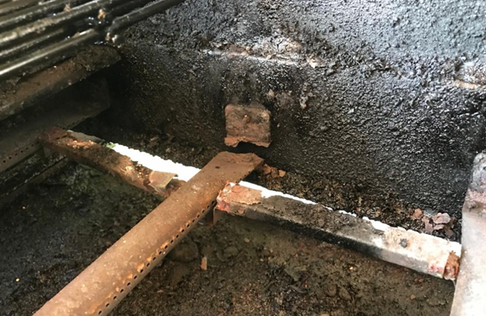
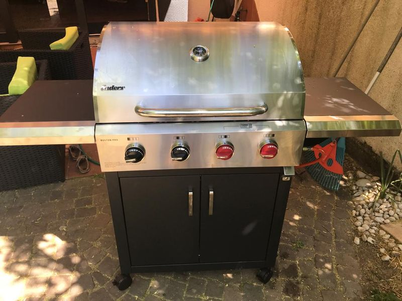
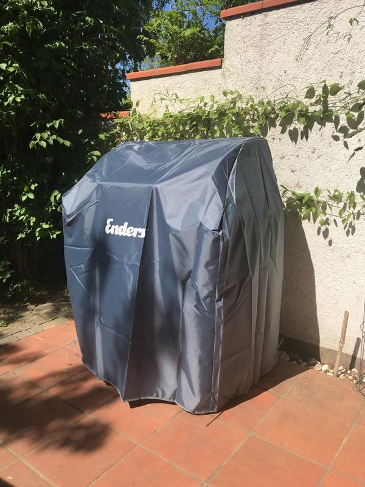
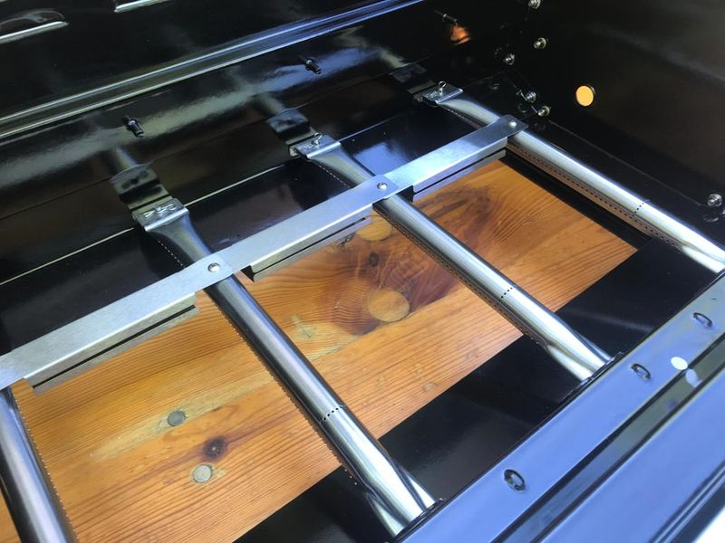
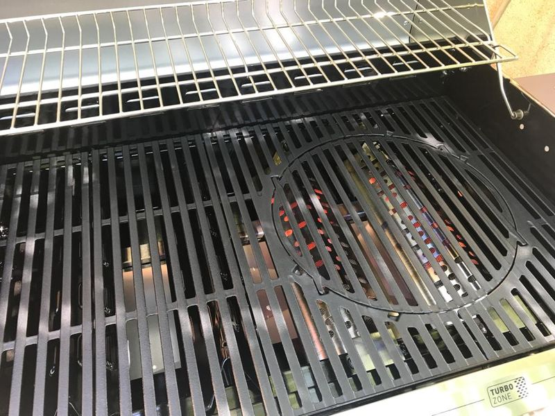
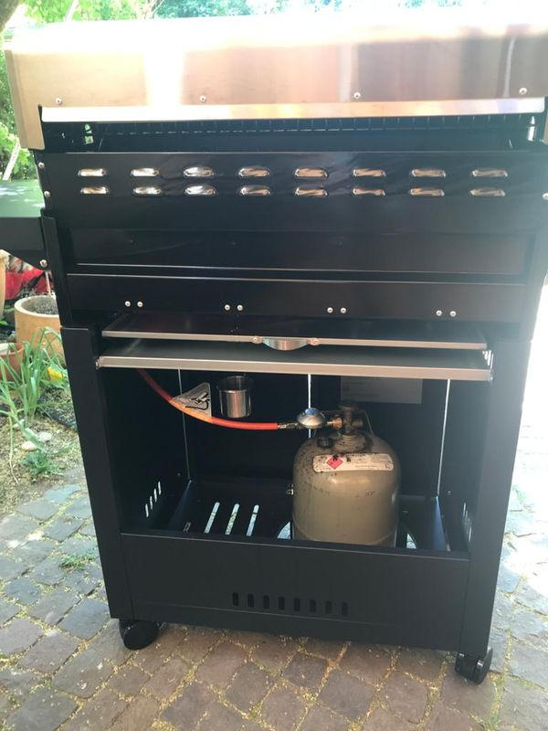

# Gasgrilll

Ich besitze schon seit 10 Jahren einen Gasgrill - vielleicht weniger Abenteuer, aber ist Holzkohlegrillen wirklich männlicher?

Ist mir eigentlich egal - wir nutzen den Grill auch im Winter und nicht nur mal gelegentlich zum Barbecue. Da möchte ich nicht stundenlang in der Kälte stehen und den Grill anheizen.

Ein Gasgrill ist perfekt.

Dennoch bin ich nicht bereit, über 1000 Euro für einen Weber-Grill zu bezahlen - da zahle ich lieber 4 x 300 Euro und komme damit auch 12-15 Jahre über die Runden. Meistens ist Rost das Problem bei den Billig-Grills ... auch wenn man eine Schutzhaube gegen direkten Niederschlag - dennoch steht der Grill die ganze Zeit im Freien und somit natürlich immer der Feuchtigkeit ausgesetzt.

---

## Mein erster Gasgrill

Es ist ewige Zeit her ... es war ein Gasgrill mit Lava-Steinen.

---

## Mein zweiter Gasgrill

... rostete dann irgendwann an den Brennern durch - das ist die Schwachstelle der Billig-Grills - keine Ahnung, ob die teuren Grills hier besser sind ... vielleicht wird hier mehr Edelstahl verbaut, so daß sie länger halten.

---

## Bis 2020

Wir hatten einen Gasgrill mit folgenden Daten:

* 10,5 kW
* Abmessungen Grillfläche: 61 x 43 cm
* 3 getrennte Brenner

Nachteil

* der Grill wurde nicht so heiß ... 200°C waren da schon das Limit
  * die Temperatur war im vorderen Bereich immer deutlich geringer als im hinteren Bereich. Ich habe das immer als Feature genutzt, um im vorderen Bereich Grillgut zu parken. Dennoch schränkt das die Möglichkeiten natürlich ein.
* nach einigen Jahren
  * Flammenverteiler durchgerostet - für 10 Euro ausgetauscht
  * Gasstrebe durchgerostet

    

---

## Ab 2020

Der Rost nagt an dem alten Grill und deshalb bin ich auf der Suche nach Ersatz mit folgenden Eigenschaften:

* mehr Power
* evtl. größere Fläche
  * mit der Familie grillen wir teilweise mit 6 Personen und da wird es manchmal schon eng auf dem Grillrost
* geschlossen - man sieht die Gasflasche nicht
* Außenabmessungen nicht viel größer als der alte Grill
* eher nicht: Seitenbrenner

### Option Aldi - Enders Boston Pro 4 R Turbo II

* 229 Euro - TOP PREIS
* Grillfläche 74 x 43 cm
* Abmessungen
  * mit geöffnetem Deckel und aufgestellten Seitenablagen (B x H x T): 146,5 x 143,5 x 70 cm
  * mit geschlossenem Deckel und abgeklappten Seitenablagen (B x H x T): 95 x 115,5 x 57,5 cm
  * cool - die Seitentischen kann man wegklappen => platzsparend
* 15,4 kW - SEHR STARK
* 4 Brenner
* mit Turbo Zone
  * sehr gut für Steaks
* inkl. Wetterschutzhülle
* geschlossen - man sieht die Gasflasche nicht
* [Test von Familie Schardt](http://familietestet.de/gassgrill-enders-boston-pro-4-turbo-ii-von-aldi-sued/)

---

## Enders Boston Pro 4 R Turbo II

Den Grill habe ich im April 2020 bei Aldi-Süd gekauft ... ziemlich schwer, wenn man den alleine im Laden in den Wagen hievt ;-)

Zusammen mit meinem Sohn habe ich ihn in 2 Stunden (ohne Eile und Hektik aufgebaut). Die Anletung ist sehr gut ... bis auf die Beschreibung der Seitenteile ... hier mußte ich erstmal die Konstruktion verstehen und aus Fehlern lernen.

> ACHTUNG: prinzipiell sehr gut verarbeitet - an einer Stelle am Seitenteil habe ich mich dennoch geschnitten.

Ich war schon beim Aufbau begeistert:

* vollständig
* Brenner und Aufhängungen aus Edelstahl ... bye-bye-Rost
* alles geschraubt
* sauber verarbeitet
* auch im Außenbereich viel Edelstahl
* durchdachte Konstruktion
  * einklappbare Seitenteile ... sehr platzsparend
  * Türen mit Magnet
  * Haken an den Seitenteilen (Mülltüte)
  * Bierflaschenöffner
* mitgelieferte Schutzhaube ... wenn auch nicht besonders dick (bin gespannt wie lange die hält)

Was mir nicht so gefällt

* 4 Rollen mit Feststellbremse
  * rollen nicht besonders gut
  * man muß die Bremsen feststellen, um zu verhindern, daß er auf meiner leicht abschüssigen Terrasse wegrollt
    * mein vorhericher Grill hatte nur 2 Rollen ohne Feststellbremse - das war einfacher und sicherer

Die erste Grillerung lief schon sehr gut ... an die Turbozone muß ich mich noch gewöhnen. Beim Einbrennen bin ich auf fast 350° C gekommen ... mein alter bleib deutlich unter 200° C. Die Hitze ist gleichmäßig verteilt.

### Bilder

