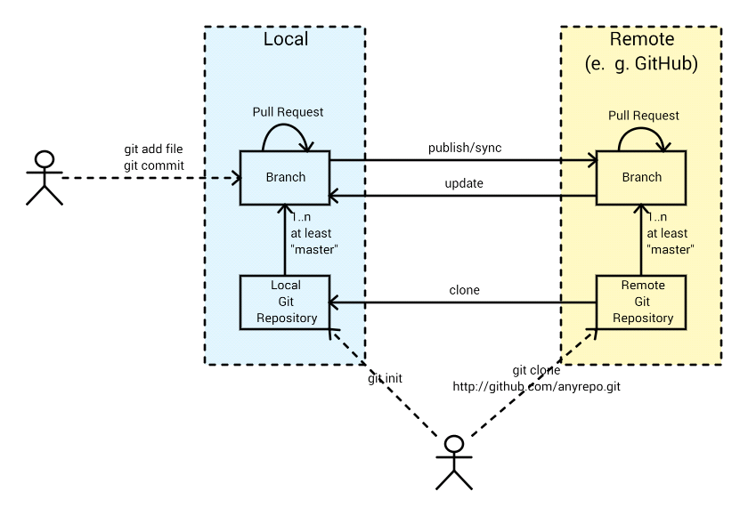

# GIT

Sehr gute Quellen:

* [Pro Git - Buch - SUPER](https://git-scm.com/book/en/v2)
* Refcardz: [https://dzone.com\/refcardz\/getting-started-git](https://dzone.com/refcardz/getting-started-git)
* Interaktives Tutorial: https://learngitbranching.js.org/
* [http://www.eecs.harvard.edu\/~cduan\/technical\/git\/](http://www.eecs.harvard.edu/~cduan/technical/git/)
* [http://book.git-scm.com\/](http://book.git-scm.com/)
* Ultra-Kurzeinführung: [http://rogerdudler.github.io\/git-guide\/](http://rogerdudler.github.io/git-guide/)
* \[1\]: [https:\/\/www.youtube.com\/watch?v=0fKg7e37bQE](https://www.youtube.com/watch?v=0fKg7e37bQE)

---

## Motivation - Linus Torvalds

* [https:\/\/www.youtube.com\/watch?v=idLyobOhtO4](https://www.youtube.com/watch?v=idLyobOhtO4)

Linus Torvalds hat Git für seine Arbeit am Linux-Kernel entwickelt, weil es kein Tool gab, das seinen Anforderungen gerecht wurde. Dementsprechend hat das Tool folgende Merkmale:

* mergen vieler Dateien (im Sinne eines _Integration-Managers_ - siehe unten) ... die einzelne Datei spielt keine große Rolle.
* extrem performant \u. a. durch den lokalen Ansatz) hinsichtlich Diffs, ...
* jeder Kernel-Entwickler kann Arbeiten, ohne andere zu beeinflussen ... erst wenn die Arbeit DONE ist, kann entschieden werden, ob die Änderungen übernommen werden.
* möglichst hohe Freiheitsgrade in der Arbeitsorganisation für jeden einzelnen Entwickler

### Git in typischen Softwareprojekten

Diese _Integration Manager_-Modell  Arbeitsweise paßt zu den wenigstens Standard-Entwicklern. Dennoch können auch Standard-Entwickler von diesem Ansatz profitieren.

Einer der größten Vorteile dieses Modells ist, daß es den Entwicklern große Freiheitsgrade (Branching, Tagging, Push, Pull, Verteilung, Zentralisierung) bei der Arbeitsorganisation läßt. Je nach Aufgabe kann man sich jedes mal neu entscheiden wie man sich organisiert ... man wählt den besten Ansatz für die jeweilige Problemstellung.

Diese Freiheitsgrade erfordern aber auch Vertrauen und gute Entwickler - mit einem guten Verständnis dieses Tools. Und genau das könnte vielen Verantwortlichen in den Projekten/Unternehmen Angst machen ...

> Aus meiner Sicht ist diese Angst vollkommen unbegründet, denn ein Unternehmen MUSS Vertrauen in seine Mitarbeiter haben, um überhaupt Software entwickeln zu können. Warum sollte es darauf vertrauen, daß qualitativ hochwertige Software entsteht, wenn es seinen Entwicklern nicht einmal zutraut ein Versionsverwaltungssystem sinnvoll zu nutzen? Solche Firmen sind zum Scheitern verurteilt.

Ich habe jehrelang mit Subversion und maven gearbeitet. Dabei bin ich nach einiger Zeit dazu übergegangen, ein paar Stunden (selten Tage) offline zu arbeiten, um nicht von anderen Commits gestört zu werden. Bei maven habe ich die Variante No-Remote-Snapshot-Updates gewählt (siehe [Remote-SNAPSHOT-Abhängigkeiten ... DONT DO THIS](maven.md)).

---

## Idee

* [http:\/\/www.eecs.harvard.edu\/~cduan\/technical\/git\/git-4.shtml](http://www.eecs.harvard.edu/~cduan/technical/git/git-4.shtml)
* Git Workflows:
  * [https:\/\/git-scm.com\/about\/distributed](https://git-scm.com/about/distributed)
  * [https:\/\/www.atlassian.com\/git\/tutorials\/comparing-workflows](https://www.atlassian.com/git/tutorials/comparing-workflows)

Bei Git handelt es sich um ein Versionssystem, das ohne dedizierten zentralen Server auskommt. Stattdessen gibt es viele mehr oder weniger gleichberechtigte vollwertige Repositories (mit allen Versionen der verwalteten Ressourcen), die bei Bedarf synchronisiert werden.

Jeder Entwickler wird für "sein" Repository zum Administrator, auf dem er Branches und Tags erstellt.

### Verteiltes Modell

Git erfordert - im Gegensatz zu Subversion - kein zentrales Repository. ABER: man kann Git so nutzen (Shared-Repository-Modell) und das wird auch getan (z. B. [GitHub](http://github.com)).

Während man bei Subversion allerdings zentral am Server Branches\/Tags erzeugt hat, tut das bei Git jeder Nutzer.



### Workflows

Um mit Kollegen an den gleichen Sourcen zu arbeiten gibt es verschiedene Workflows (man kann sich ausser den folgenden sicher noch andere überlegen):

* Peer-to-Peer-Ansatz
* Shared-Repository-Ansatz

  * Feature-Branches

* Integration Manager Modell

#### Peer-to-Peer-Ansatz

Bei diesem Ansatz tauscht jeder Entwickler mit jedem Entwickler per Git-Pull oder Git-Push die Sourcen aus. Dieser Ansatz skaliert nicht besonders gut.

Während man mit einigen wenigen Entwicklern noch Peer-to-Peer arbeiten kann, ist das ab einer gewissen Größe (ab 3-4 Leute) vermutlich mit viel Aufwand verbunden, weil sich bei 4 Personen jeder mit 3 Personen austauschen muss. In diesen Fällen ist es einfacher einen Shared-Repository-Ansatz zu fahren.

#### Shared-Repository-Ansatz - SVN-like

* [https:\/\/www.atlassian.com\/git\/tutorials\/comparing-workflows\/centralized-workflow](https://www.atlassian.com/git/tutorials/comparing-workflows/centralized-workflow)

Bei diesem Ansatz synchronisieren sich die beteiligten Entwickler über ein zentrales Repository, auf das sie Lese- und Schreibrechte haben. Peer-to-Peer-Autausch ist aber weiterhin jederzeit möglich.

Jeder Entwickler clont das zentrale GIT-Repository ... im neuen lokalen Repository entsteht ein Branch mit dem Namen _master_, der Remote-Heads besitzt. Auf diesem lokalen Repository arbeitet er allein solange er keine Änderungen vom zentralen Repository per `git fetch`\/`git merge` reinzieht. Die anderen Entwickler sehen seine Änderungen allerdings auch nicht solange kein Push ins zentrale Repository oder Pull Requests erfolgen

Lokal kann der Entwickler Branches und Tags erstellen und bei Bedarf sogar weitere Clones von seinem eigenen lokalen Repository machen.

##### Shared-Repository-Ansatz + Feature-Branches

* [https:\/\/www.atlassian.com\/git\/tutorials\/comparing-workflows\/feature-branch-workflow](https://www.atlassian.com/git/tutorials/comparing-workflows/feature-branch-workflow)

#### Integration Manager Modell

Dieses Modell wird häufig von OpenSource-Projekten verwendet. Es gibt dabei einen ausgezeichneten Integration Manager, der die Änderungen der anderen Entwickler integriert. Der Integration Manager führt das sog. _Blessed Repository_ (nur er hat dort Schreibrechte - kann darauf `git push` machen). Jeder Entwickler erstellt einen Fork des Blessed Repository und gibt dem Integration Manager Leserechte auf diesem Fork-Repository. Der Integration Manager integriert die Änderungen der Entwickler in sein Arbeitsrepository und pusht sie ins Blessed Repository.

---

## Basis-Konzepte

Linux Torvalds sagte in einer [Präsentation](2) mal, daß Git Content-based ist und Subversion File-based ... als Beispiel führte er folgendes an:

> Eine Datei A beherbergt zum Zeitpunkt t1 eine Methode `calculatePrice()`. Diese Methode wird zum Zeitpunkt t2 in die Datei B verschoben. Wenn der Entwickler nun die Historie zu `calculatePrice()` ansehen möchte, dann ist es bei Git kein Problem, den gesamten Lebenszyklus zu berücksichtigt, d. h. das Verschieben von A nach B ist transparent. Bei Subversion ist das schwierig, weil es File-based ist.

Eventuell ist das auch der Grund warum Merging mit Git so gut (automatisiert und zuverlässig) funktioniert. Bei SVN ist das aufwendiger und viele versuchen, es zu vermeiden. Diese Schwäche sorgt dafür, daß Subversion-User in der Wahl ihrer Arbeistweisen eingeschränkt sind.

Git verwendet das `.git`-Verzeichnis zur persistenten Speicherung seiner Verwaltungsdaten.

**Repository:**

* bildet die Basis der Versionsverwaltung - alle Tools (commit, checkout, branch, merge, ...) nutzen das Repository als Datenbasis. Hier sind alle Änderungen getrackt.
* rein Filesystem basiert (es ist kein Server oder Prozess erforderlich) - somit auch leicht zu sichern

**Remote Repository:**

Ein anderes Repository (es kann auch lokal und remote sein), das über den Origin-Parameter in Verbindung mit dem lokalen Repository steht (z. B. weil es das geclonte Repository ist, aus dem das lokale Repository entstanden ist)

**Index/Stage:**

Container, den der Entwickler bewusst explizit mit geänderten\/gelöschten\/hinzugefügten Ressourcen befüllt (z. B. `git add bla.txt`). Dieser Container wird später committed ... die geänderten Ressourcen bilden zusammen mit den Änderungen das CommitObject

**CommitObject:**

* ein CommitObject besteht aus Pointern auf Ressourcen (Dateien) und deren Änderungen zur Vorversion. Da ein Git-Repository in sich alle Änderungen aller Branches trägt sind Vergleiche zwischen Revisionen einer Ressource komplett lokal möglich - dazu werden die CommitObjects benötigt
* nur das erste CommitObject hat keinen Vorfahren - alle anderen haben i. d. R. einen Vorfahren, bei gemergten Branches zwei Vorfahren

**Aktueller Zustand eines Branches:**

Der aktuelle Zustand eines Branches ergibt sich aus den CommitObjects (repräsentieren die Diffs) von der Wurzel bis zum aktuellen Head-CommitObject

**Clone:**

Ein `git clone` erzeugt eine 1:1 Kopie eines Repositories (abgesehen von Git-Hooks ist es ein komplettes Backup). Dabei werden ALLE CommitObjects aller Branches ins neue Repository übernommen, d. h. die gesamte Historie ist im geclonten Repository (offline) vorhanden. Über das Origin-Attribut ist die Verbindung zur Quelle weiterhin vorhanden und per `git push` oder Pull-Requests kann eine Integration in das Origin-Repository erfolgen.

**Clone vs. Fork:**

* Clone und Fork sind schon recht ähnlich und man kann mit beiden sehr ähnlich arbeiten
* ABER: ein Fork sorgt dafür, daß Origin und Fork unterschiedliche Eigentümer hat. Je nach Konfiguration kann nur der Eigentümer Pull-Requests committen. Man kann aber problemlos einen Fork erstellen und dann einen Pull-Request erstellen, der zum Transport der Änderungen\/Erweiterungen in das Origin-Repository verwendet wird.
* Clone ist eher eine lokale Kopie des Remote-Repositories, Fork ist eine serverseitige Kopie des Remote-Repositories mit geändertem Eigentümer ... aber was ist schon Client\/Server\/lokal\/remote, wenn die Grenzen fließend sind?

**Branch:**

Ein Branch ist nur ein Pointer auf ein CommitObject. Man kann zwischen Branches beliebig hin- und herwechseln und bekommt den im jeweiligen Branch gültigen Stand auf dem Filesystem wiederhergestellt. Das erscheint auf den ersten Blick magisch, weil sich u. U. das gesamte Filesystem ändert.
Hat man eine nicht commitete Änderung an einer Ressource, die bereits unter Version-Control steht, in dem zu verlassenden Branch, dann wird das unterbunden. Man muß erst entscheiden, ob man die Änderung committet oder rückgängig macht.

**Head:**

* benanntes CommitObject (Teilmenge aller CommitObjects) - durch Branching wird ein neuer Head erzeugt, der dann eine eigene Historie entwickeln kann und irgendwann evtl. mal wieder mit dem anderen Zweig zusammengeführt wird
* jeder separate Branch hat einen eigenen Head
* es gibt immer mindestens einen Head, den sog. `MASTER` (der Head vom Hauptzweig)
* neben Heads innerhalb eines Repositories gibt es Heads auf andere Repositories (entstehen durch clonen eines Repositories) = Remote-Head

**HEAD:**

* der aktuell selektierte Head (eines Branches) wird mit `HEAD` bezeichnet, wenn es der Hauptzweig ist gilt HEAD == MASTER

**Zugriffsprotokoll:**
Git-Repository-Server erlauben i. a. einen Zugriff per

* HTTPS
* SSH
  * hiermit ist auch passwortlose Authentifizierung per [SSH-Key über den SSH-Mechanismus](ssh.md) möglich

---

## Konzeptuelle Überraschungen

### Leere Verzeichnisse

Legt man ein Verzeichnis an (`mkdir folderA`), so erkennt git das nicht als Änderung (`git status`). Man kann dieses leere Verzeichnis auch nicht ins CommitObject hängen ... `git add folderA` zeigt keine Wirkung. Erst nachdem mindestens eine Datei in das Verzeichnis gelegt wird (`touch folderA/meineDatei.txt`) zeigt git eine Änderung an.

Möchte man also "leere" Verzeichnisse unter Versionskontrolle stellen (ich hatte schon mal den Fall, daß das Sinn gemacht hat), so sollte man eine "versteckte" Datei reinlegen, an der man auch erkennt, daß sie diesem Zweck dient: 

```bash
echo "Diese datei existiert nur, um das Verzeichnis unter Versionskontrolle zu stellen" > ./folderA/.keep
```

### Historie bei Refactorings beibehalten

Im Gegensatz zu SVN hat Git keine Metadaten auf jeder einzelnen Datei. Stattdessen versucht Git durch Analyse des Commit-Objekts heuristisch rauszufinden, wenn eine Datei umbenannt oder verschoben wurde. Wenn das CommitObjekt folgende Änderungen enthält

```properties
.../folderA/meineDatei.txt
.../folderB/meineDatei.txt
```

dann wird das bei einem `git diff` VOR DEM COMMIT als Löschung und Neuanlage dargestellt. Schaut man sich nach dem Commit aber die Historie an, dann ist sie erhalten geblieben, weil diese Änderung als Verschieben interpretiert wird. ACHTUNG: das geschieht ausschließlich durch Analyse der Commit-Objekte ... keine Sicherheit, ob das auch alle Git-Clients machen oder es noch in Zukunft funktioniert.

Diese Vorgehen hat allerdings den Vorteil, daß man solche Refactorings in einem normalen File-Browser oder über Betriebssystemkommandos (`mv folderA/meineDatei.txt folderB/meineDatei.txt`) durchführen kann. Man muß hier kein spezielles Tool verwenden, das die Metadaten migriert.

---

## Workflows und Branching Models

* [Git flow und Alternativen](https://docs.gitlab.com/ee/workflow/gitlab_flow.html)

Git ist zunächst mal sehr offen wie man es benutzt - eine Stärke, aber für Newbies eine große Herausforderung. Deshalb sollte man sich auf die Suche nach Best-Practices machen.

Zentrale Frage ist "Mit wievielen Branchen will/muß ich arbeiten, um meinen Release-Zyklus abzubilden?"

* nur `master` und Feature/Bugfix-Branches
  * `master` ist zu **JEDEM** Zeitpunkt releasebar (= Deployment auf eine Stage - z. B. nach Live)
* `master`, `development` (= Integration Branch) und Feature/Bugfix-Branchesm
  * hier wird ein Integration Branch verwendet, um die Qualität bei hoher (automatisierter) Testabdeckung sicherzustellen und das Risiko einer Destabilisierung des `master` Branch zu reduzieren (erst wenn der `development` Build erfolgreich war, darf nach `master` gemergt werden)
  * macht Sinn, wenn
    * viele Entwickler parallel an einem Repository arbeiten (viele Feature-Branches parallel) und dadurch beim Mergen in den `master` Probleme ergeben, so daß der `master` bricht. Dann wäre `master` nicht mehr releasebar
    * ein gebrochener `master` große Schmerzen verursacht, weil stündlich released wird (wird nur alle zwei Wochen released ist es weniger dramatisch)
  * Atlassian empfiehlt, vom `master` Branch (der Branch mit der besten Qualität - Fehler aus dem Development Branch können sich nicht verbreiten und die Feature-Branches zerstören) den Feature-Branch abzuzweigen - danach mergt man in den `development` Branch um zu prüfen, ob die Änderungen mit denen anderer Entwickler kompatibel sind. Ist das der Fall wird der Feature-Branch (!!! nicht der `development` Branch) in den `master` Branch gemergt. Das Feature ist nun ready-for-deployment
    * funktioniert natürlich nur, wenn schnell auch in den `master` gemergt wird, so daß neue Features auch nachfolgenden Featureentwicklungen zur Verfügung stehen
    * das wiederum funktioniert nur, wenn jedes gemergte Feature auch potentiell ausgerollt werden darf (sollte das nicht der Fall sein, so kann man mit Feature-Toggles arbeiten, um mergen zu können ohne sichtbar zu sein) - ansonsten muß man den Merge der Feature-Branches noch zurückhalten

> Als grundsätzliche Regel lässt sich festhalten: Je kürzer die Release-Zyklen, desto weniger Branches sind notwendig.

Auf diesen Branching Models setzen verschiedene Workflows auf (einige sind in ["Git flow und Alternativen"](https://docs.gitlab.com/ee/workflow/gitlab_flow.html) beschrieben):

* Branch-per-Issue-Workflow
  * for SaaS Teams
  * for Multiple-version support
* Git Flow
  * wenn man kein Continuous Deployment nutzen kann
* GitHub Flow
  * wenn man Continuous Deployment nutzen kann
* GitLab Flow
  * bei einer Mischform - man kann nicht einfach sofort deployen, aber es dauert auch nicht allzu lang

Für mich macht der GitLab Flow keinen Sinn, denn eigentlich will ich meine Release-Artefakte ausgehend vom Master bauen und diese dann bei Bedarf auf die Stages promoten. Das geschieht dann entweder sofort (Continuous Deployment) oder zu einem geplanten Zeitpunkt. Hat man mehrere Integration-Stages (TEST, CUSTOMER-TEST, LIVE), dann promotet man die gebauten Releases von Stage zu Stage. Bei Hotfixes brancht man dann einen Hotfix-Branch vom Tag ab, das gerade hotfixed werden soll - dann baut man daraus ein neues Artefakt. Auf diese Weise kann man sowohl Continuous Deployment als auch Postponed Deployment mit dem gleichen Branching Model abbilden.

> Allerdings: wenn es lange dauert bis der Hotfixes (für LIVE) wieder durch neue Feature-Releases auf die Intermediate-Stages (CUSTOMER-TEST, TEST) kommen, dann müßte man die Hotfixes irgendwie auch auf die Intermediate-Stages bekommen. In dem Fall sind dann Stage-Branches vielleicht wirklich hilfreich, denn damit können Hotfixes in alle Intermediate-Branches auto-merged werden.

Wenn man Hotfix-Branch nicht sofort wieder löscht, sondern dauerhaft nutzt, um auch nachfolgende Hotfixes abzubilden, dann hat man eine Art Stage-Branch (vermutlich allerdings ohne Auto-Merge-Hotfixes), so wie beispielsweise [Environment branches with GitLab flow](https://docs.gitlab.com/ee/workflow/gitlab_flow.html#environment-branches-with-gitlab-flow).

---

## Befehle

* https://services.github.com/kit/downloads/github-git-cheat-sheet.pdf

Die Befehle sind sehr ähnlich zu Subversion (glücklicherweise, denn derzeit bin ich beruflich ein Subversion-Nutzer).

### Arbeiten am Repository

* [http:\/\/www.eecs.harvard.edu\/~cduan\/technical\/git\/git-1.shtml](http://www.eecs.harvard.edu/~cduan/technical/git/git-1.shtml)
* Erstellung eines lokalen Repositories
  * Option 1: `git init`
    * die Ressourcen im aktuellen Verzeichnis bilden das Repository, das im Verzeichnis `.git` abgelegt ist
    * möchte man dieses Repository auch remote nutzen (z. B. bei GitHub), so muß zunächst ein Remote-Target angegeben werden (`git remote add origin git@github.com:mobi3006/de.cachaca.learn.oauth2.git`) und dann kann das Repository auf remote synchronisiert werden (`git push --set-upstream origin master`).
  * Option 2: `git clone ../gitTest`
    * Repository, das im Verzeichnis `../gitTest` liegt, clonen
  * Option 3: `git clone ssh://user@server/absolutePath/to/repository myDir`
    * ACHTUNG: es ist KEIN Doppelpunkt zwischen Servername und dem Pfad zum Git-Repository
    * Remote-Repository lokal clonen - `myDir` kann optional weggelassen werden
    * dadurch entstehen Remote-Head-CommitObjects auf das Original-Repository, die den Namen `origin/[HEAD_NAME]` haben

### Arbeiten am Index

* `git status`: welche Änderungen seit letztem commit gemacht. Folgende Änderungen werden dargestellt:
  * Änderungen, die bereits im Index liegen und dementsprechend bei einem `git commit` committed würden (Folge eines `git add`)
  * Änderungen, die noch nicht im Index liegen
  * neue Ressourcen (untracked files)

    ```
          ~/src/gitTest> git status
          # On branch fix-headers
          # Changes to be committed:
          #   (use "git reset HEAD <file>..." to unstage)
          #
          #       new file:   pierre.txt
          #
          # Changed but not updated:
          #   (use "git add <file>..." to update what will be committed)
          #   (use "git checkout -- <file>..." to discard changes in working directory)
          #
          #       modified:   datei.txt
          #
          # Untracked files:
          #   (use "git add <file>..." to include in what will be committed)
          #
          #       trash.txt
    ```

  * folgende Ausgabe bedeutet, dass man auf dem geclonten Repository ein Commit gemacht hat, das noch nicht wieder zurückgepush wurde:

    ```
        $ git status
        # On branch master
        # Your branch is ahead of 'origin/master' by 1 commit.
    ```

* Ressourcen zum Index hinzufügen (in Vorbereitung eines Commits):
  * `git add myfile.txt`
    * Dateien zu einem Index hinzufügen (ACHTUNG: Im Gegensatz zu Subversion, sind alle unveränderten Dateien automatisch Bestandteil eines Commits - man muss also nur die neuen oder geänderten Dateien explizit hinzufügen)
    * etwas seltsam erscheint auf den ersten Blick, daß die Löschung einer Datei auf dem Filesystem (``rm myfile.txt``) auch per ``git add myfile.txt`` in den Index aufgenommen wird
* Ressourcen aus dem Index rausnehmen (in Vorbereiotung eines Commits):
  * `git reset HEAD myfile.txt`

### Lokale Änderungen

* Ressourcen ignorieren: das kann man per User oder per Repository machen oder lokal (für ein Repository)
  * per Repository: eine Datei mit dem Namen `.gitignore` anlegen und dort die Dateien aufführen (reguläre Ausdrücke sind meines Wissens erlaubt)
  * per User:
    * in ``~/.gitconfig`` folgenden Eintrag machen und dann die Ignores in der angegebenen Datei machen:

```
[core]
        excludesfile = /home/pfh/.gitignore
```

* `git diff`
  * Änderungen an Resourcen seit letztem commit anzeigen
* `git diff myfile.txt`
  * Änderung an der Datei `myfile.txt` seit letztem commit anzeigen
* `git diff head1 .. head2`
  * Änderungen zwischen den beiden Heads anzeigen
* `git diff head1 ... head2` (3 Punkte !!!)
  * Änderungen zwischen Head2 und dem gemeinsamen Vorfahren von Head1 und Head2 
* Änderungen lokal commiten, indem das aktuelle CommitObject committed wird:
* `git commit`
  * alle Änderungen committen, die im aktuellen Index sind ... nach erfolgreichem Commit wurde im Repository ein neues HEAD-CommitObject mit dem Inhalt des Index angelegt.
* `git commit -a`
  * alle geänderten Dateien zum Index hinzufügen und diesen committen
* `git commit -m "mein Kommentar"`
* Änderungen, die noch nicht im Index gestaged wurden, rückgängig machen
  * `git checkout -- datei.txt`
  * ``git checkout -- .``
* Ressourcen löschen
  * `git rm myfile.txt`

### Arbeiten mit Branches

* [http:\/\/www.eecs.harvard.edu\/~cduan\/technical\/git\/git-2.shtml](http://www.eecs.harvard.edu/~cduan/technical/git/git-2.shtml)
* [https:\/\/git-scm.com\/book\/de\/v1\/Git-Grundlagen-Mit-externen-Repositorys-arbeiten](https://git-scm.com/book/de/v1/Git-Grundlagen-Mit-externen-Repositorys-arbeiten)

* Versionsstand herstellen - ACHTUNG: auf noch nicht committe Änderungen achten, wenn man den Branch dabei wechselt!!!
  * `git checkout`
    * aktuell konfigurierten Branch aktualisieren
  * `git checkout <HEADNAME>`
  * `git checkout HEAD`
  * `git checkout mybranch`
  * `git checkout 0df81ba8e4281f9f0edbd6c586e26d8f42073522`
* `git branch`
  * zeigt die existierenden Branches an - der aktuell selektierte Branch wird mit einem Sternchen gekennzeichnet (hätte man eine [oh-my-zsh Shell](https://github.com/robbyrussell/oh-my-zsh) laufen, dann würde man das sofort sehen)
* `git branch mybranchname`
  * basierend auf HEAD CommitObject einen neuen Branch mit dem Namen _mybranchname_ erzeugen
* `git branch mybranchname HEAD^`
  * basierend auf dem Vorgänger des HEAD-CommitObjects einen neuen Branch mit dem Namen _mybranchname_ erzeugen
* `git branch mybranchname 0df81ba8e4281f9f0edbd6c586e26d8f42073522`
  * basierend auf dem CommitObject mit dem Namen 0df81ba8e4281f9f0edbd6c586e26d8f42073522 (SHA1-Name) einen neuen Head (= eine neue Version) mit dem Namen mybranchname erzeugen
* `git branch -d mybranchname`
  * Head eines Branches löschen, damit er nicht mehr in der Liste der Heads auftaucht (git branch). Man verliert nicht die CommitObjects, die in diesem Branch committed wurden
* `git checkout mybranchname`
  * zum Branch mybranchname wechseln - dadurch wird HEAD auf das letzte CommitObject im mybranchname-Branch gesetzt
* `git checkout master`
  * zum master Branch wechseln - dadurch wird HEAD auf das letzte CommitObject im Master-Branch gesetzt

### Mergen von Branches

* [http:\/\/www.eecs.harvard.edu\/~cduan\/technical\/git\/git-3.shtml](http://www.eecs.harvard.edu/~cduan/technical/git/git-3.shtml)
* `git merge mybranch`
  * merge des _mybranch_ in den HEAD (der HEAD sollte natürlich nicht _mybranch_ sein)
  * sollte im HEAD keine Änderung seit dem Branching erfolgt sein, handelt es sich um einen Fast-Forward-Merge - dann werden HEAD und der Ziel-Branch (z. B. master) einfach auf des CommitObject von mybranch gesetzt, es entsteht kein neues CommitObject

Beim Mergen können Konflikte entstehen ... das wird in der Ausgabe angezeigt und dann findet man in den automatisch gemergten Dateien Kennzeichen (``<<<<<``), die beide Versionen darstellen. Diese Dateien bearbeitet man nach und committed dann.

### Taggen von Branches

* `git tag -a 1.0.0 -m "tag for version 1.0.0"`
  * aktuell konfigurierten Branch mit der Bezeichnung 1.0.0 taggen

### Commit-Historie

* `git log`
  * zeige alle CommitObject-Vorfahren zum HEAD an
* `git log head`
  * identisch zu `git log`
* `git log master`
  * identisch zu `git log`
* `git log 1c8a778cd20b2991094914b573bdcda27678c51b`
  * zeige alle CommitObject-Vorfahren zum CommitObject 1c8a778cd20b2991094914b573bdcda27678c51 an
* `git log head1 .. head2`
  * zeige alle CommitObjects

### Arbeiten mit Remote-Repository

* `git clone ssh://user@server/absolutePath/to/repository`
  * Remote-Repository lokal clonen
  * das Remote-Repository wird automatisch mit dem Kurznamen _origin_ benanntngetragen
* `git remote -v`: welche Remote-Repositories sind konfiguriert?
* Remote-Repository unter dem Kurznamen _team1_ konfigurieren, so daß man dorthin ein push machen kann
  * `git remote add origin https://myserver/de.cachaca.learn.anything.git`
    * `origin` ist dabei der Name Kurzname des Repositories, der auch beim Push (`git push -u origin master`) angegeben wird
    * die konfigurierten Kurznamen findet man per `git remote -v`
* Remote-Repository mit dem Kurznamen _team1_ umkonfigurieren
  * `git remote set-url origin https://otherserver/de.cachaca.learn.anything.git`
* Remote-Repository mit dem Kurznamen _team1_ entfernen
  * `git remote remove team1`
* Änderungen in ein Remote Repository pushen
  * `git push -u origin master`
* `git fetch`
  * Änderungen aus dem Remote-Repository ins lokale Repository übernehmen, d. h. alle CommitObjects aller Branches werden ins lokale Repository übernommen. ACHTUNG: das ändert nicht den aktuellen Zustand des aktuellen Branches ... das erfolgt erst bei `git merge`
* `git remote add SYMBOLIC_NAME_OTHER_REPO URL_TO_OTHER_REPO`
  * dann kann man per `git pull SYMBOLIC_NAME_OTHER_REPO BRANCH_NAME` die Sourcen ins lokale Repository ziehen ... die liegen dort erst mal unverbunden rum und man muss sie per git merge einbinden
  * dieser Befehl passiert automatisch, wenn man das eigene Repository als Clone eines anderen Repositories angelegt hat.
* `git pull`
  * macht ein `git fetch` und `git merge` in einem Kommando
  * Änderungen aus dem Remote-Repository ins lokale Repository übernehmen und die Änderungen in den eigenen Entwicklungsstrang mergen
  * hierdurch kommen evtl. weitere Heads des geclonten Repositories hinzu (tragen das Prefix origin\/)
  * **ACHTUNG:** manche Entwickler raten von `pull`  ab, weil es schlecht nachvollziehbar und voller Magic ist (siehe [http:\/\/longair.net\/blog\/2009\/04\/16\/git-fetch-and-merge\/](http://longair.net/blog/2009/04/16/git-fetch-and-merge/))
* `git push`
  * Änderungen aus dem lokalen Repository ins Remote-Repository zurückspielen
  * im entfernten Repository müssen die Heads per git checkout weitergesetzt werden (das geschieht nicht automatisch)
* `git ls-remote`
  * welche remote Branches und Pull-Requests existieren

---

## Konfiguration

* [.gitattributes](https://git-scm.com/docs/gitattributes)

Man unterscheidet die Konfiguration auf verschiedenen Ebenen

* `--system`: systemspezifisch\/userübergreifend
* `--global`: userspezifisch ... für alle Repositories (liegt in `~/.gitconfig`)
* `--local`: Repository-spezifisch (liegt in `$REPOSITORY_HOME/.git/config`)

### Benutzerspezifische Konfiguration

Einstellungen, die für ALLE Repositories gelten sollen, kann man in der Datei `~/.gitconfig` machen.

Hierin können weitere benutzerspezifische Konfigurationen referenziert werden:

```
[core]
        excludesfile = /home/pfh/.gitignore
        attributesFile = /home/pfh/.gitattributes
```

Nach der Erstinstallation von git sollte man beispielsweise

```
git config --global user.name "Your Name"
git config --global user.email you@example.com
```

durchführen. Alternativ dazu kann man auch

```
git config --global --edit
```

Dadurch wird die Datei `~/.gitconfig` um die Properties erweitert.

### Repositoryspezifische Konfiguration

Jedes Git-Repository hat ein Verzeichnis .git (im Gegensatz zu Subversion, bei dem jedes Verzeichnis einen .svn Folder hat). In diesem Verzeichnis befinden sich die Verwaltungsdateien dieses Repositories:

* `.gitconfig`
 * statt Einstellungen für jedes Repository durchzuführen kann das in der `~/.gitconfig` benutzerspezifisch zentralisiert werden. Manche Einstellungen wie z. B. der Username sind allerdings Repository-spezifisch, weil nicht alle Repositories auf der gleichen Platform liegen (GitHub, BitBucket, lokales Synology, ...)
* `.gitattributes`
* `.gitignore`

Änderungen daran lassen sich beispielsweise per

```bash
git config user.name "Your Name Here"
git config user.email your@email.com
```

durchführen ... BEACHTE: ``--global`` fehlt hier!!!

### Passwort-Cache

Wenn man kein `https` statt `ssh` für den Zugriff verwendet (entschieden beim Cloning), dann werden die `~/.gitconfig`-Setting des Users scheinbar nicht verwendet. Bei jedem `git push` müssen Username und Password erneut eingegeben werden. Über

```bash
git config credential.helper store
git config --global credential.helper 'cache --timeout 7200'
```

kann man das ein wenig komfortabler gestalten und die Credentials cachen.

### Line-Endings

* [http://help.github.com/line-endings/](http://help.github.com/line-endings/)
* [Änderung Line-Endings Konfiguration](https://stackoverflow.com/questions/15641259/how-to-normalize-working-tree-line-endings-in-git)

In Cross-Platform-Umgebungen (Nutzer unterschiedlicher Betriessysteme - Microsoft Window, Mac OS, Linux) ist eine adäquate Konfiguration der GIT-Clients erforderlich, um nervige (zeitaufwendige) Probleme zu verhindern. Die Herausforderung ist, daß die Konfiguration auf den jeweiligen Betriebssystemen unterschiedlich sein muß.

Ziel sollte sein, im GIT-Repository **IMMER** Unix-Line-Endings (LF) zu verwenden, aber in den lokalen Files eine entsprechende Konvertierung vorzunehmen. Folgende Einstellungen werden deshalb vorgenommen:

* Micosoft Windows
  * `git config --global core.autocrlf true`
* Linux
  * `git config --global core.autocrlf input`
* MacOS
  * scheint out-of-the-box zu funktionieren ... oder so wie Linux - hier bin ich mir nicht sicher

In manchen Fällen macht es auch in nicht-Linux-Umgebungen Sinn, Unix-Line-Endings zu verwenden, z. B. bei Shell-Skripten (`*.sh`), die von einem Bash-Interpreter (z. B. Babun) lokal auszuführen sind. Ähnlich verhält es sich mit Windows-Batch-Skripten (`*.bat`), die zwar unter Linux nie ausgeführt werden, aber evtl. editiert werden und dann natürlich ihre Windows-Line-Endings behalten sollen - ansonsten meckert vielleicht der BAT-Interpreter. In diesem Fall empfehle ich die Verwendung von `<GIT-REPO>/.gitattributes` in dieser Form (eine zentrale Konfiguration würde bedeuten, daß man wieder Dokumentation benötigt und die liest niemand):

```
*.sh        text eol=lf
*.bat       text eol=crlf
```

> ACHTUNG: ich bin mir nicht sicher, aber ich hatte schon mal das Gefühl, daß ich zwischen `*.sh` und dem `text` zwei Tabs statt Blanks machen mußte, damit die Konfiguration Wirkung zeigte.

Diese Änderung führt allerdings nicht automatisch zu einer Anpassung der Dateien. Das muß explizit per ([Details hier](https://stackoverflow.com/questions/15641259/how-to-normalize-working-tree-line-endings-in-git))

```bash
git rm --cached -r .
git reset --hard
```

getriggert werden.

### Alias

Manche Befehlskombinationen möchte man immer wieder verwenden und schnell im Zugriff haben. Hierzu kann man - ähnlich wie in der Shell - entsprechende Aliase in der ``~/.gitconfig`` definieren. Hat man beispielsweise diese definiert:

```
[alias]
        hist = log --graph --oneline --decorate --all
```

dann lässt sich die pseudografische History-Darstellung per ``git hist`` auf den Schirm holen.

---

## Tooling

Für die Arbeit mit Git benötigt man einen Git Client. Auch wenn ich versuche, viele Dinge über die Command-Line zu tun, so mache ich einige Dinge doch lieber über eine GUI (z. B. in der History navigieren und Vergleiche machen).

### Command-Line

### GitHub Desktop

Der [GitHub Desktop](https://desktop.github.com/) hat mir wirklich Spaß gemacht als ich mit [GitBook](gitbook.md) begonnen habe.

### Git-GUI

schien mir auch ganz brauchbar

---

## Typische Use-Cases

### Neues lokales Repository aufsetzen

Im folgenden gehe ich davon aus, dass der Benutzer bereits Dateien angelegt hat (in ~\/mySources), aber noch nicht unter Git-Versionskontrolle gestellt hat. Dann:

```
cd ~/mySources
git init
git add .
git commit -m "inital commit"
```

### Zentrales Repository aufsetzen

Ich gehe davon aus, daß ein Entwickler mal mit dem Projekt begonnen hat und die Sourcen zunächst lokal liegen hat. Diese Sourcen will er dann in ein zentales Repository stellen, um sie mit anderen zu teilen. Es wird empfohlen, das zentrale Repository nur als sog. _Bare Repository_ anzulegen, d. h. der zentrale Server hat keine eigene Working-Copy, sondern hält nur die Repository-Information (mehr wäre vermutlich auch Platzverschwendung). Das vereinfacht die Sache, denn ansonsten würde die Working-Copy nicht automatisch upgedated und das würde nur zu Verwirrung führen (kann ich aus eigener Erfahrung bestätigen).

* [http:\/\/www.kernel.org\/pub\/software\/scm\/git\/docs\/user-manual.html\#setting-up-a-public-repository](http://www.kernel.org/pub/software/scm/git/docs/user-manual.html#setting-up-a-public-repository)

  ```
  git clone --bare ~/existingGitRepsoitoy ~/centralRepo
  touch ~/centralRepo/git-daemon-export-ok
  scp -r ~/centralRepo USER@HOST:/home/bla/...
  ```

#### Variante 1

Lokale Sourcen archivieren und zentrales Repository neu clonen

```
git clone ssh://USER@HOST/ABSOLUTER_PFAD_ZUM_REPOSITORY
```

#### Variante 2

```
cd ~/existingGitRepsoitoy
git remote add origin ssh://USER@HOST/ABSOLUTER_PFAD_ZUM_REPOSITORY
```

**ACHTUNG:** das erste push erfordert noch `git push origin master` (danach sollte es automatisch funktionieren) oder man fügt folgenden Eintrag in `.git/config` hinzu:

```
    [branch "master"]
    remote = origin
    merge = refs/heads/master
```

#### Variante 3 - EMPFOHLEN

    cd ~/existingGitRepsoitoy
    git remote add --track master origin ssh://USER@HOST/ABSOLUTER_PFAD_ZUM_REPOSITORY``

### Zentraler-Repository-Ansatz mit GitHub

Die Arbeit mit GitHub könnte folgendermaßen aussehen (in der Kombination von GitHub Desktop Tool und GitHub Webapplikation wird dieser Workflow sehr gut durch Tooling unterstützt ... aber man kann auch Standard-Tools verwenden).

#### Schritte 1a - GitHub Repository aus lokalen Ressourcen initial erstellen

```
Achtung: ich verwende hier GitHub Desktop, der die Sache sehr einfach macht
```

* GitHub Desktop starten und mit einem GitHub-Account verknüpfen
* Anlegen eines GitHub-Git-Repositories per "Add" ... hier kann man einen lokalen Ordner auswählen (aka LOCAL\_GIT\_REPOSITORY), der entweder schon ein lokales Git-Repository ist oder wird per Knopfdruck zu einem gemacht wird. Keine Angst - man muß hier gar nichts machen (Server aufsetzen oder ähnliches), denn das lokale Git-repository liegt im Filesystem (in einem Verzeichnis .git).
* sofern in $LOCAL\_GIT\_REPOSITORY noch keine Dateien drin legen ... einfach mal eine anlegen
* Commit der Änderungen an den Dateien in $LOCAL\_GIT\_REPOSITORY (hierbei handelt es sich um das initiale Commit in den master-Branch) ins lokale GIT Repository (dadurch werden nur ein paar Änderungen an $LOCAL\_GIT\_REPOSITORY\/.git vorgenommen (total schmerzfrei)
* Sync der lokalen Änderungen am Repository auf den GitHub Server per "Sync" - dadurch wird der master-Branch auch auf GitHub veröffentlich und andere lönnen ihn auch sehen (je nch dem ob es sich um ein Public oder private Repository handelt, können es ALLE sehen oder nur ausgewählte Personen)
  * jetzt sollten die Änderungen auch über die GitHub-Webapplikation zu sehen sein


#### Schritt 1b - GitHub Remote-Repository clonen

#### Schritt 2 - Änderungen lokal committen und ins Remote-Repository pushen\/syncen

Nun kommt es auf die Art der Änderung an und auf die eigene Organisation:

* entweder arbeitet man direkt auf DEM master-Branch, so daß durch das syncen lokal committeter Änderungen automatisch der master-Branch geändert wird
* oder man erstellt parallel zum master-Branch weitere Branches und verwendet Pull-Requests, um die Branches in den master-Branch zu mergen

#### Schritt 2b - Branch erstellen, committen, syncen und mit Pull-Requests in den master-Branch mergen

```
Achtung: ich verwende hier GitHub Desktop, der die Sache sehr einfach macht
```

* Branch des lokalen GitHub-Repository auf dem lokalen Rechner erzeugen (z. B. per GitHub Desktop oder mit git-CommandLineInterface) und als aktiven Branch kennzeichnen

  * Content ändern, Seiten ergänzen
  * Commit der Änderungen in den lokalen Branch ... ACHTUNG: man muß erst lokal committen, damit man die Änderungen am Local-Repository ins Remote-Repository syncen\/pushen kann

* Veröffentlichen (sync\/push) der lokalen Änderungen nach GitHub (per GitHub Desktop "Sync")

  * jetzt sollten die Änderungen auch über die GitHub-Webapplikation zu sehen sein

* die nachfolgenden Aktionen macht man am besten mit der GitHub-Webapplikation

  * auf dem Branch ein Pull-Request anlegen
  * per Pull-Request die Änderungen am Branch in den master-Branch mergen

### Zentraler-Repository-Ansatz mit Synology-Git

[siehe Abschnitt Synology](synology.md)

* [http:\/\/blog.osdev.org\/git\/2014\/02\/13\/using-git-on-a-synology-nas.html](http://blog.osdev.org/git/2014/02/13/using-git-on-a-synology-nas.html)

Synology bietet auch ein Git-Server-Paket, das über die Admin-Oberfläche schnell installiert ist. Dann muß man den relevanten Usern (evtl. legt man auch einen User `gituser` an) noch Zugriff auf den Git-Server erlauben und sich noch vergewissern, daß der ssh-Server eingerichtet ist und läuft. Der ssh-Server wird benötigt, um

* im folgenden ein Bare-Repository auf der Synology-Diskstation anzulegen (siehe unten)
* zwischen Git-Client und Git-Bare-Repository zu kommunizieren (u. a. `git clone`, `git push`)

#### ssh-Verbindung für nicht-root User konfigurieren

Nach der Konfiguration von ssh über die Synology-Adminoberfläche ist es nur dem User `root` möglich, eine ssh-Verbindung aufzubauen. Jeder andere User bekommt man bei einem `ssh myuser@diskstation` die [Fehlermeldung](http://gresch.io/2016/01/fatal-interactive-git-shell-is-not-enabled-on-synology/))

```bash
fatal: Interactive git shell is not enabled.
hint: ~/git-shell-commands should exist and have read and execute access.
```

Die Ursache liegt an der Default-Shell dieser non-root-User ... in `/etc/passwd` findet sich dieser Eintrag:

```bash
DiskStation> cat /etc/passwd
pfh:x:1027:100::/var/services/homes/pfh:/var/packages/Git/target/bin/git-shell
```

der in die Richtung "git-shell" geht. Das muß per vi-Editor (`vi /etc/passwd`) in

```
DiskStation> cat /etc/passwd
pfh:x:1027:100::/var/services/homes/pfh:/bin/sh
```

abgeändert werden.

#### Bare-Repository auf Diskstation anlegen

> Folgender Abschnitt funktioniert auch mit einem anderen User sofern für diesen User "ssh-Verbindung für nicht-root User konfigurieren" eingerichtet ist (siehe oben)

Als User `root` (ACHTUNG: das ist nicht der Admin-User, mit dem man sich an der Admin-UI anmeldet) per ssh auf die Diskstation wechseln: `ssh root@diskstation`  und dort per

```bash
cd /volume1/myuser/                # (A)
mkdir git-repos
cd git-repos
mkdir myrepo.git
cd myrepo.git
git --bare init
git update-server-info
cd ..
sudo bash                          # (C) - nur wenn nicht der root user verwendet wurde
chown -R myuser:users myrepo.git   # (B)
```

ein sog. _Bare-Repository_ anlegen.

**ACHTUNG:** natürlich muß man die Location (A) und den Owner bzw. die Berechtigungen so wählen, daß der User, mit dem sich der Client später verbinden möchte, auch lesend\/schreibend zugreifen kann.

#### Diskstation Repository clonen

Auf dem Client wird das Repository lokal geclont (Achtung: es handelt sich hier um eine ssh-URL - nicht um https):

```
git clone ssh://myuser@diskstation/volume1/homes/myuser/git-repos/myrepo.git
```

**ACHTUNG:** Für den Support von https-Urls muß noch WebDAV auf der Synology-Diskstation installiert und konfiguriert werden - aber ssh-Verbindungen sind viel besser, da eine passwortfreie Authentifizierung möglich ist.

---

## Performance

Für die Performance wird GIT ja immer angepriesen und das war auch eine der Zielvorgaben des "Erfinders" Linus Torvalds.

Ich machte allerdings zunächst mal ganz andere Erfahrungen. Mein 3 GB großes neu aufgesetztes Repository (ca. 3000 Dateien - kaum Versionen) war bei der Statusüberprüfung per `git status` sehr langsam. Zugegebenermaßen habe ich viele binäre Dateien drin und es hätte gut sein können, daß GIT darauf nicht optimiert ist und dementsprechend keine gute Wahl für meinen Use-Case ist. Deshalb ging ich dem Problem auf den Grund.

### PROBLEM 1

Performance war stark schwanken: mal 1 Sekunde und dann wieder 3 Minuten (im gleichen Setup)

### LÖSUNG 1

Ich verwendete zwei unterschiedliche Systeme, um auf das gleiche Repository zuzugreifen (von Windows per cygwin und von Suse-Linux über einen Shared Folder meiner VM). Des Rätsels Lösung war der ständige Neuaufbau des Caches (`.git/index`) - erkennbar nur am neuen Zeitstempel der Datei, denn inhaltlich waren die Dateien identisch (ich habe die Ergebnisse von `git ls-files --stage > index.txt` miteinander verglichen). Ich vermute aufgrund unterschiedlicher Git-Clients werden die Verwaltungsinformationen neu aufgebaut. Ich habe Clients der Versionen 1.6.0.2 bzw. 1.7.3.3 verwendet, vielleicht lag es auch an den verschiedenen Plattformen (cygwin vs. Suse). Der Wert `core.repositoryformatversion` in `.git/config` war bei beiden Clients allerdings 0.Der Aufbau der Metadaten dauert eben seine Zeit, allerdings ist das normalerweise nur sehr selten erforderlich.

Der folgende Befehl zeigt den Inhalt der binären Datei `.git/index` in leserlicher Form an

```
git ls-files --stage
```

Es zeigt sich, daß hier alle Dateien mit Zugriffsrechten und Fingerprint aufgelistet sind.

### PROBLEM 2

Manchmal wurde die Datei `.git/index` erneuert, obwohl immer wieder mit dem gleichen Client ein `git status` ausgeführt wurde

### Lösung 2

Noch keine Lösung gefunden - ist aber nur unter meiner Suse-VirtualBox-VM passiert.

### PROBLEM 3

Ich verwendete neben dem Windows XP-Verzeichnis und dem Shared Folder im Suse-Image noch einen USB-Stick Auf dem USB-Stick wurden immer alle Dateien als verändert angezeigt.

### LÖSUNG 3

Das lag an veränderten Berechtigungen (bei einem `git diff file1.txt` gekam ich die Meldung `old mode 100755 new mode 100644`). Und das stimmte auch ... ich hatte das Repository per `cp -a ...` von der Festplatte (NTFS formatiert) auf den USB-Stick (FAT32) kopiert und dabei ändert sich die Berechtigung von 755 auf 644. Durch Änderung der Repository-Konfiguration (`.git/config`) `core.filemode = false` konnte ich das Problem beseitigen.

Unter Berücksichtigung dieser Erkenntnisse stabilisierte sich die Performance. Hier das Ergebnis:

|  | Aufruf, Cache wird neu erzeugt (in s) | Aufruf mit befülltem Cache (in s) |
| --- | --- | --- |
| Festplatte des Windows XP Systems (cygwin git) | 120 | 1 |
| Festplatte des Windows XP Systems als Shared Folder (suse git) | 390 | 8 |
| USB-Stick (USB 2.0) des Windows XP Systems (cygwin git) |  | 5 |
| USB-Stick (USB 2.0) des Windows XP Systems als Shared Folder (suse git) | 420 | 30 |
| USB-Stick (USB 2.0) direkt in die VM eingebunden (USB 2.0) (suse git) | 720 | 0-60 |
| Festplatte eines Debian 5 Systems (debian git) |  | 1 |

**Fazit**

Die SharedFolder (oder evtl. sogar das gesamte VirtualBox-Filesystem) ist sehr langsam und braucht viel Leistung (die CPU-Usage war beim git status innerhalb einer VM sehr hoch - mein Laptop-Lüfter drehte richtig hoch). Innerhalb der VM sollte man einige ressourcenintensive Tools nicht nutzen.

---

## Tips

* vorm Mergen sollte man alle lokalen Änderungen commiten oder rollbacken
* vorm Checkout eines Heads sollte man alle lokalen Änderungen commiten oder rollbacken

---

## Fragen und Probleme

**Frage 1:** Das clonen übers Netzwerk dauert sehr lange. Woran liegt das?

**Antwort 1:** Die Ressourcen werden scheinbar gepackt und erst dann per ssh übertragen. Das verursacht auf dem Server entsprechend Last (unter Linux wird man die Prozesse git-pack-object, git-upload-pack und sshd sehen, die entsprechende CPU- und I\/O-Last erzeugen). Bei einem unperformanten Server bzw. Client kann das u. U. eine ganze Weile dauern.

**Frage 2:** Nach einem Clone dauert das erste git status extrem lang (die nachfolgenden git status Aufrufe sind wieder schnell) - ist das üblich?

**Antwort 2:** Ich vermute, daß das Repository hier nochmals aktualisiert wird.

**Frage 3:** Nach einem Clone (von einem Linux-System) auf ein Windows-System sind alle Dateien als geändert gekennzeichnet. Die Diffs zeigen eine nicht-sichtbare Änderung am Ende der Datei. Hä?

**Antwort 3:** Die Zeilenendekennzeichnungen sind unter Windows (CRLF - CarriageReturnLineFeed) und Linux\/Unix (LF - LineFeed) sind unterschiedlich. Daher kommen die Unterschiede. Jeder ([siehe Stackoverflow](https://stackoverflow.com/questions/10418975/how-to-change-line-ending-settings) - [siehe auch](https://help.github.com/en/articles/dealing-with-line-endings))

* Windows-Git-User sollte die Einstellung `core.autocrlf = true` verwenden
* Linux-Git-User sollte die Einstellung `core.autocrlf = input` verwenden

**Frage 4:** Ich bekomme alle Dateien eines geclonten Repositories (Source-Repository unter Linux, geclontes Repository unter cygwin\/Windows) als geändert angezeigt. Bei einem git diff FILE bekomme ich die Ausgabe:

```
old mode 100755
new mode 100644
```

**Antwort 4:** Die Permissions sind unterschiedlich. Hier sollte man `core.filemode = false` setzen (entweder in `~/.gitconfig` zentral für alle Repositories oder für ein einzelnes Repository in `.git/config`).

**Frage 5:** Beim Clonen eines Repository bekomme ich folgende Fehlermeldung:

```
$ git clone https://github.com/cloudfoundry/vcap-java.git
Cloning into vcap-java...
error: SSL certificate problem, verify that the CA cert is OK. Details:
error:14090086:SSL routines:SSL3_GET_SERVER_CERTIFICATE:certificate
verify failed while accessing 
https://github.com/cloudfoundry/vcap-java.git/info/refs
```

**Antwort 5:** Er kann das Server Zertifikat nicht überprüfen, weil der Herausgeber vermutlich nicht im Truststore zu finden ist. Wenns nicht so wichtig ist, dann kann man die Prüfung einfach mit der Umgebungsvariable `GIT_SSL_NO_VERIFY=true` ausschalten ... oder einfach mal folgendermassen aufrufen:

```
env GIT_SSL_NO_VERIFY=true git clone https://github.com/cloudfoundry/vcap-java.git
```

**Frage 6:** Nach der Installation von TortoiseGit bekomme ich bei der Benutzung folgende Fehlermeldung:

```
MSysGit (http://code.google.com/p/msysgit) have not installed Correctly
or MSysGitPath setting error ... der Nutzung
```

**Antwort 6:** Angeblich braucht man MSysGit, wenn man an Git hacken will ... für die normale Nutzung scheinbar nicht. Hä? Ah, eine Weile später fällts mir auf ... ich habe nur TortoiseGit installiert, Git selbst hatte ich nicht installiert - das brauche ich aber auch.