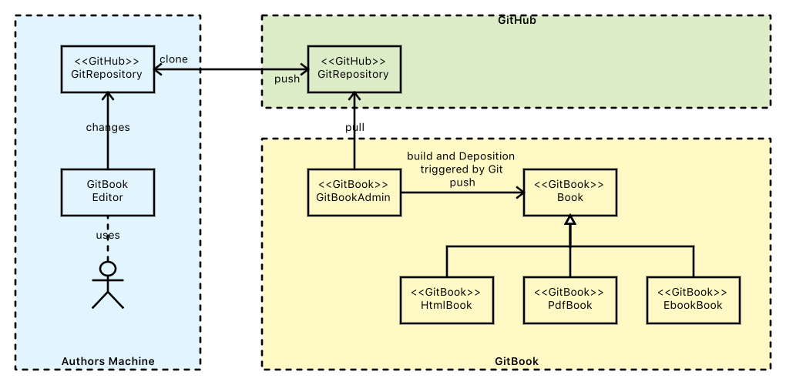
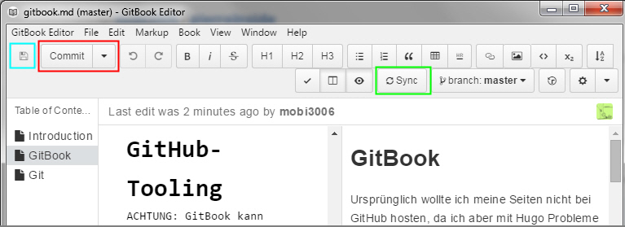

# GitBook
* https://www.gitbook.com/
* https://help.gitbook.com/
* https://www.youtube.com/watch?v=KFF5bBLX7ME
* [Sehr guter Überblick](http://www.linux-magazine.com/Issues/2014/166/Workspace-GitBook)

Ursprünglich wollte ich meine Seiten nicht bei GitHub hosten, da ich aber mit Hugo Probleme bei der Erstellung einer Menüstruktur hatte, habe ich mich dann doch mal mit GitBook beschäftigt. So könnte ich zumindest mal mit dem Markdown-Style in Fahrt kommen und mir dann aber mittelfristig eine andere Lösung überlegen (oder vielleicht gefällt es mir ja so gut, daß ich dabei bleibe).

---

# Was macht GitBook attraktiv?
* sehr gute Toolchain, die eher schon ein Publishing-System ist ... darauf gehe ich noch detaillierter ein
* kein/geringer Tool-Lock-in-Effekt ... später kann man sich vielleicht für einen anderen Deployment-Ansatz entscheiden ... den Markdown-Content wird man dann zumindest man nicht mehr anpassen müssen.
* Git-Features: 
  * verteiltes offline Arbeiten möglich 
  * Versionskontrolle für Dokumentation ... diffs möglich
* GitHub-Features: [siehe hier](github.md)
* GitBook-Features:
  * Output-Formate:
    * HTML
    * PDF
    * verschiedene eBook-Formate
  * Erstellung der Bücher automatisiert ... der Autor committet nur nach GitHub und dann läuft alles automatisch
  * Diskussionen möglich
  * im deployten Buch ist auf der Seite selbst eine Suche möglich (bei Static-Site-Generator-Ansätzen ist das nicht out-of-the-box)
  * über https://www.gitbook.com/search/advanced kann man noch komfortabler suchen
* Erweiterbarkeit über 
  * [Webhooks](https://developer.gitbook.com/webhooks/) ... man kann weitere Webhooks konfigurieren bzw. selbst welche schreiben
  * Plugins ... z. B. [YouTube-Plugin](https://plugins.gitbook.com/plugin/youtube)
* sehr gute Anlaufquelle für Dokumentation von Technologien aus Anwendersicht (sehr brauchbar für Entwickler)

## Toolchain
Die Toolchain besteht aus:

* GitBookEditor: 
  * wird zum Schreiben des Contents (in Markdown) auf dem lokalen Rechner genutzt
  * verwendet Git zur lokalen Speicherung
  * verwendet GitHub zur remote Speicherung
  * ermöglicht die lokale Erstellung von HTML-Seiten, die man auf jeden beliebigen Webserver schieben kann 
* GitHub (https://github.com)
  * hier kann der per GitBookEditor erstellte Content zentral abgelegt werden 
  * die Markdown-Seiten werden hier auch schon in HTML gerendert
* GitBook
  * produziert automatisch (wenn man in GitBook das GitHub Repository konfiguriert und GitBook entsprechende Rechte eingeräumt hat) eine neue Version des Buches sobald in GitHub Änderungen committet wurden 
  * Bücher werden in verschiedenen Formaten erstellt (ePub, PDF, mobi)
  * unterstützt Webhooks, so daß nach der Erstellung eines Buchs weitere Aktionen getriggert werden können
  * ermöglich eine komfortable Suche: https://www.gitbook.com/search/advanced
    * http://jinlaixu.net/books/gitbook-documentation/platform/search.html

Mit dieser Toolchain ist der Einstieg in Markdown-Content sehr einfach und man muß sich noch nicht damit beschäftigen welchen [Markdown-StaticSiteGenerator](staticSiteGenerators.md) man mal verwenden will.

Interessant ist, daß Teile der Drupal-Dokumentation (Drupal ist ein bekanntes Content-Management-System) auch mit GitBook erstellt ist ... ein Zeichen dafür, daß es ein exzellentes Tool für Dokumentation ist. Zudem scheint der [Static-Site-Generator-Ansatz](staticSiteGenerators.md) genau richtig zu sein für Dokumentation ... ansonsten würden die Drupal-Entwickler sicher auch Drupal verwenden (in diesem Fall sind sie wahrscheinlich auch an der leichten Integration der Leser interessiert ... "Leser werden zu Autoren"). GitBook ist sehr beliebt als Static Site Generator: http://www.staticgen.com/

## Leser werden zu Autoren
**Annahme:** der Leser ist auch ein GitHub-User

Ein Vorteil dieser Integration ist, daß es sehr einfach ist, Input von Lesern zu bekommen und so seine Dokumentation ständig zu verbessern. Ein Leser kann auf dem GitBook einfach den Link *Edit this Page*  drücken und die Seite wird in GitHub geöffnet. Dort kann der Leser zum Autor werden und einen Fork des Repositories erstellen. Darin nimmt er die gewünschten/vorgschlagenen Verbesserungen vor und erstellt dann einen Pull-Request an den Repository-Owner. Der kann seinerseits entscheiden, ob er die Änderungen übernehmen will oder nicht.

Sollte der Leser kein GitHub-User sein, dann kann er auf ähnliche Weise zur Verbesserung beisteuern, aber eben nicht gar so komfortabel. Wer aber möchte, daß sich andere beteiligen, sollte darauf achten, daß es möglichst einfach ist ... niemand will stundenlang Tools installieren müssen, nur um dann eine Zeile Dokumentation zu verbessern, die dann evtl. vom Owner nicht mal übernommen wird.

---

# Option 1: Getting started via GitBookEditor
* http://toolchain.gitbook.com/setup.html

## Anmeldung bei GitHub und GitBook
Das ist schnell gemacht.

## Vorbereitung
* Anmeldung bei GitHub und GitBook
* Repository bei GitHub anlegen
* Buch bei GitBook anlegen und mit dem GitHub-Repository verbinden (so daß später mal das Buch automatisch gebaut wird, wenn ein Commit ins GitHub-Repository erfolgen kann) 

## Installation
Das Binary wird vom Download-Server geladen und installiert.

## Buch erstellen
* GitBook-Editor starten
* Neues Buch anlegen ... das Buch (bzw. das Git-Repository) wird unter Windows an diese Position angelegt: ``C:\Users\myUser\GitBook\Library\Import\mybook``
* das neue Buch hat gleich schon drei Dateien:
  * ``README.md`` ... wird in Inhaltsverzeichnis als *Introduction* angezeigt
  * ``SUMMARY.md`` ... ist das Inhaltsverzeichnis
  * ``chapter1.md`` ... ein Beispiel
* lokal committen

## Buch lokal deployen
Mit dem GitBook-CLI kann das Buch lokal in verschiedenen Formaten deployed werden. Das Command-Line-Interface wird weiter unten vorgestellt.

## Buch online deployen
* über den GitBookEditor erfolgt ein sync (= push) mit GitHub
* nach einer Weile wird das Buch automatisch neu gebaut (HTML, PDF, eBook-Formate) und deployed ... z. B. hier: https://mobi3006.gitbooks.io/pierreinside/content/
  * sollte das nicht automatisch funktionieren, so muß man im GitBook-Admin-Weboberfläche evtl. die Verbindung zum GitHub-Repository herstellen und einen Webhook konfigurieren (der Webhook stößt dann den Build an)

---

# Option 2: Getting started via GitBook-Command-Line-Interface
GitBook liefert nicht nur den Editor als GitBook-Client, sondern auch ein CLI mit folgenden Features:

* ``gitbook init``
* ``gitbook serve``
* ``gitbook build``
* ...

Ich habe das CLI bisher nur eingesetzt, um ein statischen HTML-Output meiner gesamten Seite mittels ``gitbook build`` zu generieren. 

## Vorbereitung
* Anmeldung bei GitHub und GitBook
* Repository bei GitHub anlegen
* Buch bei GitBook anlegen und mit dem GitHub-Repository verbinden (so daß später mal das Buch automatisch gebaut wird, wenn ein Commit ins GitHub-Repository erfolgen kann) 

## Installation
... des CLI:

    $ npm install gitbook-cli 
      -g C:\Users\MY_USER\AppData\
            Roaming\npm\gitbook 
      -> C:\Users\MY_USER\AppData\
            Roaming\npm\node_modules\
            gitbook-cli\bin\gitbook.js
    ...

## Buch erstellen
    $ gitbook init ./pierreinside
    Installing GitBook 2.6.7
    gitbook@2.6.7 ..\..\Programme\cygwin\tmp\tmp-8108lvZ454IipE6j\node_modules\gitbook
    ...

Dadurch wird ein Verzeichnis `./pierreinside` angelegt, in dem ein Git-Repository angelegt ist (``.git``) und in dem bereits folgende Seiten befinden:

* ``README.md`` ... wird in Inhaltsverzeichnis als *Introduction* angezeigt
* ``SUMMARY.md`` ... ist das Inhaltsverzeichnis
* ``chapter1.md`` ... ein Beispiel

Danach werden Dateien mit beliebigen Tools geändert, hinzugefügt und gelöscht. Anschließend erfolgt der lokale commit mittels ``git add`` und ``git commit``. 

## Buch lokal deployen
Per

    gitbook serve ./pierreinside
    
kann ich das "Buch" lokal deployen, so daß ich per

    http://localhost:4000

darauf zugreifen kann.

## Buch online deployen
* über ``git push`` wird das lokale Repository ins GitHub-Repository gepusht
* nach einer Weile wird das Buch automatisch neu gebaut (HTML, PDF, eBook-Formate) und deployed ... z. B. hier: https://mobi3006.gitbooks.io/pierreinside/content/

---

# Option 3: Deployment auf Self-Hosted-Webserver
## Statische Seiten generieren
Per GitBook-CLI

    gitbook build ./pierreinside

werden die statischen HTML-Seiten erzeugt. Dabei wird ein Verzeichnis `./pierreinside/_book` angelegt. Diese Dateien kann man auf JEDEN Webserver kopieren ... DAS WARS

**ACHTUNG:** Man sieht hieran, daß man trotz GitHub-Tooling nicht gezwungen ist, die Bücher bei GitHub zu hosten und bei GitBook zu deployen!!!

---

# Integration in das GitHub-Tooling
**ACHTUNG:** GitBook kann auch genutzt werden, ohne die serverseitige GitHub/GitBook-Infrastruktur zu nutzen!!! Allerdings kann die angebotene Toolkette die Arbeit vereinfachen (vor allem reduziert es die Einstiegshürde) ...

## GitHub
GitHub kann verwendet werden, um den Raw-Content (Markdown, AsciiDoc) zu speichern (inkl. Versionsverwaltung). Das kann in einem öffentlichen (man kann allerdings bestimmen, wer committen darf) oder privaten Repository erfolgen. Allerdings ist bei GitHub derzeit nur ein einziges private Repository kostenlos ...

---

# Content
* http://toolchain.gitbook.com/pages.html

## Filesystem-Organisation
* http://toolchain.gitbook.com/structure.html

Unterhalb von ``$SITE_HOME`` (auf dem lokalen Rechner) liegt die Datei `SUMMARY.MD`, die das Inhaltsverzeichnis abbildet (später im linken Navigationsbereich dargestellt). Darin kann beliebig in die Filesystem-Ordnerstruktur referenziert werden. Yippppiiieeeh ... genau so habe ich mir das vorgestellt :-)

## Konfiguration
* http://toolchain.gitbook.com/config.html

... erfolgt in der ``book.json``.

## Unterstützte Input-Formate

GitBook unterstützt folgende Input Formate

* Markdown (GitHub-Flavor)
* AsciiDoc

## Contenterstellung

Der Content kann mit jedem beliebigen Editor geschrieben werden (u. a. mit dem GitBook-Editor, der zudem noch einen grafischen Git-Client integriert). Auch wenn Markdown eine relativ eingeschränkte Syntax hat, muß man sie trotzdem einhalten. Deshalb bieten sich Editoren an, die die Seite dann auch gleich darstellen, um so Fehler frühzeitig aufzudecken. GitHub bietet mit dem GitBook Editor ein sehr gutes Tool (siehe unten).

### Markdown Input Format
* http://toolchain.gitbook.com/syntax/markdown.html

#### Fußnoten
Hier möchte[^1] ich die Fußnote demonstrieren[^fadsg].

[^1]: hier ist der Text zur Fußnote
[^fadsg]: oder so

### SUMMARY.md
* http://jinlaixu.net/books/gitbook-documentation/book/chapters.html

Diese Datei ist das Inhaltsverzeichnis, das später auf in der linken Seite angezeigt wird.

### README.md
Diese Datei wird in GitBook als Intro für das Buch dargestellt: 
* https://www.gitbook.com/book/mobi3006/pierreinside/details
* https://www.gitbook.com/book/0xax/linux-insides/details

### GLOSSARY.md

### Youtube Videos 
* https://plugins.gitbook.com/plugin/youtube

In Markdown können Videos beispielsweise über HTML eingebettet werden ... mal

### Content einbetten
* http://toolchain.gitbook.com/templating/conrefs.html
Auf diese Weise läßt sich eine gewisse Art von Modularisierung erreichen.

---

# GitBook Editor
* https://www.gitbook.com/editor

Eigentlich wollte ich die Markdown-Seiten mit dem Editor MEINER Wahl schreiben. Als ich dann aber mit GitBook anfing wollte ich dem diesem Editor mal eine Chance geben ... und tatsächlich adressiert er schon sehr viele Aspekte, die man ansonsten vermutlich über mehrere Tools (Editor mit Live-Vorschau, Git-Client) abbilden müßte ... hier ist alles integriert (es handelt sich eher um eine Desktop Publishing Solution als um einen einfachen Editor) und somit für Newbies auf jeden Fall ein guter Startpunkt:

* Speichern ... aber wohin ??? - türkise Umrandung in Abbildung unten
* Commit zum lokalen Repository (vorher wird die Datei auf dem Filesystem gespeichert)  - rote Umrandung in Abbildung unten
* Sync (push, pull) mit dem RemoteRepo (auf GitHub) - grüne Umrandung in Abbildung unten
  * aufgrund des integrierten ``pull`` beim Sync kann man auch problemlos direkt auf dem Server-Repository (über die Webapplikation) editieren ... PERFEKT :-)
* Live-Preview
* WYSIWYG-Editor 
  * besonders gut gefallen haben mir die Shortcuts (Strg-B für Fettdruck, ...)
* Integration neuer Seiten ins Inhaltsverzeichnis (``SUMMARY.md``)
* farbige Anzeige noch nicht gespeicherter Seiten

> ACHTUNG:
> Die Änderungen im Editor sind außerhalb des Editor (Filesystem, ``gitbook serve`` zunächst nicht sichtbar. Erst nach dem Sync (grüne Umrandung) auf das Remote-Repository werden die Änderungen auch außerhalb sichtbar ([Details siehe](#256143)).

#### Was bedeutet "Import"? Wo liegen die Dateien?
Bei meinem ersten Buch hatte ich meine Sourcen in ``C:\Dev\pierreinside`` liegen und hatte das in GitBook Editor importiert.

Nach einiger Zeit habe ich mir allerdings die Frage gestellt wo denn der Editor die Dateien lokal speichert. Ich hatte eigentlich erwartet, daß die Speicherung in ``C:\Dev\pierreinside`` erfolgt. Dort habe ich neu erstellte Dateien aber nicht gefunden ... in ``C:\Users\MY_USER\GitBook\Library\Import\pierreinside`` aber auch nicht. Selbst eine Suche auf der gesamten lokalen Festplatte war erfolglos. Irgendwo mußten sie aber persistiert sein. Ich habe den Rechner sogar mal runtergefahren und die Dateien waren weiterhin über den GitBook Editor sichtbar ... nur eben nie über den File-Explorer. Selbst nach einem Commit über den GitBook Editor waren die Dateien noch nicht über den File-Explorer sichtbar. Erst nachdem ich ein Sync aufs Remote-repository gemacht habe wurden die Dateien in ``C:\Users\MY_USER\GitBook\Library\Import\pierreinside`` angezeigt ... Über den Windows ProcessExlorer habe ich ein Verzeichnis (``C:\Users\myuser\AppData\Roaming\gitbook-editor\``) gefunden, das damit in Zusammenhang stehen könnte ... NOCH habe ich KEINE ANTWORT

Das passte aber irgendwie zu meiner Beobachtung, daß bei neu angelegten Büchern gar nicht nach dem Speicherort gefragt wurde ... gefunden habe ich diese Bücher aber unter ``C:\Users\MY_USER\GitBook\Library\Import\`` - scheinbar ist das das einzige Verzeichnis, mit dem GitBook Editor arbeiten kann.

Zudem muß erst ein Sync auf das Remote-Repository erfolgen ... komisch ...

Diese Arbeitsweise bin ich so nicht gewohnt bei der Arbeit mit Git ... da ich aber ja nicht mit meinem Tooling arbeite, sondern mit dem Tooling von GitHub mag das der eingeschlagene Weg sein.

---

# Theming
* https://help.gitbook.com/content/how-can-i-change-theme.html

Seit Version 3 ist Theming möglich - Themes werden wie  Plugins behandelt (also in ``book.json`` eintragen). Um sie lokal zu integrieren, muß das Kommando 

    gitbook install

## Fertige Themes
* https://github.com/GitbookIO/theme-faq

---

# Kollaboration
## Diskussionen
Unter *GitBook Admin UI - MyBook - Settings - Features - Discussions* muß das Feature aktiviert werden. 

## Kommentare
Unter *GitBook Admin UI - MyBook - Settings - Features - Inline Comments* muß das Feature aktiviert werden.

---

# Administrative Informationen
## Private vs Public Bücher
**Public:**

* alle Internetuser können das Buch lesen - es wird auch über Suchmaschinen gefunden
* nur die explizit eingetragenen Kollaborateure können das Buch bearbeiten (Clones sind natürlich jederzeit möglich, weil es sich um ein GitHub-repository handelt)
* können verkauft werden
* die GitBook-Plattform ist für Public-Bücher kostenlos

**Private:**

* sind nur für die explizit eingetragenen Kollaborateure sichtbar
* können NICHT verkauft werden
* der Autor muß für die Plattform bezahlen

## Lizenz
Für jedes Buch kann eine Lizenz unter *GitBook Admin UI - MyBook - Settings - Features - Discussions* eingestellt werden ...

# GitBooks Schwächen
## Anpassung des Themes
Es ist extrem schwierig das Layout einer GitBook-Seite an eigene Bedürfnisse anzupassen ...

---

# Fazit
Ich bin wirklich richtig begeistert von der Toolchain. Dokumentation wie Code zu behandeln (Versionskontrolle) halte ich grundsätzlich für einen gute Idee. Das Editieren von Markdown (insbes. mit dem *GitBook Editor* mit Preview-Ansicht) ist eine wahre Freude. Der automatisierte Build/Deployment von Büchern ist sehr angenehm.

Zukünftig werde ich deutlich schneller meine Artikel verfassen können und zudem mit noch mehr Freude.

Mal sehen ob ich dauerhaft bei GitBook bleibe ...

---

# FAQ
**Frage 1:** Ich versuche, die Seiten durch Verschieben im GitBook-Editor in den Chaptern zu verschieben ... das klappt aber gar nicht ...

Antwort 1: Vielleicht ein Bug in GitBook-Editor ... ich tue das über die Datei ``SUMMARY.md``.
