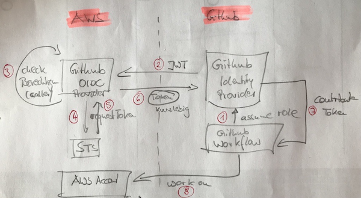

# GitHub-AWS OIDC

Mit [OIDC](openIdConnect.md) (basierend auf der [OAuth Idee](oauth.md)) lässt sich eine Authentifizierung und Authorisierung ganz ohne Passwörter bewerkstelligen. Grundprinzip von OAuth:

> OAuth 2 versucht die Komplexität aus den Clients rauszuhalten und in die Server zu verlagern. Für den Enduser (z. B. Applikationsentwickler) wird es dadurch einfacher. Die Konfiguration erfolgt ZENTRAL (das ist der Vorteil hinsichtlich Sicherheit) im Backend.

Hierbei geht GitHub als OIDC-Identity-Provider eine Trust-Beziehung mit AWS ein ... die Authentifizierung wandert von AWS nach GitHub, d. h. solange GitHub die Identität des Nutzers bestätigt, erteilt AWS dem Nutzer die im Vertrag konfigurierten Zugriffsberechtigung. Somit kommt ein Nutzer (führt einen GitHub Workflow aus) ohne Passwort aus ... zudem können die Berechtigungen zentral von einem anderen Team geregelt werden.

---

# Nachteil von Passwörtern

## Konzeptuell

* unsicher (gleiche, zu einfache)
* long-lived
* werden selten geändert
* häufig personengebunden ... was natürlich schlecht ist, wenn eine Person mal nicht mehr dabei ist aber sein Passwort in automatisierten Prozessen verwendet wird (und damit dann auch ungültig wird) => Prozesse brechen
* müssen dann evtl. noch zusätzlich in einem Passwort-Store hinterlegt werden
* müssen manchmal geändert werden
* man verliert den Überblick wo sie überall verwendet werden und wo sie dann auch geändert werden müssen

## GitHub Implementierung

GitHub kennt zwar das Konzept der Secrets ... allerdings haben Secrets gewisse Schwachstellen. Sie können gestohlen werden, die bleiben häufig immer gleich (Abhilfe Rotation). Ein typisches Beispiel aus dem GitHub Alltag:

> Shared Workflows brauchen manchmal Zugriff auf AWS Ressourcen (z. B. man hat das GitHub-Setup über Terraform implementiert und hosted den Terraform State in S3). Shared Workflows haben keinen separaten Secret Space, sondern müssen die Secrets von den Callern bekommen, d. h. die Secrets müssen entweder direkt in den Repos des Callers liegen oder von der GitHub Organisation an die Repos propagiert werden. Dadurch können ALLE Workflows des Repositories (nicht nur der Shared-Workflow) diese Secrets in nicht dafür vorgesehenen Workflows verwenden (sie können sie nicht im Klartext auslesen). Das funktioniert dann auf ALLEN Branches ... also auch auf Feature-Branches, die evtl. nicht unter 4-eyes Prinzip (Pull-Request-Enforcement) stehen. Somit könnte ein Angreifer die Secrets vollkommen unbemerkt verwendem.

---

# Lösung OIDC

* [YouTube - Connecting GitHub Actions To AWS Using OIDC](https://www.youtube.com/watch?v=mel6N62WZb0)
* [YouTube - Securely deploy to AWS with GitHub Actions and OIDC](https://www.youtube.com/watch?v=Io5UFJlEJKc)
* [GitHub - Configuring OpenID Connect in Amazon Web Services](https://docs.github.com/en/actions/deployment/security-hardening-your-deployments/configuring-openid-connect-in-amazon-web-services)
* [AWS - About security hardening with OpenID Connect](https://docs.github.com/en/actions/deployment/security-hardening-your-deployments/about-security-hardening-with-openid-connect)



Bei der Authentifizierung gibt es zwei wesentliche Beteiligte - am Beispiel eines typischen Szenario (GitHub => AWS) aus dem Bereich des Software-Deployments "Workflow A möchte ein Deployment auf AWS ausführen":

* GitHub Workflow, der den Zugriff erhalten möchte (Caller)
* AWS als Resource Owner gewährt den Zugriff auf die Protected Resource

Typisch ist, dass es zwei unterschiedliche Systeme sind, die

* Authorisierung i. a. unterschiedlich abgebildet haben (unterschiedliche Modelle/Granularitäten)
* von unterschiedlichen Firmen oder Gruppen verwaltet werden

Die Lösung von OIDC sieht [folgendermassen aus](https://docs.github.com/en/actions/deployment/security-hardening-your-deployments/about-security-hardening-with-openid-connect#understanding-the-oidc-token):

> der GitHub Workflow fragt bei **SEINEM** Authorization Server (= GitHub OIDC Identity Provider) nach einem bestimmten Zugriff auf ein Zielsystem (= Context) für einen bestimmten Use-Case (= Claim) an, z. B. "ich will eine Lambda-Funktion in AWS auf Produktion deployen"
  * wenn GitHub den User identifiziert hat, dann stellt es einen signierten Token (JWT - enthält die Claims = ) aus, so dass
    * AWS die Rechtmäßigkeit der Anfrage über die Signatur prüfen kann ... AWS prüft also, ob die Anfrage vom trusted GitHub-OIDC-Provider kommt
    * AWS die Claims (Nutzungsszenario) prüfen kann
  * ist alles in Ordnung, dann stelle AWS einen kurzlebigen AWS Token aus, mit dem der Workflow Zugriff auf die Protected AWS Ressourcen erhält

## Konfiguration in AWS

* [StratusGrid - Connecting GitHub Actions To AWS Using OIDC](https://www.youtube.com/watch?v=mel6N62WZb0)
* [Configuring a role for GitHub OIDC identity provider](https://docs.aws.amazon.com/IAM/latest/UserGuide/id_roles_create_for-idp_oidc.html#idp_oidc_Create_GitHub)

In AWS wird im Bereich IAM ein OIDC-Provider für GitHub hinzugefügt - man braucht diesen Provider nur einmal pro AWS-Account zu definieren:

* GitHub Identity Provider URL: https://token.actions.githubusercontent.com
  * daraufhin wird ein [sog. Thumbprint](https://docs.aws.amazon.com/IAM/latest/UserGuide/id_roles_providers_create_oidc_verify-thumbprint.html) ausgegeben
  * diesen Thumbprint ist der Public-Key, den GitHub zur Signierung des Json-Web-Token (JWT) verwendet
    * damit prüft AWS also, ob der JWT tatsächlich echt ist (= von GitHub kommt)
* Audience: `sts.amazonaws.com`
  * diese Information wird als Claim im JWT von GitHub mitgegeben

Anschließend muss man noch eine Trust-Relationship (wer darf es nutzen) und Berechtigungen, die beide in einer IAM-Role (basierend auf einer CustomTrustPolicy) abgebildet sind:

* mit Trusted entity (= wer darf sie nutzen)
  * `aud`, `sub` sind sog. Claims, die mehr Kontext zum Request bereitstellen ... [Liste aller unterstützten Claims](https://token.actions.githubusercontent.com/.well-known/openid-configuration)

  ```
  {
    "Version": "2012-10-17",
    "Statement": [
      {
        "Effect": "Allow",
        "Action": "sts:AssumeRoleWebIdentity",
        "Principal": {                                                  // wer is der Ausführende
                                                                        // ... das ist technisch gesehen der OIDC-Provider
          "Federated": 
            "arn:aws:iam:<MY_AWS_ACCOUNT>:oidc-provider/token.actions.githubusercontent.com"
        },
        "Condition": {
          "StringLike": {
            "token.actions.githubusercontent.com:aud": "sts.amazonaws.com",             // Ziel der API Calls
            "token.actions.githubusercontent.com:sub": "repo:mobi3006/myrepo/*"         // Quelle der API Calls
                                                                                        // ... GitHub Workflow
                                                                                        //     ... all branches
          }
        }
      }
    ]
  }
  ```

* Permissions eingepackt in eine IAM-Role ... was darf der Nutzer dieser Rolle?
  * am besten macht man gleich zu Beginn ein "Deny" auf "sts:AssumeRole", um ein Ausbrechen aus DIESER Rolle zu verhindern (und damit Tür und Tor zu öffnen)
  * danach kommen die minimalen Permissions

In Terraform sieht das Ganze dann so in etwa aus:

```
resource "aws_iam_oidc_identity_provider" "github_identity_provider" {
  url                = "https://token.actions.githubusercontent.com"
  thumbprint_list    = ["abc123"]                                   # Replace with the thumbprint of GitHub's certificate
  client_id_list     = ["sts.amazonaws.com"]
}

# 
resource "aws_iam_role" "github_role" {
  name               = "GitHubRole"
  assume_role_policy = <<EOF
{
  "Version": "2012-10-17",
  "Statement": [
    {
      "Effect": "Allow",
      "Principal": {
        "Federated": "${aws_iam_oidc_identity_provider.github_identity_provider.arn}"
      },
      "Action": "sts:AssumeRoleWithWebIdentity",
      "Condition": {
        "StringEquals": {
          "${aws_iam_oidc_identity_provider.github_identity_provider.url}:sub": "repo:mobi3006/myrepo/*"
        }
      }
    }
  ]
}
EOF
}

resource "aws_iam_role_policy_attachment" "github_role_policy" {
  policy_arn = "arn:aws:iam::aws:policy/AdministratorAccess"            # Berechtigungen
  role       = aws_iam_role.github_role.name
}
```

In obigem Beispiel sieht man immer wieder `sts` ... letztlich ist es der Security Token Service (aka STS), der das temporäre Token ausstellt, mit dem sich der GitHub Workflow authentifiziert.

## GitHub Workflow

* [About security hardening with OpenID Connect](https://docs.github.com/en/actions/deployment/security-hardening-your-deployments/about-security-hardening-with-openid-connect)

In der GitHub Organisation muss gar nichts mehr konfiguriert werden ... es funktioniert out-of-the-box mit den mit den Werten, die wir in AWS benutzt haben.

Allerdings müssen die Workflows die angelegte Rolle noch nutzen, um die von AWS im OAuth-Flow ausgestellten AWS-Credentials (in Form eines kurzlebigen Tokens) zu nutzen.

### Permissions

```yaml
jobs:
  my-job:
    permissions:
      id-token: write     # Required to fetch a OpenID Connect (OIDC) token
      contents: read      # Required for actions/checkout
```

### configure-aws-credentials

```yaml
- name: Configure AWS credentials
  uses: aws-actions/configure-aws-credentials@v4
  with:
    role-to-assume: arn:aws:iam::${{ env.AWS_ACCOUNT_ID }}:role/gh-actions-role-myrepo-deploy
    aws-region: ${{ env.AWS_REGION }}
```

### Final Result

Workflow `mobi3006/myrepo/.github/.workflows/my-workflow.yml`:

```yaml
on:
  workflow_dispatch:
jobs:
  my-job:
    permissions:
      id-token: write     # Required to fetch a OpenID Connect (OIDC) token
      contents: read      # Required for actions/checkout
    steps:
      - name: Configure AWS credentials
        uses: aws-actions/configure-aws-credentials@v4
        with:
          role-to-assume: arn:aws:iam::${{ env.AWS_ACCOUNT_ID }}:role/gh-actions-role-myrepo-deploy
          aws-region: ${{ env.AWS_REGION }}
      - name: get caller identity ... for testing access
        run: |
          aws sts get-caller-identity
```

Wie man hier schön sieht ... es werden keine Secrets gebraucht, weil alles in der Trust-Beziehung im Backend über die IAM-Role `gh-actions-role-myrepo-deploy` abgebildet ist (Trusted Entity = dieser Workflow PLUS Permissions).

---

# Bewertung

## Trennung Role vs GitHub Workflow

Wenn wir nicht gerade in einem kleinen Startup sind, dann werden die Berechtigungen innerhalb eines AWS Accounts von einem anderen Team gemanaged als von den DevOps-Leuten eines Teams, das ein Deployment implementieren will.

Insofern hat man hier schon zwangsläufig eine explizite Diskussion (Vier-Augen-Prinzip) und kann das Least-Priviliges-Prinzip einhalten.

## Ist das Beispiel sicher?

Man sieht, dass man nur durch

> role-to-assume: arn:aws:iam::${{ env.AWS_ACCOUNT_ID }}:role/gh-actions-role-myrepo-deploy

die Berechtigung zur Nutzung der Rolle bekommt. Die Nutzung wird durch die Trusted Entity 

> "token.actions.githubusercontent.com:sub": "repo:mobi3006/myrepo/*"

eingeschränkt. Doch dann darf doch jeder Workflow aus diesem Repository die Rolle assumen - will man das? Was ist wenn dort jemand seinen Code einschmuggelt indem er er einen Feature-Branch (steht i. a. nicht unter Protection, d. h. jeder kann hier Code bereitstellen) mit einem schädlichen Workflow einschleust. Wir haben das doch nicht unter Kontrolle. Insofern ist das Beispiel nicht unbedingt sicher.

Das stimmt und wir sollten das einschränken. Hierzu bietet GitHub [Environments mit Protection Rules](https://docs.github.com/en/actions/deployment/targeting-different-environments/using-environments-for-deployment). Ein Environment definiert das Ziel eines Deployments (z. B. `production`, `development`). Deployments werden natürlich mit einem GitHub Workflow umgesetzt. Mit einer Protection Rule kann man ein Approval (4-eyes Principle) durch bestimmte Engineers einfordern und so Änderungen am AWS Account kontrollieren. Ausserdem kann man einschränken, dass ein Deployment-Workflow aus einem Protected-Branch kommen muss (damit stehen Code-Änderungen evtl. unter Approval-Schutz).

Werden weitere Secrets benötigt, so können die - statt sie an die Organisation oder Repository zu hängen - einem Environment zugeordnet werden. Erst wenn alle Required Checks erfüllt sind (z. B. Approval), werden die Secrets zur Nutzung freigeschaltet.

## Wo wird denn die Identität des Callers geprüft?

GitHub wird den Request eine AWS Rolle einzunehmen mit seinem privaten Key signieren und steht somit mit seinem Namen dafür gerade, dass es sich um einen validen Request aus "seinem" Ecosystem handelt. Das schließt natürlich nicht aus, dass es sich dabei nicht doch um eine unrechtmäßige Nutzung handelt. Das wiederum muss das Trust-Entity auf Seite von AWS prüfen ... hier werden die rechtmäßigen Nutzer (z. B. ein Environment eines Repositories) eingeschränkt.

### Deploy-Environments

GitHub unterstützt sog. Environments für Deployments (und dabei handelt es sich ja dann, wenn man Änderungen an einem AWS Account vornehmen will).

In der Trust-Relationship der AWS-IAM-Rolle kann man die Nutzung auch auf Environments einschränken (im Beispiel auf das Environment mit dem Namen `Production`):

```
"${aws_iam_oidc_identity_provider.github_identity_provider.url}:sub": "repo:mobi3006/myrepo:environment:Production"
```
