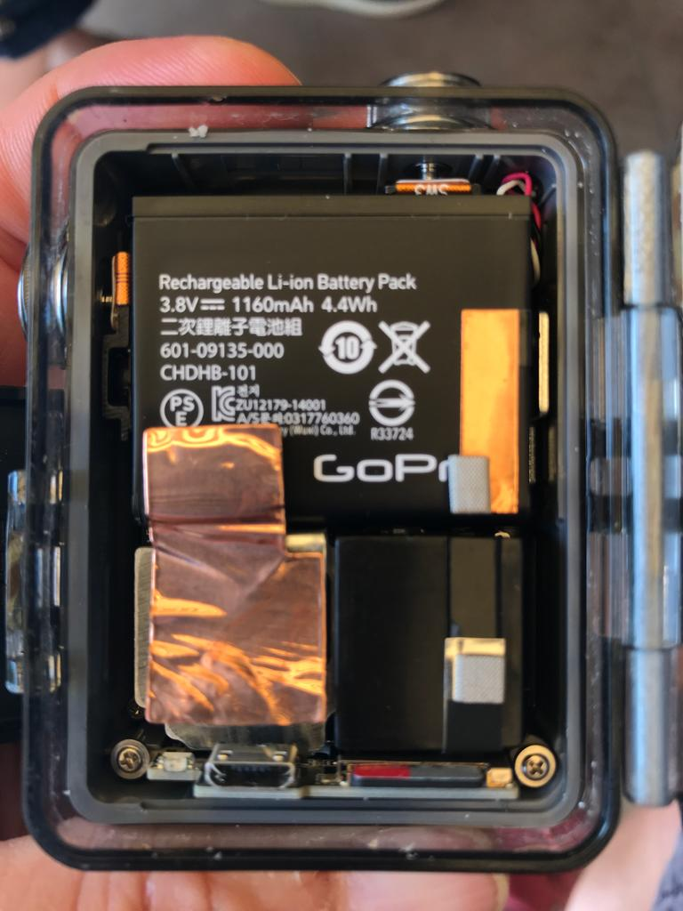

# GOPRO

Ich habe meine erste GoPro Hero+ (von 2015) mal günstig für 100 Euro gekauft. Eigentlich hatte ich keinen richtigen Verwendungszweck, aber ich wollte es einfach ausprobieren.

Gemeinsam mit einem Gorilla-Tripod kann man sie auch überall befestigen - einfach klasse.

---

## Hero+ ... 2015

Ich war sofort begeistert ...

* Weitwinkel par excellence
* sehr gute Stabilisierung
* klasse Qualität
* Unterwassergehäuse gleich dabei ... funktioniert gut
* ohne schnickschnack (nicht mal ein Bildschirm), der nur kaputtgehen kann
* besonders robust, so daß ich sie auch einfach mal ins Fußballtor stellen kann um Aufnahmen zu machen, die ich sonst nicht bekommen würde.

Ich habe sie dann im wesentlichen für Fußball-Aufnahmen, Unterwasser und Skifahren genutzt. Nicht, daß ich besonders Action-affine Hobbies habe, aber die Aufnahmen sind dennoch was ganz anderes.

Einziges Manko ist der sehr schlecht ablesbare LCD - wenn ich dort WLAN aktivieren will (für die Remote-Steuerung), dann muß ich mir schon mal eine Brille leihen.

### GoPro-App - iPhone

Diese Variante hat kein Display, was aber aufgrund des Ultra-Weitwinkels akzeptabel ist. Wenn ich dennoch mal eine Justierung der Aufnahmeposition brauche, tue ich das über die GoPro-App auf dem iPhone, mit der ich das Live-Bild sehen kann. Darüber kann ich auch Aufnahmen starten/stoppen, Marker setzen und die Videos auf der GoPro-eigenen Speicherkarte ansehen. Funktioniert sehr gut. Auf diese Weise kann ich die GoPro auch an schwer zugänglichen Orten installieren und dann bei Bedarf Aufnahmen starten.

### Akku

Der Akku hat anfangs sehr gut gehalten, doch nach 3-4 Jahren hält der Akku aber nicht mehr besonders lang und ich über überlege eine Neuanschaffung oder doch noch mal einen Akku-Tausch ... [soll ja recht einfach sein](https://praxistipps.chip.de/gopro-oeffnen-so-gehts_45471).

---
