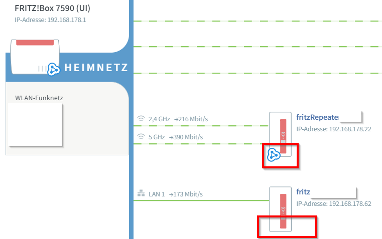
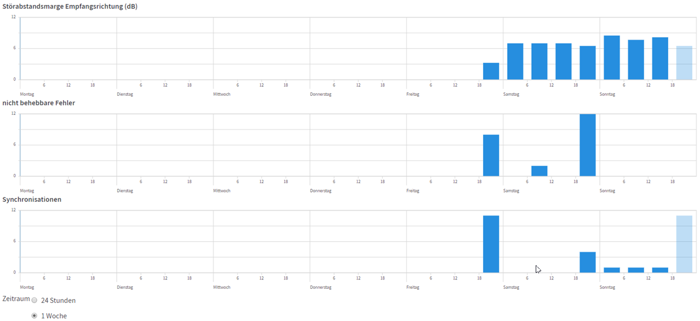

# Heimnetzwerk

Zuhause habe ich leider kein durchgehendes kabelgebundenes Netzwerk - bei Renovierungen achte ich allerdings darauf, das nachzuholen (gleich mit 10GBit Kabel - Cat 7 FSTP). Im Erdgeschoss kommt der DSL-Anschluss an und von dort habe ich 

* Kabel in den zweiten Stock über ein hohles Geländer
* Kabel zu meinem Fernseher ... verlegt unter der Terrassenschiebetür
* vom Fernseher zum Laptop ... verlegt durch die Fussleiste
* vom Fernseher in den Keller über einen Lüftungsschacht

 ... das ist schon mal sehr gut und mehr als ich mir hätte wünschen können in meinem 80er Jahre Haus.

---

## DSL Router 7390

Jahrelang hat dieser Router sehr gute Dienste geleistet, doch mittlerweile ist er schon ein wenig in die Jahre gekommen (Stand 2017). Folgende Punkte sind nicht mehr up-to-date:

* kein WLAN ac - Performance schlecht
  * das ist tasächlich ein Problem, da ich viele Videos auf meinem NAS habe, die nur ruckelnd daherkommen
  * allerdings hat auch mein Haupt-Laptop nur eine schlechte WLAN-Performance, da nur eine Antenne verbaut ... wird aber bald mal ausgetauscht
* kein Mesh-Support

---

## Alte Fritzbox als AccessPoint

Ich habe im zweiten Stock eine alte Fritzbox als AccessPoint eingerichtet. Das funktioniert prinzipiell, aber die alte Box kann halt keine aktuellen WLAN-Standards und kommt somit auf eine schlechte Performance. Das liegt sicherlich auch daran, daß das 2,4 GHz Netz von vielen meiner Nachbarn genutzt wird und die Box nicht automatisch zwiscchen den Kanälen umschalten kann. Selbst ein Raum vom AccessPoint entfernt habe ich weiter habe ich manchmal inakzeptable Geschwindigkeit.

> ACHTUNG: bei der Konfiguration muß man aufpassen ... am besten die alte Fritzbox zuerst auf Werkseinstellungen resetten. Am besten, indem man einen Rechner direkt per LAN mit der Box verbindet und die Notfall-IP-Adresse `http://169.254.1.1` verwendet, um auf die WEB UI zu kommen und die Werkeinstellungen einzuspielen und per "Internet - Zugangsadaten - Internetanbieter - weitere Internetanbieter - vorhandener Zugang über WAN/WLAN" als AccessPoint konfigurieren. Hierbei einen DHCP Server starten, die Vergabe der IP-Adressen übernimmt der Router!!! DENNOCH habe ich mir mein Netzwerk schon 2 mal mit diesem Vorgehen zerschossen ... hat mich immer wieder ein paar Stunden Arbeit gekostet.

---

## Fritz!WLAN Repeater 1750E

* [WLAN-Grundlagen](http://www.tomshardware.de/grundlagen-wissen-wlan-repeater-wireless-range-extender,testberichte-241852.html)
* [Fritz-Dokumentation](https://avm.de/service/fritzwlan/fritzwlan-repeater-1750e/wissensdatenbank/publication/show/903_FRITZ-WLAN-Repeater-per-LAN-mit-Router-z-B-FRITZ-Box-verbinden/)

Den Repeater 1750E kann man in verschiedenen Modi betreiben:

* [Repeater](https://avm.de/service/fritzwlan/fritzwlan-repeater-1750e/wissensdatenbank/publication/show/194_FRITZ-WLAN-Repeater-per-WLAN-mit-Router-z-B-FRITZ-Box-verbinden/)
* [LAN Brücke](https://avm.de/service/fritzwlan/fritzwlan-repeater-1750e/wissensdatenbank/publication/show/903_FRITZ-WLAN-Repeater-per-LAN-mit-Router-z-B-FRITZ-Box-verbinden/)
* [Mesh](https://avm.de/service/fritzos-690/faqs/welche-fritz-produkte-unterstuetzen-wlan-mesh/)

### LAN-Brücke

In diesem Modus ist das Gerät per LAN mit dem Switch/Router verbunden und bietet für Clients einen WLAN-Access (-Point) an. Der 1750 arbeitet in diesem Modus sehr gut ... ich erreiche bis zu 400 MBit/s in meinem lokalen Netzwerk. Und das bei einem AC1300 Client (= Laptop), der im 5 GHz Bereich brutto maximal 867 MBit/s schaffen kann - **Hut ab**. Im Vergleich zu meinen [150 MBit/s meiner Fritzbox 7390](https://avm.de/service/fritzbox/fritzbox-7390/wissensdatenbank/publication/show/514_WLAN-Verbindungen-langsam-geringe-Datenrate/) ein Traum.
Damit bin ich sehr zufrieden.

Somit ist er super geeignet um mein WLAN im zweiten Stock aufzuspannen. Außerdem unterstützt dieser Repeater 2,4 GHz und 5 GHz ... insbes. die 5 GHz machen auf einem Geschoss ohne Betonwände durchaus Sinn.

Aufgrund des Mesh-Supports ist der Repeater auch für einen zukünftigen Austausch des langsam veralteten DSL-Routers 7390 vorbereitet.

### WLAN-Brücke

In diesem Modus kommuniziert der 1750 über WLAN mit dem Switch/Router - die WLAN-Bandbreite wird dadurch natürlich halbiert, weil die Antennen des 1750 gleichzeitig empfangen und senden.

Leider war die Performance im Zusammenspiel mit meiner betagten Fritzbox 7390 (unterstützt nur WLAN-n, kein WLAN-ac) extrem enttäuschend. Mehr als 1-3 MBit/s habe ich trotz Fritzboxabstand von 3m nicht rausholen können ... und instabil war es durch eine Betondecke und eine Wand außerdem.  

### Mesh-Knoten

* [Einrichtung des Mesh](https://avm.de/service/mesh/faqs/fritzrepeater-im-mesh-einrichten/)

Ein Mesh Netzwerk verbindet verschiedene WLANs (von Router, AccessPoint, Repeater) zu einem virtuellen WLAN, das nach außen wie ein einziges WLAN aussieht. Die WLAN-Mesh-Knoten sollten die gleiche SSID und WLAN-Netzwerkschlüssel verwenden, denn nur so ist das sog. WLAN Roaming möglich.

> WLAN-Roaming: hierbei wird das Endgerät immer mit dem besten physischen WLAN verbunden, ohne, daß der Benutzer davon etwas merkt. Zu Testzwecken kann man den WLANs auch eigene SSIDs geben, um sie unterscheidbar zu machen und die einzelnen WLANs zu testen - das sollte man aber im im produktiven Einsatz so konfigurieren, denn sonst verliert man die WLAN-Roaming-Eigenschaft.

Bei meiner ersten Inbetriebnahme habe ich gedacht, daß ich alles richtig gemacht habe und ich nun endlich ein Mesh-Netz habe. Es sah auch tatsächlich so aus als würde meine Verbindung zwischen den verschiedenen Geräten (Fritzbox-Router + 2 FritzRepeater) umgeschaltet. Doch immer wieder hatte ich auch gar kein WLAN an Orten, die unzugänglich für den Router waren, die aber eigentlich vom Repeater erreichbar sein sollten. Deshalb vermutete ich hier noch ein Konfigurationsproblem. Und tatsächlich fiel mir auf, daß mir das Mesh-Symbol am Repeater fehlte ... wie in folgendem Bild beim unteren Repeater (der obere Repeater zeigt wie es aussehen muß, wenn es korrekt konfiguriert ist):

Das Problem ist [hier beschrieben](https://avm.de/service/fritzbox/fritzbox-7590/wissensdatenbank/publication/show/3367_Mesh-Symbol-wird-bei-FRITZ-Repeater-nicht-angezeigt/) ...  ich hatte da scheinbar einen wesentlichen Hinweis bei der damaligen Inbetriebnahme nicht berücksichtigt:

> "Über die Schaltfläche "WPS starten" in der Benutzeroberfläche kann keine Einbindung ins Mesh erfolgen."

Ich dachte meine FritzBox 7590 hätte gar keine WPS-Taste ... tatsächlich ist aber vor den LEDs ein Drucktaster - so auch bei der _Connect/WPS_ LED.

So wird es **RICHTIG** gemacht:

* [Fritzbox - Repeater als Mesh einbinden](https://avm.de/service/mesh/faqs/fritzrepeater-im-mesh-einrichten/)

Der Trick besteht darin, zunächst den **Repeater über die WPS-Taste** ins Mesh-Netzwerk einzubinden und danach erst die Default-Konfiguration auf LAN-Brücke umzukonfigurieren (sofern die Default-Konfiguration _WLAN-Brücke_ nicht gewünscht ist).

Nachdem ich den FritzRepeater auf [Werkseinstellungen zurückgesetzt hatte](https://avm.de/service/mesh/faqs/fritzrepeater-im-mesh-einrichten/article/show/355_Werkseinstellungen-des-FRITZ-Repeaters-laden/), bindete ich den Repeater über die WPS-Tasten (erst am Repeater dann an der Fritzbox) ins Mesh ein ... jetzt war das Mesh-Symbol auch in der Fritzbox-Router-Darstellung zu sehen. Einen Router betrieb ich im Modus WLAN-Brücke (die Konfiguration war damit abgeschlossen), den anderen wollte ich im Modus LAN-Brücke betreiben. Nachdem ich letzteren ins Mesh als WLAN-Bürcke eingebunden hatte, mußte ich noch die Umkonfiguration als LAN-Brücke vornehmen. Hierzu über die Web-Oberfläche die Konfiguration vornehmen **UND ERST DANACH** das LAN-Kabel einstecken.

#### Problem - 1750E per LAN-Brücke am Switch

Bei dieser Konfiguration hatte ich das Problem, daß plötzlich das LAN bei allen am Switch angeschlossenen Geräten nicht mehr zuverlässig funktioniert hat. Mal funktionierte es, mal nicht ... im Minutentakt. Scheinbar wurden die Netzwerkverbindungen am Switch (Edimax ES-5800g) immer wieder zurückgesetzt ... erkennbar an den LEDs am Switch (wenn alle Connections funktionieren, dann leuchten die LEDs an den angeschlossenen Ports dauerhaft ... beim Reset leuchten plötzlich mal ALLE LEDs und dann connecten sie sich wieder einzeln).

---

## Aktuelle Fritzbox - 2017

* https://avm.de/produkte/avm-produktvergleich/fritzbox/alle-anschluesse/

Alternativ zu einem Fritz!WLAN Repeater 1750E könnte ich meine aktuelle 7390 gegen einen neuen DSL-Router austauschen und aus der 7390 einen AccessPoint machen.

* 7590 (270 Euro) und 7580 (245 Euro):
  * derzeit (11/2017) berichten viele User von WLAN/DSL-Verbindungsabbrüchen :-(
  * mit [MU-MIMO](https://avm.de/mu-mimo/) höchste WLAN-Performance: 5GHz: 1.733 MBit/s + 2,4GHz: 800 MBit/s
  * das "VDSL-Supervectoring 35b" mit bis zu 300 MBit/s DSL kann ich an meinem Wohnort nicht gebrauchen
* 7490 (190 Euro):
  * ohne MU-MIMO - 5GHz: 1.300 + 2,4GHz: 450
  
Alle o. a. Router sind in folgenden Punkten:

* WLAN AC+N
* 2,4 + 5 GHz
* Dual WLAN
* 4 Gigabit LAN
* 2 USB (3.0???)
* Telefonanlage
* Glasfaseranschluß

### MU-MIMO vs. SU-MIMO

MIMO = Multiple Input Multiple Output

Statements von [AVM](https://avm.de/mu-mimo/)

* "Ein Router mit SU-MIMO versorgt die Netzwerkgeräte nacheinander mit Daten. Daher ist die im gesamten WLAN erreichbare Geschwindigkeit beim Einsatz mehrerer Geräte geringer."
* "Durch die gleichzeitige Übertragung mehrerer Datenströme per MU-MIMO lassen sich freibleibende Streams parallel für andere Geräte nutzen. Die WLAN-Kapazität wird besser ausgeschöpft und es entstehen weniger Verzögerungen. [...] Viele aktuelle WLAN-Geräte wie Smartphones, Tablets, PC-WLAN-Adapter etc. unterstützen bereits die neue MU-MIMO-Technologie. [...] Sind Notebook oder PC nicht MU-MIMO-fähig, bringt der FRITZ!WLAN Stick AC 430 MU-MIMO sie auf Touren."

## Umstellung DSL 16 auf VDSL 100

Im Juni 2018 war es dann endlich soweit .... schnelles DSL auch für uns - bei der letzten Beauftragung eines Upgrades war noch kein Port frei, doch 1und1 hielt Wort und prüfte 4 Monate nach Verlängerung meines Vertrages erneut die Upgrademöglichkeit (Applaus 1und1 :-).

Die Umstellung schien anfangs problemlos zu laufen - der Zeitpunkt wurde eingehalten und die volle Bandbreite war auch an meiner Fritzbox 7390 verfügbar ([Chip-Speedtest](http://speedtest.chip.de).

Nach der Umstellung hatte ich allerdings immer wieder sporadisch Verbindungsabbrüche. 30 mal in zwei Tagen - während Streamings teilweise im 8-Minuten-Takt. Nach 1-2 Minuten ist die Verbindung wieder automatisch aufgebaut (Fritzbox synchronisiert sich selbständig) ... Streaming macht so jedenfalls keinen Spaß. An dieser Statistik aus der Fritzbox sieht man die gehäuften Synchronisationen nach der Umstallung des DSL am Mittwoch/Donnerstag:

Anfangs schob ich es auf eine Kalibrierung ("Training" tauchte im Log auf), doch ich googelte und fand auch andere, die diese Probleme nach einer Umstellung über einen längeren Zeitraum hatten.

Einige mögliche Probleme:

* 7390 mit FritzOS 6 ist doch nicht geeignet für VDSL 100, obwohl AVM sie für geeignet hält
* in der Fritzbox ist "dauerhafte Verbindung" NICHT ausgewählt - BEI MIR NICHT DER FALL
* es ist kein Problem des DSL, sondern des WLAN - BEI MIR NICHT DER FALL
* Störsicherheit in der Fritzbox umkonfigurieren - von (derzeit) maximaler Performance in Richtung höhere Stabilität. Derzeit liegt die Störabstandsmarge bei 6-10db (angeblich grenzwertig), ist in den letzten Tagen aber besser geworden
  * ich habe nun in einen mittleren Bereich gewechselt ... mal sehen, ob das die Stabilität positiv beeinflußt
* Leitung vom Hausanschluß zur TAE-Dose, an dem der DSL-Splitter hängt, ist minderwertig
* Fehlkonfiguration (Vermittlungsstelle, DSL-Provider)

Nach dem 10. Anruf bei der 1und1 Hotline ohne irgendwelche Verbesserungen habe ich auf eine neue Fritzbox gedrängt. Mit der 7590 waren die Probleme dann ganz schnell weg ... immerhin habe ich die Box von 1und1 für 160 Euro (als Ersatz für meine 7390) statt 230 Euro (im Handel) bekommen. Auf die Idee hätte der SUpport aber auch mal von selbst kommen können.

## Powerline

* [Produkte von Fritz](https://avm.de/produkte/fritzpowerline/)

Von Powerline halte ich nicht viel. Ich hatte es selbst bisher noch nicht im Einsatz, aber alle Bekannten berichten von Problemen ... instabil und langsam.