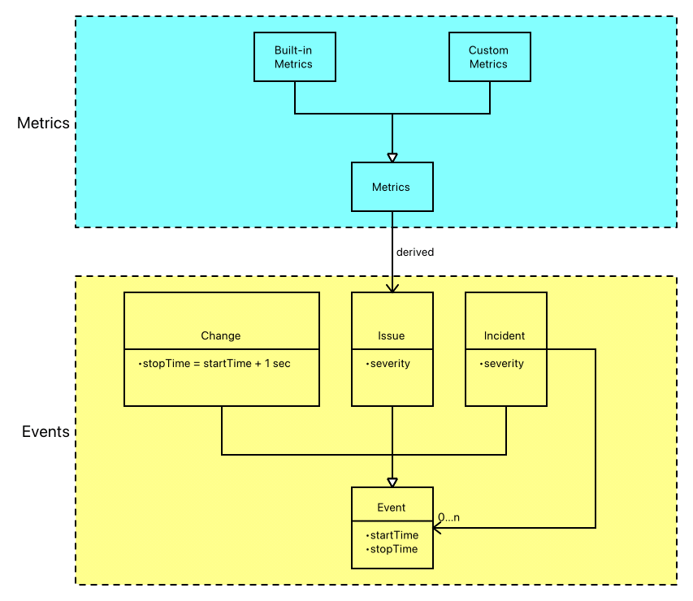
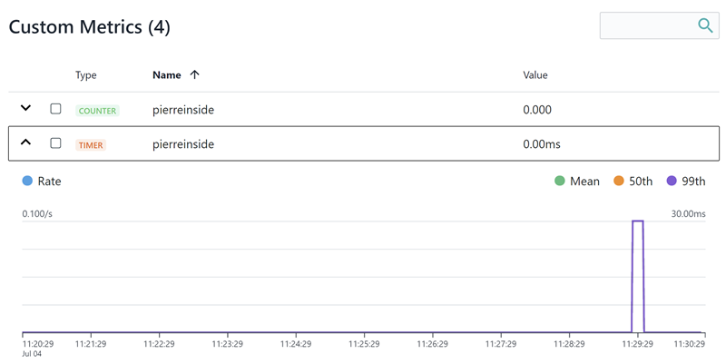
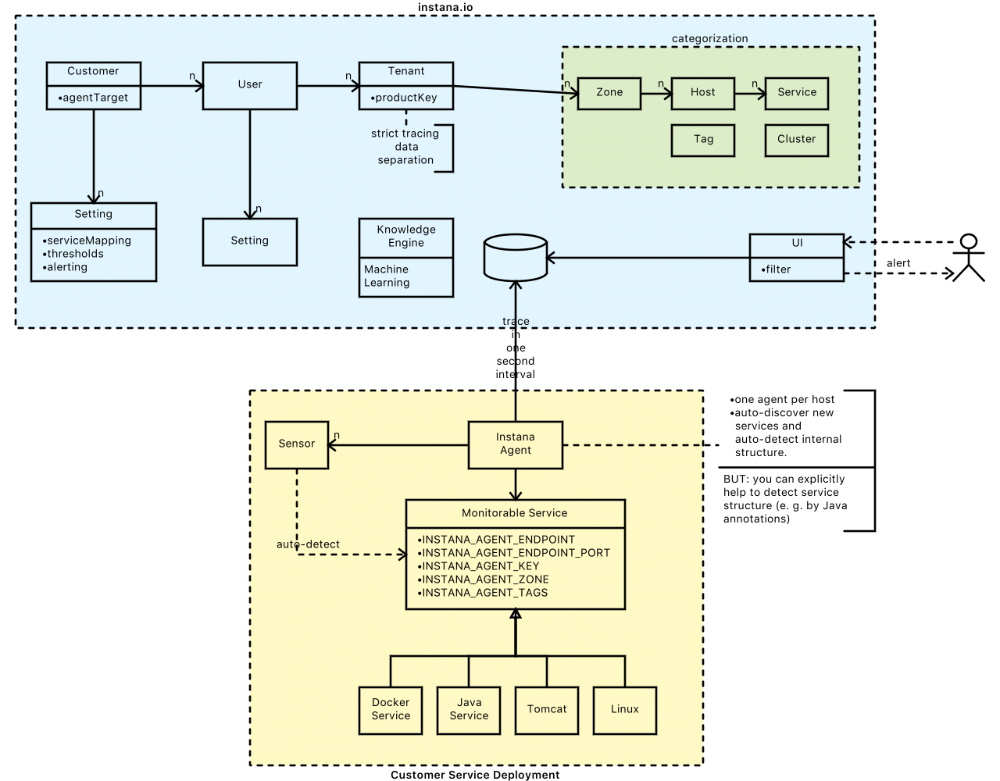

# Instana

Bei diesem Tool handelt es sich um ein Application Performance Monitoring (APM) Tool, das mit den Platzhirschen [New Relic](https://newrelic.com/) und [Dynatrace](https://www.dynatrace.com) konkurriert, aber deutlich günstiger ist.

---

## Motivation

* [Michael Krumm - Youtube](https://www.youtube.com/watch?v=wghFJGpF3Fw)
* [Instana Webinar](https://www.youtube.com/watch?v=z14wXHzw5lU)

Bei Instana ist Auto-Detection von neuen Hosts (physikalische Sicht), Services, internen Applikationsstrukturen Strukturen (APIs) und deren Beziehungen zueinander das Guiding Light. Insbesondere in elastischen (und somit sehr dynamischen) Cloud-Deployments ist das eine sehr wichtige Eigenschaft. Instana versucht, die Semantik der Anwendungen zu verstehen, um nicht nur Daten, sondern tatsächlich Informationen und automatisches Alerting zu liefern. Bei diesem Ziel ist jede (hart geforderte) manuelle Intervention (zur expliziten Abbildung dieser Strukturen) aufgrund des elastischen/agilen Umfeld nicht akzeptabel, weil es zum Scheitern verurteilt ist. Maintenance-Free. Hierzu enthält Instana viel Wissen über Technologien (z. B. JPA, Docker, Jenkins), denn das wird bei der Interpretation der Daten und einer adäquaten Darstellung der Informationen (u. a. auch navigierbar) benötigt. Auf diese Weise werden die verschiedenen Layer der Applikation erkannt. Damit ist ein Drill-Down vom Web-Service-Request bis runter zu den dadurch ausgelösten Datanbank-Zugriffen möglich. Tatsächliche Bottlenecks können so nicht nur entdeckt, sondern eine evtl. Lösung zeichnet sich im besten Fall schon ab (z. B. wenn 2000 Datenbank-Calls abgesetzt werden, dann werden scheinbar Datenbankzugriffe in einer Loop-Schleife gemacht ... das skaliert natürlich nicht und muß durch Bulk-Queries ersetzt werden). Datenströme (logische Sicht) werden inkl. der Auslastung dargestellt und ermöglichen somit eine gezielte Analyse der Bottlenecks. Asynchrone Kommunikation durch das System kann dem initiierenden Request zugeordnet werden, so daß letztlich der gesamte Kommunikationsweg untersucht werden kann - und das im Live-System.

Die Root-Cause-Analyse soll von Instana vereinfacht werden - deshalb:

* Incidents, werden austomatisch erkannt
* dive deep ... überall kann man leicht filtern (Filterwerte werden i. a. automatisch bereitgestellt)
  * wenn die automatischen Filter nicht ausreichen, dann kann man auch eine Filtersprache verwenden (e. g. `entity.selfType:java`)
* Depp Links werden unterstützt (z. B. in Alert-Notifications), so daß der Kontext sofort ersichtlich ist und zwischen Beteiligten ausgetauscht werden kann

---

## Alternativen

Mit Ansätzen wie der [Zeitreihen-Datenbank Prometheus](https://prometheus.io/) lassen sich auch eigene Lösungen stricken, die allerdings zunächst (vielleicht auch dauerhaft) einen hohen zeitlichen Invest erfordern. Letztlich ist man als Betreiber einer Anwendung aber nicht mit den reinen Daten zufrieden, sondern der Nutzen steht und fällt mit der Möglichkeit, aus diesen Unmengen an Daten tatsächlich Informationen zu gewinnen. Nur dadurch lassen sich Probleme/Bottlenecks in der Anwendung aufdecken und gewinnbringende Verbesserungen umsetzen.

Aus guten Grund wurden Lösungen wie Instana, New Relic, Dynatrace, ... geschaffen, die für teures Geld verkauft werden. Eine Selbstimplementierung kann sich wahrscheinlich nur ein Großunternehmen leisten. Eine Adaption vorhandener Open-Source-Lösungen kann auch zeitaufwendig sein oder gar in die Sackgasse führen.

Aus diesem Grund sind bezahlbare fertige (gut supportete) Lösungen eine gute Sache für bestimmte Firmen. Instana scheint diesen Markt im Auge zu haben.

---

## Konzepte und Features

### SaaS oder On-Premise

Instana bietet seinen Dienst als Software-as-a-Service (präferiert) aber auch als On-Premise-Lösung an.

Gegen eine Saas-Lösung könnte die Geheimhaltung der Daten sprechen ... per Default versucht Instana keine sensiblen Daten zu loggen (z. B. bei SQL-Queries werden keine gebundenen Parameter mitgeloggt), aber letztlich ist es eine Frage des Vertrauens bzw. einen Nachweis aus Compliance Sicht zu erbringen.

### Metrics und Events



Incidents sind spezielle Events, die mit großer Wahrscheinlichkeit Auswirkungen auf die Edge-Services der Anwendung haben ... das sind Services, die vom Endanwender genutzt werden. Instana nutzt hier die sein ganzes Wissen über kennt die Zusammenhänge der Services/Layer und der verwendeten Technologien, um aus Issues, Changes und Metriken potentielle Incidents zu machen. Die große Stärke ist dabei die Korrelation von Incidents mit Issues, Changes und Metriken. Auf diese Weise liefern Incidents häufig schon die Root-Cause oder liefern zumindest wichtige Informationen, um die Root-Cause schneller zu finden.

Instana mißt verschiedene Indikatoren (Durchsatz, Latenz, Fehlerrate, Ausnutzung) und bietet ab einem bestimmten Threshold automatische Issue-Erzeugung (Auffälligkeiten) und - bei entsprechender Konfiguration - Alerting. Für eine Root-Cause Analyse läßt sich in einer Zeitmaschine reisen (Time-Shift).

Instana ist elastic-Microservice-aware, d. h. gestoppte Knoten stellen noch nicht automatisch ein Incident dar - zunächst ist das mal nur ein Issue dar.

> ACHTUNG: da die Abtastrate von einer Sekunde sehr hoch ist, aggregiert Instana die Daten ab einem gewissen Alter, um die Datenmenge zu reduzieren. I. a. geschieht das allerdings so spät, daß man zum Zeitpunkt der Root-Cause-Analyse noch alle Daten unaggregiert zur Verfügung hat.

Beispiel:

Bei meinem allerersten Versuch, Instana zu nutzen, wurde mein Host rot gekennzeichnet in der Instana-UI und mit dem Alert "Low Disk Space" gekennzeichnet. Ein `df -h` auf meinem lokalen System offenbarte, daß Instana bescheid wußte. GENIAL.

### Alerting

Ausgehend von Changes, Issues und Incidents können Alerts getriggert und an verschiedene Kanäle (sog. Alerting Integrations ... eMail, PagerDuty, Office365, Webhook) definiert werden, so daß man bei extrem kritischen Situationen Benachrichtigungen an externe System verschickt.

Empfehlung: "Don't waste time creating and maintaining health rules" - das macht Instana automatisch (technologieabhängig)

Instana unterstützt Deep-Links, um bei Notifications direkt in den Scope einzutauchen.

### Application Perspective

Application Perspective ist eine gefilterte Ansicht für selektierte Services/Endpoints - Definition durch den Benutzer (Subset aus Services, Endpoints). Unterschiedliche Rollen (DEV, DEVOPS, SRE) haben unterschiedliche Interessen und sollten sich dementsprechend ad-hoc ihre Application Perspective zusammenstellen können.

Alle Requests, die über nicht ausgewählte (= irrelevante, d. h. applikationsfremde) Services/Endpoints getriggert werden, bleiben unberücksichtigt. Bei der Definition einer Application Perspective kann man einfach einen oder mehrere Services selektieren und dann alle Downstream-Services automatisch selektieren lassen.

Das praktische an dieser Application Perspective ist, daß sie automatisch erweitert wird, z. B. wenn ein neuer Service hinzukommt, der zu den Filterkriterien paßt.

### Services und Endpoints

Ein Service hat 1-n Endpoints.

* Services und Endpoints automatically discovered
  * endpoints define the API of a service
    * automatically discovered types:
      * BATCH
      * DATABASE
      * HTTP
      * MESSAGING
      * RPC
  * services: collection of endpoints
    * kann verteilt sein ... davon abstrahiert Instana

Instana versucht, den Servicenamen nach technologieabhängigen Algorithmen festzulegen. Die Regeln sind hier dokumentiert, so daß man durch Einhaltung gewisser sinnvoller Konventionen den Namen "selbst" bestimmen kann. Man kann andernfalls auch die environment Variable `INSTANA_SERVICE_NAME` setzen oder in Instana ein entsprechendes Custom-Mapping definieren (das ist dann aber auf jeder Instana Instanz zu tun :-(

### Traces, Calls, Spans

* [Instana Dokumentation](https://docs.instana.io/core_concepts/tracing/)

Ein Trace ist der Weg eines Requests durch die Anwendungslandschaft bis zur Antwort. Ein Trace besteht aus 1-n Calls - ein Call ist eine Kommunikation zwischen Diensten. Ein Call besteht aus 1-2 Spans (Entry Span, Intermediate Span, Exit Span). Ein Span ist ein Ausführungsabschnitt innerhalb eines Service.

"The first span in a particular service indicates that a call entered the service, and is called an entry span (The Dapper paper refers to it as a “server span”). Spans of calls leaving a service are called exit spans (in the Dapper paper they are “client spans”). Intermediate spans mark significant sections of code so the trace runtime can be clearly attributed to the correct code." ([Instana Dokumentation](https://docs.instana.io/core_concepts/tracing/#further-concepts))

> Mit dem sog. [Custom Tracing](https://docs.instana.io/quick_start/custom_tracing/) lassen sich (intermediate) Spans im Applikationscode per Instana-SDK (z. B. [Instana Java-SDK](https://github.com/instana/instana-java-sdk)) definieren, um so beispielsweise innerhalb eines Services weitere Zwischenmessungen von Laufzeiten abzubilden.

### Infrastructure Map

Hier bekommt man einen sehr guten Überblick, über die Landschaft:

* Hosts
* Services

Man kann hier

* Filtern - über eine Query-Sprache wie `entity.service.name:blablubb`
  * man kann auch Freitext versuchen ... z. B. den Service-Namen
* Gruppieren nach
  * Availability Zone
  * Tags: häufig tagged man die Hosts, Services nach verschiedenen Aspekten (Live/Test/Dev, UI/Middleware/DB, ...)

Unmonitored Hosts haben keine Instana-Agents installiert ... das könnten beispielsweise Third-Party-Services sein, die aus der eigenen Anwendungslandschaft aufgerufen werden und somit beim Tracing involviert sind.

### Service Discovery and Drill-Down

In einem elastischen Microservices Umfeld ist es essentiell, daß neue Services nicht erst aufwendig einkonfiguriert werden müssen. Statdessen leben die Services teilweise nur Minuten oder gar Sekunden.

Instana bietet - ausgehend von einem Services-Aufruf (z. B. Webservice) - einen Drill-Down des gesamten Stack-Traces inkl. Dauer der Requests. Das geht sogar soweit, daß man aus dem Instana-UI in den Java-Code navigieren kann. Awesome :-)

### Interaction Discovery

Instana verwendet Traces, um den Weg eines Client-Requests an einen Service und durch die (Microservice-) Anwendungslandschaft zu verfolgen. Auf diese Weise lassen sich einersets ganz fein granulare Daten gewinnen (z. B. welche SQL-Query wurde gegen die Datenbank abgesetzt, wie lange hat das gedauert und wie hoch war die I/O-Rate in der Datenbank) und andererseits grobgranulare Informationen (z. B. wie häufig wurde ein Service aufgerufen?) ableiten.

### Zero Configuration

Instana kommt mit dem Anspruch intelligent genug zu sein, um Probleme ohne konfigurierte Grenzwerte zu erkennen.

> Machine lerning algorithms to learn performance patterns.

Allerdings läßt kann man als Application Provider Instana Tips geben oder auch explizit konfigurieren, um bessere Insights zu liefern. Möglichkeiten:

* Instana User Interface: Service Mappers
* Application Code: Java Annotations

### Maintenance-Free

Service Discovery + Interaction Discovery + Zero Configuration &#9658; Maintenance-Free

### 1-Second-Granularity

Die Abtastrate der Sensoren beträgt eine Sekunde, d. h. jede Sekunde werden die Metriken aller beteiligten Komponenten erfaßt und gespeichert.

### Komponentenspezifische Sensoren und Dashboards

Instana kommt mit einer Vielzahl komponentenspezifischer Sensoren

* Betriebssystem
* unterstützte Sprachen: https://www.instana.com/supported-technologies/
* unterstützte Technologien: https://www.instana.com/supported-technologies/

so daß immer die relevanten Metriken gezogen und dargestellt werden können. Das geht sogar soweit, daß zu ein ElasticSearch Knoten Metriken auf folgenden Ebenen im direkten Zugriff sind:

* Spring-Boot
* Docker
* Lucene Index
* ElastciSearch Shard
* ElasticSearch Cluster
* Java-VM
* OS-Prozess
* Host
* ...

Im UI wird hierzu für jede Ebene spezifische Informationen geliefert. Beispiel:

> Bei einer Spring-Boot Anwendung, die in einem Docker-Container auf einem Linux-System läuft, gibt es die folgenden Ebenen und Informationen:
>
> * Host: CPU, Betriebssystem, Hostname, Netzwerkschnittstellen, ...
> * Docker Container: Image, Start-Kommando, Startzeitpunkt, Ports, Container Labels, Scheduler (Docker-Compose, Nomad, ...)
> * Prozess: Umgebungsvariablen, Startparameter
> * JVM: Java-Version, Memory-Settings, JVM-Parameter
> * Spring Boot: Konfiguration

Das ist bei der Fehleranalyse sehr hilfreich.

Zudem werden dadurch, daß Instana diese Technologien kennt, besonders auffällige/ungesunde Werte entdeckt. Das kann zu einem Alert führen.

Ein Beispiel:

* bei ElasticSearch können einzelne Knoten gemonitored werden, aber auch ganze Cluster.

### Machine Learning

> Understanding of Patterns of normal behavior by deep learning.

### Komponentenspezifisches Wissen

Da Instana Technology-aware ist (d. h. die eingesetzten Technologien kennt) kann es den Nutzer beim Alerting, bei der Root-Cause-Analyse und beim Problem-Solving unterstützen.

### Open-Approach

Instana plant die Sensorentwicklung offen zu gestalten, so daß man für nicht unterstützte Technologien auch eigene Sensoren schreiben kann.

### SDK

* [SDK Dokumentation](https://github.com/instana/instana-java-sdk)
* [Beispiele auf GitHub](https://github.com/instana/instana-java-sdk/tree/master/instana-java-sdk-sample)

Sollte Instana wichtige Strukturen/Zusammenhänge in der Anwendung nicht selbständig erkennen, so lassen sich im Code Metainformationen über Annotationen hinterlegen:

```java
@Span(type = Span.Type.INTERMEDIATE, value = "myService.methodExecution")
```

In der _Analyze Trace_ View kann man dann eine Filter `sdk.myService.methodExecution` definieren, um die Daten zu sehen.

### API

* [API Dokumentation](https://docs.instana.io/quick_start/api/)
  * u. a. genutzt von [Grafana Instana Plugin](https://grafana.com/plugins/instana-datasource)

Instana bietet eine REST-API, um die Daten automatisiert in die eigenen Workflows einzubinden. Aber auch, um eigene Informationen über die Instana-Agent-REST-API ins Monitoring zu bekommen, z. B. bei neuen Deployments.

Die [Rest-APIs basieren auf OpenAPI v3 (formerly known as Swagger)](https://instana.github.io/openapi/openapi.yaml). Diese Schnittstellenbeschreibung läßt sich einfach in Postman importieren und dann können komfortabel Requests abgesetzt werden. Alternativ kann man sich aus der REST-OpenAPI per [OpenAPI Client Generator](https://github.com/OpenAPITools/openapi-generator) Client-Libs (Java, Go, Python, ...) erzeugen lassen.

Hierzu benötigt man einen API-Key, den man über die Instana UI im Bereich Access Control erzeugen kann. An diesem API-Key hängen die entsprechenden Berechtigungen.

### API mit Postman

Den API-Key definiert man am besten auf höchster Ebene (am Instana-Paket) und referenziert ihn in den einzelnen Requests nur mit "Inherit from Parent". Als Key verwendet man `authorization`, als Value `apiToken {{instanaApiToken}}` - wobei man die Variable `instanaApiToken` dann noch definieren und setzen muß.

### Dynamic Focus Queries - Auswertungen über Kategorisierung und Filter

Es stehen folgende Kategorisierungsmöglichkeiten zur Verfügung:
  
* Tenants
  * die Daten verschiedener Tenants sind tatsächlich hart getrennt (z. B. Live vs. Dev/Test) ... ein Filter arbeitet ausschließlich auf den Daten EINES Tenants - im Gegensatz zu den anderen Kategorisierungsmöglichkeiten
* Zones (`entity.zone=myzone`)
* Tags
  * ein Services kann mehrere Tags haben, so daß auf verschiedenen Ebenen gefiltert werden kann
* Queries über Lucene-Syntax ... per AND verknüpft (OR muss explizit angegeben werden). Hierbei unterstützt Instana auf den Keys (z. B. `entity.tag.name`) vollständig Auto-Completion, auf den Values aber nur teilweise. Ich wünschte auf den Values würde es besser funktionieren, denn bei `entity.severity:10` weiß man natürlich nicht, was die `10` bedeutet ... hier muß man das Datenmodell schon gut kennen.
  * `entity.tag.name:foo=bar`
  * `entity.type:springboot`
  * `entity.docker.label:maintainer=Pierre`
  * `entity.host.cpu.count:<4 AND entity.zone:production) OR entity.host.cpu.count:>4`

### Cloud-Deployment Datenschutz

Im Gegensatz zu On-Premise-Hosting gibt man beim Cloud-Hosting durch Instana die Daten in deren Obhut - ist das sicher?

> Instana ist SOX-compliant und sichert zu, daß kein Content in Form von URL-Parametern oder Post-Request-Pasyloads auf den Servern

### Integrationsmöglichkeiten

Instana funktioniert i. a. nur durch Installation des Agent schon sehr gut, doch in manchen Situationen möchte man

* nicht unterstützte Technologien verwenden
* Metriken mit Daten anreichern

Hierzu bietet Instana einige [SDKs und APIs](https://www.instana.com/docs/integrations) ([statsd ist hier nicht aufgeführt](https://www.instana.com/docs/ecosystem/statsd/)), die wirklich einfach zu nutzen sind und teilweise - wenn man eine Schnittstelle über den Instana-Agent nutzt - nicht einmal Authentifizierung benötigt.

#### Instana REST API

* [Beispiele aus dem Grafana-Instana-Plugin](https://github.com/instana/instana-grafana-datasource) => praktisch, um sich ein paar Einblicke zu verschaffen

#### Instana-Agent-Rest-Event-API

* https://www.instana.com/docs/api/agent/#event-sdk-web-service

```bash
curl -XPOST \
      http://localhost:42699/com.instana.plugin.generic.event \
      -H "Content-Type: application/json" \
      -d '{\
            "title":"Custom API Events ", \
            "text": "pierretest", \
            "duration": 5000, \
            "severity": 5\
          }'
```

sorgt für ein _Warning Issue_ im Instana ... schon richtig getaggt (mit den Tags aus dem Instana-Agent). Keine Authentifizierung notwendig.

#### Rest-Trace-API

* https://www.instana.com/docs/api/agent/#trace-sdk-web-service

... REST-Calls an den Instana-Agent

#### Statsd

Der Instana-Agent kann als Statsd-Proxy konfiguriert werden:

```yaml
com.instana.plugin.statsd:
  enabled: true
  ports:
    udp: 8125
    mgmt: 8126
  bind-ip: "0.0.0.0" # all ips by default
  flush-interval: 10 # in seconds
```

Auf diese Weise kann man Messwerte per `echo "pierreinside:30|ms" | nc -u -w1 127.0.0.1 8125` an den Instana-Agent schicken. Die sind dann in der _INfrastructure - Dashboard View_ am Host hängend (und mit den entsprechenden Tags ausgestattet, die im Instana-Agent konfiguriert sind) unter _Custom Metrics_ zu finden:



Der Instana-Agent spricht das [Statsd-Protokoll](https://github.com/b/statsd_spec) mit dem Messwerte (z. B. `foo:1|c` - `foo` ist der Metrik-Identfikator, `1` der Wert und `c` der Metrik-Typ ... hier ein Counter) gesammelt und zu Metriken aggregiert werden.

Folgende [Metrik-Typen](https://github.com/statsd/statsd/blob/master/docs/metric_types.md) werden unterstützt:

* `c`: counter - Zähler auf Server-Seite
  * hier wird nur die Differenz (bei `foo:1|c` ist die Different `1`) mitgeteilt
* `g`: Gauge - Zähler auf Client-Seite
  * hier wird nur die Differenz (bei `foo:1|g` ist die Different `1`) mitgeteilt
* `ms`: Timer
* `h`: Histogramm
* `m`: Meters

Zur Verarbeitung dieser Messwerte stehen zwei Möglichkeiten zur Verfügung:

* Events
  * aus den Messwerten lassen sich Events erzeugen und aus Events lassen sich Alerts erzeugen
  * was ist der Unterschied zur Event-API?
    * bei der Generierung von Events aus Messwerten beobachtet Instana die Messwerte und entscheidet dann irgendwann aus den Daten eine Information zu machen - diese Information ist das Event
      * Metriken => Event => Alert
    * Events, die über die Event-API kommen, werden bereits an der Quelle zu einer Information (z. B. es wurde ein neuer Heapdump erzeugt) - Instana muß dann keinen Hirnschmalz investieren
      * Event => Alert
    * kann aus dem Kontext bereits ein Event erzeugt werden, dann ist das auf jeden Fall eine höherwertige Information als aus Messwerten (= Metriken = Daten) durch mehr-oder-weniger intelligente Logik eine Information (= Event) zu generieren - die Kontextinformation liefert die besseren Ergebnisse
* Grafana-Dashboard
  * hier werden keine Events unterstützt, sondern nur Metriken

> Kann es sein, daß???
>
> * Grafana (Reporting/Statistiken ist das Ziel) berücksichtigt ausschließlich Metriken - keine Events
> * Instana (Alerting ist das Ziel) berücksichtigt ausschließlich Events (deshalb müssen aus Metriken Events gemacht werden) - keine Metriken

**Event:**

Hierzu legt man ein neues Event an und darauf aufsetzend lassen sich dann auch Alerts anlegen, die beispielsweisse per MS Teams, Slack, PagerDuty ... verschickt werden können.

**Grafana:**

siehe eigener Abschnitt

---

## Architektur

* ein sog. Agent-Prozess (z. B. auch als Docker Container - macht die Nutzung extrem komfortabel) wird auf dem System gestartet ( sehr klein - ca. 50MB Memory) und dann läuft die Auto-Discovery-Maschinerie an
  * enthält komponentenspezifische Sensoren für (Abtastrate: 1 Sekunde)
    * Betriebssystem
    * Java-VM
      * ganz wichtig: man muß den Java-Prozess NICHT mit einem Java-Agent (auf JVM Level) ausstatten. Stattdessen werden die Daten von einem Port abgegriffen, der von der JVM standardmäßig bereitgestellt wird
    * Appserver (z. B. Tomcat)
    * ElasticSearch
    * ...
  * schickt Daten ans Backend (On-Premise vs. Cloud)
    * ACHTUNG: die gesendeten Daten lassen sich einschränken - auf diese Weise ist es beispielsweise möglich bei SQL-Queries keine Werte der `WHERE-clauses zu übermitteln, so daß im Instana-UI keine "Geheimnisse" sichtbar sind
* Backend (Cloud oder On-Premise)
  * sammelt die Daten der Agents
  * basierend auf Cassandra, Kafka, ElasticSearch ... scale-out possible with these technologies
* Web-User-Interface

---

## User-Interface

* physikalische Sicht auf Hosts, Container, Prozesse
* logische Sicht auf Services
* Traces - einzelne Messpunkte, die bis in den Code (wird decompiliert) runtergehen

---

## Integrationsmöglichkeiten

* [Grafana-Integration](https://grafana.com/)
  * Instana läßt sich als Data-Source in Grafana nutzen (siehe [Instana Plugin](https://grafana.com/plugins/instana-datasource))

---

## Konzepte



---

## Getting Started

Am einfachsten startet man einen Instana Agent per Docker ... hier die `docker-compose.yml`:

```yml
version: '2'
services:
    instana-agent:
      image: instana/agent
      container_name: instana-agent
      privileged: true
      pid: "host"
      ipc: host
      network_mode: "host"
      environment:
        INSTANA_AGENT_ENDPOINT_PORT: "443"
        INSTANA_AGENT_ENDPOINT: "saas-eu-foo.instana.io"
        INSTANA_AGENT_KEY: "thisIsMyProductkey"
        INSTANA_AGENT_ZONE: "thisIsMyZone"
      volumes:
        - /var/run/docker.sock:/var/run/docker.sock
        - /dev:/dev
        - /sys:/sys
        - /var/log:/var/log
        - ./instana/config/thisIsAnAdditionalConfig.yaml:/opt/instana/agent/etc/instana/thisIsAnAdditionalConfig.yaml
```

> ACHTUNG: dieser Docker Container zieht beim Start per Maven alle Sensoren vom instana Server (im Log findest sich sowas in der Art: `mvn:com.instana/sensor-java-trace/1.2.248`)

> BTW: `instana/config/thisIsAnAdditionalConfig.yaml` ist optional ... man benötigt sie, wenn man Instana Annotation in den Services des Hosts verwendet hat.

Nach dem Start (`docker-compose up instana-agent`) sollte der Host im [Portal](http://instana.io) auftauchen.

---

## Konfiguration

Auch wenn Instana den Anspruch von Zero-Configuration hat, sind einiger Konfigurationen sehr sinnvoll und erfolgen in der `configuration.yml` des Agents:

* Meta-Daten
** beispielsweise Identifikation der Umgebung (wenn man mehrere Umgebungen in einem Instana-Account monitored)
*** `com.instana.plugin.generic.hardware`
**** `availability-zone`
*** `com.instana.plugin.host`
**** `tags`
* Secrets will man i. a. nicht nach Instana transferieren
** `com.instana.secrets`
* wenn man seinen Java-Code mit dem Instana-SDK angereichert hat
** `com.instana.plugin.javatrace`
*** `instrumentation/sdk/packages`

---

## Mein Eindruck

Instana ist super ... wenn man ohne großen Aufwand Built-In-Metriken, den Fluß eines Calls durch die Layer und Performance untersuchen will. Das hilft bei der Analyse von Problemen extrem weiter. Mit der Application Perspective lassen sich die Daten auch besser einer Subkomponente zuordnen.

Möchte man allerdings mehr Semantik in die Überwachung integrieren, dann habe ich noch nicht die richtigen Wege gefunden. Wenn man gezieltes End-to-End-Monitoring, das die Integration von Custom-Daten erfordert (ist die Infrastruktur so wie definiert - daß nämlich 3 Instanzen des Srevice A laufen?), fehlen mir die Integrationsmöglichkeiten ... wie bringe ich meine Logik in Instana ein? Muß ich mir einen eigenen Sensor schreiben? Es kommt mir derzeit (mag an fehlendem KnowHow liegen) so vor als sei Instana sehr gut, um die Detail-Analyse durchzuführen ... bei dem Thema End-to-End-Monitoring aber nicht so gut aufgestellt, weil die Integration von Custom-Semantik nicht vorgesehen ist oder (noch) nicht gut unterstützt wird.

Beispiel:

Ich wollte gerne ein Alert erzeugen, wenn eine unserer Services einen Heap-Dump wegen Speichermangel erzeugt. In diesem Fall stehen mir (vom Instana-Support bestätigt) zwei Möglichkeiten zur Verfügung

* Instana-Agent Event-API
* Instana-Agent Statsd-Proxy für Metriken

Die Event-API ist sehr rudimentär was die Bereitstellung von Meta-Daten betrifft. Hier steht eigentlich nur ein Textfeld zur Verfügung, das dann später verwendet werden kann, um einen Filter für das Alerting zu definieren. Ich hätte mir hier eher ein Tagging gewünscht, um gezielter (statt mit String-Wildcards) Selektionen vorzunehmen.

Andererseits unterstützt Grafana keine Events - ausschließlich Metriken können in den Dashboard-Panels verwendet werden. Ich möchte allerdings historische Daten sammeln, um meine SLOs abzubilden und Probleme in der Anwendung zu entdecken. Meine derzeitige Lösung besteht darin, ein Event und eine Metrik nach Instana zu schreiben ... schon irgendwie redundant.

---

## FAQ

**Frage 1:** Welchen Impact hat Instana auf die Performance der Anwendung?

**Antwort 1:** Java-Anwendungen werden instrumentiert - das dauert ein wenig, ansonsten hat Instana [keine/kaum negativen Einfluss auf die Performance](https://youtu.be/wghFJGpF3Fw?t=1716). Natürlich benötigt der Instana-Agent Ressourcen (Memory/Network-I/O).
