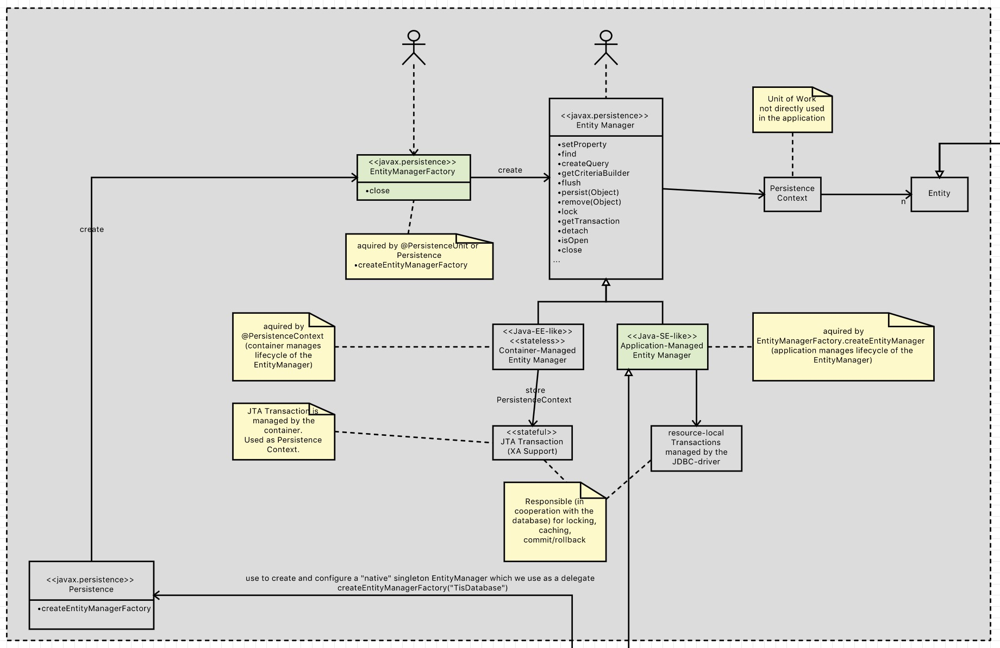

# Transaktionen

Wenn wir im Java-Umfeld über Transaktionen sprechen, dann spielt es eine entscheidende Rolle, 

* um welche Art von Transaktion es sich handelt
  * Single Source:
  * Multiple Source: hier hat man es mit einer verteilten Transaktion zu tun (Stichwort JTA, XA)
* welche Komponente den Transaktionsmanager bereitstellt
  * Application-Managed-Transaction
  * Container-Managed-Transaction

# Application-Managed vs. Container-Managed Transactions

Bei einer **Application-Managed-Transaktion** kümmert sich der Applikationscode um den Lifecycle der Transaktion. Diese Variation von Transaktionssteuerung ist auch mit Java SE möglich.

Bei einer **Container-Managed-Transaktion** übernimmt diese Aufgabe der Application-Server, der zusätzlich auch noch JTA-Transaktionen nutzt, die verteilte Transaktionen über verschiedene Data-Sources unterstützt. Diese Variation von Transaktionssteuerung ist nur mit Java EE möglich (wegen der JTA-Integration). 

# Isolation-Level
* https://dzone.com/articles/beginners-guide-transaction
* https://vladmihalcea.com/2014/01/05/a-beginners-guide-to-acid-and-database-transactions/

Mit dem Isolation-Level wird gesteuert wie parallel laufende Transaktionen abgearbeitet werden. Auf der Datenbank werden hierzu READ-Locks und WRITE-Locks verwendet.

Beim großzugügsten Isolation-Level READ UNCOMMITTED erfolgen haben weder READ-Locks noch WRITE-Locks eine Relevanz. Ganz egal ob auf einem Entity ein solches Lock sitzt, lesende und schreibende Zugriffe sind immer erlaubt. Dadurch kann es passieren, daß eine Transaktion nicht-committete Änderungen einer Transaktion sehen kann. 

Beim zwei-schärfsten Isolation-Level REPEATABLE READ sorgt 

* ein READ-Lock durch Transaktion T1 dafür, daß eine andere Transaktion T2 kein WRITE-Lock mehr setzen kann haben ... T2 muß also warten bis T1 durch ein commit/rollback das READ-Lock verwirft. Damit wird ein Repeatable-Read in der Transaktion T1 sichergestellt. Egal wann innerhalb der Transaktion T1 ein Entity gelesen wird, es hat IMMER den gleichen Zustand.  
* ein WRITE-Lock durch Transaktion T1 dafür, daß eine andere Transaktion T2 weder ein READ-Lock noch ein WRITE-Lock setzen kann. T2 muß warten bis T1 committed/rollbacked wurde ... erst danach kann es das Entity mit dem Lock lesen/schreiben. Dadurch wird sichergestellt, daß T2 keine uncommitteten Änderungen durch T1 lesen kann (was Dirty-Reads wären)

## Konfiguration
Das Isolation Level kann auf verschiendenen Ebenen eingestellt werden

* Datenbank Default (MySQL: REPEATBLE READ)
* Data Source
* Datenbank Verbindung/Session

# Transaktionen im JPA-Umfeld

[siehe eigener Artikel](jpa_txHandling.md)

