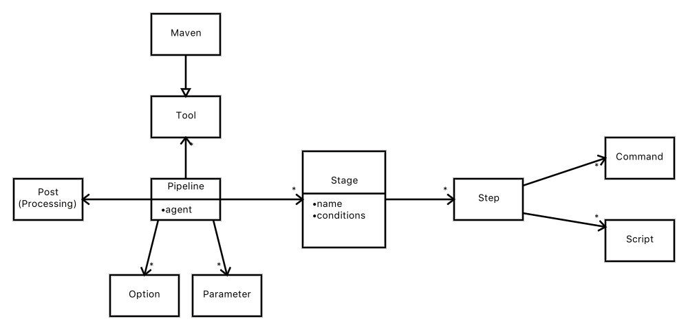

# Jenkins

* [Dokumentation](https://jenkins.io/doc/)
* [Handbuch](https://jenkins.io/doc/book/)

Jenkins wird zur Automatisierung von Builds und Deployments verwendet.

## Getting Started

Jenkins wird einfach per

```bash
java -jar jenkins.war --httpPort=8080
```

gestartet. Selbst mit Docker ist es aufwendiger.

## Konzepte



### Jobs

Jobs stellen den Trigger zur Ausführung von Pipelines zur Verfügung. Jobs werden entweder manuell oder automatisch (z. B. beim Commit in einen Source-Branch - aka "SCM polling trigger") gestartet.

Es gibt verschiedene Job-Typen:

* Maven Projekt
* Pipeline
  * ein Pipeline-Job enthält entweder eine Pipeline-Definition oder referenziert ein `Jenkinsfile` über ein VCS-Repository (SVN, GIT).
* Multibranch Pipeline
  * häufig bei Build-Jobs verwendet, wenn Feature-Branches verwendet werden ... in dem Fall soll jeder Branch automatisch bei einem Commit gebaut werden
* ...

### Pipeline

* [Jenkins Doku](https://jenkins.io/doc/book/pipeline/)
* [Jenkins-Pipelines Dokumentation](https://jenkins.io/pipeline/getting-started-pipelines/)
* [Syntax](https://jenkins.io/doc/book/pipeline/syntax/)

Groovy war von Beginn an DIE Scriptsprache für Jenkins, um Entwicklern mehr Freiheiten zu geben. Deshalb ist Groovy auch die Basis für die Definition von Pipelines in einem Textfile (z. B. `Jenkinsfile`). Dieser Code ("Infrastructure-as-Code) wird genauso behandelt wie Source-Code (unter Versionskontrolle). Damit ist das Git-Repository eines Services noch weiter self-contained, denn es enthält auch seinen eigenen Build-Job (ähnlich kann man das bei anderen Build-Tools wie beispielsweise [Travis](travis.md)). In Jenkins muß dann nur noch ein Job angelegt werden, in dem die Location des Git-Repositories definiert wird, und angegeben wird, daß das Repository ein Jenkinsfile enthält.

Man unterscheidet zwei Arten von Pipeline Definitionen:

* [Declarative Pipeline](https://jenkins.io/doc/book/pipeline/syntax/#declarative-pipeline)
  * durch eine abstrakte DSL (Groovy-basiert) einfacher zu nutzen
* [Scriped Pipeline](https://jenkins.io/doc/book/pipeline/syntax/#scripted-pipeline)
  * mächtiger als die deklarative Pipeline, da hier richtig programmiert werden kann
  * es existiert sogar ein eigenes Ökosystem, um die Effizienz durch Reuse zu erhöhen - [Nutzung/Erstellung von Shared Libraries](https://jenkins.io/doc/book/pipeline/shared-libraries/)

### Agent

Jenkins startet Aufgaben (Projekte, Pipelines) und braucht hierzu eine Laufzeitumgebung. Die Laufzeitumgebung nennt man Agent ... es werden verschiedene Typen unterstützt:

* Docker
* Jenkins-Knoten

Man kann den Agent an verschiedenen Stellen definieren:

* Pipeline
* Stage einer Pipeline
* ...

## Classic UI vs. Blue Ocean

[Blue Ocean](https://www.youtube.com/watch?time_continue=1&v=mn61VFdScuk) ist das neuere User-Interface, das parallel zur Classic UI existiert.

## Plugins

Jenkins zeichnet sich gegenüber anderen Build-Tools dadurch aus, daß es eine Fülle an Plugins gibt.

### AnsiColor Plugin

* so sind die Logfiles leichter zu lesen

### Office 365 Connector Plugin

Mit diesem Plugin klappen auch Microsoft Teams Notifications aus Jenkins Pipelines heraus.

## Global Tools

Nicht alle Tools werden über Plugins integriert. Tools wie

* JDK
* Git
* Ant
* Maven
* Packer
* Terraform
* Docker
* ...

werden über "Jenkins - Global Tool Configuration" konfiguriert.