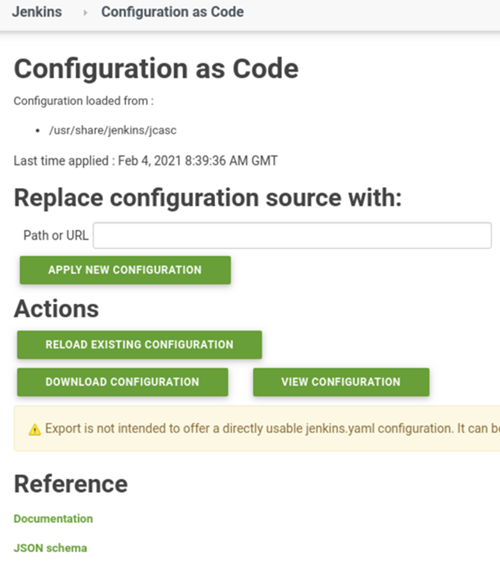

# Automatisierung Jenkins Installation

Im Zuge der Automatiserungswelle (2020) versucht man, alles zu automatisieren und Konfiguration in Form von Code abzubilden, um Snowflake-Server zu vermeiden und Code-Reviews zu verwenden, um die Qualität zu erhöhen. Ich bin seit langer Zeit ein Fan davon. 

---

## Auf die harte Tour

* [Jenkins Startup Hooks](https://wiki.jenkins.io/display/JENKINS/Groovy+Hook+Script)
* [Breaking the Jenkins Monolith](https://medium.com/buildit/breaking-the-jenkins-monolith-52c47799ddb0)
  * mit guten Beispielen wie die Konfiguration automatisiert werden kann (mit Tests)
  * inkl. automatischer Jobkonfiguration

Ich konnte nun zwar die Konfiguration von JDK und Maven über Docker Container loswerden, doch die Installation von

* Plugins

und die Konfiguration von

* Admin Password
* GIT Credentials
* Shared Libraries
* Jobs
* Usern

ist weiterhin manuell durchzuführen.

Jenkins verwaltet diese Konfiguration in XML Dateien (`/var/lib/jenkins/credentials.xml`), die mir schwierig migrierbar erscheinen (`plugin="credentials@2.1.18"`). Die Pflege dieser Dateien bei Updates scheint mir keine Freude zu sein.

Welche Alternativen sind möglich?

* Installation per Ansible
* Dockerisierung eines vorkonfigurierten Jenkins
* REST API nutzen
* Groovy Schnittstelle nutzen ... alle -Skripte in `${JENKINS_HOME}/init.groovy.d` werden beim Start idempotent ausgeführt.

### Optimierung 2: Jenkins als Docker Container

* [Docker in Docker? - Can you run Docker inside a Docker container?](https://itnext.io/docker-in-docker-521958d34efd)

Diese Option hätte den Charme, daß man alles vorkonfigurieren könnte, komplett ohne weitere Infrastruktur auf dem Jenkins-Host (Ansible hat auch Anforderungen). Jeder, der Docker nutzen kann, könnte dann auch einen fertig konfigurierten Jenkins-Server starten.

**Option 1:**

Im Docker Container läuft ein eigener Docker Host (Parent-Mode).

> "The answer is yes, but it is not recommended because it causes many low-level technical problems, which have to do with the way Docker is implemented on the operating system, and which are explained in detail in [Jérôme Petazzoni’s post](https://jpetazzo.github.io/2015/09/03/do-not-use-docker-in-docker-for-ci/)." ([Can you run Docker inside a Docker container?](https://itnext.io/docker-in-docker-521958d34efd))

**Option 2:**

In dem Fall sind die Docker Container

> "The good news is that there is another, recommended, way to use Docker inside a Docker container, with which the two Docker instances are not independent from each other, but which bypasses these problems. With this approach, a container, with Docker installed, does not run its own Docker daemon, but connects to the Docker daemon of the host system. That means, you will have a Docker CLI in the container, as well as on the host system, but they both connect to one and the same Docker daemon. At any time, there is only one Docker daemon running in your machine, the one running on the host system. To achieve this, you can start a Docker container, that has Docker installed, with the following bind mount option: `-v /var/run/docker.sock:/var/run/docker.sock`" ([Can you run Docker inside a Docker container?](https://itnext.io/docker-in-docker-521958d34efd))

Genau das habe ich mal ausprobiert. Jenkins per

```bash
docker run \
    -u root \
    --rm \
    --name jenkins \
    -d \
    -p 9090:8080 \
    -p 50000:50000 \
    -v /tmp/jenkins-data:/var/jenkins_home \
    -v /var/run/docker.sock:/var/run/docker.sock \
    jenkinsci/blueocean
```

gestartet und dann über [Blue Ocean URL](http://localhost:9090/blue/) in die _Classic UI_ gewechselt (Blue Ocean erlaubt keine Pipelines über die UI zu definieren), um diese Jenkins-Pipeline anzulegen:

```json
pipeline {
    agent none
    stages {
        stage('Example Build') {
            agent {
              docker 'maven:3-alpine'
            }
            steps {
                echo 'Hello, Maven'
                sh 'mvn --version'
            }
        }
    }
}
```

Job ausgeführt ... funktioniert - per `watch docker ps` sehe ich während der Jobausführung auch den Docker-Agent :-)

Die Jobs (inkl. History) werden in `/var/jenkins_home` abgelegt, das in obigem Beispiel auf dem Docker Host (`-v /tmp/jenkins-data:/var/jenkins_home`) abgelegt wird. Auf diese Weise verliert man nichts, wenn man den Container löschen muß.

---

## Auf die komfortable Tour

* Option 1: Jenkins Plugin
  * [Jenkins Configuration as Code 1](https://www.praqma.com/stories/jenkins-configuration-as-code/)
  * [Jenkins Configuration as Code 2](https://www.praqma.com/stories/start-jenkins-config-as-code/)
* Option 2: Jenkins-as-Code Reference-Server

Nach der Installation des Plugins findet man unter *Manage Jenkins* den Abschnitt *Configuration as Code*:



Hierüber kann man u. a. die aktuelle Jenkins Konfiguration als YAML-File exportieren. Typischerweise konfiguriert man seinen Jenkins wie gewünscht manuell und exportiert dann die JCasC Konfiguration, die man dann unter Version-Control stellen kann und für das from-scratch-Setup verwendet.

### Fazit

Das Configuration-as-Code-Plugin funktioniert sehr gut.
