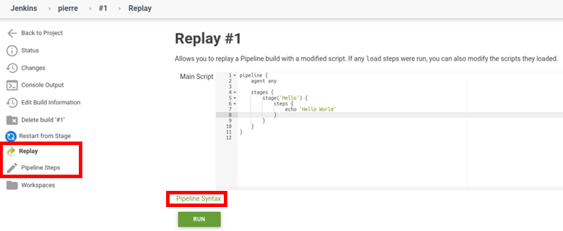

# Development Environment für Jenkins

Einer der großen Nachteile von Jenkins ist die lange Feedback-Schleife. Es gibt keine IDE, die typische Features wie Auto-Completion, Browsing, Refactoring, Debugging, ... mitbringt. Im worst-case muß man eine Shared-Installation (auf der noch andere arbeiten) verwenden, um per Commit-Push die Pipelines zu aktualisieren, manuell starten und dann die kryptischen Stacktraces analysieren - das ist der blanke Horror.

---

## MUST-HAVE - lokale Installation

* [Pipeline Development Environment](https://jenkins.io/doc/book/pipeline/development/)

Eine lokale Jenkins Installation hat meine Developer Experience auf jeden fall schon mal verbessert - im Vergleich zu einem Shared-Jenkins-Installation. Hier kann ich tun und lassen was ich will (z. B. Plugins installieren/upgraden, Konfiguration ändern), ohne Impediments für andere zu erzeugen (z. B. die gesamte Entwicklungsabteilung lahmlegen).

Doch leider muß ich immer noch immer committen, pushen und dann den Jenkins Job triggern. Um dann festzustellen, daß die Syntax im `Jenkinsfile` oder einer Shared-Library nicht stimmt. Das ist nicht besonders effizient :-(

---

## Hilfe bei der Erstellung von Pipeline-Code

### Code-Generatoren in der Jenkins UI

Jenkins bietet auf einem gestarteten Jenkins Server ... leider nur Tooling für Declarative Pipelines

* [Snippet Generator](http://localhost:8080/pipeline-syntax/)
  * dieses Tool steht über die URL zur Verfügung, ist aber auch in den Pipeline-Editor in der Web-UI integriert:
    
* [Declarative Directive Generator](http://localhost:8080/directive-generator/)
* [Global Variable Reference](http://localhost:8080/pipeline-syntax/globals)

Blue Ocean Pipeline Editor unterstützt die Editierung von Jenkins Pipelines.

### Auto-Vervollständigung IntelliJ

* [Blog](https://www.triology.de/blog/jenkins-pipeline-plugin-code-vervollstaendigung)

Jenkins stellt eine Groovy DSL Datei (GDSL) bereit, die man jobspezifisch über die URL

> https://<JENKINS_HOST>/job/<JOBNAME>/pipeline-syntax/gdsl

erstellen lassen kann und dann in sein IntelliJ integriert.

### Pipeline Linter in Visual Studio Code

Visual Studio Code stellt das Plugin *Jenkins Pipeline Linter Connector* bereit, das allerdings nur deklarative Pipelins unterstützt. Es wird folgendermaßen gegen einen laufenden Jenkins konfiguriert:

```json
"jenkins.pipeline.linter.connector.url": "http://localhost:8080/pipeline-model-converter/validate",
"jenkins.pipeline.linter.connector.user": "pfh",
"jenkins.pipeline.linter.connector.pass": "112a010e3c1408a97e38fb5d50fd79d0bf"
```

### JUnit Tests

* [Pipeline Unit Testing Framework](https://github.com/jenkinsci/JenkinsPipelineUnit)
  * das sollte man auf jeden Fall verwenden, um die Build-Infrastruktur zu testen!!!

### Fazit

> "I hate to be the bearer of bad news, but the documentation is lacking (and often unspecific as to whether or not its examples are for scripted or declarative pipelines), the book barely grazes the subject (if you’ve found one that has better information please share), and piecing together bits of other peoples’ Github examples and Stack Overflow answers is nothing short of a painful slog. Even then, you’re just as likely (if not more!) to find declarative pipeline examples which, of course, have different syntax and abilities." ([Hacky Hacker’s Guide To Hacking Together Jenkins Scripted Pipelines and Getting Them To Do Things](https://medium.com/devopslinks/a-hacky-hackers-guide-to-hacking-together-jenkins-scripted-pipelines-and-getting-them-to-do-things-a1e943cb8d11))
