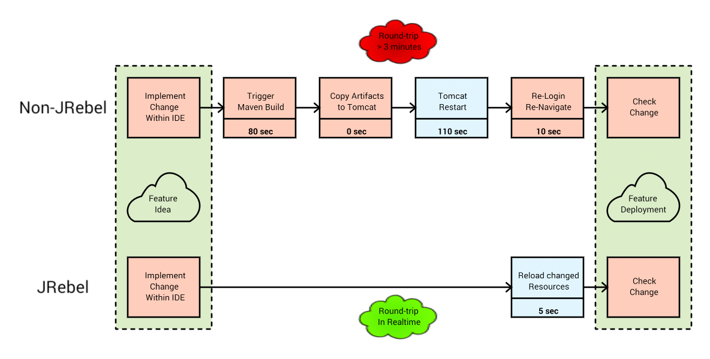
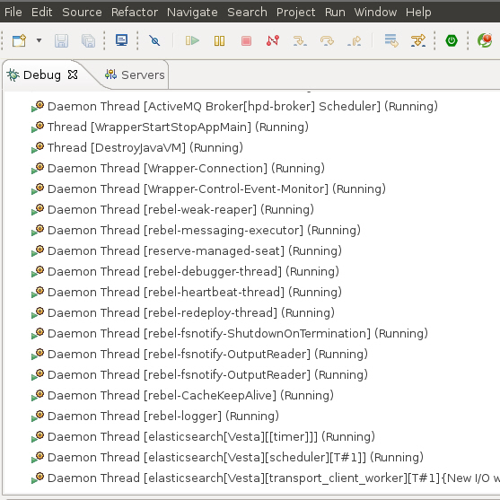
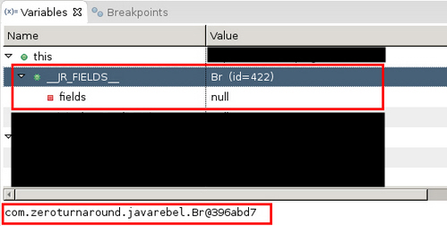

# JRebel
Deploying code changes (Java-Classes, JSF-Resources, Spring-Context-Changes, ...) to the server is usually done this way:



This process takes - depending on the size of your application - some minutes ... several times a day.

In Java 1.5 the Hot-Swap mechanism was introduced but it is very restricted because it  allows only method body changes during remote debugging sessions. When I used it it was not very reliable (sometimes it worked ... most often: not).

Spring-Boot supports Warm-Restart and also Jetty supports some kind of Hot-Swapping (but still limited - I have heard of).

JRebel supports real Hot-Swapping of a wide range of refactorings

* http://zeroturnaround.com/software/jrebel/features/

It supports also a wide range of frameworks ... a lot of framework-specific refactorings (e. g. changing the spring context) are possible without restarting the application.

Have a look at the [white paper](http://files.zeroturnaround.com/pdf/JRebelWhitePaper2014.pdf), video 1 and video 2

Video 1: (https://vimeo.com/112443042)

  <a href="https://vimeo.com/112443042" target="_blank">
    
  </a>

Video 2: (https://www.youtube.com/watch?v=4JGGFCzspaY)

  <a href="https://www.youtube.com/watch?v=4JGGFCzspaY" target="_blank">
    
  </a>

---

# Conservative Approaches
There are some approaches to reduce this costs:

* increase maven build and application server redeploy time
  * best idea - BUT: hard to reach
* use test-driven development
  * very good idea: BUT: for some modules (e. g. webui) in some situations too much overhead
* for JSF-UI-resources: configure Eclipse to work on JSF-resources directly
  * BENEFITS:
    * xhtml changes directly visible
  * DRAWBACKS
    * copy task back to the version controlled files needed (if you forget you loose code) works only for JSF resources .xhtml resources
* configure application server to use the Eclipse attached source folders (under version control) or the maven generated resource folders (containing .class, .xhtml, .properties).

---

# JRebel Approach
JRebel transforms your IDE into a deployment tool ... the artifacts created by your IDE are integrated into the running deployment (inside or outside of your IDE):


## Technical Insights

### IDE-Deployment-Integration


**maven-jrebel-plugin:**

The needed ``rebel.xml`` within each artifact (jar, war, ear) can be written manually or you can use the [maven-jrebel-plugin](http://manuals.zeroturnaround.com/jrebel/standalone/config.html#maven).

**rebel.xml:**

* http://manuals.zeroturnaround.com/jrebel/standalone/config.html
* http://www.zeroturnaround.com/alderaan/rebel-2_0.xsd

### Classloading
JRebel adapts the Classloading Mechanism of the running application. When the application loads a resource via Classloader the JRebel Classloader is used to check whether the resource under IDE-control (Eclipse, maven) is newer than the one deployed in the applications artifact (jar, war).

JRebels statement:

> "JRebel versions each class individually, instead of an entire application or module at a time – and it does not use classloaders. With JRebel, changes to classes are always visible with the Reflection API." (http://files.zeroturnaround.com/pdf/JRebelWhitePaper2014.pdf)

## Recommendations

If there is a resource in the back-referenced folder then JRebel uses this one. It uses the FIRST back-referenced resource it finds. If you would have two back-referenced resource folders (e. g. bin/classes and target/classes) it uses the first found (usually the one in bin/classes/MyClass.class). JRebel does not compare the timestamps of "bin/classes/MyClass.class" and "target/classes/MyClass.class" to use the most recent one.

THEREFORE: I recommend to only include the Eclipse target build folder (bin/classes) into the back-references. If you update your VCS-resources outside of your IDE (e. g. with a Command-Line-Tool) you should rebuild the updated projects also within your IDE (if it does not support automatic reload ... Eclipse has hooks for it).

--- 

# Getting Started ...

... with one module - in 15 minutes ..

## Step 0: prepare JRebel

* download and unzip software package (e. g. to ``~/programs/jrebel`` - aka JREBEL_HOME): https://zeroturnaround.com/software/jrebel/download/
* download license file (e. g. put it into ~/.jrebel/ directory)
* activate JRebel by:
  * ``$JREBEL_HOME/bin/activate.sh $PATH_TO_LICENSE_FILE`` e. g. ``~/programs/jrebel/bin/activate.sh ~/.jrebel/jrebel.lic``
    * KEEP IN MIND: there is also an Actiivation-UI (if you do not like CLI)

## Step 1: prepare Tomcat
* JRebel provides an interactive script that adapts the tomcat startup scripts:
  * ``$JREBEL_HOME/bin/setup.sh -r $TOMCAT_HOME``  
    * e. g.: ``$JREBEL_HOME//bin/setup.sh -r ~/programs/apache-tomcat-7.0.42``
  * ATTENTION: I had to adapt the created startup script ``startup-jrebel.sh`` slightly because the existing startup.sh needs to be called within (instead of catalina.sh)
  * background information: the script is nothing more than adding the JRebel-Java-Agent (``-javaagent:/path/to/jrebel.jar``) to the Tomcat (see http://manuals.zeroturnaround.com/jrebel/standalone/launch-quick-start.html)
* seit Version 6 kann/sollte (???) noch eine Location für den sog. *rebelbootCache* angegeben werden:

```
-Xbootclasspath/p:/home/myuser/.jrebel/bootCache/rebelbootCache.jar
```

## Step 2: prepare module ``mymodule``

... by adding ``jrebel-maven-plugin`` to ``mymodule/pom.xml``:

```xml
<plugin>
  <groupId>org.zeroturnaround</groupId>
  <artifactId>jrebel-maven-plugin</artifactId>
  <version>1.1.5</version>
  <executions>
    <execution>
      <id>generate-rebel-xml</id>
      <phase>process-resources</phase>
      <goals>
        <goal>generate</goal>
      </goals>
    </execution>
  </executions>
</plugin>        
```

Afterwards you have to run ``mvn clean install`` to generate the ``target/classes/rebel.xml``. It will look like this:

```xml
<?xml version="1.0" encoding="UTF-8"?>
<application
    xmlns:xsi="http://www.w3.org/2001/XMLSchema-instance"
    xmlns="http://www.zeroturnaround.com"
    xsi:schemaLocation=
      "http://www.zeroturnaround.com 
      http://www.zeroturnaround.com/alderaan/rebel-2_0.xsd">
        <classpath>
                <dir name="/home/pfh/src/myapp/modules/mymodule/bin/classes"/>
        </classpath>
</application>
```

The ``rebel.xml`` will also be part of the module artifact ``mymodule.jar``.

## Step 3: deploy ``mymodule.jar``
* copy mymodule.jar to your Tomcat-deployment
* start the Tomcat with ``startup-jrebel.sh``
  * within the startup log you should see some JRebel Success messages

## Step 4: test it
* change ``MyClass.java`` if the module ``mymodule`` within your IDE
* build the corresponding ``MyClass.class`` by your IDE (in Eclipse usually done automatically - output folder is ``bin/classes``)
* test your change in the running application

---

# More Details

## User-specific Agent Properties
... are set within ``~/.jrebel/jrebel.properties`` ([see documentation](http://manuals.zeroturnaround.com/jrebel/misc/index.html#agent-properties))

Here you can

* restrict which modules are under Rebel-Control
  * usually I rebellize ALL modules and use ``rebel.packages`` to select only some
* configure license (``rebel.license``)
* configure logging (``rebel.log``)
* exclude/inlcude classes/packages

> If you had such classes:
* first.Alpha
* first.foo.Bravo
* second.Charlie
* third.Delta
> 
> and you added -Drebel.packages=first.foo,second -Drebel.packages_exclude=first
 then JRebel would not reload Alpha and Bravo, because they're included
in the exclude, and Delta, because it's not included in any of the
rebel.packages. However it'd reload Charlie.

## Tanuki Wrapper
If you use this one you have to configure the JRebel-Java-Agent within your ``wrapper.conf``:

    wrapper.java.additional.13=-javaagent:/home/pfh/programs/jrebel/jrebel.jar
    wrapper.java.additional.14=-Drebel.log=true

## rebel.xml
Every Artifact (jar, war, ear) under Rebel-Control needs a ``rebel.xml`` that contains the back-reference to the code (which is under User-IDE-Control).

Usually your developers have different filesystem structures (maybe even different operating systems). Therefore the back-reference needs a user-specific part. I recommend to use a Java-System-Property (e. g. ``sourceFolder``) that is set within your application startup script (e. g. ``startup-jrebel.bat``) like this:

    java 
      -javaagent:"C:\jrebel\jrebel.jar" 
      -DsourceFolder=c:/src/myapp"
      
Within the user-unspecific and usually generated ``rebel.xml`` you use the System-Property ``sourceFolder`` in a way like this (see element ``rootPath``):

```xml
<build>
    <pluginManagement>
        <plugins>
            <plugin>
              <groupId>org.zeroturnaround</groupId>
              <artifactId>jrebel-maven-plugin</artifactId>
              <version>1.1.5</version>
              <configuration>
                    <packaging>jar</packaging>
                    <relativePath>../../</relativePath>
                    <rootPath>$${sourceFolder}</rootPath>
                    <generateDefaultElements>false</generateDefaultElements>
                    <classpath>
                            <fallback>default</fallback>
                            <resources>
                                <resource>
                                    <directory>bin/classes</directory>
                                    <excludes>
                                        <exclude>**/*.properties</exclude>
                                        <exclude>**/*.xml</exclude>
                                    </excludes>
                                </resource>
                            </resources>
                    </classpath>
              </configuration>
              <executions>
                <execution>
                  <id>generate-rebel-xml</id>
                  <phase>process-resources</phase>
                  <goals>
                    <goal>generate</goal>
                  </goals>
                </execution>
              </executions>
            </plugin>       
        </plugins>
    </pluginManagement>
    <plugins>
        <plugin>
            <groupId>org.zeroturnaround</groupId>
            <artifactId>jrebel-maven-plugin</artifactId>
        </plugin>       
    </plugins>
</build>
```

The ``relativePath`` should reference to the folder reletive to this module ... this is hard to understand. Above configuration would fit for this filesystem structure

    c:/src/myapp/             <--- value of system property "sourceFolder"
      modules/
        mymodule/
          pom.xml             <--- content see above
          target/
            classes/
              rebel.xml       <--- content see below
              
This will result in a generated ``rebel.xml`` like this:

```xml
<application>
	<classpath fallback="default">
		<dir name="${sourceFolder}/modules/mymodule/bin/classes"/>
	</classpath>
</application>
```

## JRebel Heap Space
A JRebel application needs some more heap space ... otherwise you will have some performance issues because of garbage collector running continuously

## JRebel - only for web-applications?
JRebel is not restricted to web-applications. You can configure the JRebel-Java-Agent within any Java application.

## Very Low Level

Statement 1:
> "JRebel is a JVM plugin (-javaagent) that integrates with the JVM and rewrites each class to be updateable. JRebel versions each class individually, instead of an entire application or module at a time – and it does not use classloaders. With JRebel, changes to classes are always visible with the Reflection API." (http://files.zeroturnaround.com/pdf/JRebelWhitePaper2014.pdf)

Statement 2:
> "JRebel integrates directly with application servers and frameworks to propagate configuration changes from the changed classes and resources, and annotation changes are also visible via Reflection API. JRebel comes with special integrations for over 80 of the most popular frameworks and technologies (Spring, Hibernate, Seam, Wicket and Struts just to name a few)." (http://files.zeroturnaround.com/pdf/JRebelWhitePaper2014.pdf)

Statement 3:
> "And for developers who run their application server on a virtual machine or other remote system, JRebel has a special feature called JRebel Remoting that eliminates the need to transfer the application manually. JRebel Remoting simply transfers the changed files only and then performs the reloading on remote server as expected." (http://files.zeroturnaround.com/pdf/JRebelWhitePaper2014.pdf)

You can see that in your rebellized deployed application there are some JRebel-Threads:


When you debug you can see that JRebel is there ... the Java-Classes are instrumented:


---

# Supported Frameworks 

JRebel not only supports hot-swapping for Java classes but also refactorings/extensions on framework-specific artifacts (spring application contexts, Hibernate mappings, Cxf, ...):

* http://manuals.zeroturnaround.com/jrebel/misc/integrations.html

---

# JRebel-Remote
* http://manuals.zeroturnaround.com/jrebel/remoting/index.html
* [Eclipse-Plugin](http://manuals.zeroturnaround.com/jrebel/remoteserver/eclipse.html)
* [IntelliJ-Plugin](http://manuals.zeroturnaround.com/jrebel/remoteserver/intellij.html)

JRebel not only supports IDE and application server running on the same machine. The IDE-JRebel-Plugin also supports remote deployments.

In this scenario the IDE-Plugin is responsible to transfer the changed artifacts to your deplyoment-machine. The application server on that deployment-machine is configured to have a back-reference to the transfer folder to reload updated resources.

Sorry, but I have never used it personally ...

---

# Performance
* the application is slightly slower than without JRebel ... but in developer environments this does not really matter.
* application startup increases by 10-30% (but you will have to restart less often)
* JSF-xhtml reload is in realtime
* Java-Code changes are visible within 2-15 seconds

---

# Conclusion
JRebel is really worth the money if a warm-restart approach ([like Spring-Boot supports](http://docs.spring.io/spring-boot/docs/current/reference/html/using-boot-devtools.html#using-boot-devtools-restart)) is not good enough.

* it takes only some minutes to make it running
* it works without any requirements to your IDE ... therefore it works with EVERY IDE (you do not need the provided plugins).
* even if you are a test-driven developer it makes sense to use JRebel
  * to identify the broken code - you often have an idea where the code is broken and use JRebel to check your assumption
  * to do rapid prototyping
* Support is excellent (in 2014)

Well done, Zeroturnaround :-)