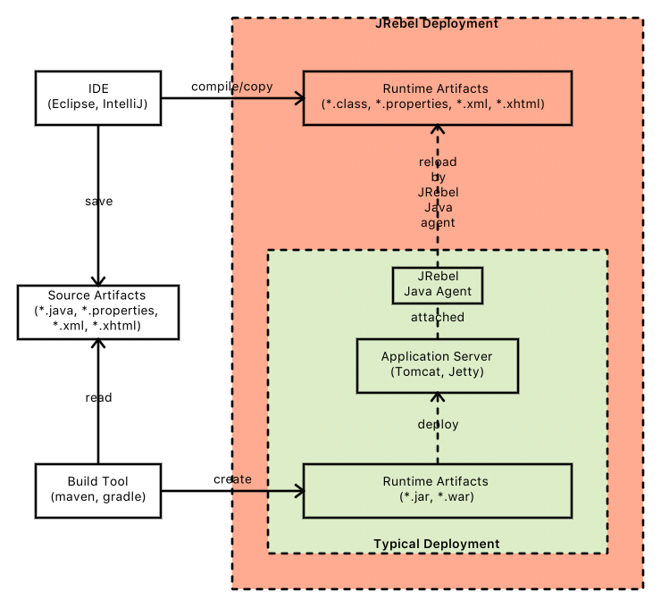
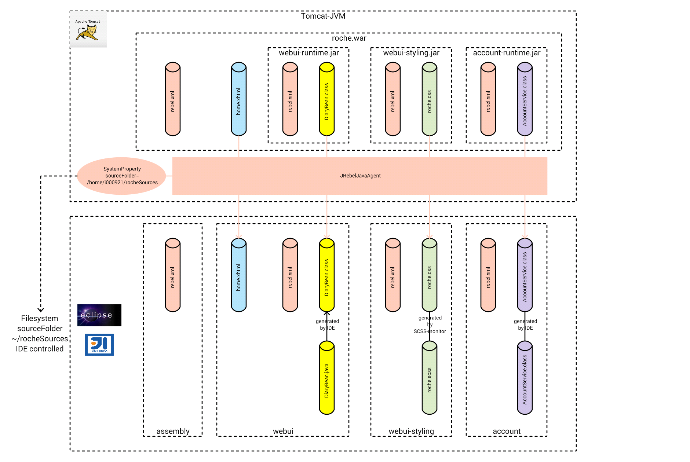

# JRebel
Deploying code changes (Java-Classes, JSF-Resources, Spring-Context-Changes, ...) to the server is done by:

    change resource in Eclipse
    mvn clean install
    copy artifacts to tomcat
    tomcat stops (automatically)
    tomcat starts (automatically)

This process takes - depending on the size of your application - some minutes ... several times a day.

In Java 1.5 the Hot-Swap mechanism was introduced but it is very restricted because it  allows only method body changes during remote debugging sessions. When I used it it was not very reliable (sometimes it worked ... most often: not).

Spring-Boot supports Warm-Restart and also Jetty supports some kind of Hot-Swapping (but still limited - I have heard of).

JRebel supports real Hot-Swapping of a wide range of refactorings

* http://zeroturnaround.com/software/jrebel/features/

It supports also a wide range of frameworks ... a lot of framework-specific refactorings (e. g. changing the spring context) are possible without restarting the application.

Have a look at the [white paper](http://files.zeroturnaround.com/pdf/JRebelWhitePaper2014.pdf) and the following video (https://vimeo.com/112443042):

  

---

# Conservative Approaches
There are some approaches to reduce this costs:

* increase maven build and application server redeploy time
  * best idea - BUT: hard to reach
* use test-driven development
  * very good idea: BUT: for some modules (e. g. webui) in some situations too much overhead
* for JSF-UI-resources: configure Eclipse to work on JSF-resources directly
  * BENEFITS:
    * xhtml changes directly visible
  * DRAWBACKS
    * copy task back to the version controlled files needed (if you forget you loose code) works only for JSF resources .xhtml resources
* configure application server to use the Eclipse attached source folders (under version control) or the maven generated resource folders (containing .class, .xhtml, .properties).

---

# JRebel Approach
JRebel transforms your IDE into a deployment tool ... the artifacts created by your IDE are integrated into the running deployment (inside or outside of your IDE):

## Technical Insights

### IDE-Deployment-Integration

**maven-jrebel-plugin:**

The needed ``rebel.xml`` within each artifact (jar, war, ear) can be written manually or you can use the [maven-jrebel-plugin](http://manuals.zeroturnaround.com/jrebel/standalone/config.html#maven).

**rebel.xml:**

* http://manuals.zeroturnaround.com/jrebel/standalone/config.html
* http://www.zeroturnaround.com/alderaan/rebel-2_0.xsd

### Classloading
JRebel adapts the Classloading Mechanism of the running application. When the application loads a resource via Classloader the JRebel Classloader is used to check whether the resource under IDE-control (Eclipse, maven) is newer than the one deployed in the applications artifact (jar, war).

JRebels statement:

> "JRebel versions each class individually, instead of an entire application or module at a time – and it does not use classloaders. With JRebel, changes to classes are always visible with the Reflection API." (http://files.zeroturnaround.com/pdf/JRebelWhitePaper2014.pdf)

## Recommendations

If there is a resource in the back-referenced folder then JRebel uses this one. It uses the FIRST back-referenced resource it finds. If you would have two back-referenced resource folders (e. g. bin/classes and target/classes) it uses the first found (usually the one in bin/classes/MyClass.class). JRebel does not compare the timestamps of "bin/classes/MyClass.class" and "target/classes/MyClass.class" to use the most recent one.

THEREFORE: I recommend to only include the Eclipse target build folder (bin/classes) into the back-references. If you update your VCS-resources outside of your IDE (e. g. with a Command-Line-Tool) you should rebuild the updated projects also within your IDE (if it does not support automatic reload ... Eclipse has hooks for it).

--- 

# Getting Started ...

... with one module - in 15 minutes ..

**Step 0: prepare JRebel**

* download and unzip software package (e. g. to ``~/programs/jrebel`` - aka JREBEL_HOME): https://zeroturnaround.com/software/jrebel/download/
* download license file (e. g. put it into ~/.jrebel/ directory)
* activate JRebel by:
  * ``$JREBEL_HOME/bin/activate.sh $PATH_TO_LICENSE_FILE`` e. g. ``~/programs/jrebel/bin/activate.sh ~/.jrebel/jrebel.lic``
    * KEEP IN MIND: there is also an Actiivation-UI (if you do not like CLI)

**Step 1: prepare Tomcat**
* JRebel provides an interactive script that adapts the tomcat startup scripts:
  * ``$JREBEL_HOME/bin/setup.sh -r $TOMCAT_HOME``  
    * e. g.: ``$JREBEL_HOME//bin/setup.sh -r ~/programs/apache-tomcat-7.0.42``
    * ATTENTION: I had to adapt the created startup script startup-jrebel.sh slightly because the existing startup.sh needs to be called within (instead of catalina.sh)
    * background information: the script is nothing more than adding the JRebel-Java-Agent (``-javaagent:/path/to/jrebel.jar``) to the Tomcat (see http://manuals.zeroturnaround.com/jrebel/standalone/launch-quick-start.html)

**Step 2: prepare module ``mymodule``**

... by adding ``jrebel-maven-plugin`` to ``mymodule/pom.xml``:

    <plugin>
      <groupId>org.zeroturnaround</groupId>
      <artifactId>jrebel-maven-plugin</artifactId>
      <version>1.1.5</version>
      <executions>
        <execution>
          <id>generate-rebel-xml</id>
          <phase>process-resources</phase>
          <goals>
            <goal>generate</goal>
          </goals>
        </execution>
      </executions>
    </plugin>        

Afterwards you have to run ``mvn clean install`` to generate the ``target/classes/rebel.xml``. It will look like this:

    <?xml version="1.0" encoding="UTF-8"?>
    <application
        xmlns:xsi="http://www.w3.org/2001/XMLSchema-instance"
        xmlns="http://www.zeroturnaround.com"
        xsi:schemaLocation=
          "http://www.zeroturnaround.com 
          http://www.zeroturnaround.com/alderaan/rebel-2_0.xsd">
            <classpath>
                    <dir name="/home/pfh/src/myapp/modules/mymodule/bin/classes"/>
            </classpath>
    </application>

The ``rebel.xml`` will also be part of the module artifact ``mymodule.jar``.

**Step 3:** deploy ``mymodule.jar``
* copy mymodule.jar to your Tomcat-deployment
* start the Tomcat with ``startup-jrebel.sh``
  * within the startup log you should see some JRebel Success messages

**Step 4:** test it
* change ``MyClass.java`` if the module ``mymodule`` within your IDE
* build the corresponding ``MyClass.class`` by your IDE (in Eclipse usually done automatically - output folder is ``bin/classes``)
* test your change in the running application

---

# More Details

## User-specific Agent Properties
... are set within ``~/.jrebel/jrebel.properties`` ([see documentation](http://manuals.zeroturnaround.com/jrebel/misc/index.html#agent-properties))

Here you can

* restrict which modules are under Rebel-Control
  * usually I rebellize ALL modules and use ``rebel.packages`` to select only some
* configure license (``rebel.license``)
* configure logging (``rebel.log``)

## Tanuki Wrapper
If you use this one you have to configure the JRebel-Java-Agent within your ``wrapper.conf``:

wrapper.java.additional.13=-javaagent:/home/pfh/programs/jrebel/jrebel.jar
wrapper.java.additional.14=-Drebel.log=true

## rebel.xml
Every Artifact (jar, war, ear) under Rebel-Control needs a ``rebel.xml`` that contains the back-reference to the code (which is under User-IDE-Control).

Usually your developers have different filesystem structures (maybe even different operating systems). Therefore the back-reference needs a user-specific part. I recommend to use a Java-System-Property (e. g. ``sourceFolder``) that is set within your application startup script (e. g. ``startup-jrebel.bat``) like this:

    java 
      -javaagent:"C:\jrebel\jrebel.jar" 
      -DsourceFolder=c:/src/myapp"
      
Within the user-unspecific ``rebel.xml`` you configure 

## JRebel Heap Space
A JRebel application needs some more heap space ... otherwise you will have some performance issues because of garbage collector running continuously

## JRebel - only for web-applications?
JRebel is not restricted to web-applications. You can configure the JRebel-Java-Agent within any Java application.

---

# Supported Frameworks 

JRebel not only supports hot-swapping for Java classes but also refactorings/extensions on framework-specific artifacts (spring application contexts, Hibernate mappings, Cxf, ...):

* http://manuals.zeroturnaround.com/jrebel/misc/integrations.html

