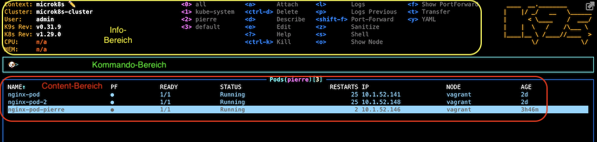

# K9s

Dieses Tool macht die Informationsbeschaffung und Steuerung eines K8s-Cluster noch ein bisschen angenehmer als `kubectl`. Es ist ein Kommandozeilen-Tool, das sich leicht mit der Tastatur bedienen lässt.

---

# Motivation

* [YouTube - K9s - The Kubernetes tool you never knew you needed](https://www.youtube.com/watch?v=ZwOOJqcKQ8g)
* [K9s — the powerful terminal UI for Kubernetes](https://blog.palark.com/k9s-the-powerful-terminal-ui-for-kubernetes/)

---

# Bedienungskonzept

Die Oberfläche ist folgendermassen aufgebaut:



bestehend aus denn Berechen:

* Info
* Kommando
* Content

Wenn man das Tool startet, dann landet man im `<pod>`-VIEW (sieht man auch unten links). Mit den Pfeiltasten kann man sich bewegen. Mit einem RETURN auf einer Zeile löst man den eine Navigation in diesen Bereich aus ... also beispielsweise von einem Pod hin zu seinen Containern. Mit einem ESC kommt man wieder eine Ebene höher.

## Shortcuts

* die wichtigsten Shortcuts sind im Info-Bereich dargestellt ... die Shortcuts sind View-spezifisch, d. h. im Pods-View hat man andere als in der Deployment-View
* mit `?` erhält man weitere Shortcuts angezeigt
* mit `/` landet man in der Kommandozeile und kann man vi-like in der aktuellen Content-Ansicht suchen ... mit TAB kommt man zum nächsten Treffer
* mit `:` landet man in der Kommandozeile. Hierüber kann man die View wechseln. Per `:namespace` wechselt man zum View "Namespace" (geht auch mit dem Alias `:ns`). Mit einem `:pods` kommt man wieder in die Pod-Ansicht

> ACHTUNG: mit einem ESC kommt man hier nicht wieder zur vorherigen Sicht zurück. Vielleicht ist der Grund, dass ESC eigentlich in der Hierarchie wieder hochsteigt ... die View liegen aber parallel zueinander.

## Aliase

... sind Aliase für Kommandos ... statt eines `:namespace` kann man auch `:ns` verwenden, weil das als Alias definiert ist (`:aliases` liefert die Liste der Aliase).

Aliase lassen sich in der Konfiguration (`~/.config/k9s/aliases.yaml`) managen.

## Views

Es gibt folgende Views:

* pod
* namespace
* service

---

# Shortcuts

Die Shortcuts sind ein bisschen vi-like.

* `?`: bekommt man immer eine Hilfe mit nützlichen Shortcuts angezeigt
* `/my-search-term`: Filter
* `:command`: Kommando ausführen
  * `:aliases`
    * Kommando Aliase ... statt `:namespace` kann man auch den Alias `:ns` verwenden
  * `:pods`
  * `:deployment`
  * `:namespace`

---

# Konfiguration

k9s ist stark konfigurierbar - das macht es zu einem echten Profitool.

Die Konfiguration liegt - bei meinem Ubuntu - in (bekommt man via `k9s info` angezeigt)

* `~/.config/k9s/config.yaml`
* `~/.config/k9s/plugins.yaml`
* `~/.config/k9s/hotkeys.yaml`
* `~/.config/k9s/aliases.yaml`

Wenn man k9s startet, dann ist der auf der Konsole konfigurierte Cluster (= Context) ausgewählt (z. B. via `export KUBECONFIG=~/.kube/config-microk8s`), der auch die `kubectl`-Kommandos erhält. Arbeitet man häufig mit mehreren Clustern (z. B. einem AWS-Cluster und dem lokalen MicroK8s Cluster), dann kann man per

```
export KUBECONFIG=~/.kube/config-microk8s:~/.kube/config-aws-prod
```

so dass man in k9s mit `:context` leicht switchen kann, ohne die k9s neu starten zu müssen.

---

# Plugins

Konfiguriert in

* `~/.config/k9s/plugins.yaml`
