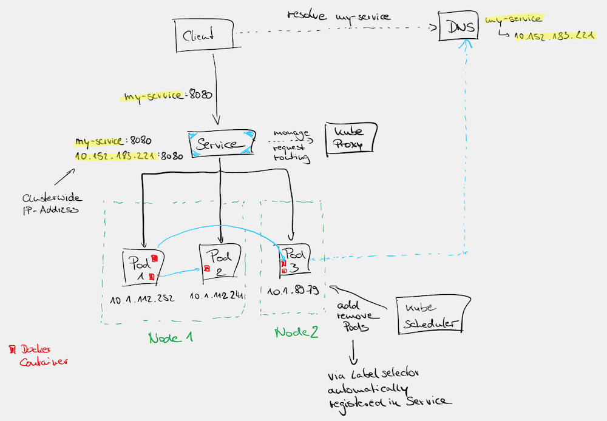

# Kubernetes

* [Refcardz](https://dzone.com/refcardz/kubernetes-essentials)
* Udemy-Kurs [kubernetes for beginners with aws examples" von Michal Hucko](https://www.udemy.com/course/kubernetes-for-beginners-with-aws-examples/learn/lecture/36051770)
  * [GitHub repo](https://github.com/misohu/kubernetes-basics)
  * [Slides](https://docs.google.com/presentation/d/1nHH6RwjNzw7HNRY9chtciCPYVSSVvZgYmXCCbtip4QI/edit#slide=id.p)

Kubernetes ist ein Google-Projekt zur Orchestrierung von Containern (z. B. Docker-Containern). Auf diese Weise lassen sich Deployments automatisieren, administrieren, horizontales skalieren, ausrollen (Rolling Deployments).
Kubernetes besitzt eine Selbstheilungsmöglichkeit - stirbt ein Pod, so bekommt Kubernetes das mit und startet einen neuen. Kubernetes verwendet einen deklarativen Stil anstatt eines imperativen ... Du definierst das Ziel und Kubernetes kümmert sich um die Umsetzung und Einhaltung.

> ... stirbt also ein Pod (eine Instanz eines Services), dann ist der spezifizierte Zustand (Anzahl der Replicas) nicht mehr korrekt und Kubernetes korrigiert das automatisch.

Health-Checks sind essentiell dafür, dass Kubernetes den geforderte Zielzustand einhalten kann. Ein Pod, der zwar läuft, aber eigentlich nicht mehr genutzt werden kann, wird erkannt und durch einen neuen ersetzt.

Ein Autoscaler kann die Anzahl der Replicas automatisch korriegieren, wenn er merkt, dass die Compute-Power nicht mehr ausreicht, um die Last zu bewältigen.

K8s abstrahiert die unterliegende Infrastruktur. Es spielt keine Rolle, ob darunter OnPrem-Hardware oder Cloud-Ressourcen (auch unterschiedlicher Cloud-Anbieter) oder auch nur Raspberry PIs liegen. Kubernetes wird deshalb auch häufig als Operating System der Cloud bezeichnet. Ein Betriebssystem startet Processe auf EINEM Rechner, Kubernetes wendet dieses Konzept auf die Cloud an ... irgendwo wird der Prozess (= Pod) gestartet ... sofern entsprechende Ressourcen vorhanden.

> Letztlich verteilt K8s die vorhandene Rechenpower (On-Prem, Cloud) auf die zu verarbeitende Last. Dabei sind natürlich bestimmte Randbedingungen einzuhalten (z. B. OS-Version, Speicheranforderungen, CPU-Architektur, ...).

Die Cloud hat ihre ursprüngliche Motivation in der Skalierbarkeit. Hierin liegt der grosse Vorteil gegenüber einer limitierten eigenen OnPrem-Umgebung. Grundsätzlich könnte man seine eigene OnPrem-Umgebung so groß gestalten, dass man nie in Ressourcenengpässe läuft und somit keinen Cloud-Anbieter bräuchte. Das wäre allerdings nicht besonders wirtschaftlich, weil man immer auf den worst-case vorbereitet sein müsste und den natürlich auch bezahlen müsste.

> Hieraus ergibt sich eine riesige Chance für Startups, die ohne großes Invest in Hardware ihre Idee auf den Markt bringen können. Ein Booster für Innovation.

AWS, Google, Azure halten diese oversized Umgebung bereit, weil es Kunden gibt, die dafür bezahlen und die wahrscheinlich NIE immer Gleichzeitig unter Vollast laufen, so dass sich er Bedarf mittelt und es sich für den Cloud-Provider und den Kunden rechnet. Im besten Fall ist das eine Win-Win-Situation. Für kleine Unternehmen, die mit einer tollen Idee an den Start gehen wollen, ist das ideal. Sie brauchen nicht in Vorleistung zu gehen, um ein grosses Data-Center aufzubauen, das sie vielleicht nie benötigen. Sobald der Service erfolgreich ist, skaliert die Umgebung automatisch, um die Kunden zu befriedigen - Kosten entstehen erst, wenn sie tatsächloch benötigt werden (und dann im besten Fall auch mit Einnahmen verrechnet werden können).

Kubernetes und alles was darauf läuft ist darauf ausgelegt, IMMER zu laufen. Es sollte keine Downtime geben. Deshalb ist es nicht verwunderlich, wenn Deployments und der Server jahrelang ohne Downtime auskommen. Selbst die Kubernetes-Upgrade laufen ohne Downtime ab.

---

# Konzept Cluster

Sowohl auf der Data-Plane als auch auf der Control-Plane wird i. a. mit einem High-Availability Cluster bestehend aus mind. 3 Nodes gearbeitet. Verwendet man eine Cloud-Lösung, dann wird man versuchen die Nodes in unterschiedliche Availability Zones zu verteilen, so dass auch bei Wartungsarbeiten an der Infrastruktur des Cloud-Providers kein für den Endkunden sichtbarer Ausfall entsteht

---

# Konzept Kube-API

Das ist eine REST-API (bereitgestellt auf der Control Plane) zur Steuerung des K8s-Clusters.

`kubectl` ist eine CLI, die die REST-API verwendet. Statt eines `kubectl get pods --namespace my-namespace`

```
curl https://192.168.100.39:16443/api/v1/namespaces/my-namespace/pods \
    --header `Authorization: Bearer <TOKEN>' \
    --insecure
```

Das curl Kommando wird ein längliches JSON Dokument liefern. `kubectl` reduziert den Output auf ein Minimum. Dennoch kann man mit dem Parameter `-o json` oder `-o yaml` auch ein anderes Format bekommen:

```
kubectl get pods --json
```

---

# Konzept Namespace

Über Namespaces separiert Kubernetes verschiedene Nutzer des Clusters. Man könnte auf diese Weise verschiedene Kunden (Tenants), Stages, Use-Cases, ... separieren, die voneinander isoliert auf einem Cluster betrieben werden.

Normalerweise verwendet man nicht für jede Separierung einen eigenen Cluster, weil das Maintence und Koste erhöht. Das gleichzeitige Betreiben isolierter Anwendungsfälle ist also inherent in das Kubernetes Konzept integriert.

Auf Namespace-Ebene lassen sich Berechtigungen, Quota und andere Limitierungen definieren, um so die Nutzung des Clusters zu beschränken, zu optimieren oder was auch immer.

Letztlich bestimmt der Anwendungsfall (was will ich separieren?) welchen Aspekt man zur Definition eines Namespaces verwendet.

## Default Namespaces

* `default`
* `kube-system`
  * Kubernetes System Komponenten laufen hier

---

# Konzept Pod

* ist kleinste Deployment-Einheit bestehend aus 1-n Docker-Containern, Data-Volumes, Networks, ...
* ein Pod bekommt eine IP-Adresse
* alle Container innerhalb eines Pods können über `localhost` miteinander kommunizieren (vereinfacht die Konfiguration)
* ein Pod kommt vollständig auf einen Worknode
  * alles darin befindliche wird auf dem gleichen Knote ... Dinge, die IMMER gemeinsam auf einem Node (= Minion) deployed werden.
* Komponenten EINES Pods sind eng verknüpft und teilen den gleichen Lifecycle
* so startet man einen Pod mit einem einzigen Container: `kubectl run nginx-pod --image=nginx --port 80`
  * der Pod exposed den Port 80 (des NGINX Docker Containers) nach außen für andere Pods innerhalb des gleichen Namespaces 
* um einen Port nach aussen (außerhalb des Namespaces) freizugeben kann man explizit ein Port-Forwarding `kubectl port-forward nginx-pod 8080:80` definieren und anschließend man kann per http://localhost:8080 auf den NGINX Server zugreifen
  * auf diese Weise kann ich auf den Pod in AWS über ein `localhost:8080` zugreifen, um darin Fehler analysieren zu können
  * ACHTUNG: so macht man das i. a. nicht im normalen Betrieb ... sondern eher zum Debugging
* ein Pod kann mehrere Labels haben, die dann verwendet werden, um Pods auszuwählen
* Pods teilen sich Volumes
* sind volatil (ephemeral) ... können wegfallen oder sich vermehren (getriggert durch den Auto-Scaler)

Beim Start eines Pods geschieht folgendes:

* `kubectl` weist den API-Server an einen Pod mit NGINX zu starten
* die Control-Plane (auf dem auch der API-Server läuft) schreibt den DESIRED State (1 NGINX Pod) nach etcd
* der Kube-Controller stellt fest, dass der DESIRED State nicht erfüllt ist (denn es gibt einen solchen Pod noch nicht)
* der Kube-Controller weist den Scheduler an einen Pod zu starten
* Scheduler sucht einen passenden Worker-Node mit freien Ressourcen aus und weist Kubelet auf diesem Node an, diesen Pod zu starten
* Kubelet (auf dem angewiesenen Worker-Node) versucht das NGINX Image von der lokalen Registry zu ziehen (wenn nicht vorhanden wird es aus dem Internet gezogen) und startet anschließend den Pod

Warum mehrere Container in einem Pod

* Initialisierungs-Container, die Provisioning machen und dann stoppen
* Sidecar-Container, um bestimmte Aspekte zu übernehmen, die nicht in die Anwendung integriert werden soll
  * Verschlüsselung, Zertifikathandling
  * Logging

Pods werden i. a. selten einzeln deployed, sondern immer über ein ReplicaSet oder gar Deployment. Wenn man nun einen Pod sieht und möchte den irgendwie verändern, dann muss man natürlich herausfinden welches die zuständig Deployment-Einheit ist. Hierzu schaut man sich das Manifest-File des Pods an per

```
kubectl get pod my-pod -o yaml
```

Darin befindet sich die Information `ownerReferences`. Diese Info befindet sich an vielen Kubernetes-Ressourcen, so dass man backward-traversing machen kann.

> **ACHTUNG:** in einem professionellen Umfeld startet niemand pods imperativ mit `kubectl run ...`. Das kann man mal zum Rumspielen tun oder zum Debugging. Normalerweise verwendet man ein Deploment, da hier Replicas, Health-Checks, ... spezifiziert werden können.

## Stateful vs Stateless Pods

...

## Container Limits

Um einen Pod mit all seinen Containern auf einem passenden Node zu platzieren, muss der Scheduler wissen

* wieviele Ressourcen sind auf den Nodes frei
  * das ist Aufgabe des K8s-Clusters
* wieviele Ressourcen braucht der Pod zum Starten und Maximal
  * das ist Aufgabe des Applikationsentwicklers, der pro Container `requests` (Ressourcen die zum Start benötigt werden ... die minimalen Ressourcen also) und `limits` (die maximalen Ressourcen) definiert

    ```
    resources:
      requests:
        memory: "256Mi"
        cpu: "2"
      limits:
        memory: "512Mi"
        cpu: "4"
    ```

> Es ist zu empfehlen im Kubernetes-Cluster default-Werte hierfür zu definieren. Das verhindert böse Überraschungen, wenn der Entwickler das vergisst.

---

# Konzept Minion

* Minion ist die softwareseitige Komponente eines Nodes - der Node besteht aus der Hardware und der Software (= dem Minion)

---

# ReplicaSet

**ACHTUNG:**
In der [offiziellen Kubernetes](https://kubernetes.io/docs/concepts/workloads/controllers/replicaset/) Doku heißt es:

> "we recommend using Deployments instead of directly using ReplicaSets, unless you require custom update orchestration or don't require updates at all. This actually means that you may never need to manipulate ReplicaSet objects: use a Deployment instead, and define your application in the spec section"

Ein ReplicaSet ist eine Kubernetes Ressource (`kind: ReplicaSet`). Hierin erfolgt die Spezifikation einer Pod-Replizierung:

```
apiVersion: apps/v1
kind: ReplicaSet
metadata:
  labels:
    app: nginx-pierre
  name: nginx-pierre
spec:
  replicas: 4
  selector:
    matchLabels:
      app: nginx-pierre                               <======= müssen identifsch sein
  
  # hier beginnt die Pod-Spezifikation
  # ... die Teil der ReplicaSet-Spezifikation ist
  template:
    metadata:
      labels:
        app: nginx-pierre                             <======= müssen identifsch sein
    spec:
      containers:
      - name: nginx
        image: nginx
        ports:
          - containerPort: 80
```

Will man die Anzahl der Replikate verändern, dann muss man nur an `spec.replicas` drehen und die Änderung applyen. Oder man verwendet das imperative Kommando

```
kubectl scale replicaset ningx-pierre --replica 2
```

---

# Konzept Deployment

Ich kann einzelne Pods über ein Manifest-File deployen lassen, ich kann viele gleiche Pods über ReplicaSets deployen lassen. Wozu dann noch Deployments als eigenes Konzept ... ich habe doch schon alles?

Was ist gleich?

* ein Deployment repräsentiert eine Menge identischer Pods (ein oder mehrere), die auf die Worker-Nodes deployed werden
* bei ReplicaSets kann ich eine Menge gleicher Pods als DESIRED State definiere und Kubernetes erfüllt diese Anforderung

> Intern verwendet ein Deployment auch ReplikaSets ... deshalb sieht die Manifest-Spezifikation auch sehr ähnlich aus.

Die nachfolgenden Aspekte sind echte Vorteile gegenüber diesen einfachen Deployment Ansätzen.

## Manifest File

Die Spezifikation eines Deployments sieht sehr ähnlich zu dem eines ReplikaSets aus. Aus einem ReplikaSet kann man einfach ein Deployment-Spezifikation machen, indem man `kind: ReplicaSet` durch `kind: Deployment` ersetzt. Allerings bietet das Deployment weitere Features.

In der [offiziellen Kubernetes](https://kubernetes.io/docs/concepts/workloads/controllers/replicaset/) Doku heißt es:

> "we recommend using Deployments instead of directly using ReplicaSets, unless you require custom update orchestration or don't require updates at all. This actually means that you may never need to manipulate ReplicaSet objects: use a Deployment instead, and define your application in the spec section"

## Rollout Strategy

Wir wollen i. a. neue Versionen unserer Anwendungen (neue Features, Bugfixes) ohne Downtime ausrollen, so dass der User davon im besten Fall nichts mitbekommt und auch keine Performanceeinbußen hinnehmen muss. Für diese Nutzererfahrung muss man ein bisschen smarter Vorgehen als einfach alles plattmachen und neu ausrollen.

Verschiedene Ansätze

* Recreate ... mit Downtime (nicht besonders smart)
  * runterfahren aller Pods und hochfahren neuer Pods
* Rolling-Update ... ohne Downtime
  * über `maxSurge: 100%` kann man ein Blue-Green-Deployment implementieren, bei dem erst Pods mit der neuen Version hinzugefügt und dann die alten entfernt werden
  * über `maxUnavailable: xyz%` kann man steuern wie offensiv das Deployment erfolgen soll
  * wenn das Deployment fehlschlägt (z. B. StartupProbe, ReadinessProbe schlagen fehl), dann erfolgt auch ein automatisches Rollback
  * mit `maxSurge: 0%; maxUnavailable: 25%` läuft das Update so, dass keine neuen Pods hinzugefügt werden, aber 25% entfernt und durch neue ersetzt werden
  * mit `maxSurge: 0%; maxUnavailable: 100%` könnte man die "Recreate" Strategy abbilden

Beim Rolling-Update laufen über einen gewissen Zeitraum 2 Versionen der Applikation in unterschiedlichen Pods (manche Nutzer/Requests bekommen dann die alte Version - andere bereits die neue). Das hat besonders Anforderungen an die Applikation, die der Applikationsentwickler berücksichtigen muss (z. B. Backward/Forward-Kompatibilität der Datenbank-Schema und APIs).

## Rollback Strategy

Rollbacks können während eines Deployments automatisch von Kubernetes ausgeführt werden (wenn die Readiness-Probe fehlschlägt und bereits ausgetauschte Pods durch die alte Version ausgetauscht werden müssen).

Alternativ kann es passieren, dass während des Deployments keine Fehler festgestellt werden, aber die Kunden sich beschweren und man deshalb manuell Rollback auslösen muss (ein Re-Deployment der alten Version).

Kubernetes speichert hierzu die alten Versionen der Manifest-Files in etcd (in einem Annotation Feld). Diese kann man mit 

```
kubectl rollout history deployment my-webserver
```

> Hat man im Deployment-Manifest die `metadata/annotations/kubectl.kubernetes.io/change-cause` gepflegt, dann bekommt man hier auch eine `CHANGE-CAUSE` angezeigt und kann die Deployment-Versionen besser identifizieren.

Für ein Deployment kann man sich über

```
kubectl get deployment my-webserver -o yaml
```

und findet dann an der Annotation `kubectl.kubernetes.io/last-applied-configuration` die Konfiguration der vorherigen Deployment-Ressource.

Einen Rollback kann man dann per

```
kubectl rollout undo deployment my-webserver back
```

triggern (oder zu einer anderen Version `kubectl rollout undo deployment my-webserver --to-revision=23`).

## Wie startet man ein Deployment?

... wie bei allen anderen Changes bereitet man ein Manifest-File (z. B. `my-webserver-deployment.yml`) vor und applied es per

```
kubectl apply -f my-webserver-deployment.yml
```

Man kann das Manifest-File auch interaktiv per `kubectl edit deployment my-webserver` bearbeiten. Dieses Kommando sorgt für den Download der aktuellen Manifest-Datei via API-Server aus etcd. Danach kann man es editieren und applyen.

Mit einem `kubectl scale deployment my-webserver --replicas 10` kann man auch on-the-fly die Anwendungs skalieren (besser man verwendet hier Auto-Scaling, das Last-Spitzen selbständig erkennt und ausbalanciert ).

> Ich empfehle das aber maximal in Spielumgebungen zu tun. In professionell genutzten Umgebungen, sollte man das Manifest-File editieren, ins VCS committen, reviewen und dann automatisiert deployen (oder dann das Manifest-File per `kubectl apply -f my-webserver-deployment.yml` anwenden).

---

# Auto-Scaling

Wie können wir (hoch/runter) skalieren

* vertikal
  * auf Node-Ebene => Stärke der Nodes
  * auf Pod-Ebene (Vertical Pod-Autoscaler - **BETA**) => zur Laufzeit die Limits ampassen
    * ... aufgrund der gesetzten Limits sind die Möglichkeiten pro Pod limitiert (ausserdem ist sind die Ressourcen auch hardwareseitig (auf dem Node) evtl. irgendwann erschöpft).
* horizontal
  * auf Node-Ebene => Anzahl der Nodes
  * auf Pod-Ebene => mehr/weniger Pods auf vorhandenen Nodes

Auf diese Weise kann man flexibal auf die Last durch Nutzer reagieren (upscaling), ohne unnötige Kosten zur erzeugen (downscaling).

### Horizontal Pod-Autoscaler (HPA)

Basierend auf einer Autoscaling-Policy entscheidet Kubernetes mehr oder weniger Pods zu schedulen (de-schedulen).

```
apiVersion: autoscaling/v2
kind: HorizontalPodAutoscaler
metadata:
  name: apache
  namespace: pierre
spec:
  maxReplicas: 10
  metrics:
  - resource:
      name: cpu
      target:
        averageUtilization: 60
        type: Utilization
    type: Resource
  minReplicas: 1
  scaleTargetRef:
    apiVersion: apps/v1
    kind: Deployment
    name: apache
```

Hier sieht man, dass der Autoscaler eine Ressource vom Typ `HorizontalPodAutoscaler` ist. Die Ressource, die der Auto-Scaler verwaltet ist hier nur referenziert (`kind: Deployment` und `name: apache`). Auf diese Weise kann man den HPA nachträglich an jedes Deployment anflanschen.

> Verwendet man [microk8s](kubernetes-microK8s.md), dann muss man für den HPA den Metrics-Server enablen (`microk8s enable metrics-server`), denn darüber bekommt microk8s Informationen über die Auslastung des microk8s Cluster (`kubectl top nodes`).

Für ein kleines bisschen Monitoring hinsichtlich der Ressourcennutzung lassen sich diese Kommandos verwenden:

* `kubectl top nodes`
* `kubectl top pods`
* `kubectl top deployment`

Autoscaling-Policies können auf verschiedenen Metriken basieren

* Utilization
* Message Queue Länge (Kubernetes EventDriven Autoscaler - KEDA)

## Vertical Pod-Autoscaler

* [Vertical Pod Autoscaler](https://github.com/kubernetes/autoscaler/tree/master/vertical-pod-autoscaler)

---

# Konzept Node

* Teilnehmer an einem Kubernetes Cluster. Das können sein:
  * physische Rechner
  * Virtuelle Maschine
  * Cloud-Compute Einheiten (z. B. EC2)
  * ...
* Control-Plane-Nodes vs Data-Plane-Nodes
* auf ALLEN beteiligten Nodes (Control-Plane + Data-Plane-Node) läuft ein Kubelet-Agent (als System-Prozess oder als Pod), der via Kube-API Server über den Zustand des Knoten berichtet. Die Control-Plane muss natürlich zwecks Planung/Verteilung der Node zu jedem Zeitpunkt wissen wo Ressourcen (unter Berücksichtigung der definierten Contraints) vorhanden sind. Der Kube-API-Server kann das Kubelet anweisen, einen neuen Arbeitsauftrag (Docker-Container, Prozess, ...) zu starten. 

## Master-Node = Control-Plane

* Steuereinheit des Kubernetes-Clusters zur Verteilung der Arbeit auf die Data-Plane, die aus Worker Nodes besteht
* die Control Plane besteht i. a. auch aus verschiedenen Nodes, um Ausfallsicherheit zu gewährleisten
* bestehend aus
  * Kube-API-Server (= Kube-API)
    * als Pod (eat your own dogfood) oder System-Prozess bereitgestellt)
    * hiermit kommuniziert das Tool `kubectl`, das der Administrator zur Steuerung verwendet
  * Kube-Scheduler: überwacht, daß die Spezifikation der Landschaft (z. B. Anzahl der Pods) eingehalten ist und startet/stoppt ggf. Pods
  * Kube-Proxy: verteilt die Last (= Workload)
  * Kube-DNS
  * Controller für Background-Aufgaben
  * etcd
    * eine verteilte (ausfallsichere) Key-Value-Datenbank (basierend auf Dqlite) zur Speicherung von
      * Metadaten - dem State des K8s-Clusters (was ist deployed?)
      * Manifests - die Spezifikation der Landschaft (was soll deployed sein?)
    * besteht die Control-Plane aus mehreren Knoten, dann wir etcd i. a. auf jeden dieser Knoten repliziert, so dass bei einem Ausfall des Leader-Nodes ein anderer Leader gewählt werden kann
  * nur der API-Server (Kube-API) spricht mit etcd
    * man könnte auch selbst etcd zur Datenspeicherung verwenden, aber das sollten man tunlichst unterlassen
  * verwendet das Raft-Protocol zur Repliktation von etcd - es ist besonders zuverlässig, um auch bei Knotenausfällen Datenkonsistenz zu gewährleisten

---

# Konzept Controller Manager

Überwacht den Kubernetes Status und vergleicht (Reconciliation-Loop) diesen mit dem DESIRED State. Wenn es hier Unterschiede gibt, dann delegiert es die Herstellung des DESIRED State (z. B. an den Kube-Scheduler - z. B. neuen Pod starten).

* Replication-Controller

---

# Probes

Die Probes werden vom Kubernetes Cluster getriggert, um den Lifecycle eines Pods zu bestimmen (muss man den Pods restarten? kann der Pod schon Requests erhalten und seine Arbeit machen?). Die Probes beziehen sich auf den Applikationsstatus zur Laufzeit und müssen vom Applikationsentwickler unterstützt werden. Daneben macht Kubernetes weitere Checks, die sich aber auf die Infrastruktur beziehen, die Kubernetes managed. Hierzu gehört natürlich auch, ob der DESIRED State dem aktuellen State entspricht und vielleicht Pods der Anwendung gestartet oder gestoppt werden müssen.

Die Probes werden in der hier dargestellten Reihenfolge ausgeführt.

## Startup Probe

> Diese Probe wird nur beim Start eines Pods ausgeführt ... sie prüfen aber auf CONTAINER-Ebene. Sollte sich daraus die Notwendigkeit für einen Restart ergeben, dann wird der gesamte Pod restarted. 

Über diesen Check meldet die Anwendung, dass sie erfolgreich gestartet ist.

```
startupProbe:
  httpGet:
    path: /
    port: 80
  initialDelay: 5
  periodSeconds: 3
  timeoutSeconds: 3
  failureThreshold: 2
```

Wenn diese Probe fehlschlägt, dann wird der Container restartet. Das kann - je nach Restart-Policy - zu einer infinite Loop führen. Die Restarts werden dann aber mit exponentieller Wartezeit durchgeführt, so dass der Restart immer seltener getriggert wird. Diese problematische Situation muss der Operator/Applikationsbetreiber im Blick haben und eingreifen, denn dann hat die Anwendung ein Problem und kann keine Kundenrequests mehr verarbeiten.

## Readiness Probe

> Diese Probe wird nur beim Start eines Pods ausgeführt

Über diesen Check meldet die Anwendung, dass sie bereit ist Arbeit auszuführen (ihren Job zu machen). Erst dann wird der Kube-Proxy bzw. der Service diesen Pod mit Arbeitsaufträgen versorgen (also vollständig ins Routing einbeziehen).

Hierin werden aufwendigere Checks durchgeführt (z. B. Database-Connections, ist das AI-Model schon initialisiert?)

Wenn diese Probe fehlschlägt, dann wird der Container nicht mit Arbeit versorgt ... er wird aber nicht restartet, weil die Initialisierung vermutlich noch nicht abgeschlossen ist. Es dauert so lang wie es dauert.

## Liveness Probes

> Diese Probe wird kontinuierlich ausgeführt.

Hierbei handelt es sich um Applikationsspezifische Health-Checks. Kubernetes kann natürlich überwachen, ob der Pods, der Knoten, ... erreichbar ist. Es kann aber nicht wissen, ob die im Pods befindliche Anwendung noch seinen Dienst für den Nutzer erledigen kann.

Hierzu bedarf es einer applikationsspezifischen Prüfung, die der Anwendungsentwickler bereitstellen muss. Dieser Check wird dann **per Container** als `livenessProbe` implementiert:

```
livenessProbe:
  httpGet:
    path: /
    port: 80
  initialDelay: 5
  periodSeconds: 3
  timeoutSeconds: 3
  failureThreshold: 2
```

Wenn der `failureThreshold` erreicht ist, wird Kubernetes einen Restart des Pods veranlassen.

## Restart Policy

Wenn die Startup- oder Liveness-Probe fehlschlägt, dann zieht die Restart-Policy.

Kann ein Restart auf einem anderen Knoten erfolgen?

* Restart bezieht sich immer auf den gleichen Worker-Node
* ein Reschedule könnten den Worker-Node

---

# Konzept Scheduler

Der Scheduler ist dafür zuständig - getriggert vom Controller - Worker-Nodes zu finden, auf denen die angeforderte Arbeitslast aussgeführt werden kann.

> Was der Kube-Proxy für Pods ist der Kube-Scheduler für Nodes.

---

# Konzept Kubelet

* das Herz eines Worker-Knotens, i. a. ein System-Prozess - kein Pod
* Agent, der auf jedem Slave-Node im Kubernetes-Cluster läuft
* hierüber kommunizieren Kube-API-Server und Worker-Node
  * API-Server => Worker-Node:
    * zum Starten/Stoppen eines Pods 
  * Worker-Node => API-Server:
    * wie hoch ist die Auslastung
    * De-/Registrierung eines neuen Worker-Nodes
    * stellt Health-Check-Informationen des Nodes bereit

---

# Konzept Service

## Motivation

In einer elastischen Umgebung mit Auto-Scaling und Self-Healing Mechanismus sind die Pods ephemeral, d. h. sie kommen und gehen relativ häufig. Wenn nun aber meine Anwendung aber mit einer anderen (internen) Anwendung kommunizieren will, dann erfolgt diese Kommunikation über IP-Adressen. Doch leider ändern die sich ständig (neuer Pod wird gestartet, Pods verschwinden weil die Last weniger wird).

Aus diesem Grund wurden Services eingeführt, die eine halbwegs statische IP-Adresse haben und zudem noch im Kubernetes DNS einen semantischen Namen erhalten. Dadurch können auch die IP-Adressenn eines Service verändert werden, ohne Auswirkungen auf die Kommunikation (entsprechend kurze TTLs vorausgesetzt).

Der Service ist somit ein Proxy vor den Pods und managed die Last (die Entscheidung wohin ein Request geroutet wird trifft allerdings der Kube-Proxy).



> "The front-end of a Service provides an IP, DNS name and port that is guaranteed not to change for the entire life of the Service. The back-end of a Service uses labels and selectors to load-balance traffic across a potentially dynamic set of application pods." (The Kubernetes Book: 2023 Edition)

## Öffentlich erreichbare Services

Innerhalb eines K8s-Clusters müssen die internen Backend services miteinander kommunizieren können. Hierzu genügt ein sog. ClusterIP-Service (`kind: service; type: ClusterIP`). Diese Cluster-IP Adresse wird im Kube-DNS mit der Service-IP-Adresse kombiniert, der Service hat einen statischen Port, d. h. über `my-webserver:8080` kann jede Komponente innerhalb des Clusters einen Pod/Container erreichen, der den Request ausführt (der Kube-Proxy steuert welche Instanz das sein wird). Diese IP-Adresse des Service ist aber eine Cluster-interne IP-Adresse (private IP-Range), die man übers Internet nicht routen kann.

Wenn man nun einen Service (z. B. `my-webserver`) übers Internet erreichbar machen will, dann benötigt man eine Public-IP-Adresse (mit einem Public-Domain-Name wie z. B. `www.cachaca.de`). Zudem muss man ein Routing definieren, um von außen zum Pod zu gelangen ... das erfolgt über

* NodePort 
* LoadBalancer

## NodePort

Jeder Cluster-Node bekommt für den Service einen NodePort, d. h. bei n Knoten haben wir n NodePorts. Über jede (öffentliche) IP-Adresse eines beliebigen K8s-Worker-Nodes bekommt man dann Zugriff via ClusterIP auf die Pods/Container.

Die Port-Range bei Node-Ports liegt zwischen 30000 und 32767.

### Implementierung deklarativ

... via `kind: Service; type: NodePort`:

```
apiVersion: v1
kind: Service
metadata:
  labels:
    run: nginx
  name: nginx
spec:
  ports:
  - nodePort: 32268
    port: 80
    protocol: TCP
    targetPort: 80
  selector:
    run: nginx
  type: NodePort
status:
```

Der Service wird durch einen `selector` lose über Labels mit den Pods gekoppelt.

Per Default wird hier ein Service vom `type: ClusterIP` erstellt. Der Service ist somit nicht von außerhalb des Clusters erreichbar, aber natürlich von innerhalb, z. b. via

```
# starten eines Analyse Pods
kubectl run busybox --image busybox --command -- sleep "infinity"

# Zugriff von busybox auf nginx - innerhalb des Clusters via ClusterIP
kubectl exec -ti busybox -- wget nginx:8080
```

### Implementierung imperativ

Bei einem

```
kubectl expose pod nginx --port 8080 --target-port 80
```

erfolgt automatisch die Erstellung eines Service (`kubectl get service nginx`) mit ClusterIP. Für die Erstellung des "public" Service braucht man 

```
kubectl expose pod nginx --target-port 80 --type NodePort
```

## Load-Balancer

> Es handelt sich um einen Level 4 Load-Balancer (auf IP-Port-Ebene) ... nicht um einen Level 7 Load-Balancer (auf Applikationsebene).

Bei diesem Ansatz sind die Work-Node IP-Adressen unbekannt (oder sogar privat), aber davor installiert man einen Load-Balancer mit einer public-IP (und evtl. einem sprechenden Domain-Namen). Da es sich um einen Level-4 Load-Balancer handelt braucht man hier für jeden Service einen eigenen Port bzw. - wenn man die Standard-Ports 80/443 verwenden will - entsprechend viele IP-Adressen (was teuer werden kann).

> Bei einem Level-7 Load-Balancer könnte man auf verschiedenen URL-Path ein Mapping definieren.

> Beim NodePort-Ansatz ist der Portbereich zwischen 30000 und 32767 ... etwas ungewöhnlich, wenn man auf einen Webservice (typischerweise Port 80/443) zugreifen will. Ausserdem muss beim NodePort die Worker-Nodes public sein. Im besten Fall mit einem Domain-Name ... doch wenn die Nodes doch elastisch sind, dann sind die Nodes ja nicht statisch ... das passt also nicht besonders gut zusammen. Der Load-Balance löst das Problem.

Der Load-Balancer ist ein Webserver, der public via Domain-Name über die üblichen Default-Ports (80/443) erreichbar ist und den Traffic an die NodePorts der Workwer-Nodes weiterleitet, die dann wiederum ClusterIP verwenden, um zu den Pods/Containern zu routen. Die drei Ansätze ClusterIP, NodePort und LoadBalancer spielen also zusammen und formen die Lösung.

> In [MicroK8s](kubernetes-microK8s.md) hilft hier `metallb` (Metal-Load-Balancer) Plugin

### Implementierung imperativ

Nach einem

```
kubectl run nginx --image=nginx --port 80
```

zum Start eines Pods erzeugt

```
kubectl expose pod nginx --target-port 80 --type LoadBalancer
```

einen Service mit einer IP-Adresse aus der Range des Load-Balancers.

> Im Hintergrund wird hier ein ClusterIP und ein NodePort erstellt.

### Implementierung deklarativ

```
apiVersion: v1
kind: Service
metadata:
  labels:
    run: nginx
  name: nginx
spec:
  ports:
  - port: 80
    protocol: TCP
    targetPort: 80
  selector:
    run: nginx
  type: LoadBalancer
```

---

# Konzept Ingress


Der oben dargestellte Load-Balancer auf Level 4 des OSI-Schichtenmodells routet nur auf Basis der Information IP-ADDRESSE:PORT. Für jeden Service braucht man also eine andere IP-Adress oder einen anderen Port. Beides ist sehr limitiert, weil man

* nicht beliebig viele public IP-Adressen hat (man zahlt dafür)
* normalerweise keine seltsamen Port-Nummer (z. B. 31678) verwenden möchte, die sich niemand merken kann.

Man ist gewohnt über den Standardport 443 (z. B. https://www.cachaca.de:443) auf einen Webservice zuzugreifen (und nicht über  https://www.cachaca.de:31678).

Ingress löst das Problem durch Routing auf Level 7. Hier stellt die IP-ADRESSE und der PORT keinen limitierenden Faktor da, denn ich kann diese beiden Ziele auf ganz unterschiedliche Backend-Service routen ... alleine basieren auf dem URL-Pfad

* https://www.cachaca.de/frontend
* https://www.cachaca.de/backend
* https://api.cachaca.de
* https://gallery.cachaca.de

Ein Level-4 Load-Balancer würde nur die IP-Adresse von cachaca.de bekommen und könnte gar nicht mehr nach `frontend`, `backend`, `api`, `gallery` unterschieden, um den Request an unterschiedliche Stellen zu routen.

> ACHTUNG: Ingress kann nur HTTP und HTTPS routen ... für andere Ports/Protokolle muss man dann NodePort/LoadBalancer verwenden.

Letztlich verwendet dieses Setup einen Level-4 Load-Balancer, der auf der IP-Adresse vom "cachaca.de" sitzt und den Traffic an den Ingress-Controller auf Level-7 weiterleitet. Dort wird dann der URL-Pfad untersucht und auf dieser Ebene neu geroutet. In Kubernetes braucht man dazu die Spezifikation einer Ingress-Ressource.

Als Ingress-Controller kann NGINX eingesetzt werden (der wird auch in [microk8s](kubernetes-microK8s.md) verwendet). Es gibt aber viele Alternativen.

## Implementierung deklarativ

In diesem Beispiel habe ich die Spezifikation der Backend-Pods und -Services für `nginx` und `apache` weggelassen:

```
apiVersion: networking.k8s.io/v1
kind: Ingress
metadata:
  name: ingress-controller
  labels:
    app: ingress-controller
  annotations:
    nginx.ingress.kubernetes.io/rewrite-target: /                   <==== ingress-controller configuration
    nginx.ingress.kubernetes.io/use-forwarded-headers: "true"       <==== ingress-controller configuration
spec:
  rules:
  - host: servers.pierre                                            <==== routing specification
    http:
      paths:
      - path: /apache
        pathType: Prefix
        backend:
          service:
            name: apache
            port:
              number: 80
  - host: servers.pierre                                            <==== routing specification
    http:
      paths:
      - path: /nginx
        pathType: Prefix
        backend:
          service:
            name: nginx
            port:
              number: 80
  - host: school.pierre                                             <==== routing specification
    http:
      paths:
      - path: /
        pathType: Prefix
        backend:
          service:
            name: school-project
            port:
              number: 8000
```

Nach einem Deployment kann man sich die Ressource per `kubectl get ingress` anschauen.

---

# Konzept Daemon Set

Ein DaemonSet stellt sicher, dass auf jedem Worker-Knoten (oder einer definierten Auswahl davon) ein bestimmter Pod läuft. Wenn ein neuer Worker gestartet wird, so wird der Pod automatisch auch auf diesem Knoten deployed.

---

# Konzept Reconciliation

* man definiert einen gewünschten Zustand und Kubernetes sorgt dafür, daß der Zustand erreicht wird:
  * gewünschter Zustand: 3 Pods xyz laufen
  * aktueller Zustand: 1 Pod xyz läuft
  * Kubernetes Replication Controller started 2 weitere xyz Pods 
* Kubernetes macht Healthchecks, um den aktuellen Zustand immer abzufragen und den gewünschten Zustand evtl. zu erreichen

---

# Konzept Namespace

... erlauben die Separierung Workloads, so dass sogar verschiedenen Tenants (z. B. Kunden) oder unterschiedliche Stages auf demselben EKS-Cluster betrieben werden können. Auf diese Weise kann man den Maintenance-Aufwand reduzieren und Infrastruktur wiederverwenden bzw. sinnvoll aufteilen.

---

# Konzept Addon

Kubernetes bietet ein PlugIn Konzept, das sich Add-Ons nennt. Hiermit können die Features erweitert werden.

---

# Konzept Bastion Host

Häufig wird eine EC2 Instance in einem EKS-Cluster als Bastion-Host verwendet, über den man dann `kubectl` Kommandos (und andere) gegen das Cluster ausführen kann (z. B. zwecks Fehleranalyse). 

---

# Konzept Kube-Proxy

verantwortlich für Load-Balancing von Requests, wenn die Services mal laufen

---

# Konzept Kube-DNS

Die DNS Komponente ist in Kubernetes pluggable, d. h. man kann unterschiedliche Implementierungen verwenden. In [microk8s](kubernetes-microK8s.md) und [AWS EKS](aws-eks.md) wird [CoreDNS](https://coredns.io/) verwendet. Der DNS läuft im Namespace `kube-system`.

DNS-Auflösung von Service-Names, so dass eine Adressierung über statische Domainnames (= Service Names erfolgen kann).

Auf diese Weise können auch Services unterschiedlicher Namespaces miteinander kommunizieren. Mit diesen Adressen erfolgt die Kommunikation:

* `service`: Adressierung eines Service im gleichen Namespaces
* `service.default`: Adressierung eines Service im `default` Namespace (man kann hier natürlich einen beliebigen Namespace verwenden)
  * alternativ: `service.default.svc.cluster.local`

---

# Konzept Context

Für `kubectl` werden in `~/.kube.config` verschiedene API-Server (einer Kubernetes-Cluster-Control-Plane definiert) als Ziel der Kommandos definiert. Ein `context` entspricht somit einem K8s-Cluster. Einer ist der `current-context` - der Default, wenn im Kommando keine anderer `context` angegeben ist.

```
apiVersion: v1
clusters:
- cluster:
    certificate-authority-data:
      blafasel
    server: https://10.211.55.48:16443
  name: microk8s-cluster
- cluster:
    certificate-authority-data: 
      foobar
    server: https://this_is_the_fqdn.gr1.eu-central-1.eks.amazonaws.com
  name: aws_cluster
contexts:
- context:
    cluster: microk8s-cluster
    user: admin
  name: microk8s
- context:
    cluster: aws_cluster
    user: aws_user
  name: aws_cluster
current-context: aws_cluster                            <=========== current-context
kind: Config
preferences: {}
users:
- name: admin
  user:
    token: <TOKEN>
- name: aws_user
  user:
    exec:
      apiVersion: client.authentication.k8s.io/v1beta1
      args:
      - --region
      - eu-central-1
      - eks
      - get-token
      - --cluster-name
      - aws_cluster
      - --output
      - json
      command: aws
```

Ein Kontext ist eine Kombination aus

* Cluster
* Account

## Arbeit mit mehreren Clustern

Es gibt zwei Optionen, den aktuellen Context zu definieren.

Per `kubectl config view` kann die aktuelle Kube-Context Konfiguration ausgeben ... ganz unabhängig davon welche Option man verwendet hat.

### Option 1: `~/.kube/config` mit `current-context`

* per `kubectl config set-context microk8s` kann der `current-context` in `./.kube/config` verändert werden werden
* über den Parameter `--context` kann der Context pro Kommando gesetzt werden (z. B. `kubectl get nodes --context microk8s`)

Verwendet man Amazon-EKS, so kann man sich per `aws eks --region <aws_region> update-kubeconfig --name <cluster-name>` die Konfiguration in `~/.kube.config` integrieren lassen. Eine Liste der im Account verfügbaren Cluster bekommt man per `aws eks list clusters <aws_region>` (die korrekte Konfiguration der AWS Credentials natürlich vorausgesetzt).

### Option 2: Umgebungsvariable `KUBECONFIG`

Ich bevorzuge die Speicherung der Konfiguration in unterschiedlichen Dateien unterhalb von `~/.kube` (anstatt mehrere Cluster in `~/.kube/config` zu haben) und das switchen der Target Cluster

* `export KUBECONFIG=~/.kube/config-aws`
* `export KUBECONFIG=~/.kube/config-microk8s`

Verwendet man Amazon-EKS, so kann man sich per `aws eks --region <aws_region> update-kubeconfig --name <cluster-name> > ~/.kube/config-aws` die Konfiguration in die Datei `~/.kube/config-aws` generieren lassen. Eine Liste der im Account verfügbaren Cluster bekommt man per `aws eks list clusters <aws_region>` (die korrekte Konfiguration der AWS Credentials natürlich vorausgesetzt).

Man kann aber auch bei jedem Kommando eine `KUBECONFIG` explizit mitgeben:

```
kubectl get pods --kubeconfig=/home/vagrant/.kube/config-microk8s
```

### kubectx

* über `kubectx` von [ahmetb](https://github.com/ahmetb/kubectx) - hier läßt sich der Context/Namespace interaktiv umschalten, die History verwenden oder einfach zum vorherigen zurückgehen `kubectx -`

Ich verwende zum umschalten eigentlich immer `export KUBECONFIG=~/.kube/config-microk8s`

### Wechsel der Namespaces

Auf einem K8s Cluster laufen i. a. viele Namespaces, doch häufig interessiert man sich für einen Namespace.

Man kann per

```
kubectl config set-context --current --namespace=my-namespace
```

die aktuelle KUBECONFIG auf den Namespace `my-namespace` umschalten. Das hat eine Änderung in der aktuellen Config in `~/.kube/config` bzw. der in `KUBECONFIG` exportierten Datei.

Leider ist das Kommando ein wenig unhandlich und aus diesem Grund gibt es das kleine Helferlein `kubens`:

```
kubens my-namespace
```

---

# Konzept Manifest Files

`yaml` Dateien, die einen Zielzustand (= Deployment) beschreiben:

```
apiVersion: apps/v1
kind: Deployment
metadata:
  labels:
    app: nginx
  name: nginx
spec:
  replicas: 4
  selector:
    matchLabels:
      app: nginx
  template:
    metadata:
      labels:
        app: nginx
    spec:
      containers:
      - name: nginx
        image: nginx
        resources: {}
        readinessProbe:
          httpGet:
            path: /
            port: 80
          initialDelaySeconds: 10
          periodSeconds: 3
          timeoutSeconds: 3
          failureThreshold: 2
  strategy:
    rollingUpdate:
      maxSurge: 0
      maxUnavailable: 25%
    type: RollingUpdate
```

Man kann sich leicht aus den laufenden Ressourcen die Manifest-Files exportieren und dann anpassen. Alternativ bringt man eine Ressource interaktiv zum laufen (wie man sie braucht) und exportiert sie dann.

Ein Manifest-File kann mehrere Kubernetes Ressourcen spezifizieren ... die sind dannn durch `---` voneinander getrennt (das sollte man aber besser nicht tun).

## Abgrenzung zu anderen Ansätzen

Neben solchen Manifest-Dateien (Teil des K8s Core), die per `kubectl apply` ausgerollt werden gibt es noch weitere Ansätze

* [Helm-Package-Manager](kubernetes-helm.md)
* [Kustomize]()

---

# ConfigMap

Eine ConfigMap besteht aus Key-Value-Paaren:

* enthält statische und/oder dynamische Konfiguration der Applikation ... Pod-übergreifend und persistent
* persistiert in etcd => überlebt also Pod und Nodes
* ist für Pods eine read-only Ressource

Die werden zur Konfiguration der Pods bzw. seiner Container eingesetzt und über File-Mounts der ConfigMap können sogar dynamische Änderungen in die laufenden Container injected werden.

## Erzeugung

ConfigMaps sind Kubernetes Ressourcen und werden wie üblich ... angelegt

* imperativ:
  * `kubectl create configmap my-configmap --from-literal search-engine=https://google.com`
  * `kubectl create configmap my-configmap --from-file my-config-file.txt`
* deklarativ:

  ```
  apiVersion: v1
  kind: ConfigMap
  data:
    search-engine: https://google.com
  metadata:
    name: webserver-configmap
    namespace: default
  ```

## Nutzung

ConfigMaps werden Containers eines Pods gemounted und stehen dann als Umgebungsvariablen oder Volume-Files (in diesem Kontext readonly) zur Verfügung

```
apiVersion: apps/v1
kind: Deployment
metadata:
  labels:
    app: nginx
  name: nginx
spec:
  replicas: 4
  selector:
    matchLabels:
      app: nginx
  template:
    metadata:
      labels:
        app: nginx
    spec:
      containers:
      - name: nginx
        image: nginx
        resources: {}
        envFrom:
          - configMapRef:                            <=== alle Key-Value-Pairs als Umgebungsvariable bereitstellen
              name: my-configmap-resource
        env:
          - name: CUSTOM_NAME                        <=== selektiv Key-Value-Pairs als Umgebungsvariable bereitstellen
            valueFrom:                                    (umbenennen möglich)
              configMapKeyRef:
                key: name
                name: my-configmap-resource
        volumeMounts:
          - mountPath: /etc/config                   <=== File-Mount mit allen Key-Value-Pairs
            name: configmap-data
      volumes:
        - name: configmap-data
          configMap:
            name: my-configmap-resource
```

Nach einem Update der ConfigMap sind die Werte in einem File-Mounted Szenario SOFORT für den Containes sichtbar - das ist bei der Bereitstellung als Umgebungsvariable nicht der Fall.

---

# Secrets

Technisch gesehen unterscheiden sich Secrets nicht von ConfigMaps. Die Erzeugung erfolgt per

```
`kubectl create secret generic my-secret --from-literal password=bXktcGFzc3dvcmQK`
```

> der `password`-Value muss Base64 encoded sein!!!

Allerdings behandelt Kubernetes Secrets in bestimmten Use-Cases ein wenig sensitiver:

* sie werden Base64-encoded in etcd gespeichert (was natürlich nicht sicher ist)
* keine Ausgabe in Logfiles

> In etcd und in den Containers werden Secrets aber dennoch im Plaintext genutzt.

## Type generic

## Type docker-registry

---

# etcd

* nur die Control Plane verwendet etcd
* key/value Store
* enthält die Konfiguration des Clusters
* jeder Knoten hat Zugriff

## Nice2Know

* neue Knoten werden nach dem Start von Kubelet automatisch in das Cluster als Ressource aufgenommen
* über ein Overlay-Network (z. B. bei Docker) wird ein Netzwerk gespannt, das die Kommunikation der Cluster-Nodes ermöglicht


---

# kubectl CLI

`kubectl`-CLI ist ein Client, mit dem ein Administrator mit einem Kubernetes-Cluster spricht. Die Kommunikation erfolgt mit der Kubernetes-Control-Plane - genauer gesagt mit dem API-Server (REST-API). Man installiert i. a. `kubectl` auf dem eigenen Laptop (oder auch einem Bastion Host) und konfiguriert ihn entsprechend auf einen Ziel-Cluster.

`kubectl` benötigt eine enstrechende Konfiguration des Ziel-Clusters in `~/.kube/config`. Intern verwendet `kubectl` die KUBE-API ... eine REST-API der Kubernetes Control Plane. Es ist somit nur eine Abstraktionsschicht, die sehr stabil bleibt ... selbst wenn sich die REST-API mal (auch backward-inkompatibel) ändern sollte.

> In einem elastischen Umfeld ist es wichtig, eine solche Abstraktion zu haben, denn die physische Location des API-Servers kann sich in einem elastischen Umfeld jederzeit ändern.

* `kubectl get namespaces`
* `kubectl get pods -n NAMESPACE`
* `kubectl describe pods -n NAMESPACE`
  * Metadata und Events anzeigen
* `kubectl describe deployment my-app`
* `kubectl apply -f my-deployment.yaml`
  * Deployment starten
* `kubectl get deployments`
* `kubectl rollout status deployment my-deployment`
* `kubectl rollout pause deployment my-deployment`
* `kubectl rollout resume deployment my-deployment`
* `kubectl rollout history deployment my-deployment`
* `kubectl rollout history deployment my-deployment --revision=2`
  * zeigt Details zu diesem Deployment an
* `kubectl rollout undo deployment my-deployment --to-revision=1`
  * rollback deployment
* `kubectl scale deployment my-deployment --replicas=5`
  * verwende 5 Replicas ... sind es derzeit 3 werden weitere erzeugt ... sind es derzeit 7 werden 2 weggeworfen
* `kubectl expose deployment my-deployment --type=LoadBalancer  --name=my-service`
  * Pod als Service anbieten ... der Service repräsentiert einen den verteilten Pods vorgeschalteten Load-Balancer
* `kubectl apply -k /workspace/modules/affinity/checkout`
  * Änderungen innerhalb des Clusters per [Kustomize](https://kustomize.io/) anwenden
* `kubectl exec pod -n catalog -- cat /var/log/syslog`

> Als professioneller K8s Nutzer ist es natürlich immer gut, wenn man sich mit den Basic CLI-Commands auskennt. Ich finde allerdings, dass es insbes. für Newbies eine große und unnötige Hürde ist, sich die Syntax der doch sehr länglichen Komamndos merken zu müssen. Ich kann hier nur [k9s](kubernetes-k9s.md) ans Herz legen, das die Navigation in einem Kubernetes-Cluster deutlich vereinfacht.

## kubectl describe POD/DEPLOYMENT

Hierüber bekommt man

* Laufzeit-Informationen
* Lifecyle Events (Pending, Starting, Running)

Sehr nützlich für die Fehleranalyse bei Deployments.

## Imperative vs Declarative

`kubectl` bietet beide Formen an:

* imperativ: `kubectl run nginx-pod --image=nginx --port 80`
* deklarativ: `kubectl apply -f nginx-deployment.yaml`
  * `nginx-deployment.yaml` ist ein sog. Manifest-File ... die Spezifikation eines DESIRED State
  * ein Manifest-File kann beliebig viele Spezifikationen enthalten

Beim deklarativen Beispiel handelt es sich um ein Manifest-Datei, die angewendet wird ... sozusagen eine Definition des Zielzustandes. Darin sind evtl. eine Anzahl von Replicas der NGinx Pods definiert, so dass die Control-Plane selbständig dafür sorgt, dass entsprechend viele Pods laufen. Das gilt aber nicht nur zum Zeitpunkt des `apply`-Statements, sondern auch für später. Der Zielzustand wird in etcd gespeichert und wenn Kubernetes-Control-Plane feststellt, dass nur noch 2 Replicas laufen, dann wird ein dritter Pods gestartet ... self-healing. Wir definieren also nur den Zielzustand und übergeben die Kontrolle an Kubernetes.

Neben diesem konzeptuellen Vorteil, lassen sich solche Manifest-Dateien auch einfach mit anderen teilen (z. B. unter Versionskontrolle stellen) und wiederholt ausführen. Der erste wichtige Schritt zu richtiger Automatisierung - die viel weniger Fehler produziert als eine Step-by-Step-Anleitung von Kommandos (die veraltet). Nicht zu vergessen, dass auf diese Weise auch Wissen geteilt werden kann und Kollaboration (über Pull-Requests) ermöglicht werden kann.

> Im Hintergrund wird das imperative Kommando von `kubectl` durch den Kube-API-Srever in eine deklarative Beschreibung umgewandelt, denn dieser DESIRED State wird nach etcd gespeichert. Der Controller entdeckt eine Diskrepanz zum Real-State und weist den Scheduler an etwas zu unternehmen.

Zum Rumspielen ist der imperative Ansatz ganz praktisch, aber es führt zu Snowflake-Servern, die nicht maintainbar sind. Deshalb wird in relevanten Umgebungen immer einen deklarativen Ansatz (via Manifest Dateien) verwenden.

Über einen `--dry-run` kann man sich aus einem imperativen Kommando ein deklaratives Manifest-File erzeugen lassen:

```
kubectl run nginx-pod --image=nginx --port 80 --dry-run=client -o yaml > nginx-deployment.yaml
```

... was sehr praktisch ist, wenn man vom Spielmodus und den professionellen Modus wechseln will. Natürlich sollte man sich das generierte Manifest-File mal anschauen und noch nachjustieren.

---

# Getting Started

Grundsätzlich basiert Kubernetes auf der Idee, das Deployment über mehrere Maschinen zu verteilen (und unterstützt damit der Microservice Idee). Es gibt verschiedene Lösungen, um Kubernetes lokal auf einem einzigen Cluster-Knoten zu betreiben und damit (ohne weitere Kosten zu erzeugen) erste Erfahrungen zu sammeln

* [microk8s](https://microk8s.io/)
  * [siehe auch](kubernetes-microK8s.md) 
  * basiert auf containerd und geht somit an Docker vorbei (auch wenn Docker containerd verwendet). Dadurch sieht man bei `docker ps` nicht die Kubernetes Container. Das ist praktisch, wenn man das nicht vermischen möchte.
* [minikube](https://github.com/kubernetes/minikube)
  * [siehe auch](kubernetes-minikube.md) 
* [k3s](https://k3s.io/)

Die manuelle Installation eines Kubernetes-Clusters ist nicht trivial (insbes. hinsichtlich der Netzwerkkonfiguration). Insofern ist Minikube ein guter Startpunkt. Auf vielen IaaS-Plattformen (z. B. AWS) existieren fertige Templates, die die Installation und Konfiguration zu einem Kinderspiel machen. Auch das ist ein guter Startpunkt.

> Der Vorteil dieser lokalen Installation besteht auch nicht nur in den geringeren Kosten (kostenlos), sondern auch im Zeitaufwand. Die Installation auf einem [AWS-EKS](aws-eks.md) kann schon mal 30-60 Minuten dauern ... reine Ausführungszeit - das Löschen dann auch wieder 30 Minuten. Wenn man dann eben mal zum Lernen ein Cluster braucht, dann hat entweder einen hohen Zeitaufwand (jedes mal Auf/Abbau) oder hohe Kosten (Cluster läuft die ganze Zeit).

---

# Lokale Installation per LinuxKit

* [YouTuber Video - DockerCon 2017](https://youtu.be/FEtVxwsCUBY?t=1246)
* [GitHub](https://github.com/linuxkit/linuxkit/tree/master/projects/kubernetes)

---

# Lokale Installation per Docker Desktop

... enthält bereits ein Kubernetes

---

# CI/CD

[see here](argocd.md)

---

# Debugging via Busybox Pod

Manchmal muss man zu Analysezwecken (auch zu Lernzwecken) innerhalb eines Clusters sein, um von dort aus Befehle abzusetzen. Von außen kommt man häufig nicht dran, weil die Ports nicht weitergeleitet sind oder andere Security-Restiktionen gelten. Hier liefert BusyBox gute Dienste, weil

* es als Container (eines Pods) im Namespace der Wahl neben die zu analysierenden Pods deployed werden kann
* viel Tooling mitbringt (z. B. `wget`, `netstat`, `traceroute`, ...)

Starten eines BusyBox Pods innerhalb eines Namespaces:

```
kubectl run busybox --image busybox --command -- sleep "infinity"
```

Ausführen von Kommandos innerhalb des Kubernetes Clusters:

```
kubectl exec -ti busybox -- wget nginx:8080
```

Mit einem 

```
kubectl exec -ti busybox -- sh
```

kann man ein Treminal direkt im Container öffnen, um darin dann gleich mehrere Kommandos auszuführen.

---

# Spielprojekte

## Ideensammlung

* http://blog.hypriot.com/
  * http://blog.hypriot.com/post/microservices-bliss-with-docker-and-traefik/
* https://www.scaleway.com/
* https://www.digitalocean.com/

## Raspberry PI Cluster

* http://blog.hypriot.com/post/let-docker-swarm-all-over-your-raspberry-pi-cluster/
* https://open.hpi.de/courses/smarthome2016


