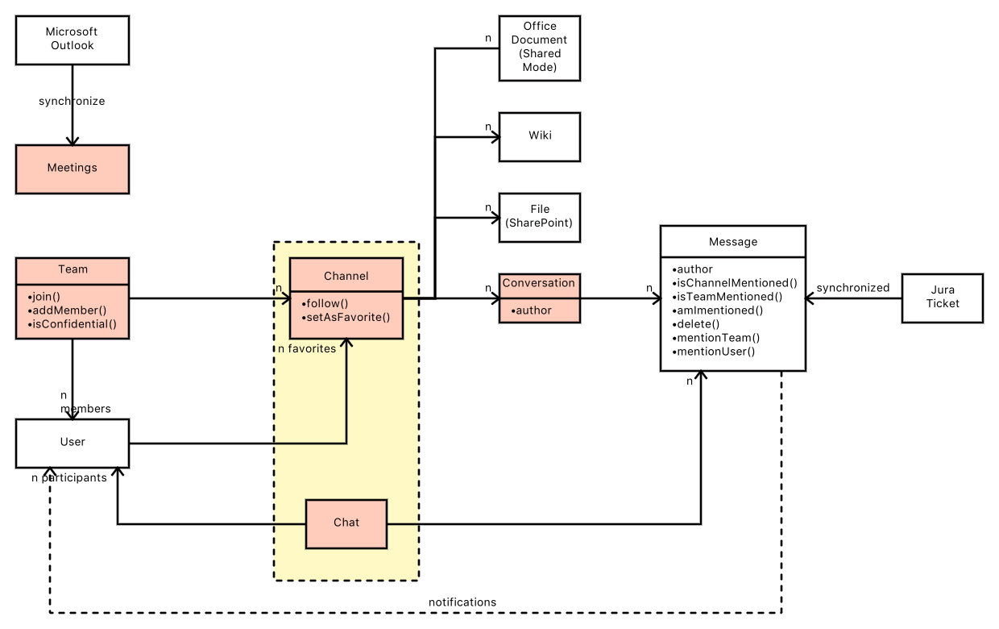

# Microsoft Teams

Bevor ich zu Microsoft Teams steiß hatte ich bereits einige Chat- bzw. Collaboration-Tools kennengelernt wie Slack, Skype, WhatsApp, ...

Was Microsoft Teams besonders interessant macht:

* Integration der gesamten Microsoft Toolsuite
* sehr gutes Conversation-Konzept
  * Chats sind bei vielen Teilnehmern häufig unübersichtlich, weil viele Threads parallel laufen. Das macht es schwierig einem Thema zu folgen. Sicherlich kann man neue Chaträume erstellen oder nur noch in spontanen Gruppen chatten, doch das skaliert irgendwann nicht mehr und man möchte anderen vielleicht auch die Chance geben, allen Diskussionen zu einem Topic zu folgen. Microsoft-Teams hat hier ein sehr gutes Conversation-Konzept

## Konzepte

