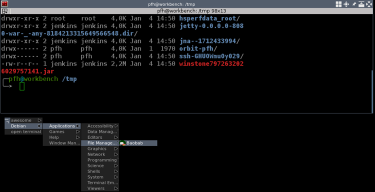

# 4K Monitor

Ich bin seit Jahren Nutzer von 2-3 Monitoren an einem Rechner. Schließlich gab es vor 10 Jahren noch keine 4K Monitore und bisher waren 2 kleine 24 Zoll Monitore mit Full-HD Auflösung auch zu einem Bruchteil des Preises eines guten 4k Monitors zu haben.

Zudem haben (hatten?) viele Betriebssysteme ein Problem mit diesen hohen Auflösungen, da die Schriften nicht ordentlich vergrößert wurden (Stichwort HighDPI Scaling), so daß es kaum möglich war die Schrift unter Icons zu lesen. Mittlerweile hat sich das aber wohl gebessert (hab ich gelesen).

Da ich einen Tiling Window Manager (awesome) unter Linux verwende, würde ich ein solcher Monitor sicherlich exzellent in mein Nutzungsverhalten integrieren lassen.

---

## Größe

### 27 vs. 32 vs. 34 vs. 40 Zoll

* 27 Zoll ist zu klein (auch wenn man die Größe auf 125% oder 150% umstellt) für 4k (bis 2500x ... ist es in Ordnung), das habe ich getestet (und anderen erging es ebenso)
* 32 Zoll bzw. 34 Zoll erscheinen mir perfekt (das habe ich bei einigen Rezensionen so auch bestätigt gesehen)
  * macht hier curved schon Sinn?
  * muß man auf besonders guten seitlichen Blickwinkel achten (z. B. mit einem IPS Display?
* 40 Zoll erscheint mir zu groß, da ich hier den Kopf bewegen müßte bzw. mit den Augen weite Wege zurücklegen müßte - vielleicht wäre dann sogar eine Curved Variante angebracht oder zumindest einer mit besonders gutem seitlichen Blickwinkel

### 32 Zoll

* [LG 32UD59-B - 500 Euro (Stand Mai 2018)](https://www.amazon.de/dp/B0748KJY4Q/ref=psdc_429868031_t1_B075NL1HLG)
* [LG 32UD89-W - 750 Euro (Stand Mai 2018)](https://www.amazon.de/LG-Products-32UD89-W-Monitor-schwarz/dp/B01ND44JR2/ref=sr_1_1?s=computers&ie=UTF8&qid=1525855543&sr=1-1&keywords=lg+monitor+32+zoll&refinements=p_n_feature_two_browse-bin%3A12123586031)
* [LG 32UD99-W - 870 Euro (Stand Januar 2019)](https://www.amazon.de/dp/B01N6ZKF1R/ref=psdc_429868031_t3_B01ND44JR2)
* [LG 32UD59-B - 1000 Euro (Stand Mai 2018)](https://www.amazon.de/LG-32UD59-B-monitor-31-5-viewable/dp/B075NL1HLG/ref=sr_1_2?s=computers&ie=UTF8&qid=1525855912&sr=1-2&keywords=lg+monitor+32+zoll&refinements=p_n_feature_two_browse-bin%3A12123586031&dpID=51cep4bpl2L&preST=_SX300_QL70_&dpSrc=srch)
* [Viewsonic VP 3268-4k - 1000 Euro (Stand Oktober 2018)](https://www.viewsonic.com/us/vp3268-4k.html)

Während man 27 Zoll Bildschirme unter 500 Euro bekommt, verdoppelt sich der Preis bei 32 Zoll fast ... aber die Preise werden ständig sinken.

---

## Auflösung

* 16:9 (3840 x 2160)
* 21:9 (3840 x 1600) - hier macht bei 32/34 Zoll Curved vielleicht Sinn

---

## Anschluß

Ich bin kein Spieler - deshalb sollten mir 60 Hz Bildwiederholrate ausreichen, mehr als 30 Hz sollten es aber sein.

### USB C

4k Monitore werden i. a. über USB-C angeschlossen. Ich nutze einen Dell XPS 15 (2016), der bereits über einen USB-C Ausgang verfügt - derzeit verwende ich noch eine USB3-Docking-Station (für Netzwerkkabel, Tastatur, Maus), die allerdings noch keinen USB-C Support bietet. Viele Monitore bringen schon Docking-Station-Funktionalität mit bzw. erlauben den Anschluss einer Docking-Station, so daß der Monitor per USB-C am Laptop hängt und die Docking Station am Monitor.

> Insofern muß ich die Docking Station nicht austauschen.

Über USB-C kann der Laptop dann i. a. auch geladen werden - allerdings reicht der Ladestrom nicht immer, um den Laptop selbst bei hoher Last noch zu laden (der Verbrauch übersteigt dann die Ladeleistung und das Ladelevel des Akkus sinkt dennoch).

---

## LG 32UD99-W - meine Wahl

Ich habe mich für diesen Monitor entschieden ... toller Monitor, aber die betriebssystemseitige Unterstützung (Microsoft Windows) bzw. für meinen Use-Case (Virtualbox mit Linux VM) ist es noch nicht optimal.

### DPI-Skalierung

Unter Windows habe ich die Skalierung auf 125% geändert, das ist gut. Doch unter Virtualbox sind die Menüs manchmal doch recht klein:

> Zugegebenermaßen in einem älteren Ubuntu (16.04 LTS) und [awesome](awesome.md) als Window-Manager. Außerdem habe ich dem Image nur 128 MB Video RAM zugeordnet ... es gehen wohl auch 256 MB (doch leider nicht über die UI).

Ich kann zwar auch in Virtualbox die Skalierung verändern, doch hatte ich hier den Eindruck, daß es zu Lasten der Responsiveness geht und die Darstellung "Blurry" wird. Diese Tips haben mir nicht geholfen:

* [Microsoft Support - windows-scaling-issues-for-high-dpi-devices](https://support.microsoft.com/en-gb/help/3025083/windows-scaling-issues-for-high-dpi-devices)

Zudem kann man auch im den Unity-Settings eine Skalierung konfigurieren.

Es waren einfach zu viele Optionen und keine hat mich wirklich überzeugt ... letztlich bin ich zunächst mal wieder auf 100% Skalierung in Virtualbox und Unity zurückgekehrt - Windows bleibt bei 125%