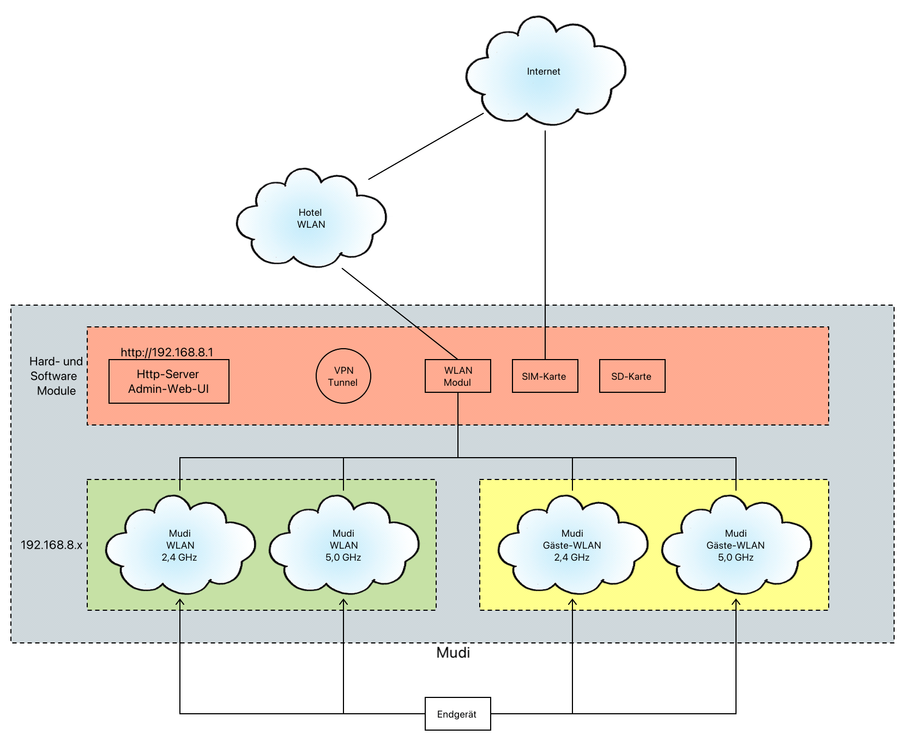

# Mudi - GL-e750

* [Produktinfos](https://www.gl-inet.com/products/gl-e750/)
* [Handbuch](https://docs.gl-inet.com/router/en/3/setup/gl-e750/first_time_setup/)
* [ausführliches Review - YouTube](https://youtu.be/BhKC7rMrj8E)

Ich habe bereits den [GL-AR750S-Ext aka Slate](slate.md) seit 4 Jahren und war von der Professionalität der Software und der Updates sehr begeistert. Nun läuft der Support für dieses Gerät aus und ich liebäugel mit dem Mudi, der aufgrund des integrierten Akkus mobil einsetzbar ist.

> mittlerweile gibt es auch schon V2 dieses Geräts (GL-E750V2), das größere SD-Karten unterstützt (1 GB statt 512 MB - kein wesentlicher Aspekt für mich) und schneller lädt (4 statt 6 Stunden - das ist ein ganz nettes Feature, da der Mudi nach 8-10 Stunden aufgeladen werden will)

Der Mudi ist ein Router, der ein eigenes WLAN zur Verfügung stellt, mit dem sich die Endgeräte verbinden.

---

## Features

* Akku mit 7000mAh
  * 12 Stunden schafft er wenn er kaum benutzt wird
  * kann während der Nutzung aufgeladen werden (z. B. über eine Powerbank)
* Display, das wichtige Infos zu Mudi-WLAN (inkl. Passwort), Akku, Modus, ... anzeigt (nur ein bisschen klein)

### Was mir fehlt?

* eSIM support

### Was verbessert werden könnte?

* Display kaum zu gebrauchen (Helligkeit, Schriftgröße)
* rutschiges Plastikgehäuse
  * Plastik ist in Ordnung ... schliesslich soll das WLAN top sein - rutschig sollte es aber nicht sein
* beim Laden über USB-C wird das Gerät relativ warm ... 63° sagt die Admin-UI
  * die normale Betriebstemperatur liegt bei 40-50°
* Batterie könnte länger halten ... Gewicht wäre mir hier egal (auf 100g kommt es nicht an)
  * mittlerweile lade ich ihn nach intensiver Benutzung einfach einmal auf 100% und fahre ihn denn runter - somit ist er dann beim nächsten Mal auf jeden Fall einsatzbereit

---

## Inbetriebnahme

### Erst-Inbetriebnahme

> **ACHTUNG:** Die Admin-WebUI http://192.168.8.1 zum Mudi funktioniert nur, wenn man das WLAN des Mudi verwendet. Wenn man also im Heimnetzwerk mit dem Haim-WLAN ist, muss man das WLAN wechseln. Der Mudi verwendet den WLAN-Namen `GL-E750-xxx`.

* aufladen
* 3-5 Sekunden zum Booten auf den Push-Button drücken
* wenn man eine SIM-Karte drin hat, dann zeigt das Display "PIN Code eingeben" an ... das kann man ignorieren - der Mudi hat ja keine Tasten
  * wenn man die PIN bereits im Web-Admin-UI konfiguriert hat verschwindet die Anzeige später (wenn die Initialisierung durch ist)
* mit dem speziellen WLAN des Mudi und dem WLAN-Schlüssel `goodlife` verbinden
* im Webbrowser http://192.168.8.1 verbinden
* **SICHERES** Admin-Passwort vergeben
* Grundeinrichtung über die Web-Admin-UI
  * Mudi-WLAN-Namen ändern (2,4 / 5 GHz + Gäste-WLAN) und **SICHEREN** WLAN-Schlüssel setzen
    * es wird empfohlen bei "TX Power" statt "Maximum" nur "Hoch" zu verwenden ... das spart Batterie
    * als "Kanal" verwende ich "auto"
  * Internet-Verbindung konfigurieren
    * Repeater Modus ... am besten damit starten
    * Tethering
    * SIM
    * Kabel
  * Firmware upgrade
  * Timezone setzen
* SIM-Karte einsetzen ... [nicht ganz einfach siehe YouTube-Video](https://www.youtube.com/watch?v=l9dxJUL7lhA)
* Reboot
* SIM-PIN eingeben über die Web-Admin-UI

### Zweit-Inbetriebnahme

Nach einigen Wochen habe ich das 5 GHz WLAN nicht mehr finden können, obwohl es weiterhin eingeschaltet und als "sichtbar" gekennzeichnet war. Das 2,4 GHz WLAN war auch nicht mehr sichtbar, doch das konnte ich dann manuell am iPhone mit der SSID konfigurieren.

Deshalb habe ich mich entschlossen, den Mudi auf Werkseinstellungen zurückzusetzen und neu - diesmal - mit der Gli-Net App vom iPhone zu konfigurieren.

Diesmal hat die automatische Erkennung des Mobilfunkproviders (O2) nicht funktioniert. Ich habe denn googeln müssen, welche Werte ich konfigurieren muss (und auch das hat nicht auf Anhieb funktioniert):

    * 3G
    * PIN
    * PAP ohne username Passwort
    * TTL ... durfte nicht leer sein, sonst konnten man nicht speichern

Ich bin mir nicht sicher, ob die Problem nur mit der GLI-NET App bestehen oder grundsätzlicher Art sind. Sollte letzteres der Fall sein, wäre das natürlich immer dann ein Problem, wenn man häufig die SIM-Karte wechseln müßte (um beispielsweise einen lokalen Provider im Ausland zu nutzen).

### Dritt-Inbetriebnahme

Wieder ein paar Wochen später habe ich - mal wieder das 5 GHz WLAN nicht gesehen - aber viel schlimmer manchmal auch nicht das 2,4 GHz nicht und wenn, dann hat die SIM-Karte nicht funktioniert. Das nervt mich jetzt doch ein bisschen. Die Konfiguration könnte ich über die iPhone App auch gar nicht sehen ... war nur ein grauer Kasten. Also wieder Reset auf Werkseinstellungen (Reset-Button hinter der Abdeckung 10 Sekunden drücken - dann erfolgt der Reboot).

> Die Firmware war aktuell - die WLANs eigentlich als "sichtbar" konfiguriert.

Diesmal hat die automatische Erkennung des Mobilfunkproviders (O2) wieder funktioniert.

Der Mudi ist in 10 Minuten (ich nutze nur wenige Features) wieder eingerichtet ... ärgerlich ists trotzdem und wer mehr Zeit in seine Konfiguration investiert hat wird sich noch mehr ärgern.

### Stand-By

Durch Drücken der Taste für 3 Sekunden kommt der Mudi in einen Standby-Mode (zeigt er auch auf dem Display an). In diesem Modus ist er via WLAN nicht erreichbar - er muss erst wieder aufgeweckt werden (3 Sekunden drücken).

Ausschalten durch 5 Sekunden drücken ... statt 3 Sekunden.

### Werkseinstellungen Reset

Entfernt man die Klappe an der Rückseite des Geräts (dort wo die SIM-Karte sitzt), dann hat man Zugriff auf die "Reset"-Taste, die man für 10 Sekunden mit einem spitzen Gegenstand drücken muss. Danach sollte der Mudi mit Werkseinstellungen neu starten, d. h.

* das WLAN heisst auch wieder `GL-E750-xxx` und das Passwort ist `goodlife`
* der Admin User hat das Passwort `goodlife`

> Die zuletzt installierte Firmware bleibt natürlich erhalten - Updates seit der Geräteauslieferung müssen also nicht nochmals installiert werden.

### Probleme

* Firmware-Aktualisierung von 3.211 auf 3.217 war über die Click-Download-Methode nicht möglich ... man kann den Download Button drücken, es passiert aber nichts
  * über [Firmware-Download](https://dl.gl-inet.com/?model=e750) habe ich mir die Latest Stable Version runtergeladen (tar) und dann über "Lokale Aktualisierung" installiert. Anschließend hat es eine Weile gedauert 1-2 MInuten bis die mobile Datenverbindung wieder nutzbar war.

---

## Booting

* der Bootvorgang dauert ca. 2 Minuten
* konfiguriert man ein **neues** Repeater-WLAN, so erfolgt eine kurze Unterbrechung der WLAN-Verbindung
  * schaltet man den Repeater-Modus auf ein bereits bekanntes WLAN um, so ist die Unterbrechung nicht oder kaum wahrnehmbar

---

## Performance

### O2 Data SIM

* ohne VPN
   * im Wohnzimmer (generell schlechte Mobilfunk-Verbindung - baulich bedingt)
     * 2 MBit/s
     * ping 60 ms
     * selbst normales Surfen nicht angenehm
   * im Arbeitszimmer
     * 7 - 15 MBit/s
       * akzeptabel aber bei weitem keine versprochenene LTE-Geschwindigkeit
     * ping 40 ms
     * normales Surfen in Ordnung ... YouTube bis 720p gut - bei 1080p Aussetzer

Ich schätze O2 hat **hier** einfach nicht das beste Netz.

### Repeater Modus

* ohne VPN
  * 44 MBit/s (DSL 100 MBit)
    * im Down- und Upload
    * im WLAN, das ich im Mudi verwende habe ich 90 MBit/s
      * der Mudi hat keine Top-Performance aber sehr brauchbar
  * Ping 12 ms

---

## Batterie-Laufzeit

### YouTube Video

* via WLAN 2,4 GHz
* Video mit 720p
* Temperatur kanpp 50° C
* innerhalb von 60 Minuten Batterie von 34% auf 23% gesunken

### Standby

* 60 Minuten Standby: 22% => 16%
* nachts im Standby (10 Stunden) ... 90% => 75%

### Aufladen

* Powerbank: 2:20 Stunden für 45% (während er gelaufen ist - nicht im Standby) => ca. 20% pro Stunde
* USB-Ladegerät: kein Unterschied zur Powerbank
* mitgelieferten Ladegerät: ???
* es spielt keine Rolle, ob Mudi im Standby-Mode oder im Running-Mode ist

---

## GL-iNet App iOS

* [iOS App glinet](https://apps.apple.com/de/app/glinet/id1523245996)

Diese App rundet den sehr guten Eindruck ab. Sie ist sehr praktisch, um schnell mal ein neues WLAN zu konfigurieren oder auch einen QR-Code für das Gäste-WLAN bereitzustellen.

---

## Anwendungsfälle

Der Mudi bietet Internetzugang über folgende Modi

* WLAN-Repeater (aka WLAN-Access-Point)
  * Internet über das WLAN eines Hotels oder anderes öffentliches WLAN
  * Tethering über ein Handy funktioniert in diesem Modus **NICHT**
* SIM-Karte
  * hierzu bedarf es einer SIM-Karte, die im Gerät steckt
* USB-Tethering
  * die Internetverbindung eines Telefons wird per Tethering zur Verfügung gestellt ... das Handy muss per USB an den Mudi angesteckt werden und am Handy muss das Tethering konfiguriert werden
* Netwerkkabel
  * der Mudi liefert einen USB-Adapter mit, der einen RJ45-Anschluss (normales Netzweerkkabel) bereitstellt. Der Adapter hat einen eigenen USB-Anschluss, so daß man keinen USB-Anschluss (Laden des Geräts, USB-Tethering) verliert

Ich möchte mobil arbeiten (vielleicht sogar mal mit dem Wohnmobil oder im Ferienhaus von unterwegs arbeiten), also tatsächlich Videokonferenzen von unterwegs und Java/Docker-Builds machen (Download großer Datenmengen ... Netzwerk- und Internetbandbreite ist hier entscheidend) ... nahezu so wie von zuhause. Ausserdem möchte ich meiner Familie (m)eine grosse Datenkarte zur Nutzung zur Verfügung stellen, ohne dass JEDER einen großen Vertrag haben muss.

### Anwendungsfall Internet-Fail-Over

Gelegentlich kommt es vor, dass das Internet langsam ist oder nur unzuverlässig funktioniert. In dem Fall nutze ich den Mudi gerne als Ersatz (mit einer günstigen Daten-SIM-Karte) - das kann mir auch dabei helfen, das Problem einzugrenzen (liegt es an meinem Endgerät oder dem Router/Provider).

Auf diese Weise könnte ich auch leichter mal einen Provider-Wechsel überstehen oder den Wechsel von DSL auf Glasfaser nahtloser gestalten.

### Anwendungsfall WLAN-Access-Point

In diese Modus verwendet man ein externes WLAN (vom Hotel, Campingplatz, Cafe, ...) für den Zugang ins Internet.

Natürlich kann man das WLAN auch in jedem Endgerät einstellen, doch wenn man viele Endgeräte hat (Laptops, mehrere Handys und Tablets, FireTV-Stick, eBook-Reader, Navigationssystem), dann ist es einfach eine einzige Konfiguration im Mudi zu ändern und die anderen Endgeräte bleiben einfach im Mudi-WLAN. Das ist sehr komfortabel.

Ein besonderes Goody ist die VPN-Verschlüsselung im Mudi. Auf diese Weise kann man über ein unsicheres (= offenes oder unbekanntes) WLAN ins Internet gehen, aber dennoch vollkommen sicher, da die Verbindung im Mudi über ein VPN abgesichert wird. Man kann natürlich auch VPN in den Endgeräten (Handy, Tablet, Laptop, ...) konfigurieren. Das ist dann allerdings mehrfacher Aufwand und natürlich braucht man dann auch mehr VPN-Lizenzen (=> Kosten).

> **ACHTUNG:** hierzu braucht man einen VPN-Anbieter, der das OpenVPN- oder Wireguard-Prookoll unterstützt. Siehe Details im Abschnitt VPN-Tunnel.

### Anwendungsfall SIM-Daten-Karte

Wir haben eine O2-Karte verwendet ... sobald wir wieder in der Reichweite eines konfigurierten Repeater-WLANs waren hat der Mudi automatisch umgeschaltet. Das war sehr komfortabel. 

### Anwendungsfall VPN Tunnel

Der VPN Tunnel kann in allen Internet-Access-Modi Sinn machen, da man hierüber neben der Verschlüsselung auch die Möglichkeit hat eine IP-Adresse eines bestimmten Landes zu nutzen und so vorzugaukeln man sein in Deutschland oder den USA.

In Europa braucht man das für die großen Streaming-Dienste wie Netflix, Prima, Sky, DAZN, ... nicht, da die Inhalte i. a. nicht dem Geoblocking unterworfen sind. Für die Mediatheken und YouTube o. ä. braucht man es gelegentlich, da die Inhalte aus rechtlichen Gründen nur in Deutschland zur Verfügung stehen dürfen.

> Ein Beispiel: während die ZDF Mediathek ohne VPN problemlos in Frankreich funktioniert hat, wurde das Frauen-WM-Spiel Deutschland vs Südkorea (WM 2023) geblockt. Nach der Erstellung eines VPN-Tunnels über einen deutschen VPN-Server konnten wir das Spiel schauen.

Dieser Aspekt ist nicht nur für Urlauber interessant. Manche Inhalte (z. B. American Football) kann man nur in den USA empfangen. Mit einem VPN-Server in den USA ist das kein Problem mehr.

Der Mudi hat eine Extra-Schieberegler, den man mit einer Aktion belegen kann. Ich habe hier die VPN "on vs off" Belegung konfiguriert, so dass ich entscheiden konnte, ob mit VPN oder ohne gearbeitet wird.

**OpenVPN-Protokoll:**

Dieses Standard-Protokoll benötigt mehr Ressourcen als das neue Wireguard-Protokoll. Insbesondere in Endgeräten mit wenig Rechenpower (wie dem Mudi) ist das ein klarer Nachteil.

> Performance-Vergleich laut Mudi-Produktseite: OpenVPN erreicht maximal 10 MBit/s - Wireguard erreicht 50 MBit/s. 10 MBit/s reichen natürlich vollkommen aus für 2-3 Streams. Dann ist das Gerät aber am Anschlag während es mit Wireguard 10 Streams liefern könnte. Vielleicht nicht für jeden ein Problem - ABER: der Mudi bietet noch weitere Funktionen (z. B. normales Internet-Surfen, Fileserver), die dann natürlich auch beeinträchtigt werden, wenn ein OpenVPN-Stream läuft. Zudem verbraucht das Gerät dann mehr Strom und der Akku ist schneller leer.

Die Unterstützung von OpenVPN ist dennoch die beste ... es ist DAS Standard-Protokoll der VPN Anbieter. Die Einrichtung ist denkbar einfach:

* beim VPN-Anbieter anmelden
* VPN-Server auswählen und Konfigurationsdatei runterladen
* Konfigurationsdatei in den Mudi im Abschnitt OpenVPN hochladen

**Wireguard-Protokoll:**

Wireguard ist mittlerweile etabliert und Anbieter wie [ovpn.com](https://ovpn.com) unterstützen es genauso komfortabel wie OpenVPN.

Bei NordVPN ist das leider nicht der Fall, da sie ein proprietäres Wireguard-Protokoll verwenden (das Produkt dazu heisst NordLynx). Hierzu müsste man auf dem Mudi eine Linux-Package installieren - das ist mir zu umständlich ... deshalb scheidet NordVPN derzeit aus.

Die FritzBox unterstützt neuerdings auch Wireguard ... eine gute kostenlose Alternative, wenn der Upload über ausreichend Bandbreite verfügt.

### Anwendungsfall USB-Tethering

Vielleicht kann das Sinn machen, wenn man keine SIM-Datenkarte im Mudi hat oder das Datenvolumen bereits verbraucht ist. Dann kann man vielleicht das Datenvolumen eines Handys verwenden. Im Notfall ist das vielleicht eine Option ... besonders komfortabel (und mobil) ist das dann aber nicht.

### Anwendungsfall File-Server

Die im Mudi befindliche SD-Karte kann man als Netzwerkspeicher über smb://192.168.8.1 freigeben und in den Endgeräten verwenden.

Ich habe länger überlegt welche Anwendungsfälle mir da einfallen, da ich

* auch genügend Online Speicher habe
* ein altes Synology-NAS verwenden könnte

Ich könnte mir vorstellen, dass man den Mudi für offline Backups beispielsweise von Fotos (Handy, Kamera) verwendet (hier möchte man das kostbare Mudi-SIM-Datenvolumen vielleicht nicht opfern).

Über die [iOS PhotoSync](https://apps.apple.com/de/app/photosync-fotos-%C3%BCbertragen/id415850124) App könnte man das in der Pro-Version (30 Euro einmalig) umsetzen. Auf diese Weise könnte ich vielleicht sogar Bilder automatisch von der Kamera auf den Mudi syncen und von dort automatisch in die Cloud hochladen.

---

## SIM-Daten-Karten

[siehe "Mobiles Internet"](mobiles-internet.md)

---

## Fazit

### August 2023

Nach 3 Wochen intensiver Nutzung mit 36 GB Datentransfer (SIM-Karte, Repeater, VPN, SD-Karte, viele Endgeräte, Streaming - ) bin ich sehr begeistert von diesem Gerät. Nur die WLAN-Stärke könnte besser sein (Wifi 6 wäre super). Mit eSIM-Support würde noch ein weiterer Anwendungsfall hinzukommen und das Gerät perfektionieren.

Mit 200 Euro (im Sale 170 Euro) ist das Gerät kein Schnäppchen, aber man erhält ein professionelles Gerät, das den Komfort im mobilen Einsatz deutlich erhöht. Kein MUSS aber ein Super-AddOn.

### Dezember 2023

Zuletzt habe ich den Mudi seltener genutzt und er war meistens aus. Wenn ich ihn dann brauchte, hat er zu häufig wegen oben beschriebener WLAN-Nicht-Auffindbar-Probleme nicht funktioniert. Das hat mich schon genervt. In den nächsten Wochen werde ich dem Problem mal auf den Grund gehen.