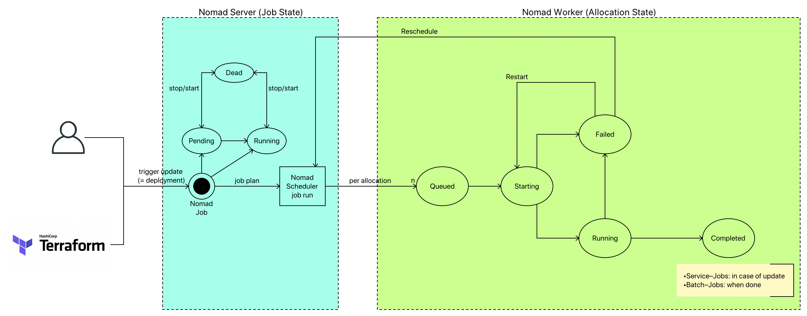

# Nomad by HashCorp

* [Homepage](https://www.nomadproject.io/)
* [Getting Started](https://learn.hashicorp.com/nomad)
* [Glossar](https://nomadproject.io/docs/internals/architecture/)

Nomad ist ein weiteres Tool aus dem Sortiment von HashiCorp. Es wird als Scheduler für Services (gestartet über einen sog. [Driver](https://www.nomadproject.io/docs/drivers/index.html)) verwendet. Einfacher ausgedrückt: hiermit werden Prozesse auf Worker-Maschinen gestartet. Nomad sorgt für die Überwachung der Services und sorgt - unter Zuhilfenahme der Job-Defintion - für eine hohe Verfügbarkeit ... im besten Fall für Zero-Downtime.

Nomad sorgt auch selbständig dafür, daß die gewünschte Anzahl an Service-Knoten läuft, indem es kontinuierlich einen HealthCheck macht und bei Bedarf neue Knoten startet. Außerdem werden die Services auf Knoten gestartet, die die notwendigen Voraussetzungen (Betriebssystem, Ressourcen, ...) erfüllen.

Sowohl Nomad Server als auch Nomad Clients/Worker werden in Produktiv-Szenarien auf verschiedene Regions verteilt (z. B. AWS: Availability Zones). Auf diese Weise wird die Verfügbarkeit verbessert.

Beim Rollout einer neuen Version bietet Nomad in der [Job Stanza](https://www.nomadproject.io/docs/job-specification/update.html) Unterstützung für

* Blue/Green Deployments
* Rollling Deployments
* Canary Deployments

> BTW: Nomad verwendet sehr ähnliche Konzepte wie bei [Terraform](terraform.md) ... auch ein HashiCorp Produkt.

> ACHTUNG:
> * in Nomad werden können Konfigurationen von höheren Ebenen (Job => Task) vererbt werden, d. h. die `reschedule` Stanza vom Job wird auf die alle `group`s vererbt. Wenn dann auf Group-Ebene auch eine `reschedule` Stanza definiert ist, dann werden die beiden gemergt.
> * ist eine notwendige Information nicht explizit spezifiziert, dann werden sinnvolle kontextabhängige Defaults verwendet, die in der Dokumentation zu finden sind
> Die komplette Job-Definition (sog. Effective-Job-Edscription) kann man dann von Nomad abfragen (per CLI oder aber auch im Web-UI). In der UI kann man auch sehen welche Änderungen am Job gemacht wurden.

---

## Architektur und Konzepte

* [Nomad Dokumentation - Architektur](https://www.nomadproject.io/docs/internals/architecture.html)
* [Nomad Dokumentation - Scheduling](https://www.nomadproject.io/docs/internals/scheduling.html)

Nomad besteht aus

* Nomad Server Cluster (Empfehlung: mind. 3 Knoten)
  * Gehirn der Orchestrierung (Nomad Scheduler)
  * erhalten Aufträge als Jobs per Nomad CLI oder Rest-API (z. B. auch von [Terraform](terraform.md))
  * interpretiert den Nomad Job und verteilt die Aufgaben auf die Nomad Client Agents, die es dann lokal ausführen
  * es gibt einen sog. Leader unter den Cluster Knoten, die anderen nennt man Follower
    * "The leader is responsible for processing all queries and transactions. Nomad is optimistically concurrent, meaning all servers participate in making scheduling decisions in parallel. The leader provides the additional coordination necessary to do this safely and to ensure clients are not oversubscribed." ([siehe hier](https://www.nomadproject.io/docs/internals/architecture.html))
  * Cluster Nodes natürlich auf verschiedene Datacenter verteilt, um entsprechende Ausfallsicherheit zu garantieren
* Nomad Client Agent
  * registrieren einen Nomad Client (aka Worker) beim Nomad Server Cluster und informieren regelmäßig über
    * Hardware Ressourcen
    * zur Verfügung stehende Driver (z. B. Docker)
  * führt die `tasks` der Jobs (mit dem `driver` als Controller lokal aus)  * berichtet über die verfügbaren Resourcen und die laufenden Services
  * aktualisiert u. U. Loadbalancer
* Region -> Nomad Server Cluster -> Nomad Server (verteilt auf unterschiedlicher Datacenter)
  * Föderation zwischen Regionen sind möglich
  * "Regions are fully independent from each other, and do not share jobs, clients, or state. They are loosely-coupled using a gossip protocol, which allows users to submit jobs to any region or query the state of any region transparently. Requests are forwarded to the appropriate server to be processed and the results returned. Data is not replicated between regions." ([siehe hier](https://www.nomadproject.io/docs/internals/architecture.html))

### Ports

Das sind die Standardports von Nomad Server und Client:

* 4646:
  * WEB UI (e. g. http://myserver:4646/ui)
  * REST interface (e. g. http://myserver:4646/v1/agent/health?type=server)
* 4647
  * Nomad Server RPC Check
* 4648
  * Nomad Server Serf Check

### Consul Integration

* [Doku](https://nomadproject.io/guides/integrations/consul-integration/)

Da Nomad Services startet/stoppt ist eine Integration mit eine Service-Registry wie Consul absolut sinnvoll, denn letztlich will man als Client eines Service nicht eine spezielle Instanz addressieren, sondern im besten Fall einen Proxy adressieren, der dann seinerseits den Request an eine Instanz weiterleitet. Nomad bringt kein Consul mit, kann aber über Konfiguration

* [der Nomad-Server](https://nomadproject.io/docs/configuration/consul/)
  * die Consul-Integration funktioniert auf diesem Level allerdings schon out-of-the-box, wenn auf dem Nomad-Server auch der Consul-Agent läuft (den Consul-Token in `/etc/nomad.d/config.hcl` muß man aber wahrscheinlich noch anpassen):

    > "A default consul stanza is automatically merged with all Nomad agent configurations. These sane defaults automatically enable Consul integration if Consul is detected on the system. This allows for seamless bootstrapping of the cluster with zero configuration. To put it another way: if you have a Consul agent running on the same host as the Nomad agent with the default configuration, Nomad will automatically connect and configure with Consul. [...] An important requirement is that each Nomad agent talks to a unique Consul agent. Nomad agents should be configured to talk to Consul agents and not Consul servers. If you are observing flapping services, you may have multiple Nomad agents talking to the same Consul agent. As such avoid configuring Nomad to talk to Consul via DNS such as consul.service.consul" ([Dokumentation](https://nomadproject.io/docs/configuration/consul/))

* [der Nomad-Jobs](https://nomadproject.io/docs/job-specification/task/) - hier am Beispiel eines Docker-Service, der eine Spring-Boot-Applikation bereitstellt):

    ```hcl
    service {
      name = "myservice"

      # über "urlprefix" erfolgt die Definition wie der Service anzusprechend ist
      tags = ["myservice", "urlprefix-/myservice proto=https tlsskipverify=true"]

      port = "https_port"
      address_mode = "host"

      check {
        name = "myservice - health"
        type = "http"
        protocol = "http"
        port = "management_port"
        path = "/actuator/health"
        interval = "10s"
        timeout = "4s"
      }

      check_restart {
        limit = 3
        grace = "90s"
      }
    }
    ```

    * Consul wird in diesem Fall mit dem Health-Check beauftragt - ist ein Restart notwendig, so kommuniziert Consul mit Nomad, der dann seinerseits den Restart der Task veranlaßt.

### Automatic Clustering with Consul

> "Nomad servers and clients will be automatically informed of each other's existence when a running Consul cluster already exists and the Consul agent is installed and configured on each host" ([Dokumentation](https://nomadproject.io/guides/integrations/consul-integration/))

Auch hier wird deutlich, daß Nomad und Consul ein echtes Dream-Team (nahtlose Integration ohne Konfiguration) sind :-)

### Vault Integration

* [Doku](https://nomadproject.io/guides/integrations/vault-integration/)
  * [meine eigene Vault-Einführung](vault.md)
* Nomad braucht einen Vault-Token (den Consul-Token in `/etc/nomad.d/config.hcl`)
  * in Spielumgebungen kann man auch den `root`-Token eintragen
  * besser ist es einen Role-Based-Token mit eingeschränkten Permissions zu verwenden - hierzu muß man
    * ein Policy-File `my-nomad-server-policy.hcl` erstellen
    * in Vault per `vault policy write nomad-server my-nomad-server-policy.hcl` registrieren
    * eine Token Role (mit der Berechtigungen) erstellen
    * ein Token erzeugen

---

## Verfügbare Resourcen

Der Nomad Server Node muß wissen welche Target Nodes für die Ausführung von Aufgaben zur Verfügung stehen. Hierzu informiert der Nomad Client Agent kontinuierlich über die tatsächlich verfügbaren Resourcen (CPU, Speicher, Network-I/O, Plattenplatz, ...). Steht dann eine Aufgabe an, dann kann der Nomad Server einen passenden Target Node auswählen.

---

## Start Services auf Worker Maschinen

Für den Start eines Services auf einer Nomad Client Maschine (= Nomad Worker) stehen verschiedene [Driver](https://www.nomadproject.io/docs/drivers/index.html) zur Verfügung:

* Docker
  * derzeit (April 2019) kann Nomad **unter Windows** keine Docker-Linux container starten
* Java
* ...

Der Nomad-Job definiert Anforderungen an die einzuhaltenden Constraints.

---

## Jobs

Jobs sind die Schnittstelle des Anwendungsentwicklers zu Nomad. Einige Teile der Job-Defintion sind für den Nomad-Server relevant (z. B. `update`-Stanza), andere hingegen für den Nomad-Worker (z. B. `check_restart`). Der Job stellt Anforderungen an den Ausführungsplan des Schedulers, um bestimmte Eigenschaften des Deployments sicherzustellen.

Ein Job Skeleton kann per `nomad job init` erzeugt werden. Per `nomad job run my-job.nomad` wird ein Job per `nomad`-CLI ausgeführt.

> [Terraform](terraform.md) kann auch zur Ausführung eines Nomad-Jobs eingesetzt werden.

### Beschreibung

Die Beschreibung erfolgt in der [HashiCorp Configuration Language (HCL)](https://github.com/hashicorp/hcl) oder in JSON (ist aber schlechter lesbar).

> ACHTUNG: man muß nicht alles definieren bzw. manche verwendeten Definitionen sind im expliziten Job nicht sichtbar, weil Nomad Default-Konfigurationen annimmt (wenn diese nicht explizit überschrieben werden. Das macht erhöht die Lesbarkeit eines Job-Files nicht unbedingt ... Im Nomad-UI (das wirklich intuitiver sein könnte) wird die **VOLLSTÄNDIGE** Job-Spezifikation in JSON angezeigt.

Aufbau:

> Job-Datei -> ein Job ->* group -> Evaluation -> Allocation ->* task

es wird der gewünschte Zustand beschrieben - Nomad ermittelt daraus in der Planungsphase die tatsächlichen Aktionen im Vergleich zum aktuell laufenden Setup. Sollte ein Service unhealthy werden (über einen im Job definierten Health-Check - kann unterschiedlich komplex sein - bei Spring Applikationen bietet sich die Actuator Health Endpoint an), den der Service anbieten muß), dann triggered Nomad automatisch ein Deployment.

Im Job werden die notwendigen Ressource-Anforderungen (Hardware, Architektur, Software (Betriebssystem, Kernel, Driver)) für einen Service definiert ... das ermöglicht dem Nomad Server einen passenden Nomad Client (= Worker) zu finden und mit einer Task zu beauftragen. Der Worker verwendet eine sog. Allokation, um die Task abzuarbeiten - ist die Task fertig, dann wird die Allokation gelöscht.

* [kleines Beispiel](https://www.nomadproject.io/docs/job-specification/index.html)
* [`job`](https://www.nomadproject.io/docs/job-specification/job.html)
* [`update`](https://www.nomadproject.io/docs/job-specification/update.html)
  * Canary Deployments ... zeichnen sich dadurch aus, daß eine weitere Instanz gestartet wird ... zusätzlich zu den existierenden. Wenn die Canary Instanz für gut befunden wurde (siehe `health_check` Property), dann erfolgt ein Rolling Update
* `group`
  * ["The group stanza defines a series of tasks that should be co-located on the same Nomad client. Any task within a group will be placed on the same client."](https://www.nomadproject.io/docs/job-specification/group.html)
  * jede Task-Group hat eine entsprechende Allokation auf der zum Job-Ausführungszeitpunkt ausgewählten Nomad-Client
* `task`
  * kleinste ausführbare Einheit
  * wird von einem `driver` ausgeführt (z. B. Docker, Java, Exec)
  * über `service` erfolgt die [Integration mit Consul](https://nomadproject.io/guides/integrations/consul-integration/) (wobei Consul separat betrieben werden muß)

Für jede Service-Instanz wird eine eigene Allokation erzeugt, d. h. zur Ausführungszeit werden aus einem Job 1-n Allokationen, die auf den Nomad-Workern ausgeführt werden. Hinter jedem laufenden Service steht eine Allokation.

### Ausführung

Nomad Jobs werden explizit durch den Admin (per `nomad job plan my-job.nomad`) oder durch Nomad selbst (wenn ein Service nicht mehr erreichbar ist ... hierzu benötigt der Service entsprechende Health-Check Services) geplant (sog. Evaluation), d. h. hier wird ermittelt, welche Aktionen (sog. Allocation ... auf den Nomad-Clients kann man die Allocation-Logs auf dem Filesystem ansehen) auszuführen sind. Beispiel:

> Ein Service soll nun mit 3 Instanzen bereitgestellt werden (ist jetzt so im Job geändert worden). Derzeit laufen aber nur 2.

In diesem Fall würde in dem Plan ermittelt, daß eine weitere Instanz zu starten ist.

Den Evaluation-Plan macht der sog. Evaluation Broker - ein Scheduler, der den fertigen Plan (enthält auch schon die zu nutzenden Worker Nodes) zum Leading Nomad Server zwecks Ausführung schickt. Bis hierher wurden noch keine Resourcen reserviert, d. h. es kann vorkommen, daß Evaluation Plans erstellt wurden, die im Konflikt stehen. Dieses optimistische Planing wird vom Leading Nomad Server aufgelöst ... entweder kommen dann Pläne nur teilweise oder gar nicht zur Ausführung. Vor der Ausführung eines Jobs via `nomad job run my-job.nomad`, sollte man den Plan generieren lassen und prüfen.

Der Evaluation-Plan wird anschließend zu einem oder mehreren (meherere - wenn auf mehreren Knoten ein Prozess gestartet werden soll) Nomad-Workern zwecks Ausführung geschickt ... nach Ausführung steht die Allocation zur Verfügung. Unter `/var/lib/nomad/alloc` auf dem Worker-Node findet man die Allokationen des Jobs. Hier sind u. a. auch Log-Files zu finden. Teilweise werden hier auch Ressourcen bereitgestellt, die dann beispielsweise in Docker-Containern als Mounts zur Verfügung gestellt werden.

#### Nomad Status Konzept

Nomad kennt Status auf vielen Ebenen: Job, Task, Allocation, ...

Leider werden diese Status und deren Transitionen in der offiziellen Dokumentation nicht erklärt, so daß folgende Aufstellen meinem Reverse-Engineering entsprungen ist:



* Allokation
  * running
  * pending
    * bedeutet, daß die Allokation nicht ausgeführt werden kann
    * die Gründe hierfür sind vielfältig
  * dead

### Rollout Jobs

* [Update Stanza](https://nomadproject.io/docs/job-specification/update/)

Beim Rollout einer neuen Version (Rolling-Deployments, Canary-Deployments) sind die Abbruchkriterien evtl. andere ... und die Folge-Aktionen (z. B. Rollout) sind evtl. auch andere. Diese Eigenschaften werden in `update` definiert.

Nomad unterstützt verschiedene Rollout-Strategien (definiert in der `update`-Stanza):

* [Rolling](https://learn.hashicorp.com/nomad/update-strategies/rolling-upgrades)
  * nacheinander werden die
* [Blue Green](https://learn.hashicorp.com/nomad/update-strategies/blue-green-and-canary-deployments)
* [Canary](https://learn.hashicorp.com/nomad/update-strategies/blue-green-and-canary-deployments)

### Rollout Worker Nodes

* [Workload Migration Guide - UNBEDINGT LESEN](https://learn.hashicorp.com/nomad/operating-nomad/node-draining)
* [Video über Drain](https://youtu.be/AKgWY0_TxYw)

Das wichtigste Ziel von Nomad ist die Zusicherung von Zero-Downtime. Aus diesem Grund werden Services auf ihre Gesundheit überwacht. Beim Rollout einer neuen Version begibt man sich wissentlich in eine gefährliche Situation ... Services werden abgeschaltet - die alten Versionen. Somit ist der Rollout eine kritische Situation, der man mit guten Strategien begegnen muß.

Beim [Nomad Node Drain](https://consul.dev-onprem-eu-central-fra.tis.loc/ui/dev-onprem-eu-central-fra/nodes) werden

* Services von einem zu löschenden Nomad-Worker evakuiert/migriert
* keine neuen Allokationen auf dem Worker mehr zugelassen ([Node Eligibility](https://nomadproject.io/docs/commands/node/eligibility/))

, um den Worker langsam aus der Nutzung zu entlassen und dann problemlos zu stoppen. Über die CLI wird der Drain per `nomad node drain <NODE_ID>` ausgelöst. Im Hintergrund wird der Knoten als Orchestrierungs-Target entfernt. Das Kommando wird von der [`migrate`-Stanza](https://nomadproject.io/docs/job-specification/migrate/) beeinflußt. Wenn es fehlt, dann werden mehr oder weniger sinnvolle Defaults verwendet ... EMPFEHLUNG: drüber nachdenken, ob die Defaults passen. Die Allocation-ID's bleibt auf dem neuen Knoten scheinbar die gleiche ... vielleicht Nomad-interne Optimierung dieses Prozesses.

Beim Drain kann es natürlich passieren, daß etwas schiefgeht (z. B. nicht genügend Nomad-Worker, um die Services aufzunehmen). Im schlimmsten Fall sorgt man - aufgrund fehlschlagender Health-Checks nach der Migration auf einen anderen Knoten - für weitere Reschedulings, die dann wieder Last erzeugen. Im besten Fall sorgt man für ausreichend Nomad-Worker (z. B. erst einen neuen Knoten starten bevor man einen alten Knoten drained). Nach einer gewissen Deadline werden die Allocations eines drained Nodes einfach gestoppt - auch wenn noch keine erfolgreiche Umverteilung stattgefunden hat.

> ===> trotz `migrate`-Strategie kann es zu Downtime des Service kommen ... hier sollte man alles dransetzen, um die Root-Cause zu zu beheben

Muß man mehrere Nomad Worker drainen (z. B. Rollout einer neuen OS-Version aller Nomad-Worker), dann sollte man verhindern, daß Services auf Knoten umverteilt werden, die anschließend auch drained werden sollen - sonst entsteht unnötige Last. In einem solchen Fall markiert man alle Knoten als `ineligible` (`nomad node eligibility -disable 46f1`), die ausgetauscht werden sollen. Denkt man diesen Ansatz zuende, so muß man den Austausch aller Worker folgendermaßen umsetzen:

* genügend neue Worker erstellen
* alle alten Worker als `ineligible` markieren
* alte Worker (nacheinander) drainen

[Hier](https://learn.hashicorp.com/nomad/operating-nomad/node-draining) ist ein noch komplexeres Beispiel beschrieben - "Migrating datacenters".

### Task Verteilung - Placements

* [Group Stanza](https://nomadproject.io/docs/job-specification/group/)
* [Spread Stanza](https://nomadproject.io/docs/job-specification/spread/)
* [Constraint Stanza](https://nomadproject.io/docs/job-specification/constraint/)
* [Affinity Stanza](https://nomadproject.io/docs/job-specification/affinity/)

Alle Tasks einer `group` werden auf dem gleichen Nomad Worker deployed - collocated. Große Gruppen können somit dazu führen, daß eine Gruppe nicht deployed werden kann, weil ein einzelner Worker-Knoten nicht genügend Ressourcen hat ... obwohl das Cluster insgesamt vielleicht genügend Ressourcen hätten ... nur eben nicht auf einem Knoten. Deshalb sollte man hiermit vorsichtig agieren.

Die `spread`-Stanza definiert die Verteilung der Service-Instanzen auf die Nomad-Worker. Um maximale Ausfallsicherheit zu gewährleisten

* sollten die Instanzen auf alle Availability-Zones verteilt sein
  * das Konzept der Availability Zone (AZ) gibt es explizit in AWS, doch grundsätzlich macht es auch außerhalb von AWS Sinn
* sollten die Instanzen auf die Nomad-Worker gleichverteilt sein (z. B. nicht alle Instanzen laufen auf EINEM Knoten)

Über die `constraint`-Stanza können Bedingungen an das Placement von Tasks definiert werden. Mit `distinct_hosts`

```
group "mygroup" {
  count = "3"
  constraint {
    operator = "distinct_hosts"
    value = "true"
  }
  task "mytask" {
  }
}
```

können wir erreichen, daß keine auf einem Knoten nicht mehrere Allokationen der Taskgroup `mygroup` ausgeführt werden. Das impliziert aber auch, daß mind. 3 Worker-Nodes existieren müssen - ansonsten kann der Constraint nicht erfüllt werden und wir laufen in einen "Placement failed" error (im Gegensatz zu `affinitiy` handelt es sich hier also um ein **HARTES Kriterium**) und der Job geht in den Status "pending". Sobald dann aber ein Knoten verfügbar ist, wird der Job in den Status "Running" gehen und die Allokation ausgerollt.

Die `affinity`-Stanza definiert kein hartes Requirement für die Verteilung einer Task, sondern ein **WEICHES Kriterium** ... eine Präferenz - kann dies nicht erfüllt werden, so stoppt das NICHT das Placement der Allokation.

> Ich habe den Eindruck, daß sich hier im Laufe der Zeit ein Zoo an Möglichkeiten entwickelt hat, um das Placement zu beeinflussen. Ist `spread` vielleicht etwas, das auch über `constraint` umgesetzt werden könnte - vielleicht, weil es ein sehr typischer Constraint ist?

### Healthcheck und Self-Healing

* [Check-Restart Stanza](https://nomadproject.io/docs/job-specification/check_restart/)
* [Restart Stanza](https://nomadproject.io/docs/job-specification/check_restart/)
* [Reschedule Stanza](https://nomadproject.io/docs/job-specification/reschedule/)

Healthchecks sind die Hooks, über die Nomad entscheidet, ob eine Allocation healthy ist oder nicht. Über `check` wird die Prüfungsaktion definiert (und wie häufig - `check/interval`), über `check_restart` wird die Logik definiert, ab wann ein Restart **AUF DEM GLEICHEN NODE** initiiert wird. I. a.

* gibt man einem Service nach einem Start/Restart ein wenig Zeit (`check_restart/grace`), um sich zu initialisieren und den Health-Check-Endpoint bedienen zu können
* nicht bei dem ersten Fehlschlag ein Restart initiiert (um false positives zu vermeiden), so daß man `check_restart/limit=3` wählt

Ein Restart der Allokation wird nicht beliebig häufig versucht (`restart/mode=fail`), denn wenn ein Restart nichts bringt und abermals durchgeführt werden muß ist die Wahrscheinlichkeit hoch, daß der Restart das Problem nicht beseitigen kann - weitere Restarts kosten nur Ressourcen, ohne Aussicht auf Erfolg. Das spezifiziert man in `restart/attempts` und legt dabei evtl. noch eine Zeit (`restart/delay`) zwischen den Restart-Versuchen fest. Wenn der Restart der Allokation auf dem gleichen Knoten nicht funktioniert, wird ein `reschedule` der Task gemäß der definierten (oder der Default-) Stanza ausgeführt ... dabei wird nach Möglichkeit ein anderer Knoten verwendet.

---

## Nomad CLI

* [Dokumentation](https://www.nomadproject.io/docs/commands/index.html)

CLI als Binary runterladen:

```bash
wget https://releases.hashicorp.com/nomad/0.10.4/nomad_0.10.4_linux_amd64.zip
unzip nomad_0.10.4_linux_amd64.zip
```

Nun hat man das CLI-Binary ([Go-Tool](go.md)) unter `./nomad` zur Verfügung - am besten irgendwo in `PATH` packen.

Für den Zugriff auf Nomad braucht man i. a. einen Access-Token (mit den notwendigen Berechtigungen). Am besten bereitet man die Shell folgendermaßen vor:

```bash
bash
export NOMAD_TOKEN=blablubb
nomad -autocomplete-install
```

Per Default arbeitet `nomad` gegen die lokale Maschine (`http://127.0.0.1:4646` - address of the Nomad server). Will man die `nomad`-Kommandos auf eine andere Maschine umbiegen, dann 

Die Nomad-Befehle werden mit dem Binary `nomad` abgesendet und vom Nomad Agent (auf Server oder Client) interpretiert/ausgeführt.

* `nomad agent`
  * startet einen Nomad Agent (i. a. wird man den Agent als Service beim Rechnerstart starten)
* `nomad agent-info`
  * Ausgebe sieht auf einem Nomad Server Agent natürlich anders aus als auf einem Nomad Client Agent
* `nomad status`
  * `nomad status myservice`
  * `nomad status 5522cbd7-8cdb-8433-b729-44685a436e68`
    * Status einer Allokation
* `nomad server members`
* `nomad node status`
  * `nomad node status -allocs`
    * dabei wird auch die Anzahl der gehosteten Allokationen angezeigt
  * `nomad node status b6b5423f`
    * zeigt die Allokationen auf diesem Knoten
* `nomad monitor --log-level=DEBUG`
* `nomad job plan my-job.nomad`
  * hierbei wird auch ein "Job Modify Index" angegeben, den man als Bedingung für die Ausführung eines Jobs angeben kann (siehe unten)
* `nomad job run my-job.nomad`
  * noch besser: `nomad job run -check-index 41047 my-job.nomad`
    * Ausführung mit optimistischem Locking ... die Planung, die der Admin i. a. kritisch beäugt, werden die durchzuführenden Aktionen ermittelt und ausgegeben. Wenn der Admin diese für sinnvoll hält, dann startet er die Job-Ausführung. Die Situation kann sich dann aber geändert haben und der Admin würde in dieser neuen Situation den Job nicht zur Ausführung bringen. Genau für diesen Fall kann man die Ausführung eines Jobs an einen bestimmten Status (sog. Job Modify Index) binden ... hat sich der Status mittlerweile geändert, erfolgt keine Ausführung.
  * mit diesem Kommando kann auch ein Re-Deployment des Services getriggert werden, z. B. wenn man die Konfiguration geändert hat, die in einem [Consul](consul.md) liegt und bei Start der Anwendung einmalig gezogen wird. Ohne eine Änderung am aktuellen Status, muß keine neue Allokation erzeugt werden.
* `nomad job stop myService`
  * wenn ein Service nicht startet (z. B. weil ein Fehler in der Konfiguration vorliegt oder die Applikation einen Fehler hat), dann würde aufgrund des automatischen Re-Deployments von Nomad (wenn der Zielzustand nicht erreicht ist - Healthcheck) immer wieder eine erneute Allokation gestartet. In diesem Fall macht es Sinn, die Ausführung des Jobs zu stoppen. Ansonsten würde sich der Nomad-Server in einer Endlosschleife befinden.

---

## Nomad HTTP-API

* [API Dokumentation](https://nomadproject.io/api-docs/)

Das Nomad-CLI setzt auf der HTTP-API auf ... ist also im wesentlichen ein wrapper.

Auf einem Nomad-Server oder -Worker kann die Schnittstelle z. B. per

> curl --header "X-Nomad-Token: ${NOMAD_TOKEN}" http://localhost:4646/v1/jobs?pretty

nutzen, um Informationen über alle Jobs runterzuladen.

---

## Nomad UI

Jeder Nomad-Agent (auf Server und Client) bietet ein WEB-UI, das für Gelegenheitsnutzer zur Informationsbeschaffung ganz nützlich ist. Leider ist die Web-UI stark limitiert - für die High-Level-Anwendungsfälle ist sie ganz brauchbar. Für tiefere Informationen und zur Administration wird man dennoch zur CLI greifen ;-)

Man sollte die UI allerdings auch nicht unterschätzen - ich habe mal die Jobs über HTTP-API (download, edit, upload) angepaßt ... bis ich dann festgestellt habe, daß sich die Jobs auch über die Web-UI editieren lassen :-)

Interessante Infos:

* Änderungen am Nomad-Job
* mounted Filesystems - mit Blick auf die Dateien (sehr praktisch)
* Logs ... auch wenn man die natürlich besser zentral speichert (Services sind i. a. geclustered)
