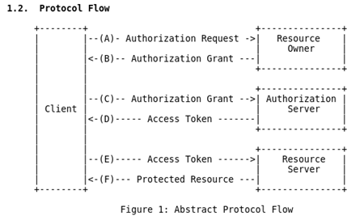

# OAuth

## Buch OAuth 2 in Action

* [OAuth 2 Explained In Simple Terms](https://www.youtube.com/watch?v=ZV5yTm4pT8g)
* [Buch bei Manning](https://www.manning.com/books/oauth-2-in-action)
* [Live Book](https://livebook.manning.com/#!/book/oauth-2-in-action)
* [Beispielcode in JavaScript (Node.js basiert)](https://github.com/oauthinaction)

## Motivation

Will man mit einem System arbeiten, so benötigt man häufig entsprechende Berechtigungen. Für diese Berechtigungen braucht es dann zunächst mal eine Identität, als die man sich mit einem Geheimnis authentifizieren muß. Hat man nun mehrere Systeme, mit denen man arbeiten muß, dann ist die Frage, ob jedes dieser Systeme ein eigenes User-Management implementieren sollte. Für den Benutzer hätte das die unangenehme Folge, daß er in jedem System einen Benutzer pflegen müßte und zudem wäre es sehr schwierig, wenn ein System A mit einem anderen System B im Auftrag/Kontext eines Nutzers agieren müßte. Dann bräuchte das System A nämlich die Credentials des Benutzers im System B. Und niemand möchte seine Credentials verraten ...

> "The OAuth 2.0 authorization framework enables a third-party application to obtain limited access to an HTTP service, either on behalf of a resource owner by orchestrating an approval interaction between the resource owner and the HTTP service, or by allowing the third-party application to obtain access on its own behalf." ([RFC 6749](https://tools.ietf.org/html/rfc6749))

Was möchte man erreichen:

> spezifizierbaren (READ, CREATE, UPDATE, DELETE, ...) temporären selbstinitiierten Zugriff auf genau spezifizierbare geschützte Ressourcen, der jederzeit widerrufen werden kann bzw. automatisch irgendwann abläuft

Und das liefert OAuth:

> "in OAuth, the end user delegates some part of their authority to access the protected resource to the client application to act on their behalf. To make that happen, OAuth introduces another component into the system: the *authorization server* [...] Fundamental to the power of OAuth is the notion of delegation. [...] a subset of a user's authorization is delegated, but OAuth itself doesn't carry or convey the authorizations. Instead, it provides a means by which a client can request that a user delegate some of their authority to it. [...] OAuth 2.0 is designed for the world of web APIs, accessed by client software. The OAuth 2.0 framework in particular provides a set of tools for connecting such applications and APIs across a wide variety of use-cases. [...] The core OAuth 2.0 specification has somewhat accurately been described as a security protocol generator, because it can be used to design the security architecture for many different use-cases." ([OAuth 2 in Action](https://www.manning.com/books/oauth-2-in-action))

und das bedeutet ganz konkret

> "(a) photo-printing service (= client) can ask the user, 'Do you have any of your photos stored on this storage site? If so, we can totally print that.' The user is then sent to the photo-storage service, which asks, 'This printing service is asking to get some of your photos; do you want that to happen?' The user can then decide whether they want that to happen, deciding whether to delegate access to the printing service." ([OAuth 2 in Action](https://www.manning.com/books/oauth-2-in-action))

## Traditionelle unsichere Ansätze

* Credential Synchronisierung - verwenden der gleichen Credentials auf verschiedenen Systemen
  * in dem Fall müßte System A über das Klartext-Passwort des Users Alice auf System B verfügen, um es gegenüber System B zu verwenden - SCHLECHT, denn normalerweise sollte nicht einmal das System A über das Klartext-Passwort des Users Alice auf System A verfügen (deshalb verwendet man Digest Authentication)
    * über das Ask-for-Keys-and-Replay Antipattern könnte System A nach den Credentials auf System B fragen und damit agieren (Man-in-the-Middle-Attack)
  * zudem verwenden User häufig die gleichen Credentials auf unterschiedlichen Systemen - Sicherheitslücke würde für den Resource Owner noch größer, weil der Authorization Server damit in Besitz von Credentials kommt, die der Resource Owner evtl. auf anderen Systemen verwendet (zugegeben: durch Digest-Authentication nicht ganz einfach)
  * System A könnte auf System B mit vollen Rechten des Users Alice agieren - es besteht keine Möglichkeit, die Zugriffe einzuschränken (auf bestimmte Aktionen oder Ressourcen)
  * es besteht keine Möglichkeit für System B zu erkennen, ob der User selbst oder nur ein anderes System mit ihm interagiert
  * praktische Probleme wie Passwortänderung, unterschiedliche Passwort/Username-Policies
* Developer Keys
  * löst ein paar Probleme der Credential Synchronisierung, aber die Berechtigungen lassen sich aber Problem der Berechtigungseinschränkung noch nicht gelöst

## OAuth 1 vs OAuth 2

* [RFC 5849 - The OAuth 1.0 Protocol](https://tools.ietf.org/html/rfc5849)
  * Start 2006
  * löste einige proprietäre Lösungen ab (Google, Yahoo, ...)
* [RFC 6749 - The OAuth 2.0 Authorization Framework](https://tools.ietf.org/html/rfc6749)
  * Start 2012
* 1.0 = Protocol ... 2.0 = Framework

## Alternativen

Die Alternativen

* [SAML](saml.md)
* Kerberos

basieren alle auf ganz ähnlichen Prinzipien wie OAuth.

## Prinzipien

### Castle-Approach

Eins der wesentlichen Probleme in den OAuth-Szenarien ist, daß viele Stakeholder beteiligt sind, die allesamt (abgesehen von der Protected Resource) Angreifer sein könnten. Deshalb wird versucht, implizite Trustbeziehungen (blindes Vertrauen) zu vermeiden und stattdessen Vertrauen nur auf Grundlage vorweisbarer "Geheimnisse" zu gewähren (z. B. [CSRF-Token](https://de.wikipedia.org/wiki/Cross-Site-Request-Forgery)). Vertrauen ist gut, Kontrolle ist besser.

Zudem wird immer versucht, mehrere Hürden (vergleichbar mehrere Mauern) aufzubauen, so daß ein Durchbrechen EINER Hürde nicht zu einem erfolgreichen Angriff führt ([Defense-in-Depth-Prinzip aka Castle-Approach](https://en.wikipedia.org/wiki/Defense_in_depth_(computing)).

> Beispiel: einen CSRF-Angriff kann man dadurch erschweren, daß man neben dem Cookie für Server-Session noch einen URL-Parameter "CSRF-Token" mitgibt. Dieser Token wurde bei der Session-Erzeugung (z. B. beim Login) erzeugt und in der serverseitigen Session gespeichert. Kommt nun ein Request mit dem Session-Cookie, dann reicht das noch nicht aus, um die Session wirklich zu nutzen. Stattdessen muß der Requester noch einen CSRF-Token (im [OpenID Connect Protokoll den State-Token](openIdConnect.md)) mitliefern, mit dem der Requester nachweisen, kann, daß er den ursprünglichen Login auch tatsächlich gemacht hat.

In diesem Beispiel reicht also ein "Geheimnis" (Cookie) nicht aus, es muß noch ein anderes geliefert werden.

### Einfache Clients

OAuth 2 versucht die Komplexität aus den Clients rauszuhalten und in die Server zu verlagern. Das reduziert die Einstiegshürde für Applikationsentwickler (implementieren i. a. die Clients) und erhöht die Sicherheit, da die Entwickler des Authorization Servers und der Protected Resource ein höheres Interesse/KnowHow an der Sicherheit haben als die Entwickler, die "nur" eine Integration schaffen wollen. Dadurch erhöht sich die Akzeptanz von OAuth (einer der Gründe für den Erfolg). Zudem gibt es wenige Authorization Server und Protected Resources im Vergleich zu Applikationen, die eine Integration schaffen.

## Konzepte

### Resource Owner

* ist der ursprüngliche Initiator des OAuth-Flows - er beauftragt den Client mit der Durchführung einer bestimmten Aktion gegen die Protected Resource
  * "ursprüngliche Initiator" heißt, daß der menschliche Benutzer am Anfang, die Übertragung der Authorisierung auf den Client triggert - der Client kann später allerdings jederzeit selbständig einen Zugriff auf die Protected Resource triggern bzw. einen Refresh Token beim Authorzation Server anfordern
* nach erfolgreicher Identifikation (per Authentifizierung am Authorization Server) muß der Resource Owner den entsprechenden Consents/Scopes autorisierenerstellt der Authorization Server ein Authorization Objekt (je nach Authorization Grant Type: Authorization Code oder Access Token) und transportiert es über HTTP-Redirect zum Client
  * die Protected Resource hat den Consent/Scope definiert - evtl. wurde der notwendige Consent/Scope beim ersten abgewiesenen Zugriff des Clients auf die Protected Resources über die Error Response zum Client transportiert

### Client

* System, das im Auftrag des Resource Owners eigenständig (jetzt oder später) die Protected Resource nutzen möchte
* stellt der Client fest, daß er keinen oder einen unzureichenden Access Token hat (evtl. erst nach einem fehlgeschlagenen Zugriff auf die Protected Resource), bittet er den Resource Owner um Erteilung einer entsprechenden Berechtigung. Hierzu löst der Client einen HTTP-Redirect über den Resource Owner mit den benötigten Berechtigungen (vielleicht in der Exception der Protected Resource enthalten) aus
* muß - je nach Authorization Code Grant Type - aus dem Authorization Code einen Access Token über den Authorization Server machen ... hierbei erhält der Client gleichzeitig einen Refresh Token
  * authentifiziert sich am Authorization Server ... warum?
* muß den Token nicht verstehen/interpretieren, sondern reicht ihn nur weiter an die Protected Resource

### Protected Resource

* HTTP-API-Ressource, die im Auftrag des Resource Owners vom Client genutzt werden soll
* muß der Authorisierung (repräsentiert durch den Access Token) durch den Authorization Server vertrauen (!!!) und den Access Token interpretieren bzw. ihn über den Authorization Server in auflösen, um daraus die erteilten Berechtigungen abzuleiten

### Authorization Server

* identifiziert den Resource Owner (über Authentifizierung)
* hat zwei Endpunkte:
  * `authorize` Endpunkt: erstellt im Auftrag des Resource Owners Authorization Objects wie Authorization Code bzw. OAuth Access Token
  * `createToken` Endpunkt - nur genutzt bei Verwendung von Authorization Codes als Zwischenprodukt (z. B. Autentication Code Grant Type)

### Authorization Object

* Objekt, das die Authorization Entscheidung repräsentiert

#### Authorization Code

* optional (je nach Authorization Grant Type)
* ist ein Authorization Object
* darf nur einmalig verwendet werden (da er in der Front-Channel-Kommunikation eingesetzt wird?)
* hiermit kann der Client zu jedem beliebigen Zeitpunkt EINMALIG einen Access Code vom Authorization Server beziehen
* ist nicht das endgültige Authorization Object, sondern nur eine Zwischenlösung
  * Hintergrund: der Authorization Code kommt vom Resource Owner (per HTTP-Redirect transportiert), der evtl. ein Angreifer ist bzw. einen unsicheren Rechner hat - der Authorization Code könnte korrumpiert sein

#### Access Token

* mandatory
* ist ein Authorization Object
* repräsentiert die erteilte Zugriffsberechtigung, die dem Client im Auftrag des Resource Owners vom Authorization Server erteilt wurde
  * da es sich um eine Zeichenkette ohne Blanks handelt, ist die Interpretation der erteilten Berechtigungen nicht möglich - das wissen nur Authorization Server und Protected Resource
* darf mehrfach verwendet werden (da er in der Back-Channel-Kommunikation eingesetzt wird?)
* beschränkte Laufzeit
* ist die Laufzeit abgelaufen, dann muß ein Refresh erfolgen:
  * entweder über ein Re-Login des Users
  * oder über ein Refresh-Token (das ihn für die Erneuerung des Access Tokens berechtigt) an den Authorization Server
* Client kann mit dem Access Token i. a. nichts anfangen (kann es häufig nicht mal interpretieren) ... er leitet es nur an die Protected Resource weiter (treduziert die Client-Komplexität) - nur Authorization Server und Protected Resource haben mit dem Inhalt was zu tun
* Typ des Access Tokens ist nicht Teil der OAuth Spezifikation - folgende Token Typen kommen zum Einsatz
  * [Bearer Token](https://www.predic8.de/bearer-token-autorisierung-api-security.htm) ... er enthält interpretierbare Informationen über die Authorisierung des Requests
    * will man der Protected Resource die Interpretation des AccessTokens ersparen (vielleicht auch weil es sicherer ist), dann kann man sich überlegen, dem Authorisierungsserver einen Introspection Endpoint zu spendieren
  * ID ... in diesem Fall muß die Protected Resource die ID über den [Introspection Endpoint des Authorization Servers](https://www.oauth.com/oauth2-servers/token-introspection-endpoint/) in eine Information umwandeln, um die Zugriffskontrolle prüfen zu können. Im Gegensatz zum Bearer Token muß hier also noch eine Kommunikation mit dem Authorisierungsserver stattfinden ... dafür lassen sich aber auch Revocations leicht implementieren
* der Scope ist Teil des Access Tokens

### Refresh Token

Der Refresh Token ist interessant, wenn man AccessToken-Revocation oder eine AccessToken-Scope-Veränderung abbilden will. In diesem Fall macht man die Laufzeit des AccessTokens klein und die des RefreshTokens lang (oder unendlich). Der Client wird dadurch gezwungen, den AccessToken regelmäßig über den Authorization Server zu erneuern. Der Authorization Server kann dann entscheiden

* Zugriff nicht widerrufen: User muß nicht eingreifen
* Zugriff mittlerweile widerrufen: Client erhält für den Refresh Token keinen Access Token mehr und der User muß erneut explizit eine Authorisierung delegieren

* grundsätzlich optional
  * beim Authorization Code Grant Type kann er genutzt werden
  * beim Implicit Grant Type wird er auf keinen Fall genutzt genutzt (macht keinen Sinn, da ein AccessToken jederzeit selbständig vom Client erzeugt werden kann)
* bei der Ausstellung eines Access Tokens erhält der Client auch gleichzeitig einen Refresh Token, mit dem ein neuer Access Token angefordert werden kann
  * Dienste wie Google liefern einen Refresh Token ausschließlich nach dem allerersten AuthorizationCode-Request (mit zusätzlichen Request-Parametern kann man einen Refresh-Token in der Response erzwingen - `access_type=offline`), weil davon ausgegangen wird, daß der Refresh-Token vom Client gespeichert wird. Die Authorisierung kann man über https://myaccount.google.com/permissions widerrufen
* wenn der Zugriff auf die Resource fehlschlägt, dann könnte es daran liegen, daß der Access Token nicht mehr gültig ist und per Refresh Token erneuert werden muß
* i. a. sehr lange Laufzeit bzw. unendlich gültig bzw. bis er explizit widerrufen wird

### Scope

* Repräsentation von Berechtigungen auf die Protected Resource
* Ausprägung/Granularität von Scopes liegt ganz im Verantwortungsbereich der konkreten Protected Resource
  * im Authorization Code Grant Flow fragt ein Client, der auf eine Protected Resource zugreifen möchte, den menschlichen Resource Owner, ob er dem Client eine Reihe von Berechtigungen erteilen möchte ... diese Berechtigungen werden dem menschlichen Resource Owner präsentiert:


### Authorization Grant

* gesamte Prozess der OAuth Access Token Erstellung - hier gibt es vier verschiedene Ausprägungen/Flows - sog. Authorization Grant Types
* in der Kommunikation mit dem Authorization Server wird der Grant Type explizit angegeben

Letztlich gibt es eine Vielzahl verschiedener Grant Types - welchen soll man nun verwenden. Das Buch [OAuth2 in Action](https://www.manning.com/books/oauth-2-in-action) gibt auf [Seite 108 (Figure 6.6)](https://livebook.manning.com/#!/book/oauth-2-in-action/chapter-6/113) einfache Regeln für die Auswahl des passenden Grant Types an die Hand. Das ist schon mal ein guter Anhaltspunkt, der im konkreten Fall aber sicher nochmals zu überprüfen ist.

#### Authorization Code Grant Type

* hierbei kommen zwei Authorization Objects zum Einsatz: Authorization Code (Zwischenstufe) und Access Token (Endstufe)

#### Implicit Grant Type

* dieser Flow kommt zum Einsatz, wenn Resource Owner und Client auf EINEM System im Front-Channel betrieben werden und nicht physikalisch getrennt sind (z. B. JavaScript-Fat-Client-Anwendung, die auf die Protected Resource zugreift)
* logischerweise kommt hierbei kein Authorization Code zum Einsatz - es werden ausschließlich Access Tokens verwendet, denn die Motivation für den Authorization Codes ist ja gerade eine eine Hürde zwischen dem Nutzer (der evtl. gar nicht der wahre Resource Owner ist) und dem Client aufzubauen. Wenn beides eins ist, macht diese Hürde keinen Sinn mehr.
  * Access Codes werden direkt nach Authentifizierung und Authorisierung durch den Resource Owner ausgestellt ... der Client muß keine Umwandlung (und somit auch keine Authentifizierung am Authorization Server durchführen)
* es werden keine Refresh Tokens verwendet, weil in diesem Szenario davon auszugehen ist, daß die Resource Owner jederzeit erreichbar ist (er bedient ja den Client interaktiv), um einen neuen Access Token per interaktiver Re-Authorisierung auszustellen

#### Client Credential Grant Type

* dieser Flow kommt zum Einsatz, wenn der Resource Owner nicht interaktiv integriert werden kann, weil sich beispielsweise Microservices im Backend einer komplexen Landschaft gegenseitig aufrufen. Es gibt in diesem Szenario keinen Front-Channel, sondern nur den Back-Channel. Die Clients arbeiten in diesem Fall auf eigene Rechnung).
* logischerweise kommt hierbei kein Authorization Code zum Einsatz - es werden ausschließlich Access Tokens verwendet, denn die Motivation für den Authorization Codes ist ja gerade eine eine Hürde zwischen dem Nutzer (der evtl. gar nicht der wahre Resource Owner ist) und dem Client aufzubauen. Wenn beides eins ist, macht diese Hürde keinen Sinn mehr.
* es werden keine Refresh Tokens verwendet, weil der Client in diesem Szenario jederzeit selbständig einen neuen Access Token ausstellen lassen kann

#### Assertion Grant Type

* in diesem Flow kommen kryptografisch geschützte Assertions (z. B. SAML-Assertions) zum Einsatz, die der Client verwendet, um sie über den Authorization Server in einen OAuth Access Token umzuwandeln
* auf diese Weise können existierende Assertion-basierte Authentifizierungen/Authorisierungen (SAML kann auch Authorisierungsinformationen im Stile eines OAuth Scopes enthalten) in das OAuth2 Szenario integriert werden

#### Resource Owner Credentials Grant Type

* hierbei übergibt der Resource Owner seine Credentials an den Client - deshalb MUSS hier eine Vertrauensbeziehung bestehen, die nur zu internen Clients bestehen kann. Mit den Credentials fordert der Client - ohne Interaktion mit dem Resource Owner - Access Tokens vom Authorization Server an (Credential-Replay)
  * eigentlich war das ein NO-GO alter Tage (Ask-for-Keys-and-Replay Antipattern - Man-in-the-Middle-Attack) ... es wurde in die OAuth2-Spezifikation aufgenommen, um einen Migrationspfad zu sicheren Authorisierungsverfahren auf Basis von OAuth2 zu ermöglichen. DENN zumindest zur Protected Resource hin, kann schon ein Access Token verwendet werden ... nur der trusted Authorization Server bekommt die Credentials im Klartext, nicht mehr die Protected Resource (die ihrerseits schon auf Tokenverfahren imgestellt werden kann)

### Front-Channel-Kommunikation

Integration des Resource Owners mit Authorization Server und Client.

### Back-Channel-Kommunikation

Kommunikation des Clients mit Authorization Server und Protected Resource.

## Eigenschaften

### Was ist OAuth 2

* User-to-System-Authorization-Delegation
* alle beteiligten Stakeholder sprechen über HTTP miteinander (auch der Resource Owner ... über den Browser) - da Geheimnisse ausgetauscht werden wird HTTPS empfohlen
  * HTTP-Redirects wird verwendet, um die Stakeholder über den Resource Owner zu verbinden und die Daten (Scope, State, Authorization Code, Tokens, ...) auszutauschen
* Protokoll (wie interagieren die Stakeholder, um ein Access Token zu erhalten?) und Framework (es gibt verschiedene Use-Cases in Form von Grant Types und innerhalb der Grant Types gibt es noch weitere Freiheitsgrade) - daraus resultiert eine entsprechende Komplexität und Fallstricke (Do's and Don'ts), d. h. entscheidet man sich für OAuth2, dann hat man damit eine prinzipielle Richtung vorgegeben, aber noch nicht alle Details festgelegt
  * Beispiel: das Format und der Inhalt der Access Tokens ist nicht spezifiziert - es kann sich um einen einfachen String handelt, es kann aber auch ein SAML- oder JWT-Token (o. ä.) sein
* Ökosystem bestehend aus Erweiterungen, Profile, Protokolle on-top-of OAuth 2

### Was ist OAuth 2 NICHT

* User-to-User-Authorization-Delegation
* kein Authentication Protokoll, obwohl Authentifizierung im Protokoll eine wichtiges Rolle spielt (Resource Owner am Authorization Server UND Client am Authorization Server) ... [OpenID Connect](openIdConnect.md) verwendet OAuth 2, um ein Authentication Protocol zu formen
  > "Much of the confusion comes from the fact that OAuth 2.0 is commonly used inside of authentication protocols, and that OAuth 2.0 embeds several authentication events inside of a regular OAuth 2.0 process." ([Buch OAuth2 in Action](https://livebook.manning.com/#!/book/oauth-2-in-action/chapter-13/))
* OAuth 2 definiert nicht das Token Format (im Gegensatz zu anderen Security Protocols wie SAML, Kerberos WS-*)
* Nutzung außerhalb von HTTP ist nicht vorgesehen
* kryptografische Verfahren sind nicht vorgegeben

### Relevante Technologien

... beim Einsatz von OAuth 2 ... aber nicht explizit Teil der OAuth 2 Spezifikation:

* OpenID Connect - für Authentifizierung
* JSON Object Signing and Encryption (JOSE)
* Java Web Token (JWT)

## Getting Started

Ich habe das Authorization Code Grant Type Beispiel aus dem [Buch OAuth2 in Action](https://www.manning.com/books/oauth-2-in-action) als lauffähiges Docker-Compose Projekt umgesetzt, das folgendermaßen gestartet wird (Installation von Git, Docker und Docker-Compose wird vorausgesetzt):

```bash
git clone git@github.com:mobi3006/de.cachaca.learn.oauth2.git oauth2-authorization-code-grant-type
cd oauth2-authorization-code-grant-type
docker-compose up
```

Hierduch werden drei Services gestartet (ACHTUNG: in diesem Demo-Szenario wird kein HTTPS verwendet) - [siehe auch Dokumentation](https://github.com/mobi3006/de.cachaca.learn.oauth2/blob/master/README.md):

* Client: http://localhost:9000
* Authorization-Server: http://localhost:9001
* Protected Resource: http://localhost:9002

Eine OAuth2 Authorization Code Grant Type Flow läuft folgendermaßen ab:

1. Resource Owner beauftragt den Client in seinem Sinne die Protected Resource zu verwenden
2. Client beauftragt den Authorization Server damit mit dem Resource Owner eine Authorisierung durchzuführen
   * indem der Resource Owner einen Redirect auf den Authorization Server erhält (mit Informationen über die zu erstellende Permission/Authorisierung)
3. Resource Owner erstellt eine Authorisierung in Form eines Authorization Codes
   * hierzu muß sich der Resource Owner zunächst identifizieren (durch Authentifizierung) ... ist das wirklich der Resource Owner?
   * der Resource Owner wird gefragt, ob er die erforderliche Berechtigung erteilen möchte
   * der Authorization Server erstellt den Authorization Code und sendet dem Resource Owner ein Redirect zum Client mitsamt dem Authorization Code
4. Client erhält das Token von Authorization Server
   * Client identifiziert sich am Authorization Server und übergibt den Authorization Code
   * Authorization Server wandelt den Authorization Code in einen Access Token um
5. Client zeigt den Access Token vor, um auf die Protected Resource zugreifen zu können
6. Protected Resource prüft die Gültigkeit des Tokens und überprüft, ob der Scope ausreichend ist, um den Zugriff zu erlauben
   * evtl. wird die Protected Resource den Authorization Server kontaktieren, um die Gültigkeit des Tokens zu prüfen und den Scope zu ermitteln (sofern diese Information nicht im Token inkludiert ist)

Siehe [RFC 6749](https://tools.ietf.org/html/rfc6749)



### Tokenerstellung

### Tokennutzung

## Client Deployment Typen

Ein wichtiger Aspekt ist bei der Betrachtung unterschiedlicher Client-Typen und der dabei sinnvollen Grant Types ist die Authentifizierung des Clients am Authorization Server. Dies ist nicht bei allen Grant Types erforderlich. Wenn es aber erforderlich ist (z. B. Authorization Code Grant Type), dann ist die Herausforderung, daß dieses Credential je nach Client Typ evtl. auf einen angreifbaren Public Client (z. B. Laptop des Resource Owner) transportiert wird. Das hat eine höhere Kritikalität als wenn das Credential nur auf einen Confidential Client wandert.

> Dieser Aspekt wird im [Buch OAuth2 in Action](https://www.manning.com/books/oauth-2-in-action) in Kapitel 6.2.4 behandelt.

Es gibt drei verschiedene Client-Typen, die unterschiedlich gut mit dem OAuth2 Ansatz zurechtkommen.

* Web-Applikationen - im Browser wird vom Server erstelltes HTML gerendert
  * hierfür paßt OAuth 2 mit Front- und Backend-Channel perfekt ... ALLE Grant Typen sind GEEIGNET
* Browser Applikationen - laufen komplett eigenständig im Browser des Resource Owners
  * Front-Channel-Kommunikation ist einfach
  * Back-Channel-Kommunikation ist schwieriger, z. B. aufgrund der Same-Origin-Policy
* Native Applikationen - laufen außerhalb des Browsers und komplett auf dem Computer des Resource Owners
  * Front-Channel-Kommunikation ist schwieriger, da der native Client HTTP-Redirects vom Authorization Server ausführen muß
  * Back-Channel-Kommunikation ist einfach
  * Welche Grant Types sind geeignet?
    * Authorization Code: GEEIGNET
    * Client Credentials: GEEIGNET
    * Assertions: GEEINGET
    * Implicit: NICHT empfohlen

In den Beispielen zum [Buch OAuth2 in Action](https://github.com/oauthinaction) sind Codebeispiele für alle Client-Arten zu finden.

## Spring OAuth2 Support

* [gute Einführung](http://stytex.de/blog/2016/02/01/spring-cloud-security-with-oauth2/)
* [räumt mit einigen Mißverständnissen auf - viele Wege führen nach Rom](https://spring.io/guides/tutorials/spring-boot-oauth2/)
* [Spring OAuth 2.0 Login](https://developer.okta.com/blog/2017/12/18/spring-security-5-oidc)

Spring stellt schon einige Packages im Zusammenhang mit OAuth2 zur Verfügung:

* org.springframework.security.oauth2.client
  * OAuth2RestTemplate
* org.springframework.boot.autoconfigure.security.oauth2.client
  * `@EnableOAuth2Sso` - hiermit kann man sehr komfortabel einen Authorization Code Grant Flow abbilden. Es handelt sich hierbei um eine convenience Annotation, die ein paar Abkürzungen nutzt. Man kann das ganze auch manuell mit ein paar anderen Annotationen und Konfigurationen aufsetzen.
    * BTW: die Konfiguration ist bei Nutzung von `@EnableOAuth2Sso` auch in einem anderen Namespace (`security.oauth2.client` statt `spring.security.oauth2.client`) etwas anders ... mich verwirrt die Spring-Strategie

Über entsprechende Properties in der `application.properties` (oder `application.yaml`) wie beispielsweise `security.oauth2.client.client-id` werden die Instanzen konfiguriert.

## OSS Projekte mit OAuth2 Support

### anilallewar/microservices-basics-spring-boot

* https://github.com/anilallewar/microservices-basics-spring-boot

Blueprint für eine Microservice Anwendung basierend auf

* Spring Boot 1.5.3.RELEASE
* Spring Cloud Config
* Zuul Api-gateway
* Auth-server
* Loadbalancer (Ribbon)
* Angular
* Gradle (aber es wird ein Wrapper mitgeliefert, so daß eine lokale Gradle-Installation nicht notwendig ist)

Make it running:

```bash
git clone git@github.com:anilallewar/microservices-basics-spring-boot.git
cd microservices-basics-spring-boot
./build-all-projects.sh
./docker-image-all-projects.sh
cd docker-orchestration/docker-compose
docker-compose up -d
```

Nach einiger Zeit sind dann die Services verfügbar.

> ACHTUNG: es werden keine Ports explizit zum Docker-Host gemappt, damit keine Konflikte wegen belegter Ports entstehen ... deshalb muß man die Ports der UIs per `docker ps` rausfinden und zwar bei jedem Neustart:

```bash
╭─pfh@workbench ~/src/spring-projects/microservices-basics-spring-boot  ‹master*›
╰─➤  docker ps
CONTAINER ID        IMAGE                                         COMMAND                  PORTS                     NAMES
02f9b1e03a5e        anilallewar/basic-user-webservice:0.0.1       "/bin/bash -c /app/r…"   0.0.0.0:32790->8080/tcp   docker-compose_userwebservice_1
a986e6afe32a        anilallewar/basic-api-gateway:0.0.1           "/bin/bash -c /app/r…"   0.0.0.0:8765->8765/tcp    docker-compose_apigateway_1
c4f350f62ea7        anilallewar/basic-web-portal:0.0.1            "/bin/bash -c /app/r…"   0.0.0.0:32789->8080/tcp   docker-compose_webportal_1
9ed2246d03aa        anilallewar/basic-auth-server:0.0.1           "/bin/bash -c /app/r…"   0.0.0.0:32793->8899/tcp   docker-compose_authserver_1
36b7f8b8c02a        anilallewar/basic-comments-webservice:0.0.1   "/bin/bash -c /app/r…"   0.0.0.0:32791->8080/tcp   docker-compose_commentswebservice_1
a8630eb52acc        anilallewar/basic-task-webservice:0.0.1       "/bin/bash -c /app/r…"   0.0.0.0:32792->8080/tcp   docker-compose_taskwebservice_1
d623ccf9869d        anilallewar/basic-webservice-registry:0.0.1   "/bin/bash -c /app/r…"   0.0.0.0:8761->8761/tcp    docker-compose_eurekaregistry_1
40e4d5c9257e        anilallewar/basic-zipkin-server:0.0.1         "/bin/bash -c /app/r…"   0.0.0.0:9411->9411/tcp    docker-compose_zipkinserver_1
7ebffb965314        anilallewar/basic-config-server:0.0.1         "/bin/bash -c /app/r…"   0.0.0.0:32788->8888/tcp   docker-compose_configserver_1
6069e9724730        mysql:latest                                  "docker-entrypoint.s…"   0.0.0.0:32787->3306/tcp   docker-compose_mysqldb_1
```

In diesem Fall würde man die Services hierüber finden:

* Web-Portal: http://localhost:32789

Leider hat das Login zu einem Error geführt.