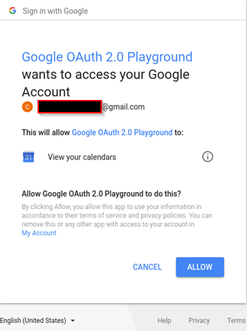
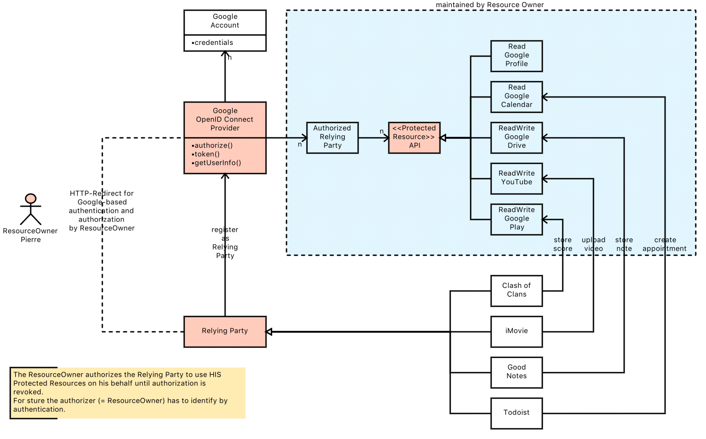

# OpenID Connect

* [Core Protocol](http://openid.net/specs/openid-connect-core-1_0.html)

OpenID Connect ist ein Protokoll zur Umsetzung von Authentication-as-a-Service. Da es letztlich darum geht, eine Identitätsfeststellung durchzuführen wird es auch als Identity Federation bezeichnet (ein Service wird mit der Feststellung der Identität beauftragt). Das basiert letztlich darauf, daß ein User (Mensch/Maschine) ein Geheimnis benutzt, das ausschließlich er kennt: Password, Secret Key, Token, Fingerabdruck, Iris, ...

Dieser Ansatz hat sehr viele Vorteile:

* Benutzer
  * es wird ein einziges Credential verwendet, um sich an vielen Services anzumelden (keine lästigen eMail-Verifications). Das erhöht den Komfort für den Benutzer und sorgt zusätzlich für mehr Sicherheit (ich dachte eigentlich immer, daß sich das ausschließt ... eine Win-Win-Situation) verhindert, daß Benutzer die gleichen Credentials auf unterschiedlichen Services verwenden, Credentials aufschreiben, unsichere Credentials verwenden, ...
  * Single-Sign-On (zumindest bei OpenID Connect ist das inhärent vorhanden)
* Applikationsentwickler
  * Usermanagement und - und Identity kann wiederverwendet werden
* Service-Anbieter
  * Benutzer sind eher bereit, sich zu identifizieren (anzumelden), um geschützte Dienste zu nutzen
  * bekommen dadurch mehr Engagement (z. B. Inhalte)
* Sicherheit
  * Anwendugsentwickler müssen sich nicht mehr kümmern und ein Identity Provider wird die sichere Lösung anbieten können

Man darf dabei aber nicht vergessen, daß ein einziges Credential auch den Nachteile hat:

* ist dieses Credential geknackt, dann stehen die Türen zu vielen Services (Daten) offen - widerspricht das nicht eigentlich dem Sicherheitsansatz, viele Hürden aufzubauen
* die Nachverfolgbarkeit wird erhöht - werden unterschiedliche Credentials von einem Benutzer verwendet, dann ist es schwieriger festzustellen, daß es sich dabei um den gleichen Nutzer handelt
  * durch die erhöhte Integration der Dienste kann es für den Benutzer unüberschaubar werden, welche Spuren er hinterläßt (plötzlich wird auf Facebook meine tägliche Fahrradstrecke gepostet, die ich über Komoot geplant habe)

## OAuth 2 vs. OpenID Connect

OpenID Connect = OAuth2 + OpenID Provider

OpenID Connect ist ein vollständiges OAuth2-basiertes Authentifizierungsprotokoll, das für Authentification-as-a-Service Implementierungen verwendet werden kann:

> "[...] allows Clients to verify the identity of the End-User based on the authentication performed by an Authorization Server, as well as to obtain basic profile information about the End-User in an interoperable and REST-like manner. OpenID Connect allows clients of all types, including Web-based, mobile, and JavaScript clients, to request and receive information about authenticated sessions and end-users. The specification suite is extensible, allowing participants to use optional features such as encryption of identity data, discovery of OpenID Providers, and session management, when it makes sense for them." ([Website OpenID Connect](http://openid.net/connect/))

In OAuth2 dreht sich alles im Authorisierung - der Aspekt einer Identifizierung des Nutzers via Authentifizierung ist nicht Teil der OAuth2 Spezifikation. OpenID Connect basiert auf dem OAuth2-Framework, um ein Authentifizierungsprotokoll zu implementieren. Letztlich wird OAuth2 verwendet, um den Zugriff der Applikation (= Client) auf die Protected Resource "Identity Provider" zu authorisieren.

Im [Buch Auth2 in Action](https://livebook.manning.com/#!/book/oauth-2-in-action/chapter-13/28) wird gibt der Authorization Server beide Tokens (Accedd Token und ID Token) im gleichen Request an den Client. Das hat mich lange Zeit verwirrt, denn eigentlich hätte ich erwartet, daß erst mit dem Access Token ein Zugriff auf den Identity Provider möglich ist, der Informationen über den authentifizierten User in Form eines ID Tokens bzw. über die Identity Profile API bereitstellt.

> "We’ve conceptually combined the authorization server and protected resource into the Identity Provider, or IdP. It’s possible that the two aspects of the service, issuing tokens and serving user identity information, could be served by separate servers, but as far as the RP is concerned, they’re functioning as a single unit. We’re also going to add a second token alongside the access token, and we’ll use this new ID token to carry information about the authentication event itself."

Über das ID Token ist der User authentifiziert und über den AccessCode wird er für weitere Protected Resources (neben dem Identity Provider) authorisiert.

Die Zusammenhänge zwischen Authentifizierung und Authorisierung wirken ein wenig durcheinander. Letztlich bildet OpenID Connect ein Authentifizierungsprotokoll über OAuth2-Authorisierung ab. OAuth2 wird zur Authorisierung des Zugriffs auf den geschützten ID Token verwendet. Die in OAuth2 verwendete Authentifizierung des Resource Owners wird dadurch zu einem Authentifizierungsprotokoll. Vielleicht kann man die OpenID Connect Authentifizierung als Meta-Authentifizierung bezeichnen, bei der konkrete Authentifizierungen (1. Resource Owners am Identity Provider + 2. Client am Authorization Server) an Drittsysteme (RelyingParty/Client) weitergegeben/delegiert werden kann. Auf diese Weise werden Grenzen zwischen Security Domains überwunden:

> "the resource owner authenticates to the authorization server’s authorization endpoint, the client authenticates to the authorization server at the token endpoint, and there may be others depending on the setup. We’re building authentication on top of authorization, and the authorization protocol itself relies on authentication, isn’t that a bit overcomplicated? [...] It may seem an odd setup, but notice that this setup can leverage the fact that the user is authenticating at the authorization server, but at no point are the end user’s original credentials communicated to the client application (our RP) through the OAuth 2.0 protocol. By limiting the information that each party needs, the transaction can be made much more secure and less prone to failure, and it can function across security domains. The user authenticates directly to a single party, as does the client, and neither needs to impersonate the other." ([Buch Auth2 in Action](https://livebook.manning.com/#!/book/oauth-2-in-action/chapter-13/32))

Die Stakeholder des OAuth2 Protokolls haben im OpenID Connect Kontext andere Bezeichnungen, weil es sich um einer Spezialisierung handelt. Dennoch ist es wichtig, die Abbildung der Stakeholder auf das OAuth2 Protokoll immer im Bliock zu haben, um die gegenseitigen Trustbeziehungen zu erkennen und das Überschreiten der Security Domain Boundary zu erkennen - was den Mehrwert des OpenID Connect Ansatzes ausmacht. Verliert man dieses Wissen aus dem Blick, so können sich - sofern man einen Authorization Server bzw. OpenID Provider implementiert - fatale Fehler einschleichen, die das System als Ganzes kompromittieren!!!

### OpenID vs. OpenID Connect

Es gibt auch nicht OpenID, doch OpenID Connect ist angeblich mehr API-friendly.

## Alternativen

* CAS
* Keycloak

## Konzepte

### Identity Provider = OpenID Provider

* ein Identity Provider verwendet Authentifizierung zur Identifikation eines Clients
* der Identity Provider kann innerhalb einer Anwendung implementiert sein (z. B. in einem Monolithen) oder aber auch als externer Service (Authentication as a Service - z. B. in einer Microservice Architektur) eingebunden werden

### OpenID Provider (OP)

* ist der Identity Provider im OpenID Connect Umfeld
* verschmilzt mit dem OAuth2-Authorization-Server
* bietet folgende REST-Endpunkte
  * authenticate
  * userInfo

### Authentication as a Service

Provider eines Service möchten evtl. kein eigenes User-Management betreiben, um den Nutzern das Management ihrer Credentials zu vereinfachen, z. B. sie können die Facebook Credentials verwenden.

### ID Token

* Identity Token
* ID Token wird nach der Identifizierung per Authentifizierung (des menschlichen Benutzers) durch den OpenID Provider (= Identity Provider) in Form eines JSON Web Tokens (JWT) an die Relying Party (die den OpenID Provider im Sinne eines Authentication-as-a-Service genutzt hat) übergeben. Die Relying Party nutzt den ID Token evtl. um eine Session für den authentifizierten User zu erzeugen, aber danach nicht mehr (ist eher ein Wegwerfprodukt mit kurzer Laufzeit - wird auch )
* ID Token enthält u. a. folgende Informationen:
  * Issuer
  * Gültigkeitsdauer
  * Subject (Identity)
  * Audience - intendierte Nutzer des Tokens
  * Nonce - siehe unten
  * Claims = kategorisierte Informationen zur Identifizierung (z. B. über den User oder die Authentifizierung). Der Umfang wird durch den `scope` Paremeter definiert ... beim `scope=openid profile` sieht der JWT folgendermaßen aus (`profile` sorgt für den Abschnitt `userinfo`):

    ```json
    {
    "response_type": "code id_token",
    "client_id": "my_client",
    "redirect_uri": "https://www.cachaca.de/cb",
    "scope": "openid profile",
    "state": "38469z24uhzg23",
    "id_token":
      {
        "claims":
          {
            "auth_time": null,
          },
      },
    "userinfo":
      {
        "claims":
          {
            "name": Pierre,
            "nickname": {"optional": true},
            "email": foo@bar.com,
            "verified": null,
            "picture": {"optional": true}
          }
      }
    }
    ```

* signiert
* verläßt aus Sicherheitsgründen niemals die Relying Party (abgesehen vom OpenID Provider kennt den ID Token niemand)
* normalerweise kürzere Laufzeit als ein Access Token

### ID Token vs. Access Token

Braucht es denn wirklich zwei Tokens (ID Token aus OpenID Connect, Access Token aus OAuth2), die letztlich häufig zum gleichen Zeitpunkt und von der gleichen Komponente (die sowohl IdentityProvider als auch Authorization Server repräsentiert) erstellt wird? Genügt hier nicht der AccessToken, der ja auch Informationen über den User enthält?

* auch wenn der AccessToken User Informationen trägt, so sagt er nichts darüber aus, ob tatsächlich in der laufenden Transaktion eine Identifikation des Users stattgefunden hat. Der Token kann sehr alt oder gar gestohlen (ausgestellt für einen anderen Client), so daß einen Identifizierung zusätzlichen Schutz bietet.
* da OAuth2 nichts über das Format des Access Tokens aussagt, könnte man alles in den Access Token packen, doch dadurch würde man der Protected Resource Informationen (Nutzer des Access Tokens) über die Identity offenbaren, was in manchen Szenarien vielleicht nicht gewünscht ist. Durch die Trennung kann die Identity-Information komplett beim Client verbleiben ... für die Protected Resource sollte das keine Rolle spielen - Hauptsache der User ist authorisiert

### UserInfo Endpunkt

* der OpenID Provider stellt diesen Endpunkt zur Verfügung, um Claims abzufragen
* der Endpunkt ist eine Protected Resource im Sinne von OAuth2, d. h. beim Zugriff ist ein Access Token erforderlich

### Scope

* [Scope vs. Claim](https://nat.sakimura.org/2012/01/26/scopes-and-claims-in-openid-connect/)

Der `scope` bei der Authentifizierungsanfrage definiert den Inhalt des ID Tokens. Der ID-Token enthält minimal den Abschnitt `id_token` mit ein paar Claims.

ABER auch:

> "OpenID Connect Clients use scope values, as defined in Section 3.3 of OAuth 2.0 [RFC6749], to specify what access privileges are being requested for Access Tokens. The scopes associated with Access Tokens determine what resources will be available when they are used to access OAuth 2.0 protected endpoints. Protected Resource endpoints MAY perform different actions and return different information based on the scope values and other parameters used when requesting the presented Access Token." ([OpenID Connect Spezifikation - Scopes and Claims](http://openid.net/specs/openid-connect-core-1_0.html#ScopeClaims))

### Claim

* [OpenID Connect Spezifikation - Scopes and Claims](http://openid.net/specs/openid-connect-core-1_0.html#ScopeClaims)
* [OpenID Connect Spezifikation - Claims](http://openid.net/specs/openid-connect-core-1_0.html#Claims)
* [Scope vs. Claim](https://nat.sakimura.org/2012/01/26/scopes-and-claims-in-openid-connect/)

Beschreibt Informationen über die Identity. Bei `scope=profile` in der Authentifizierungsanfrage liefert den Abschnitt `userinfo` im JWT Token mit einigen Claims:

```json
"userinfo":
  {
    "claims":
      {
        "user_id": null,
        "name": {"optional": true},
        "nickname": {"optional": true},
        "profile": {"optional": true},
        "picture": {"optional": true},
        "website": {"optional": true},
        "gender":  {"optional": true},
        "birthday":  {"optional": true},
        "locale":  {"optional": true},
        "zoneinfo":  {"optional": true},
        "updated_time": {"optional": true}
      }
  }
```

Ein User kann evtl. mitbestimmen welche Informationen an eine Relying Party weitergegeben werden:

> "In some cases, the End-User will be given the option to have the OpenID Provider decline to provide some or all information requested by RPs. To minimize the amount of information that the End-User is being asked to disclose, an RP can elect to only request a subset of the information available from the UserInfo Endpoint." ([OpenID Connect Spezifikation - Scopes and Claims](http://openid.net/specs/openid-connect-core-1_0.html#ScopeClaims))

### Relying Party (RP)

Client, der dem ID Token vertraut

### State Token

* https://developers.google.com/identity/protocols/OpenIDConnect#server-flow
* [Cross-Site-Request-Forgery](https://de.wikipedia.org/wiki/Cross-Site-Request-Forgery)
* [State vs. Nonce](https://stackoverflow.com/questions/46844285/difference-between-oauth-2-0-state-and-openid-nonce-parameter-why-state-cou)

Dieser Token ist eine Information, die die Relying Party erstellt und an den OpenID Connect Provider per HTTP-Redirect austauscht. Die Information ist somit nur direkt Beteiligten und dem User (über den Redirect) bekannt. Ein unbeteiligter Dritter erhält die Information nicht, da auch [Query-Strings über HTTPS verschlüsselt sind](http://blog.httpwatch.com/2009/02/20/how-secure-are-query-strings-over-https/). Allerdings landen diese Informationen unverschlüsselt in den Logs des OpenID Providers (dem man allerdings vertraut) und in der Historie des User-Browsers (Redirect!!!) ... insofern ist dieser State Token kein richtiges Geheimnis.

Nach erfolgreicher Anmeldung an einem Server (z. B. OpenID Connect Provider oder auch Relying Party) wird i. a. eine Session auf dem Server erzeugt und der Client erhält ein Cookie. Wenn der Client diesen Cookie im Request vorzeigt und die Session serverseitig noch valide ist, muß keine erneute Authentifizierung erfolgen. Ein Angreifer könnte nun einen Request gegen den Server auslösen (z. B. JavaScript App, andere Webseite, eMail-Link) und dieser Request würde im Security-Kontext des Client (des Users) laufen.

Der State Token dient der Verhinderung eines solchen Angriffs ... der Angreifer kann nicht so einfach an den State Token kommen (der Token darf nicht im Cookie stecken, sondern muß als URL-Parameter transportiert werden). Ganz unmöglich ist das nicht, denn er wurde ja zumindest mal in den Browser des Users transportiert, aber es erhöht zumindest mal die Schwierigkeit. Somit weist der State nach, daß der Session-Cookie nicht mißbraucht wird, sondern tatsächlich von dem genutzt wird, der die Authentifizierung initiiert hat.

### Nonce

* [State vs. Nonce](https://stackoverflow.com/questions/46844285/difference-between-oauth-2-0-state-and-openid-nonce-parameter-why-state-cou)

Die Nonce wird bei der Authentifizierungsanfrage der Relying Party erzeugt (z. B. eine GUID) und landet bei der Tokenerzeugung im ID Token. Die Relying Party prüft nach der Tokenerzeugung, ob das ID Token auch die notwendige Nonce enthält und sie somit den erzeugten Tokens trauen kann.

Nonce ist ähnlich zu einem State Token, doch ist es eine Absicherung zwischen anderen Beteiligten:

* das State-Token baut Vertrauen zwischen Relying Party und User auf. Es erschwert, daß der Aufrufer der Relying Party (der potentielle User ... der aber gar nicht der echte User ist), das Authentifizierungsvertrauen in Form des Session Cookies mißbraucht.
* die Nonce baut Vertrauen zwischen Relying Party und OpenID Connect Provider auf. Hiermit wird sichergestellt, daß die ursprüngliche Authentiizierungsanfrage (der Relying Party über den User-Browser zum OpenID Connect Provider) und die zeitlich nachfolgende (in einem neuen Request) Tokenanfrage auch tatsächlich vom gleichen OpenID Connect Provider bearbeitet werden. Damit wird 

## Ablauf einer Authentifizierung/Authorisierung

* http://openid.net/specs/openid-connect-core-1_0.html#CodeFlowSteps

```
+--------+                                   +--------+
|        |                                   |        |
|        |---------(1) AuthN Request-------->|        |
|        |                                   |        |
|        |  +--------+                       |        |
|        |  |        |                       |        |
|        |  |  End-  |<--(2) AuthN + AuthZ-->|        |
|        |  |  User  |                       |        |
|   RP   |  |        |                       |   OP   |
|        |  +--------+                       |        |
|        |                                   |        |
|        |<--------(3) AuthN Response--------|        |
|        |                                   |        |
|        |---------(4) UserInfo Request----->|        |
|        |                                   |        |
|        |<--------(5) UserInfo Response-----|        |
|        |                                   |        |
+--------+                                   +--------+
```

Der menschliche User wird von der Relying Party OAUth2-like über HTTP-Redirect zum OpenID Provider (= Identity Provider) in den Flow eingebunden.

Authentifizierung kann über folgende OAuth2-Grant-Types erfolgen:

* [Authorization Code Flow (= Grant Type)](http://openid.net/specs/openid-connect-core-1_0.html#CodeFlowAuth)
* [Implicit Flow (= Grant Type)](http://openid.net/specs/openid-connect-core-1_0.html#ImplicitFlowAuth)
* [Hybrid Flow](http://openid.net/specs/openid-connect-core-1_0.html#HybridFlowAuth)
  * basierend auf [OAuth 2.0 Multiple Response Type Encoding Practices](http://openid.net/specs/oauth-v2-multiple-response-types-1_0.html)

## Getting Started

* [sehr pragmatische Einführung von Google](https://developers.google.com/identity/protocols/OpenIDConnect)

Da OpenID Connect sehr beliebt ist, findet man bei vielen Cloud-Unternehmen (u. a. Microsoft, Google) Umsetzungen verschiedener Flows und auch sehr gute Dokumentationen.

Web-Applikationen machen von diesen OpenID Connect Providern regen Gebrauch. Das inhärente Single-Sign-On ist neben der Eigenschaft Reuse-Existing-Credentials ein extrem komfortables Feature (einmal bei GitHub angemeldet und mit diesem Login 20 Web-Applikationen ohne erneute Anmeldung nutzen).

### Google als OpenID Connect Provider

* [Google OpenID Provider in Action ... sehr schön mit Beispiel-Requests](https://developers.google.com/identity/protocols/OpenIDConnect)
* [Google OAuth Playground - sehr gut](https://developers.google.com/oauthplayground)

[Google ist OpenID Connect certified](http://openid.net/certification/) und somit bietet sich der Dienst besonders an, um OpenID Connect in Action zu sehen.

#### Nutzung als Software-Anbieter

Jede Anwendung (= Client = Relying Party), die ein Login mit den Google-Credentials erlauben will, muß bei Google eine Client Konfiguration anlegen, in der

* Credentials (clientID/username/password)
* Redirect-URL
* Branding (für die Login-Page)
  * natürlich muß die OAuth2 Login Page Vertrauen erwecken (schließlich soll der User hier seine Credentials preisgeben) - hier sollte also der OpenID Provider klar erkennbar sein (ordentliche URL, Server Zertifikat, ...)

abgelegt sind.

#### Nutzung als User

* [Verwaltung der zugelassenen Anwendungen](https://security.google.com/settings/security/permissions)

Sobald eine Anwendung die Authentifizierung/Authorisierung vom User im OpenID Connect Stil erfragt, der User sich mit seinen Google Credentials authentifiziert und die Anwendung mit der gewünschten Berechtigung (im Screenshot "View your calenders") autorisiert



wird ein entsprechendes Authorisierungs-Profil für diese Anwendung im OpenID Connect Provider von Google angelegt. Diese Profile lassen sich [unter Google - My Account - Sign-In and Security](https://security.google.com/settings/security/permissions) verwalten (einsehen und löschen) pflegen - man kann eine Berchtigung also jederzeit wieder entfernen. Es geht hier also nicht nur um die Authentifizierung, die an Google delegiert wird, sondern auch um die Authorisierung, d. h. der User gewährt einem Service (= Relying Party im Sinne von OpenID Connect) das Recht für bstimmte Aktionen in seinem Sinne (z. B. eMails lesen, Kalender Einträge pflegen).



Der [Google-Playground](https://developers.google.com/oauthplayground) bietet ein nettes Tool, um der Playground-Webapplikation "Google OAuth 2.0 Playground" Zugriff auf die Google APIs (Calendar, eMail, ...) auszuprobieren.

#### Protected Resource - Todoist

[todoist](https://todoist.com/) ist eine beliebtes Getting Things Done (GTD) Tool, das unter Android, iOS und als Webapplikation läuft. Beim Login kann man wählen zwischen verschiedenen User-Managements:

* Todist
* Google via Google's OpenID Provider
* Facebook via Facebook Connect (Facebook nutzt nicht OpenID Connect, sondern [Facebook Connect](https://developers.facebook.com/docs/facebook-login))

### Microsoft 365

* http://www.office.com

> ACHTUNG: Microsoft 365 basiert auf [OneDrive for Business](https://onedrive.live.com/about/de-DE/business/) ... ist nicht zu verwechseln mit [OneDrive](https://onedrive.live.com/about/de-de/), das für Privatanwender konzipiert ist.

#### Microsoft OpenID Connect Provider

* [Microsoft-Dokumentation](https://docs.microsoft.com/de-de/azure/active-directory/develop/active-directory-protocols-openid-connect-code)
* Entwicklerinfos zur Nutzung des Micosoft OpenID Connect Providers: https://developer.microsoft.com/de-de/graph

> Ich bin mir nicht sicher, ob Microsoft 365 OpenID Connect basiert ist, das Protokoll sieht aber zumindest sehr ähnlich aus und Microsoft hat auch einige [OpenID Connect zertifizierte Identity Provider](http://openid.net/certification/).

Die Login Page des Microsoft OpenID Connect Providers befindet sich unter https://login.microsoftonline.com. Die OAuth2-Login-Seite erlaubt die Selektion verschiedener Accounts.

> Ein Account wird repräsentiert über einen Identifikator - hier ist Email, Phone und Skype-ID zulässig

Nach erfolgreicher Authentifizierung mit dem gewählten Account wird mir angezeigt für welches Unternehmen ich mich eingeloggt habe und werde dann auf Grundlage der `redirect_uri` zu der ursprünglichen Seite gemäß OpenID Connect redirected.

#### Landing Page

Die Landing Page (von dort aus kann man in alle Microsoft Anwendungen springen) befindet sich auf https://www.office.com. Der Zugriff ist geschützt, d. h. man sieht die Applicationen erst nach erfolgreicher Anmeldung ... der Anmeldelink (https://www.office.com/login) redirected auf den Microsoft OpenID Connect Provider (https://login.microsoftonline.com) mit den entsprechenden OpenID Connect URL Parametern (u. a. `response_type=code+id_token`). Nach erfolgreicher Anmeldung gelangt man auf die Landing Page.

#### Deep Links zum Einstieg

Verwendet man spezielle Links der Anwendungen (Outlook: https://outlook.office365.com, Office: https://office.live.com, Teams: https://teams.microsoft.com, Sharepoint: https://trinso-my.sharepoint.com) für den ersten Einstieg, so verhält sich die Anwendung wie beim Zugriff auf die Landing Page ... Redirect zum Microsoft OpenID Connect Provider.

#### Wechsel zwischen Apps

Beim Wechsel zwischen Apps gibt es Unterschiede im Verhalten:

* bleibt man innerhalb einer Security-Domain, z. B. beim Wechsel von Word (https://office.live.com/start/Word.aspx?auth=2) nach Excel (https://office.live.com/start/Excel.aspx?auth=2&nf=1) bleibt der Client (office.live.com) gleich und aufgrund des gemeinsamen Session-Handlings im Backend kann auf ein Redirect über den Microsoft OpenID Connect Provider verzichtet werden - das Backend erkennt den User als bereits identifiziert
* wechselt man die Security-Domain hingegen zum ersten Mal (!!!), z. B. beim Wechsel von Word (https://office.live.com/start/Word.aspx?auth=2) nach OneDrive  (https://trinso-my.sharepoint.com/), dann erfolgt hingegeben ein Redirect über den Microsoft OpenID Connect Provider aus (der allerdings aufgrunds des impliziten Single-Sign-On Konzepts geleich wieder zu einem Redirect führt ... die Seite flackert und es dauert recht lang)
  * wenn man sich in einer Security-Domain bereits authentifiziert hat (über den Microsoft OpenID Connect Provider Redirect-Mechanismus), dann existiert im Backend eine Session und über den Cookie-Mechanismus kann die auch immer wieder identifiziert werden, so daß die Redirects stetig abnehmen - Microsoft 365 lässt sich dann flüssiger bedienen.

#### Change Password

Der Account wird in der Webapplikation https://portal.office.com/account/ verwaltet. Hier wird u. a.

* das Profil gepflegt
* das Passwort geändert
  * das Passwort wird allerdings wiederum in einer anderen Webapplikation (https://account.activedirectory.windowsazure.com) gepflegt ... die Einbindung erfolgt OpenID Connect typisch über den OpenID Connect Provider (https://login.microsoftonline.com/common/oauth2/authorize?client_id=...).
* die Berechtigungen (auf andere Clients = Webanwendungen) gepflegt

#### Logout

Beim Logout wird die API https://www.office.com/logout aufgerufen, die aber wie alle APIs über OpenID Connect geschützt ist:

* https://login.microsoftonline.com/common/oauth2/logout?post_logout_redirect_uri=https%3a%2f%2fwww.office.com%2f%3fref%3dlogout

Letztlich werden hiermit vermutlich ALLE laufenden Sessions der einzelnen beteiligten Clients (Office, OneDrive) und im IAM gelöscht.

#### Fazit

Das Office 365 Paket von Microsoft besteht aus einer Vielzahl an Webapplikationen und APIs, die miteinander über den OpenID Connect Mechanismus Single-Sign-On verbunden sind, so daß es dem Benutzer kaum auffällt, daß die Web-Anwendungen ständig gewechselt werden.

### GitHub

* https://github.com/login/oauth/authorize

GitHub bietet KEIN OpenID Connect an, aber ein ähnliches Protokoll auf OAuth2-Basis.

## Implementierung mit Spring Security

Spring (-Boot) ist im Java-Ökosystem DIE Platform/Framework zur Entwicklung von Microservices und hat auch ensprechende Konzepte für OpenID Connect bzw. OAuth2.

[siehe eigener Abschnitt](springSecurity.md)

## OpenID Certification

* [... to be certified OpenID Provider or certified Relying Party](http://openid.net/certification/)