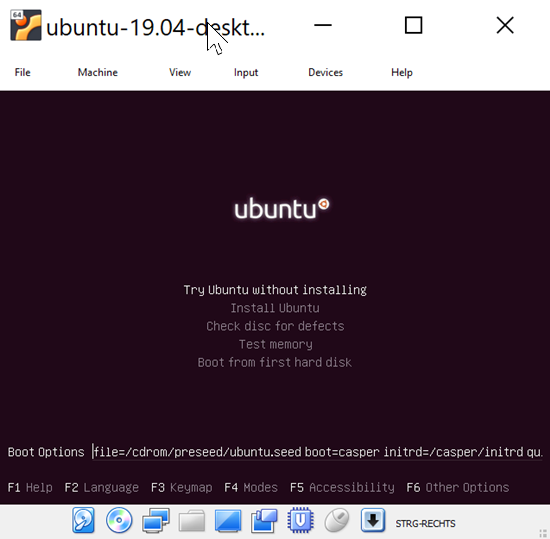

# Hashicorp Packer

Mit diesem Tool werden Images unterschiedlichster Art gebaut: Docker, AMI, VMWare, Virtualbox, ...

---

## Getting Started

Packer besteht - Hashicorp typisch - nur aus einzigen Executable - somit keine Library-Abhängigkeiten - download, unzip and ready to use :-)

> Ich verwende hier einen Windows-Rechner mit installiertem VirtualBox.

Mit dieser Beschreibung in der Datei `ubuntu-14.04.json` ([hier findet man Ubuntu-Images](http://releases.ubuntu.com/))

```
{
    "builders": [
        {
            "type": "virtualbox-iso",
            "guest_os_type": "Ubuntu_64",
            "iso_checksum": "946a6077af6f5f95a51f82fdc44051c7aa19f9cfc5f737954845a6050543d7c2",
            "iso_url": "http://old-releases.ubuntu.com/releases/14.04.1/ubuntu-14.04.1-server-amd64.iso",
            "iso_checksum_type": "sha256",
            "output_directory": "output-ubuntu-14.04",
            "vm_name": "ubuntu-14.04",
            "disk_size": 15000,
            "headless": "true",
            "http_directory": "http",
            "boot_wait": "10s",
            "boot_command": [
                "<esc><wait>",
                "<esc><wait>",
                "<enter><wait>",
                "/install/vmlinuz<wait>",
                " initrd=/install/initrd.gz",
                " auto-install/enable=true",
                " debconf/priority=critical",
                " preseed/url=http://{{ .HTTPIP }}:{{ .HTTPPort }}/preseed.cfg<wait>",
                " -- <wait>",
                "<enter><wait>"
            ],
            "ssh_timeout": "60m",
            "ssh_username": "ubuntu",
            "ssh_password": "ubuntu",
            "shutdown_command": "sudo systemctl poweroff",
            "vboxmanage": [
                ["modifyvm", "{{.Name}}", "--memory", 512],
                ["modifyvm", "{{.Name}}", "--cpus", 1]
            ]
        }
    ],
	"provisioners": [
	]
}    ```

und der Datei `preseed.cfg` im Unterverzeichnis `http` mit folgendem Inhalt

```
# Preseeding only locale sets language, country and locale.
d-i debian-installer/locale string en_US

# Keyboard selection.
d-i console-setup/ask_detect boolean false
d-i keyboard-configuration/xkb-keymap select us

choose-mirror-bin mirror/http/proxy string

### Clock and time zone setup
d-i clock-setup/utc boolean true
d-i time/zone string UTC

# Avoid that last message about the install being complete.
d-i finish-install/reboot_in_progress note

# This is fairly safe to set, it makes grub install automatically to the MBR
# if no other operating system is detected on the machine.
d-i grub-installer/only_debian boolean true

# This one makes grub-installer install to the MBR if it also finds some other
# OS, which is less safe as it might not be able to boot that other OS.
d-i grub-installer/with_other_os boolean true

### Mirror settings
# If you select ftp, the mirror/country string does not need to be set.
d-i mirror/country string manual
d-i mirror/http/directory string /ubuntu/
d-i mirror/http/hostname string archive.ubuntu.com
d-i mirror/http/proxy string

### Partitioning
d-i partman-auto/method string lvm

# This makes partman automatically partition without confirmation.
d-i partman-md/confirm boolean true
d-i partman-partitioning/confirm_write_new_label boolean true
d-i partman/choose_partition select finish
d-i partman/confirm boolean true
d-i partman/confirm_nooverwrite boolean true

### Account setup
d-i passwd/user-fullname string vagrant
d-i passwd/user-uid string 1000
d-i passwd/user-password password vagrant
d-i passwd/user-password-again password vagrant
d-i passwd/username string vagrant

# The installer will warn about weak passwords. If you are sure you know
# what you're doing and want to override it, uncomment this.
d-i user-setup/allow-password-weak boolean true
d-i user-setup/encrypt-home boolean false

### Package selection
tasksel tasksel/first standard
d-i pkgsel/include string openssh-server build-essential
d-i pkgsel/install-language-support boolean false

# disable automatic package updates
d-i pkgsel/update-policy select none
d-i pkgsel/upgrade select full-upgrade
```

wird per

```
packer build ubuntu-14.04.json
```

ein `iso`-Image im Verzeichnis `output-ubuntu-14.04-desktop` abgelegt.

> Der `boot_command`-Abschnitt ist wichtig, weil viel Betriebssystem-Installationen interaktive eingaben erwarten (z. B. Sprachkonfiguration). Die werden mit diesem Code spezifiziert. Das ist natürlich vom zum installierenden Betriebssystem (und der Version) abhängig. Am besten installiert man das System mal interaktiv in einem Virtualbox-Image und schreibt sich die Kommandos auf.

In diesem Beispiel wird per ESC der Expert-Mode für den Bootvorgang



selektiert, um erweiterte Boot-Optionen zu konfigurieren, u. a. die `preseed/url` (Erklärung siehe unten).

### Was im Hintergrund geschieht

Im Hintergrund wird durch die Packer-CLI ein neues Virtualbox-Image (mit dem Namen "ubuntu-19.10-desktop") aus dem angegebenen ISo-Image erstellt, gestartet, provisioniert (in meinem Beispiel erfolgt keine weitere Provisionierung), gestoppt und wieder gelöscht. Wird die CLI unterbrochen (Ctrl-C), so wird das Virtualbox-Image i. a. sauber wieder gelöscht (klappt leider nicht immer - Fehlermeldung "Cleanly cancelled builds after being interrupted").

Was noch geschieht:

* das Image stellt einen RDP-Port (Remote-Desktop-Protocol) zur Verfügung, um sich den Bildschirm per Windows "Remote Desktop Connection" anzuzeigen
* für die ssh-Verbindung auf den Port 22 des Linux-Systems wird ein Port-Forwarding (z. B. auf Port 3991) im Virtualbox-Image angelegt - mit dem Zweck
  * das System später sauber runterzugefahren
  * das System zu provisionieren (z. B. per [Ansible](ansible.md))
* Packer startet einen HTTP-Server - der Port wird auf der Packer-CLI-Console ausgegeben
  * Details siehe Abschnitt über den Preseed-Mechanismus
  * hierüber wird das sog. [Preseed-File](https://www.packer.io/guides/automatic-operating-system-installs/preseed_ubuntu.html) bereitgestellt, das eine unattended-Ubuntu-Installation ermöglicht

### Debian-Preseed-Mechanismus

Debian stellt für unattended-Installations (Installationen, die nicht interaktiv mit Benutzereingaben erfolgen) den sog. [Preseed-Mechanismus bereit](https://www.packer.io/guides/automatic-operating-system-installs/preseed_ubuntu.html) (ähnlich wie Cent OS Kickstarter). Hierbei wird eine `preseed.cfg` Datei benötigt, in der die notwendigen - sonst interaktiven - Eingaben hinterlegt sind.

Über den von Packer gestarteten HTTP-Server wird die Preseed-Datei zur Installation contributed.

Hier findet man eine funktionierende Konfiguration:

* https://github.com/geerlingguy/packer-boxes/tree/master/ubuntu1804

### CentOS-Kickstarter-Mechanismus

* [Cent OS Kickstarter](https://linuxhint.com/install-centos-7-kickstart/)

### Fehleranalyse

Bei mir klappte das auf Anhieb nicht - deshalb machte ich mich gleich mal mit ein paar Möglichkeiten zur Fehleranalyse vertraut:

* da ein Virtualbox-Image erstellt wird, kann man die vom VirtualBox-UI angebotenen Analyse-Möglichkeiten nutzen:
  * Bildschirm des Images ansehen (über "Show")
  * Konfiguration ansehen
  * Logfile ansehen
* im Packer-CLI wird ein Remote-Desktop-Protocol (RDP) Port ausgegeben (` virtualbox-iso: rdp://127.0.0.1:5962`) - per Windows "Remote Desktop Connection" kann man den Bildschirm des Images sichtbar machen
  * ist im Prinzip nichts anderes als über die Virtualbox-UI mit "Show"

---

## CLI

Am besten installiert man sich die Shell-Autocompletion `packer -autocomplete-install` ... und die nächste gestartete Shell stell Auto-Completion zur Verfügung

* `packer validate example.json`
* `packer build example.json`

---

## Templates

* [Doku](https://packer.io/docs/templates/index.html)

Ein Packer-Template ist eine JSON-Datei (z. B. `example.json`), in der die komplette Bauenaleitung steht. Per `packer build example.json` wird daraus dann ein Image gebaut.

---

## Builder

Die (mandatory) Builder-Sektion legt fest

* welches Image ist die Quelle?
* welcher Image-Typ soll erstellt werden?
* ...

### Docker Image Builder

* https://www.packer.io/docs/builders/docker.html

Die Konfiguration von Docker Images basiert NICHT auf `Dockerfile` sondern auf einer JSON Beschreibung der Builder- und Provisioning Scripts. Hierüber werden Docker-Container gestartet, dann erfolgt das Provisioning (per Ansible, Chef, Shellscripting, ...) und zum Schluß wird aus dem laufenden System ein Image extrahiert und zur Wiederverwendung ins Repository gelegt.

Damit ist die Sprache zunächst mal unabhängig vom Image-Typ - allerdings erfolgt die Konfiguration in einer eigenen DSL.

> ich bin gespannt wie gut sich das anfühlt bei der Fehlersuche ... da hab ich mit einer in ANT eingebetteten DSL schon mal unangenehme Erfahrungen gemacht.

### Virtualbox Image Builder

* [virtualbox-iso](https://www.packer.io/docs/builders/virtualbox-iso.html)

Dieser Builder ist einer der wenigen Packer-Builder, die nicht einfach in einer VM laufen kann, weil er eine VirtualBox-Installation benötigt und deshalb am besten auf Bare-Metal ausgeführt wird. Wer nicht über Bare-Metal verfügt, kann sich bei [packet](https://www.packet.com/) einen entsprechenden Dienst kaufen.

---

## Provisioning

Provisioning bezeichnet die Detailkonfiguration des Images (z. B. installierte Software, Konfiguration). Hier werden u. a. folgende Ansätze unterstützt:

* Shell
* Ansible
* Chef
* Puppet
* Salt
* ...

### Ansible Provisioning

---

## Post-Processors

Nach der Fertigstellung des Images werden die Artefakte in einem Repository gespeichert - das erledigen die Post-Processors:

* Docker Push
* Amazon Import
* Vagrant Cloud
* Google Compute Export
* vSphere
* ...

---

## Jenkins Integration

Packer läßt sich beispielsweise folgendermaßen in eine Jenkins-Pipeline integrieren:

```json
pipeline {
    environment {
        PATH="${tool('packer')}:$PATH"
    }
    stage('Build docker image') {
        environment {
            PACKER_NEXUS = credentials("bla")
            PACKER_ANSIBLE_VAULT = credentials("blub")
        }
        steps {
            dir('packer') {
                sh "set -e; packer version"
                sh "set -e; packer validate config.json"
                sh "set -e; packer build config.json"
            }
        }
    }
}
```
