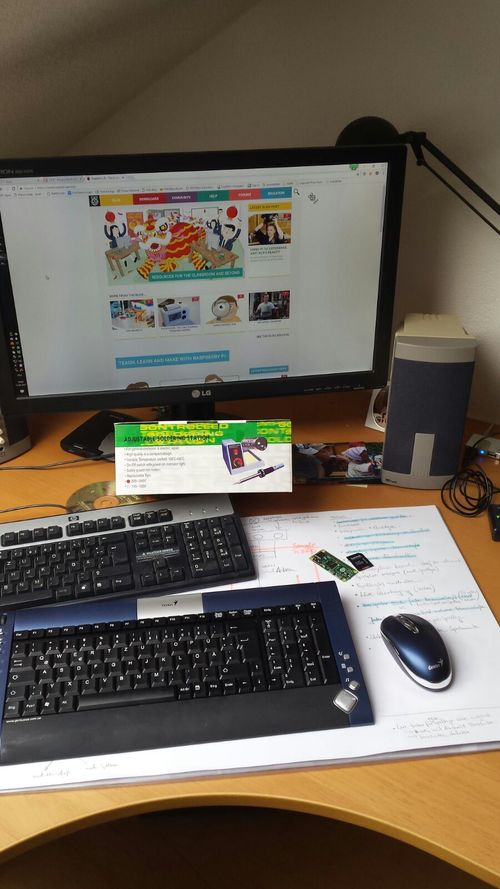

# Projekt Sportstracker

Meine Jungs spielen gerne Fussball/Hockey im Keller und spielen dabei mittlerweile immer die Torhymnen ab. Leider wird das Spiel dadurch immer wieder unterbrochen und wir haben uns überlegt, daß wir Buzzer für die Tore bräuchten.

Schnell kamen weitere Ideen dazu:

* Spielstand
* Buzzer für Spielunterbrechung
* Restspielzeit
* Spielplan für eine Saison
* Tabelle
* Single-Player-Mode
* verschiedene Sportarten (Fußball, Eishockey, Handball, Baketball)
* bei Tor Licht aus im Raum und Lichtorgel
* Restzeitansage (eine Minute vor Schluß)
* Videoübertragung
* Torlinientechnik
* Smartwatch-Anbindung für die Dokumentation von Toren und Torschützen bei richtigen Ligaspielen
  * DFB.net bzw. fussball.de Anbindung
* ...

Lange habe ich überlegt wie ich mit meinen Kindern ein wenig kreativ computern könnte und sie an die Faszination Computer/Softwareentwicklung heranführen könnte. Alle bisherigen Ideen kamen aus meinem Umfeld und ich hatte immer den Eindruck, daß ich sie damit nicht würde begeistern können ... und ich gehe mal davon aus, daß es sich hierbei um ein Dauerprojekt handelt, das mehrere Jahre in Anspruch nehmen könnte (wenn es gut läuft). Hier braucht es also entsprechende Motivation.

Auf dieses Projekt sind sie gleich aufgesprungen und haben eigene Featureideeen entwickelt.

Unsere ersten Ideen

> Leider haben wir das Projekt nicht lange verfolgt. Es fehlten einfach doch noch die Grundlagen. Das wollen wir nun im Jahr 2020 mit [Scratch](scratch.md) nachholen. Die ersten Grundlagen wurden bereits in der Schule gelegt. Langfristig wollen wir aber weiterhin mit dem [Raspberry Pi](raspberrypi.md) rumspielen. Projekte wie [Lucky Luke auf einer selbstgebauten Spielekonsole](https://github.com/mobi3006/pico) eröffnen doch viel mehr Möglichkeiten.

## Aufbau

Neben einem Raspberry PI (Zero) würden wir evtl. einen Server (im Internet) einsetzen ... am Anfang übernimmt der Raspberry PI den Server Part und die Anbindung der Buzzer. Zur Konfiguration des Spiels verwenden wir Tablets/Handys. Man könnte irgendwann dann auch einen Laptop integrieren, um beispielsweise einen Drucker anzusteuern.

## Raspberry PI Zero

Seit zwei Jahren habe ich dieses 5 Euro Ding zuhause rumliegen ... auf diese Weise sehen sie zumindest schon mal was einen Computer ausmacht. Würden wir die GPIOs anlöten und ein paar LEDS zum leuchten bringen, dann wäre das ein guter Start. Irgendwann würde der PI in einem Gehäuse verschwinden und das ganze viel professioneller aussehen (aber sie würden sich noch an den Anfang erinnern).

## Los geht's

Der Lötkolben steht auch schon parat... das dauert aber noch, denn zunächst werden wir uns mal mit der Software beschäftigen ... Hardware wird später eingebunden:

... die Gummibärchen vertilgt ... jetzt hat der Raspi ein zuhause:

Sieht doch schon ganz brauchbar aus:

Leider blieb beim ersten Startversuch der Bildschirm schwarz ... so ists halt - die Fehlersuche beginnt.

## Jetzt geht' wirklich los

Nachdem wir die Idee schon 2016 entwickelt haben, sind wir bis Frühjahr 2018 nicht wirklich weiter gekommen. Um nun ein bisschen Speed draufzubekommen, werde ich nun dieses Projekt auch für MICH als Lernprojekt zu verwenden. Hier kann ich neue Technologien in ganz viele verschiedene Richtungen (Microservices, UI, Cloud-Deployment, ...) ausprobieren. Vielleicht bekommen wir so endlich mal was zum Laufen ... und ich finde den richtigen Weg, die Kinder zu integrieren. Das Setup eines solchen Projekts ist für die Kinder sicher zu dröge (und ich habe ja selbst noch keinen Plan) - da sind sie zu ungeduldig. Ich stelle mir vor, daß sie am Anfang vielleicht gar nicht programmieren, sondern Logos/Icons malen, Hymnen zusammenschneiden, ... und natürlich bei der Ideefindung und beim Design (z. B. Domainmodel) mithelfen.

### GitHub - Sportstracker

* CI über [Travis](travis.md) ... sehr gute GitHub Integration ... einfach `.travis.yml` ins Git-Repository packen