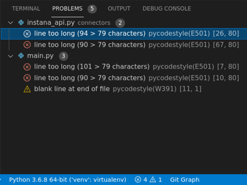
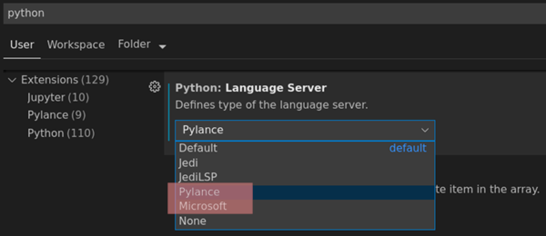

# Python

Python unterstützt verschiedene Paradigmen (prozedurale, funktionale, objektorientierte). Es handelt sich um eine interpretierte Sprache - somit entfällt das lästige Erstellen compilieren (man kann aber auch Just-In-Time-Compiler wie [PyPy](https://de.wikipedia.org/wiki/PyPy) verwenden) ... einfach Editor auf und coden - was man eben von einer Skriptsprache erwartet. Auf diese Weise kann man es auch sehr praktisch mit [Shellprogrammierung](shellprogramming.md) mixen oder die [Shellskripte vielleicht sogar ablösen](https://medium.com/capital-one-developers/bashing-the-bash-replacing-shell-scripts-with-python-d8d201bc0989).

---

## Best Practices

Als Newbe sollte man sich strikt an Best-Practices halten. Das gilt auch für erfahrene Software-Entwickler, die nun Python neu entdecken. Jede Sprache hat ihre Idiome, die es erfahrenen Python-Entwicklern einfachen machen, den Code zu lesen und zu verstehen. Wenn man sich selbst dann für Python-erfahren genug hält kann man sicher das ein oder andere anders machen.

### Coding Style

* [Official Python Code Style - PEP8]
* [Google Python Style Guide](https://github.com/google/styleguide/blob/gh-pages/pyguide.md)

Ich denke, man sollte das Rad nicht neu erfinden und sich an einen weit akzeptierten Styleguide halten - einen Custom-Styleguide zu entwerfen halte ich für Zeitverschwendung. Zur Not muss man seinen Style halt leicht modifizieren (fällt mir als Python Newbe vielleicht auch besonders leicht, da ich noch keinen eigenen Style habe).

Solche Prüfungen sollte die IDE auch unterstützen und überprüfen. Hierzu verwendet man sog. Linter. [Visual Studio Code unterstützt verschiedene Linter](https://code.visualstudio.com/docs/python/linting), der Default is Pylint, doch verwende ich für die Auto-Formatierung schon PEP8 und deshalb möchte ich auch diesen Coding Style verwenden:

* ich selektiere über die Command Palette "Python: Select Linter / pycodestyle"
  * laut Doku ist der PEP8 kompatibel
* die Aufforderung zur Installation nehme ich an
* anschließend enable ich Linting über Command Palette "Python: Enable/Disable Linting"

Danach sehe ich die Style-Abweichungen in der Status-Leiste und dem Problems Tab:



Die Linter lassen sich über die VSCode `settings.json` den eigenen Ansprüchen entsprechend konfigurieren:

> "python.linting.pycodestyleArgs": ["--ignore=E303"]

Mit `yapf` kann ich die Formatierungsprobleme automatisch lösen - sehr praktisch.

### Formatting

Immer wieder ein Streitpunkt unter Entwicklern ... Tabs oder Spaces, Einrückungen, ... blablabla. Ich mag den Ansatz von Golang, daß der Code immer automatisch formatiert wird und somit bei JEDEM Entwickler gleich aussieht. Ende der Diskussion.

Meine Empfehlung ist die Verwendung von [yapf](https://github.com/google/yapf/). Hierbei handelt es sich um ein Python-Package (`pip install yapf`), das den Code auto-formatiert. Ich verwende es i. a. so (`venv` ist der Ordner meiner virtuellen Python Umgebung ... den Python-Source-Code der Distribution möchte ich nicht umformatieren):

```bash
yapf --in-place --recursive --style="{based_on_style: google, indent_width: 3}" --exclude "venv/**" **/*.py
```

`yapf` ist über ein `.style.yapf` (beispielsweise im Root-Folder eines Projekts) konfigurierbar, so daß man dort obige CLI-Options auch so abbilden kann

```ini
[style]
based_on_style=pep8
indent_width=4
```

Ich habe diesen Alias in meiner Shell definiert:

```bash
alias yapf="yapf --in-place --recursive --exclude 'venv/**' **/*.py"
```

Mit einem einfachen `yapf` kann ich somit eine Formatierung vornehmen.

> Wenn man Bulk-Formatierungen vornimmt, sollte man das in einem eigenen Commit von anderen Änderungen separieren und in der Commit-Message entsprechend kennzeichnen. Am besten ist, wenn diese Formatierung IMMER vor einem Commit abläuft.

---

## Versionen

Python gibt es in verschiedenen Versionen. Version 2 (hat am 1.1.2020 sein End-of-Life erreicht) und 3 sind zueinander inkompatibel. Dieser Code

```python
stadt = input("In welcher Stadt wohnst Du?")

if "berg" in stadt:
  print("Du wohnst am Berg :-)")
else:
  print("Du wohnst NICHT am Berg :-)")
```

läuft in Python 3 aber nicht in 2.

Glücklicherweise lassen sich beide Versionen parallel betreiben, da die Binaries dann `python`, `python2` oder `python3` heißen (es gibt noch weitere Binaries, die dieses Konzept dann auch verwenden). Am besten funktioniert das mit virtuellen Environments (siehe unten), so daß man unabhängig von der Version immer mit `python` arbeiten kann.

### Linux - switch to Python 3 default

Ich hatte ein realtiv altes Ubuntu-System, das noch Python 2 als default verwendete. Python 3 war schon installiert, doch ich wollte nicht immer `python3` eingeben müssen, um den "richtigen" Interpreter zu starten. Leider besteht Python nicht nur aus dem Interpreter, sondern auch aus dem Paketmanager `pip` und noch weiteren Tools (`pipenv`, ...), die dann alle zueinander passen müssen. Das kann ganz schön nerven.

Es gibt verschiedene Lösungen

* [siehe hier](https://linuxconfig.org/how-to-change-from-default-to-alternative-python-version-on-debian-linux)

Aus meiner Sicht sollte man IMMER virtuelle Environements verwenden.

---

## Installation

### Ubuntu via APT

Install Python `sudo apt-get install python3-pip` and create a file `hello.py`

### Ubuntu tarball

* [so gehts](https://realpython.com/installing-python/)

Über einen tarball (z. B. `Python-3.9.5.tgz`) ist es häufig einfacher eine bestimmte Version oder die neuesten Versionen zu installieren. Evtl. hat die verwendete Linux-Distribution kein Paket für die relevante Version.

Über einen tarball compiliert man Python aus den Sourcen selber innerhalb weniger Sekunden. Man braucht allerdings auch ein paar Development Packages (siehe offizielle Dokumentation). Leider führen fehlende Developer Packages nicht sofort bei `configure`, `make` oder `altinstall` (siehe unten) zu einem Fehler. Stattdessen können die Fehler später (z. B. `pip install -r requirements.txt`) zu einem Abbruch führen. Das ist leider recht frustrierend :-(

> DESHALB: der abschließende Test der Installation per `python -m test` ist **absolut erforderlich**, um spätere Probleme zu vermeiden, die man dann nicht so einfach einer unvollständigen/fehlerhaften Installation zuordnen kann. Nichtsdestotrotz kann man den Test natürich jederzeit durchführen.

Danach gehts per

```bash
wget https://www.python.org/ftp/python/3.8.10/Python-3.8.10.tgz
tar xvf Python-3.8.10.tar.xz
cd Python-3.8.10
./configure --enable-optimizations --with-ensurepip=install
make -j 8

sudo make altinstall
```

> ACHTUNG: das Scripting scheint das Fail-Fast-Prinzip zu ignorieren ... so brach `make` bei mir nicht beim ersten Fehler ab. Glücklicherweise war der Fehler auffällig in rot im Consolen-Output zu sehen ... sonst wäre mir das nie aufgefallen.

Der letzte Befehl ist entscheidend und wird unbedingt empfohlen. Hierdurch wird die neue Version parallel zu den bereits existierenden installiert und ersetzt diese nicht.

> In obigem Beispiel wurde eine Version `/usr/local/bin/python3.8` installiert, die sich übrigens nicht neben den per APT installierten Versionen `/usr/bin/python` (Python 2) und `/usr/bin/python3` (Python 3).

Anschließend teste ich die Version über eine virtuelle Umgebung:

```bash
cd my-project
virtualenv --python=/usr/local/bin/python3.8 venv
source ./venv/bin/activate

python --version

python -m test
```

Wenn alle Tests (dauernn schon ein paar Minuten) erfolgreich waren, dann kanns losgehen :-)

### iOS Pythonista

Auf meinem iPad habe ich die App Pythoista installiert, mit der sich kleinere Programme auch unterwegs implementieren lassen. Die vorhandenen Bibliotheken sind natürlich eingeschränkt (es ist aber mehr als die Python-Standardinstallation), doch für Algorithmen reicht es allemal.

### Online Entwicklungsumgebungen

* [Repl.it](https://replit.com/)
* [Python anywhere](https://www.pythonanywhere.com/)
* ...

---

## Nutzungsmodi

### Python Shell Mode

Dieser Modus wird per `python` gestartet ... es ist anschließend kein Editor notwendig, um Dateien zu editieren und zu speichern. Stattdessen wird der Code direkt in die Shell geschrieben und direkt ausgeführt. Das ist sehr praktischen, wenn man mal eben schnell eine Berechnung wie beispielsweise `print(2**10)` ausführen will. Streng genommen, kann man sich das `print` sparen und einfach `2**10` eingeben. Die Werte der Expressions werden in diesem Modus automatisch ausgegeben.

```python
>>> 2**10
1024
>>> print(2**10)
1024
>>> "Pierre"
'Pierre'
>>> vorname="Pierre"
>>> nachname="Feldbusch"
>>> vorname + " " + nachname
'Pierre Feldbusch'
```

### In File-Mode

In diesem Modus muß man dem Python-Interpreter eine Datei (= Modul) vorwerfen, die er dann interpretiert/ausführt:

```bash
echo "print(42)" > main.py
python main.py
```

wird dann die Zahl `42` ausgegeben :-)

---

## Visual Studio Code

* [Tutorial](https://code.visualstudio.com/docs/python/python-tutorial)
* prepare System - see above

Starte Visual Studio Code and installiere [Visual-Studio-Code Python Extension von Microsoft](https://marketplace.visualstudio.com/items?itemName=ms-python.python). Create a file `hello.py`:

```python
msg = "Hello World, Pierre"
print(msg)
```

Führe anschließend den Code per "Run Selection/Line in Python Terminal" aus :-)

In der unteren blauen Statusleiste ist die verwendete Python-Version zu erkennen. Hier kann man die Version auch umschalten ... beispielsweise auf ein Virtuelles Environment.

Nichtsdestotrotz hatte ich mit den Default-Einstellungen der Python-Extension einige Probleme:

* Navigieren in importierte Module (auch meine eigenen, die sich direkt im gleichen Git-Repository befinden) funktioniert nicht. Hierzu finde ich diesen Beitrag:
  * [Stackoverflo](https://stackoverflow.com/questions/53939751/pylint-unresolved-import-error-in-visual-studio-code)
* der Wechsel des Python-Interpreters funktioniert nicht zuverlässig. Ich muß dann immer mal die Datei wechseln, um den neuen Interpreter auch tatsächlich in der Statusleiste angezeigt zu bekommen
* nach Installation eines Moduls per `pip install module` (über meine Console oder auch das VSCode Terminal) steht das Modul scheinbar noch nicht zur Verfügung. Ein `import module` sorgt für einen Fehler, der erst durch einen VSCode-Neustart verschwindet

Nach Umstellen vom Microsoft Language-Server auf Pylance hat alles schon viel besser funktioniert:



Enthält ein Projekt eine Virtuelle Umgebung z. B. in `PROJEKT/venv-myproject` so erkennt das VSCode und verwendet den darin befindlichen Interpreter und deren Libraries. In der unteren blauen Statusleiste ist das zu erkennen - hierüber kann man au

---

## Python Virtual Environments

* [Getting Started](https://docs.python-guide.org/dev/virtualenvs/)
* [Tutorial](https://docs.python.org/3/tutorial/venv.html)

> ACHTUNG: virtuelle Environments erfordern die Bereitstellung von Python-Versionen auf dem System ... das virtuelle Environment bringt diese nicht mit.

Bei diesem Ansatz werden Bibliotheken und Interpreter in einem applikationsspezifischen Verzeichnis installiert, so daß verschiedene Ausführungsumgebungen voneinander getrennt werden können. Auf diese Weise werden Konflikte vermieden und man kann sich nicht auf Bibliotheken stützen, die im Zusammenhang mit einem anderen Projekt installiert wurden ... das verbessert die Qualität in den projektspezifischen Dependencies (`requirements.txt` Datei).

Das Paket zum Management dieser virtuellen Umgebungen wird per `sudo apt install virtualenv` installiert (unter Windows habe ich `pip install venv` verwendet und das Installationsverzeichnis anschließend in den `PATH` gepackt). Per (z. B.) `virtualenv ~/ideWorkspaces/venv/jenkins-stats` wird ein virtuelles Environment im Ordner `~/ideWorkspaces/venv/jenkins-stats` angelegt.

> Ich präferiere, das virtuelle Environment in einen Subfolder (z. B. `~/src/jenkins-stats/venv`) des Git-Repo's zu packen, das den Source-Code enthält. Zumindest, wenn ich den Source-Code selbst unter Kontrolle habe, denn dann füge ich `venv` zur `.gitignore` des Repos hinzu. Aus meiner Sicht erhöht das die Übersichtlichkeit ... das virtuelle Environment liegt nicht mehr irgendwo, sondern direkt im Python-Projekt.

So sieht der ganze Prozess dann aus:

```bash
git clone https://github.com/HewlettPackard/Jenkins-stats.git jenkins-stats
cd jenkins-stats
mkdir venv
echo venv >> .gitignore
virtualenv venv
source venv/bin/activate
```

 Anschließend befinden sich in diesem Verzeichnis einige Shell-Skripte. Um diese Umgebung zu aktivieren wird `source ~/src/jenkins-stats/venv/bin/activate` ausgeführt. In meiner zsh-Shell ändert sich dadurch der Command-Prompt ... der Name der aktuell aktiven  virtuellen Umgebung ist erkennbar:

```log
╭─pfh@workbench ~/src/com.github  
╰─➤  source ~/ideWorkspaces/venv/jenkins-stats/bin/activate
(jenkins-stats) ╭─pfh@workbench ~/src/com.github
```

Die typischen Python Kommandos (`python`, `pip`, ...) sind nun auf die Skripte in der virtuellen Umgebung (`~/src/jenkins-stats/venv/bin/python`) umgebogen. Die Installation von Libraries per `pip install Jinja2` oder `pip install -r requirements.txt` führen zur Installation der Pakete im virtuellen Environment (`~/src/jenkins-stats/venv/lib`) ... nicht im System-Installationsverzeichnis für Python-Module.

`virtualenv` verwendet dabei die auf dem System verfügbare Default-Python-Version (die per `python` verfügbar ist)... kopiert dabei aber die Executables in die virtuelle Umgebung. Hat man noch eine andere Python-Version (z. B. `python3`) installiert (aber Python 2 war der Default bei `python --version`), so kann man diese per

```bash
virtualenv --python=/usr/bin/python3 venv
```

Ist dies die erste Python Version in dem virtuellen Environment, dann wird sie per `python --version` verfügbar sein ... es muß kein `python3 --version` verwendet werden.

> ich habe lange überlegt, ob ich meinen virtuellen Environments einen kontextabhängigen Namen geben soll, damit ich in meiner ZSH-Shell immer weiß welche virtuelle Umgebung (wird dort angezeigt) aktiviert ist. Letztlich habe ich mich dagegen entschieden und verwende IMMER `venv`. Erstens scheint das der Standardname zu sein und zweitens kann ich so einfach `venv` in jedes meiner `.gitignore` packen. Vor der Python-Nutzung initialisiere ich dann immer die virtuelle Umgebung ... hierzu verwende ich einen `alias venv=./venv/bin/activate`. Für die Erzeugung habe ich einen anderen `venv-create='virtualenv --python=/usr/bin/python3 venv`. Das macht das Handling komfortabler ... ich könnte auch ein Shellscript als Decorator um `python` bauen, um eine  automatische Aktivierung durchzuführen (aber natürlich müßte ich dann auf der Konsole immer im Python-Projekt stehen, um die passende Umgebung zu finden).

Das Umschalten auf eine neue virtuelle Umgebung ist in VSCode ein bisschen umständlich, wenn ich einen Workspace verwende, der ganz viele Projekte (auch mit unterschiedlichen virtuellen Umgebungen) enthält. Starte ich hingegen einen VSCode-Worspace mit nur einem Projekt/Verzeichnis, unter dem sich dann auch gleich der Ordner `venv` befindet, dann ist das super komfortabel, da meine `venv`-Umgebung sofort zur Auswahl steht.

---

## Sprache

Man sollte sich an die typischen Idiome/Patterns halten und auch den [Styleguide](https://google.github.io/styleguide/pyguide.html) berücksichtigen. Bestenfalls unterstützt die IDE hierbei und gibt Warnungen aus, wenn sie nicht eingehalten werden (Stickwort Linting).

Ganz wichtig:

* eine Python-Datei (`foo.py`) repräsentiert ein Modul, das wiederum ... wild gemischt enthalten kann
  * ausführbaren Code (`print("pierre")`)
  * Funktionsdefinitionen (`def foo():`)
  * Klassendefinitionen (`class Foo:`)
  * Meta-Daten (`import random`)

### Besonderheiten

* Variables don’t have types in Python; values do. That means that it is acceptable in Python to have a variable name refer to an integer and later have the same variable name refer to a string.
* Python unterstützt viele Programmier-Paradigmen ... prozedural, objektorientiert, funktional. Für mich als Java-Entwickler war die Mischung am Anfang etwas befremdlich, d. h. man schreibt sein Hauptprogramm `main.py` und darin sind dann prozedurale Element (Initialisierung), aber auch schon gleich erste Klassen. Eine Mixtur aus Klassen und Initialisierung globaler Variablen. Geht sicher auch anders oder ist das ein gängiges Idiom? Vielleicht habe ich nur keinen Çlean-Code gesehen ...
* Python hat Built-In-Funktionen wie `type`, `len`, `input`, `range` ... diese können ohne `import` genutzt werden
  * [vollständige Liste](https://docs.python.org/3/library/functions.html)
* Datentypen wie `int`, `string`, Listen, Tupel haben eingebaute Funktionen, die man nutzen kann ... (`print("Pierre".count("r"))`
  * `"Pierre".split("e")`
* `"_".join(["P", "i", "e", "r", "r". "e"])`

### Variablen

Global-Namespace vs. Local-Namespace:

```python
def anyFunction(x):
  m = 8
  z = m + 6
  w = y + 1
  y = x * x + k
  return y

y = 5
k = 3
m = 1
```

In diesem Fall ist `y` im globalen Namespace definiert - innerhalb der Funktion `anyFunction` wird `y` allerdings als lokale Variable behandelt, weil sie eine Zuweisung (`y = x * x + k`) erhält. Im lokalen Kontext hat die Variable aber keinen Wert und es wird zu einem Fehler kommen.

Im Gegensatz dazu hat die globale Variable `k` in `anyFuntion` keine Zuweisung, sodaß innerhalb `anyFuntion` der globale Wert `k = 3` verwendet wird.

`m` hingegen ist sowohl im globalen Namensraum als auch im lokalen Namensraum von `anyFuntion`. Der lokale Namensraum hat höhere Priorität.

> Absurd ist in Python, daß man `global m` definieren könnte und dann würde innerhalb `anyFuntion` der Wert aus dem globalen Namensraum verwendet. Wer ist das denn für ein Quatsch???

### Einrückung

Einrückungen sind bei Python wichtig. Bei Kontrollstrukturen ist das gleich offensichtlich. Bei folgendem Code nicht sofort ... dieser Code ist syntaktisch falsch wegen der Einrückung:

```python
    fruit = "Banane"
    print(fruit)
```

So muß es aussehen:

```python
fruit = "Banane"
print(fruit)
```

### Standarddatentypen

* int
* float
* str
* bool (`True`, `False`)

Man kann den Type eines Wertes per "Casting" verändern `int5 = int("5")`.

### Sequences

Sequences sind die Datentypen

* String (immutable)
* List (mutable) ... mit eckigen Klammern definiert
  * ändern `names[1] = "Pierre"`
  * einfügen `names[1:1] = ["Jonas", "Robin"]`
  * anhängen `names += ["Jonas", "Robin"]`
  * löschen
    * `names[1:3] = []`
    * `del names[1:3]`
  * Liste clonen by Slice-Operator: `namesClone = names[:]`
  * der Operator `+=` hat ein spezielles Handling bei (mutable) List: "obj = obj + object_two is different than obj += object_two ... The first version makes a new object entirely and reassigns to obj. The second version changes the original object so that the contents of object_two are added to the end of the first."
    * Empfehlung: den `+=` Operatior nicht bei Listen - oder besser - gar nicht verwenden
* Tuple (immutable) ... mit runden Klammern definiert
  * die runden Klammern können weggelassen werden ... die beiden folgenden Tupel sind semantisch gleich

      ```python
      tupelA = ( "Banane", "Apfel", "Pfirsich" )
      tupelB = "Banane", "Apfel", "Pfirsich"
      ```

Besonderheiten von Sequenzen

* bei immutable Datenstrukturen nimmt Python eine Speicheroptimierung vor und speichert den gleichen Wert nur ein einziges mal (Aliasing) - bei mutable Datentypen ist das nicht der Fall!!!
* `list = ["hello", 2.0, 5, [10, 20]]` ist in Sprache wie Java nicht erlaubt, weil die Werte unterschiedlichen Typs sind ... in Python ist das erlaubt wegen der Regel "Variablen haben keinen Typ - Werte haben einen Typ"
  * mit Listen funktionieren auch typische Operatoren wie `+` und `*`
    * `blist = alist * 2`
* `tupel = ("hello", 2.0, 5, [10,20])` ist ein Tupel ... sieht einer List `list = ["hello", 2.0, 5, [10,20]]` sehr ähnlich ist aber immutable
* Sequenzen unterstützen Slicing ... List-Slices sind Listen, Tupel-Slices sind Tupel, String-Slices sind Strings:
  * `name = Pierre; inBetween = name[1:len(name)-2]`
* `map`
* `set`: `myset={"Pierre", "Silke", "Jonas"}`
  * mit comprehensions: `a = {x for x in 'abracadabra' if x not in 'abc'}`
  * Operationen: `myset - { "Pierre" }` liefert `{"Silke", "Jonas"}`
* Tupel: `('n', 'no', 'nop', 'nope')`
  * Elemente müssen nicht vom gleichen Datentyp sein: `((12345, 54321, 'hello!'), (1, 2, 3, 4, 5))`
  * im Gegensatz zu `list` ist ein Tuppel immutable und hat i. a. unterschiedliche Datentypen - Tupel werden in anderen Use-Cases verwendet

### Sequence - String

Speicheroptimierung:

```python
fruitA = "Banane"
fruitB = "Banane"
print("expected True", fruitA is fruitB)
print("expected True", fruitA == fruitB)
```

* mit String kann man "rechnen"

    ```python
    def multiply(s, mult_int):
        return s * mult_int
    print(multiply("Hello", 3))      # HelloHelloHello
    ```

* immutable Functions:
  * `nameUpper = "Pierre".upper()`
  * `nameLower = "Pierre".lower()`
  * `stripped = "    Das ist ein Test      ".strip()`
    * `strip` entfernt auch Zeilenumbrüche
  * `replaced = "Das ist ein Test".replace("a", "b")`
  * `print("Hallo {}, ich bin {} Jahre alt und ich habe {} Euro in der Brieftasche".format("Pierre", 13))`
    * [String-Formatierungsvarianten]()
    * hier kann man den Wert noch formatieren (z B. `print("Hallo {}, ich bin {} Jahre alt und ich habe {:.2f} Euro in der Brieftasche".format("Pierre", 13, 100))`)
    * noch schöner ist, wenn man den Platzhaltern Namen geben kann
      * das vereinfacht Refactorings am String, weil die Reihenfolge der Variablenwerte keine Rolle spielt:
        * `print("Hallo {name}, ich bin {alter} Jahre alt und ich habe {betrag:.2f} Euro in der Brieftasche".format(name="Pierre", alter=13, betrag=100))`
      * wiederholte Strings müssen nicht als Werte wiederholt angegeben werden:
        * `print("Hallo {name}, ich bin {alter} Jahre alt und ich habe {betrag:.2f} Euro in der Brieftasche. Bis bald, {name}".format(name="Pierre", alter=13, betrag=100))`
    * mittlerweile hat sich der f-String durchgesetzt, der noch leichter lesbar ist
      * `print("Hallo {name}, ich bin {alter} Jahre alt und ich habe {betrag:.2f} Euro in der Brieftasche")`

### Sequence - List

mit mutating Functions:

* `list.append("banana")`
  * im Gegansatz zu `list = list + ["banana"]`, das zwischenzeitlich eine neue Liste erzeugt, dann die `list`aber auf die neue Liste zeigen läßt. Im Endergebnis gleich, aber technisch anders
* `list.count("banana")`
* `list.insert(1, "banana")`
* `list.index("banana")`
* `list.remove("banana")`
* `list.reverse()`
* `list.sort()`
  * mutating Method => funtioniert nicht auf Tupels
  * alternativ (und auch funktionaler, da immutable) kann man die Built-In-Funktion `sorted(list)` verwenden, die dann auch auf immutable Sequences funktioniert
* `list.sort(key=None, reverse=False)`
* `list.pop()`
  * auf diese Weise lassen sich mit `append` und `pop` Stacks implementieren
* `list.popleft()`
  * auf diese Weise lassen sich Queues mit `list.append()`/`list.popleft()` implementieren
    * nicht performant - besser `queue` aus dem `collections`-Paket verwenden

### Sequence - Tupel

Speicheroptimierung:

```python
fruitsA = [ "Banane", "Apfel", "Pfirsich" ]
fruitsB = [ "Banane", "Apfel", "Pfirsich" ]
print("expected False (compare identical object)", fruitsA is fruitsB)
print("expected True (compare content!!!)", fruitsA == fruitsB)
print("expected False", id(fruitsA) == id(fruitsB))
```

Mit Tupel-Assignment läßt sich das Tauschen von Variablenwerten sehr elegant beschreiben:

```python
a = 3
b = 5
print(a, b)
a, b = b, a
print(a, b)
```

Auf Tupeln kann man per `sorted` sortieren (Breaking Ties Eigenschaft):

```python
list = [(3, 5), (1,4), (1, 3)]
print(sorted(list)    # [(1, 3), (1, 4), (3, 5)]
```

Diese Eigenschaft kann man gut verwenden, um komlexe Sortierkriterien zu definieren:

```python
list = ["Anton", "Zorro", "Nathan", "12345", "Robin"]
print(sorted(list, key=lambda name: (len(name), name))    # ["12345", "Anton", "Robin", "Zorro", "Nathan"]
```

### Dictionary

* Dictionary (Key-Value-Maps) ... mit geschweiften Klammern:
  * `tel = {'jack': 4098, 'sape': 4139}`
  * `tel['pierre']=3006` => `{'jack': 4098, 'sape': 4139, 'pierre': 3006}`
* ungeordnet
* der Zugriff ist aber - wie bei den Squenzen - über eckige Klammern

```python
# Creation at initialization time
dictAlt = { "one":"eins", "two":"zwei", "three":"drei" }
print(dictAlt)

# Creation after creation
dict = {}
dict["one"] = "eins"
dict["two"] = "zwei"
dict["three"] = "drei"
dict["wasauchimmer"] = ["pierre", "feldbusch", 1972]
print(dict)

del dict["wasauchimmer"]

# dict.keys() erzeugt nur ein Iterable, aber keine list ... aber wird können es per cast transformieren
for key in dict.keys():
  print(key, ":", dict[key])

for value in dict.values():
  print(value)

# hier wird eine List erstellt und ist damit ein Iterator
for item in dict.items():
  print("key: ", item[0], "value", item[1])
# ... aber VIIIIEL eleganter <==== IDIOM
for k, v in dict.items():
  print("key: ", k, "value", v)

# dict implementiert einen Iterator ... wie list/tupel
for key in dict:
  print(key, ":", dict[key])

if "two" in dict:
  print("two ist drin")

# wenn man auf einen Key per Indexing zugreift, der nicht existiert, gibt es einen Fehler
# Wenn man also nicht genau weiß, ob der Key drin ist, dann sollte man es vorher
# prüfen (um den Runtime-Error zu vermeiden) oder die get-Methode verwenden
value = dict.get("Pierre")          # liefert None
if value is None:
  print("nicht gefunden")
else:
  print(value)
print(dict.get(value, "default"))   # liefert default
if value in dict:
  print(dict[two])

feldbusch = { "Pierre" : 48, "Pierre": 76 }
print(feldbusch["Pierre"])        # liefert 76

# dictionary sortieren nach values
dict = { "Pierre" : 48, "a": 76, "b": 14, "c": 100 }
for k in sorted(dict.keys(), key=lambda k: dict[k]):
  print(k, dict[k])
# ... oder noch kürzer ... das sieht doch schon fast wie eine DSL aus :-)
for k in sorted(dict, key=lambda k: dict[k]):
  print(k, dict[k])
```

### Type Hints

* [Guide](https://realpython.com/python-type-checking/)

Python ist eine untypisierte Sprache ... Variablen haben keine Datentypen ... Werte haben Datentypen. Deshalb ist folgendes problemlos möglich:

```python
var = "Pierre"
print(var)
var = 42
print(var)
```

Die Variable ändert seinen Typ zur Laufzeit. Bei kleineren Skripten und wenigen Datentypen ist das ganz ok, doch hinsichtlich der Lesbarkeit des Code ist schwierig. Hier weiß man nicht, ob das Ergebnis ein String ist oder eine Liste oder gar ein Set:

```python
def getServices(category):
  if category == "backend":
    return [ "a", "b", "c" ]
  else:
    return [ "d", "e", "f" ]
```

Erst in der Implementierung erkennt man den zurückgegebenen Datentyp Liste. Bei komplexeren Methoden mit evtl. mehreren `return` Statements kann das problematisch werden - die Folge sind Fehler ... zudem will niemand unleserlichen Code refactorn (der Anfang vom Ende).

Aus diesem Grund hat Python aus Type Checking eingführt, so daß man dem Code mit

```python
from typing import List

def get_services(category:str) -> List[str]:
  if category == "backend":
    return [ "a", "b", "c" ]
  else:
    return [ "d", "e", "f" ]

services = get_services("backend")
```

mehr Semantik verleihen kann. Das verhindert erstens Fehler und ermöglicht zudem eine bessere Code-Navigation in der IDE mit Auto-Completion-Support (bei Eingabe von `service.` in der IDE werden nur die Funktionen/Methoden einer `List` zur Auswahl gestellt). So klappt das Tippen doch gleich viel schneller und mit weniger Fehlern.

Type checking zur Compile-Zeit bzw. vor der Ausführung hat man damit aber noch nicht ... zumindest nicht mit `python` von der Console. Eine gute Python-IDE kann hier helfen.

### Alias Types

Mehrfach geschachtelte Typen wie z. B. `List[Tuple[str, str]]` sind i. a. recht schwer zu lesen. Hier kann es helfen einen Alias zu definieren, der einen semantischen Namen verwendet, so daß man dann

```python
Card = Tuple[str, str]
Deck = List[Card]
```

verwendet. Aus meiner Sicht deutlich besser zu lesen.

> An dieser Stelle kann man allerdings auch eine Klasse `Card` definieren. Das hätte den Vorteil, daß man dann auch noch Methoden reinpacken kann. Aus meiner Sicht sind Alias ein guter Mittelweg zwischen nichtssagenden Datentypen und Klassen mit Daten und Methoden.

### Exceptions

Exceptions dienen der Behandlung von Ausnahme-Situationen. Sie sollen verhindern, daß das Programm komplett abbricht und man stattdessen eine weitere Chance erhält (Stichwort Resilience).

Der Exception-Typ (im Beispiel `ZeroDivisionError`) ist optional ... läßt man ihn weg, wird jegliche Exception vom `except`-Block "gefangen".

```python
vornamen = [ "pierre", "hans", "patrick" ]
try:
    x = 5/0
    vorname = vornamen[3]
    myvar = doesNotExist
except ZeroDivisionError as e:
    print("got an ZeroDivisionError")
    print(e)
except IndexError as e:
    print("got an IndexError")
    print(e)
except:
    print("got any other error")
    print(e)
```

Man sollte Exceptions aber nicht mißbrauchen, um den Programmfluß für typische Use-Cases zu steuern:

```python
vornamen = [ "pierre", "hans", "patrick" ]
i = 0
while True:
  try:
      print(vornamen[i])
      i += 1
  except IndexError:
      break
```

Exceptions sind Klassen und haben eine Vererbungshierarchie. Ein `except ArithmeticError:` fängt alle von `ArithmeticError` abgeleiteten Exceptions, also `ZeroDivisionError`, `FloatingPointError` und `OverflowError`. Auf diese Weise kann man mit EINEM except-Statements gleich eine ganze Familie von Fehlern fangen.

Mit einem `KeyboardInterrupt`-Exception-Handler lassen sich beispielsweise Server-Prozesse sauber beenden:

```python
def createServer():
  serversocket = socket(AF_INET, DOCK_STREAM)
  try:
      serversocket.bind(("localhost", 5000))
      serversocket.listen(5)
      while True:
        (clientsocket, address) = serversocket.accept()
        receivedData = clientsocket.recv(5000).decode()

        # interpret received data
        # ...

        # prepare response
        data = "HTTP/1.1 200OK\r\n"
        data += "Content-Type: text/html; charset=utf-8\r\n"
        data += "\r\n"
        data += "<html><body>hello world</body></html>\r\n\r\n"

        # send response
        clientsocket.sendall(data.encode())
        clientsocker.shutdown(SHUT_WR)
  except KeyboardInterrupt:
    print("Server shutdown initiated")
  except Exception as e:
    print("error")
    print(e)
  
  serversocket.close()

createServer()
```

Exceptions kann man über

```python
raise Myexception()
```

auslösen.

### Funktionen

* in Python verwendet man für Funktionsnamen (und Variablennamen) Snake-Case (`get_value()`) anstatt Camel-Case (`getValue()`)
* Funktionen liefern IMMER genau EINEN Returnwert ... wenn nicht explizit mit `return bla`, dann ist der Returnwert immer `None` und kann dann beispielsweise per `if myFunc() == None:` abgefragt werden
  * ein Idiom in Python ist die Verwendung von Tupels als Rückgabewert - damit lassen sich sehr schön mehrere Rückgabewerte definieren und die Formulierung sieht dabei sehr elegant aus (ganz ähnlich wie in [Golang](go.md)):

    ```python
    def getSchwerpunkt(whatever):
      # Berechnung
      return x, y
    xAxis, yAxis= getSchwerpunkt(quadrat)
    ```

* Parameter können auch über Tupel übergeben werden ... allerdings mit einer sehr speziellen Star-Notation:

    ```python
    def setMittelpunkt(x, y):
        print("(x, y) = (", x, ",", y, ")")

    x = 3
    y = 5

    setMittelpunkt(x, y)

    mittelpunkt = x, y
    setMittelpunkt(mittelpunkt[0], mittelpunkt[1])

    setMittelpunkt(*mittelpunkt)
    ```

* Parameter können Default-Werte haben und sind dann optional ... aber ACHTUNG bei mutable Parameters (z. B. Lists), denn der Default-Wert bleibt erhalten!!!
  * mandatory Parameter müssen zuerst aufgeführt werden

    ```python
    def doit(value, list=[]):
      list.append(value)
      return list
    print(doit(1))              # [1]
    print(doit(2))              # [1, 2]
    print(doit(3))              # [1, 2, 3]
    print(doit(4), ["Pierre"])  # [Pierre, 4]
    ```

  * der Default-Wert wird zum Zeitpunkt der Funktionsdefinition festgelegt - nicht zum Zeitpunkt der Asuführung:

      ```python
      initial = 3
      def doit(value=initial):
        return value
      initial = 7
      print(doit())              # 3
      ```

    > man kann hier eine Menge Schindluder betreiben ... das sollte man vermeiden - CleanCode!!! man schreibt den Code für den Leser (Code wird 10x häufiger gelesen als geschrieben) ... irgendwelche Spitzfindigkeiten sollte man vermeiden

* Keyword-Parameter machen den Code sehr lesbar und sind in Kombination mit optionalen Parametern häufig absolut notwendig

    ```python
    def doit(x, y=2, z=3):
      return x * y + z
    print(doit(1))
    print(doit(1, z=5))         # ausgelassener Parameter "y" 
    print(doit(1, z=5, y=7))    # Reihenfolge y, z geändert
    print(doit(z=5, y=7, x=1))  # Reihenfolge x, y, z geändert
    ```

* Dokumentation einer Funktion sollte man mit einen sog. "docstring" machen, denn es gibt Tools, die daraus eine Dokumentation erzeugen

  ```python
  def hello():
    """Gibt "Hallo" aus"""
    print("Hallo")
  hello()
  ```

  * übrigens: die Dokumentation ist zur Laufzeit per `print(hello.__doc__)` lesbar
    * beachte: Funktionen sind ganz normale Objekte `print(type(hello))` liefert `<class 'function'>`
* Funktionsparameter können Defaultwerte haben und sind dann optional: `def ask_ok(prompt, retries=4)`
* mit `*args` gibt es eine spezielle Variante von Übergabeparameter: Argumentliste

```python
def store(*args):
    ...

store("Pierre", "Silke")
```

* mit `*kvargs` gibt es eine spezielle Variante von Übergabeparameter: Dictionary

```python
def store(**kvargs):
    ...

store(name="Pierre", age=27)
```

Als eingefleischter Nutzer typisierter Sprachen finde ich es relativ schwierig eine Funktion aus dem Kontext heraus zu verstehen, weil ich bei der Funktion

```python
def best_key(x):
  # irgendein komplexer code
```

gar nicht weiß, welchen Datentyp `x` repräsentiert. Der Code innerhalb der Funktion funktioniert aber nur basierend auf einem nicht sichtbaren Kontrakt. Ich muß also den Code der Funktion erstmal halbwegs verstehen, um dann daraus den erwarteten Input-Typ abzulesen.

Das finde ich sehr gewöhnungsbedürftig ... aber konsistent, wenn man berücksichtigt, daß Variablen keinen Typ haben, nur die Werte. Was ich aus dem Code häufig noch schwieriger rauslesen kann ist, ob es sich um eine Liste (mutable) oder ein Tupel (immutable) handelt. Das ist auch für den Entwickler schwierig, der die Methode `best_key` refactoren will und eigentlich nicht weiß, ob dort immer Listen oder manchmal auch Tupel reinwandern ... das bestimmt nämlich der Aufrufer??? 

> In Python 2 hat man das in die Dokumentation geschrieben. In Python 3 verwendet man hierfür Annotationen ... das wird allerdings von Python nicht ausgewertet, sondern komplett ignoriert:
>
>```python
>def floatToInt(x: float) -> int:
>  return int(x)
>```

Durch die fehlende Typisierung kann eine Funktion sogar ganz unterschiedliche Datentypen zuürckliefern:

```python
def hello(name):
  if "Pierre" == name:
    return "Hallo Pierre"
  else:
    return 42
name = input("wie ist dein name")
print(type(hello(name)))
```

Sicherlich kein Best-Practice, aber prinzipiell möglich. Typisierter Sprachen würden das verhindern ... um so wichtiger die losen Best-Practices zu kennen und einzuhalten. ABER: es zeigt sich, daß man damit extremen Spaghetticode schreiben kann :-(

### Built-In-Funktionen

...  können ohne `import` genutzt werden

* `print`
* `type`
* `len(list)`
* `max(a, b)`
* `input`
  * `age=int(input("How old are you? "))`
* `range`
  * `l=range(3,6)   # l=(3,4,5)`
* `sorted`
  * `listB = sorted(listA)`
  * `listB = sorted(listA, reverse = True)` ... `reverse` ist ein optionaler Parameter
  * `listB = sorted(listA, key = absolute)` mit folgender `absolute`-Funktion (ACHTUNG: `absolute` ist ein Functionpointer!!!):

      ```python
      def absolute(x):
        if x >= 0:
          return x
        else:
          return -x
      ```

  * `listB = sorted(listA, key = lambda x: absolute(x))` mit einer Lambda-Function

* `enumerate` erhält eine Sequence als Parameter und liefert ein Iterable von `(index, value)` - IDIOM
  * statt

      ```python
      fruits = ['apple', 'pear', 'apricot', 'cherry', 'peach']
      for n in range(len(fruits)):
          print(n, fruits[n])
      ```

  * verwendet man

      ```python
      fruits = ['apple', 'pear', 'apricot', 'cherry', 'peach']
      for index, fruit in enumerate(fruits):
          print(index, fruit)
      ```

### Anonyme Funktionen - Lambda Functions

In meiner Zeit als C-Entwickler nannte man das Functionpointer. Viele Jahre später wurde daraus der Begriff Lambda-Function. Auf diese Art und Weise läßt sich ein Algorithmus als Parameter übergeben, um so das Strategy-Pattern zu implementieren und den Code sehr schön lesbar zu halten. Die Funktionsbeschreibung wird schlanker und erinnert an eine mathematische Funktionsdefinition im Stil von `f(x) = x * x` häufig auch per `x -> x * x` ausgedrückt.

Eine Funktion

```python
def func(args):
  return value
```

wird ganz schematisch (und deshalb können IDEs auch eine automatische Transformation anbieten) folgendermaßen in eine Lambda-Funktion transformiert:

```python
lambda args: value
```

Ein Beispiel:

```python
def square(n):
  return n * n
print(square(2))
```

wird zu

```python
sq = lambda n: n*n
print(sq(2))
```

In diesem Beispiel habe ich eigentlich nicht viel gewonnen, weil ich ja doch eine benannte (Lambda-) Funktion `sq` erstellt habe. Doch in folgendem Beispiel wird die Mächtigkeit deutlich ... ein Sortierkriterium wird über eine Lambda-Funktion definiert:

```python
pairs = [(1, 'one'), (2, 'two'), (3, 'three'), (4, 'four')]
pairs.sort(key=lambda pair: pair[1])
```

### Bibliotheken / Pakete / Module

* [sehr schön erklärt](https://realpython.com/python-modules-packages/)
* [Dokumentation](https://docs.python.org/3/reference/import.html)
* [siehe separates Kapitel für mehr Details](python-libraries.md)

> "It’s important to keep in mind that all packages are modules, but not all modules are packages. Or put another way, packages are just a special kind of module." ([siehe Dokumentation](https://docs.python.org/3/reference/import.html))

Die Stärke einer Sprache liegt häufig in den Bibliotheken, die man verwenden kann. In Python nennt man dies Bibliotheken Packages (sie enthalten ein oder mehrere Module) - sie müssen lokal vorhanden sein. Entweder sind sie bereits in der verwendeten Python-Distribution oder müssen mit dem Python Package Manager (`pip`) installiert werden. Der Python-Interpreter sucht in folgender Reihenfolge nach Modulen (kann man auch zur Laufzeit über `sys.path` rausbekommen):

* aktuelles Verzeichnis
* `PATHONPATH` Umgebungsvariable
* Python Installation (hierüber werden die Python-Basis-Bibliotheken eingebunden)

> Ein Paket (auf dem Filesystem ein Verzeichnis) ist eine Sammlung von Modulen (auf dem Filesystem eine einzelne `foo.py` Datei). Jedes Modul kann ausführbaren Code enthalten, der beim Import eines Moduls ausgeführt wird. Die Definition einer Funktion/Klasse (`def`) wird auch "ausgeführt", resultiert aber nicht Ausführung des Bodies, sondern nur in die Aufnahme der Funktionen in die Symboltabelle, so daß sie gefunden werden können.

Für den Import gibt es zwei Varianten:

* `import random`
  * hiermit wird das Modul `random` gesucht (`random.py`), initialisiert (Ausführung `random/__init__.py` sofern vorhanden) und `random` wird in die lokale Symboltabelle aufgenommen (damit ist das Paket erst nutzbar), doch die Funktionen/Klassen des Moduls müssen mit vorangestelltem Paketnamen (`diceValue = random.randrange(1, 7)`) referenziert werden.
* `import jinja2.environment`
  * hier wird das Package `jinja2` verwendet
  * durch den `import` eines Moduls aus diesem Package wird das Package (beim ersten mal) über `jinja2/__init__py` initialisiert - anschließend wird das Modul `jinja2/environment` eingelesen
  * nun stehen Funktionionen/Klassen über `jinja2.environment.Template()` zur Nutzung zur Verfügung
* `from random import randrange`
  * hiermit wird das Modul `random.py` gesucht und - wenn noch nicht geschehen - initialisiert. Zudem wird die Funktion `randrange` aus dem Modul `random` in die lokale Symboltabelle des aktuellen Moduls aufgenommen. Beim Aufruf kann man auf den Modulnamen verzichten und die Funktion verwenden als wäre sie im aktuellen Python-File implementiert. Das sieht auf den ersten Blick einfacher aus (`diceValue = randrange(1, 7)` liest sich angenehmer), doch es geht die Information verloren aus welchem Paket die Komponente stammt.
* `from jinja2.environment import Template`
  * hier wird das Package `jinja2` verwendet
  * durch den `import` eines Moduls aus diesem Package wird das Package (beim ersten mal) über `jinja2/__init__py` initialisiert - anschließend wird das Modul `jinja2/environment` eingelesen und die Klasse `Template` wird in der lokalen Symboltabelle hinterlegt => ist also per `Template()` (ohne Paket/Modul-Prefix) nutzbar

> Packages wie `jinja2` vereinfachen den Import ... es reicht hier aus `from jinja2 import Template` anzugeben. Hier fehlt die Information über das Modul `environment`.
>
> Die Erklärung warum das funktioniert findet sich im `jinja2/__init__.py` Modul (zu finden unter `venv/lib/python3.6/site-packages/jinja2/__init__.py`), das u. a. folgendes macht:
>
> ```python
>from .environment import Template as Template
> ```
>
> Die Klasse wird also bei der Initialisierung des `jinja2`-Packages als `Template` zur Verfügung gestellt. Und genau diesen "Alias" verwendet man dann bei `from jinja2 import Template`.
>
> **Es ist tatsächlich Best-Practice das Public-Interface eines Packages (das der Anbieter unbedingt stabil halten wird (Backward-Compatible)) auf diesem Weg zu definieren!!!**
>
> Es wird nicht verhindert auch Funktionen/Klassen aus den Modulen zu nutzen, die nicht public sind (z. B. `from jinja2.environment import get_spontaneous_environment`), doch können die jederzeit refactored werden (u. a. gelöscht werden). Auf diesen Funktionen/Klassen sollte man den eigenen Code nicht aufbauen!!!

Funktionen, die in einem anderen Module (= Python-File) innerhalb eines Verzeichnisses liegen, müssen genauso importiert werden wie Funktionen aus Libraries, die man per `pip` installiert hat.

> Unter VSCode hatte ich das Problem, daß meine importierten Custom-Python-Files nicht gefunden werden konnten. Es fehlte die Information über den Root, von dem aus die in Unterordnern befindlichen `foo.py` Module gefunden werden konnten. Wenn mein VSCode Workspace allerdings den Root-Folder enthielt (`code ./my-project`), dann war der Root vorhanden und der Import der Klasse `Settings` per `from package.helper import Settings` wurde korrekt über das Verzeichnis `./my-project/package/helper.py` aufgelöst.

Wenn man ein Paket importiert, so wird immer die sich darin befindliche Datei `__init__py` ausgeführt (ich spreche hier von "Regular Packages" ... nicht von "Namespace Packages")

Man muß Pakete aber nicht statisch importieren. Das kann auch dynamisch per `__import()__`-BuiltIn-Funktion geschehen. Python kann damit sehr generischen Code bereitstellen. Das Paket [`importlib`](https://docs.python.org/3/library/importlib.html#module-importlib) bietet noch viel mehr Optionen.

### Bibliotheken - Main

Importiert man ein Modul, so wird dieses Modul (`greetings.py`) ausgeführt, d. h. der gesamte ausführbare Code kommt tatsächlich zur Ausführung:

```python
def greet(name="World"):
  print(f"Hello {name}")
```

In diesem Fall besteht die "Ausführung" in der Definition der Funktion `greet` ... dadurch erfolgt keine Ausgabe.

Als Entwickler möchte man seinen Code allerdings auch selbst nutzen, beispielsweise um ihn zu testen, d. h. in `greetings.py` würde man gerne auch sowas machen:

```python
def greet(name="World"):
  print(f"Hello {name}")

greet()
greet(name="Pierre")
greet("Python")
```

so dass ein `python greetings.py` zur Ausgabe

```python
Hello World
Hello Pierre
Hello Python
```

führt.

> Klar, man kann den Testcode in ein anderes Modul verlagern ... hält den Code aber nicht so schlank wie ein einziges File, d. h. ein Modul, das seine Tests enthält (finde ich ganz charmant).

Das hat aber den Nachteil, daß diese Ausgabe auch erscheinen würde, wenn man ein `import greetings` ausführt ... und das will man i. d. R. nicht.

In Python löst man das Problem i. a. mit

```python
def greet(name="World"):
  print(f"Hello {name}")

if __name__ == "__main__"
  greet()
  greet(name="Pierre")
  greet("Python")
```

dann erfolgt die Ausgabe nur, wenn die Ausführung als Main-Modul gestartet wurde. Bei einem `import greetings` ist der `__name__` zur Laufzeit `greetings` => die Ausgabe erfolgt nicht.

### Paketmanager Pip

[siehe eigenes Kapitel für mehr Details](python-libraries.md)

* `pip install jinja2`
* `pip install -r requirements.txt`
* `pip list`
  * welche Packages sind installiert
* `pip check`
  * Dependency check der installierten Packages

### Idiome

* Werte ignorieren mit `_` als Variablenname

    ```python
    track_medal_counts = {'long jump': 3, '100 meters': 2, '400 meters': 1}
    track_events = []
    for event, _ in track_medal_counts.items():
        track_events.append(event)
    ```

* List Comprehensions: `squares = [x**2 for x in range(10)]`

### String contains

Da ein String eine Sequence/List ist macht man das nicht per Functions-Call, sondern

```python
stadt = input("In welcher Stadt wohnst Du?")
if "berg" in stadt:
  print("Du wohnst am Berg :-)")
else:
  print("Du wohnst NICHT am Berg :-)")
```

### Loops

```python
for i in range(5):
    print(i)
```

ACHTUNG: in erwartet ein Iterable ... eine Sequenz ist ein Iterable. `range(5)` erzeugt eine List (einfach mal ausprobieren: `print(type(range(5)))`).

### Files

```python
# open in readonly mode
fileref = open("../data/mydata.csv", "r")   # relativ zum Ausführungskontext (absolute Pfade funktionieren auch)
                                            # Absolute Pfade sind natürlich nicht portierbar

content = fileref.read()                    # fileref.read(n) liest n characters
print(contents[:100])
print(len(content))

lines = fileref.readlines()                 # fileref.readlines(2) liest x Zeilen ... oder eine: fileref.readline()
                                            #
                                            # ACHTUNG: diese Variante verwendet man aus Speichergründen besser nicht,
                                            #          denn hierbei wird die gesamte Datei in den Speicher geladen.
                                            #          Stattdessen verwendet man "fileref" als Iterator und liest
                                            #          zeilenweise.
print(len(lines))

print(lines[:4])
for line in lines:
  print(line)
for line in fileref:                        # das ist die typische Nutzung (IDIOM)
  print(line.strip())

fileref.close()
```

> `open()` ist eine Built-In-Function

Achtung: es handelt sich bei dem File-Handle (z. B. `fileref`) um einen Iterator, d. h. nach einem `content = fileref.readlines()` sorgt ein erneutes `content2 = fileref.readlines()` für eine leere Liste.

Da man beim Filehandling gerne mal das Schließen des Handles vergißt, besitzt Python folgendes Idiom:

```python
with open("../data/mydata.csv", "r") as fileref:
  for line in fileref:
    print(line.strip())
```

Das ist Kontextmanager um das Filehandling, der sich auch gleich um das Schließen kümmert :-)

---

## Objektorientierung

### Klassen

```python
class Point():
  pass

point1 = Point()
point2 = Point()

point1.x = 5
```

### Instanzvariablen vs Klassenvariablen

Klassenvariablen sind instanzübergreifend und existieren nur ein einziges mal (entspricht `static` Properties in Java). Deshalb werden sie auch innerhalb der Klasse definiert.

> Das paßt konzeptionell zu dem Ansatz die Instanz an alle Methoden explizit zu übergeben. Für mich als Java-Entwickler zunächst mal eine Umstellung.

Instanzvariablen haben höhere Priorität ... bei `print(point1.x)` wird also zunächst mal nach einer Instanzvariablen `x` geschaut und wenn es keine gibt, dann wird nach einer Klassenvariablen geschaut.

Nichtsdestotrotz greift man auf eine Klassenvariable auch über die Instanz zu (`self.classVariable`). Man könnte auf die Klassenvariable aber auch per `Point.classVariable = 3` zugreifen.

```python
class Point():
  classVariable = 0
  def methodA(self):
    if self.classVariable == 0:
      return "null"

point1 = Point()
point1.instanceVariable = 5
```

> Eine Sache, die mir hier nicht gefällt ist, daß ich als Leser der Klasse `Point` nicht weiß, daß es ein Property `instanceVariable` hat ... das taucht irgendwann im Code auf - vielleicht sogar in einer anderen Datei. Zudem werden die Instanzvariablen erst zur Laufzeit angelegt ... nur, daß sie im Code erscheinen bedeutet nicht, daß sie auch existieren:

```python
class Point():
  def initialization(self):
    self.x = 0
    self.y = 0
  def __str__(self):
    return "({}, {})".format(x, y)

print(Point())
```

führt zu einem Laufzeitfehler `NameError: name 'x' is not defined`, da die Instanzvariable `x` (und auch `y`) zum Zeitpunkt der Ausführung der `__str__`-Methode noch gar nicht existiert. Erst durch expliziten Aufruf der Methode `initialization()` erfolgt die Anlage und danach funktioniert auch `__str__` fehlerfrei. Typischerweisse sollte man diese Initialisierung im Konstruktor `__init__(self)` machen.

> Um Spaghetti-Code zu vermeiden, sollte man im Konstruktore ALLE Instanzvariablen anlegen!!!

Jetzt wird es sehr technisch - aber es lohnt sich, darüber nachzudenken:

* Methoden werden in Python als Klassenvariablen behandelt

Das bedeutet, daß ein Aufuf von `point1.methodA()` folgendermaßen abgearbeitet wird:

* gibt es in der Instanz `point1` eine Instanzvariable `methodA` => NEIN
* gibt es in der Klasse `Point` eine Klassenvariable `methodA` => JA
* da nach `methodA` eine `()` folgt wird die Funktion `methodA()` mit `point1` als Parameter aufgerufen

Das Wissen hierüber ist für die tägliche Arbeit nicht entscheidend, gibt aber Einblicke wie das objektorierte Konzept in Python implementiert ist.

### Methoden

Die Funktionen in Klassen werden Methoden genannt. Alle Methoden haben als ersten Parameter IMMER das Objekt `self`, das die Instanz repräsentiert. Python verwendet also einen Delegationsansatz, um Klassen mit Instanzen zu verknüpfen.

> Da ich aus einer anderen Welt (Java, C++, Eiffel) komme, mutet das zunächst mal komisch an.

### Dunderscore-Methoden

* [guter Überblick](http://www.siafoo.net/article/57)

Die Lifecycle-Methoden (Konstruktor, String-Repräsentation, ...) sind in speziellen `__init__(self)` (den Parameternamen `self` zu verwenden ist ein Idiom - man kann jeden anderen verwenden ... macht aber niemand) Methoden verpackt ... können überschrieben werden, müssen aber nicht.

* `__init__(self, x, y)`
  * Konstruktor
* `__str__(self)`
* `__add__(self, other)`
  * `point1 + point2`
* `__sub__(self, other)`

### Vererbung

Die `__init__(self)` Methode kann, muß aber nicht in der erbenden Klasse überschrieben werden. Wenn keine definiert ist, wird die aus der Superklasse automatisch verwendet.

Beim erweitern des geerbten Konstruktors muß dieser explizit per `super()` aufgerufen werden:

```python
class SubClass(SuperClass):
  def __init__(self, name, size):
    super().__init__(name)
    self.size = size
```

---

## Fallstricke

### Best-Practices

Grundsätzlich erlauben solche Sprachen i. a. mehr als compilierte Sprachen ... es ist schwierig Best-Practices vor der Laufzeit zu prüfen. Hierzu bedarf es einer IDE, die das unterstützt und die Best-Practices überprüft. Deshalb werden

* Linter
* Auto-Formatter wie [yapf](https://github.com/google/yapf/)
* Styleguides wie der von [Google](https://google.github.io/styleguide/pyguide.html)

empfohlen.

### Testabdeckung

Zudem sollte man eine hohe Testabdeckung haben, denn ein wesentlicher Nachteil untypisierter Sprachen besteht darin, daß Typfehler häufig erst entdeckt werden können, wenn der Code auch ausgeführt wird. In folgendem Beispiel

```python
name = input("Wie ist dein name?")
if name == "Pierre":
    name_int=int(name)
print(name)
```

tritt der Fehler `int(name)` erst in Erscheinung, wenn ich den Namen `Pierre` eingebe. Um dieses Problem zu lösen benötigt man viele Tests ... oder einen intelligenten Editor, der Python-Wissen hat und diese Probleme erkennen kann.

---

## Bibliotheken / Pakete

[siehe eigenes Kapitel](python-libraries.md)

---

## Python in Kombination mit Shell

### Python executes Shell-Commands

Mit [Fabric](http://www.fabfile.org/) steht eine sehr brauchbare Python Library zur Verfügung, um aus Python-Code (remote) Shell-Kommandos abzusetzen und die Ergebnisse in Python weiterzuverarbeiten.

Die Installation ist mit `pip` schnell erledigt

```bash
pip install fabric2
```

Danach kann man Programme wie `hello-fabric.py`

```python
from fabric2 import Connection
c = Connection('localhost')
result = c.run('uname -s')
print("result: " + result.stdout.strip())
```

per `python hello-fabric.py` ausführen.

In der [Dokumentation](http://docs.fabfile.org/en/2.5/) findet man erste Programmier-Beispiele.

## Kinder lernen programmieren

* [Buch: Programmieren mit Python - supereasy](https://www.amazon.de/Programmieren-mit-Python-supereasy/dp/3831034575/ref=pd_sim_4?_encoding=UTF8&pd_rd_i=3831034575&pd_rd_r=0671b0b2-b66b-11e8-b7b1-1f841b9564db&pd_rd_w=soYkA&pd_rd_wg=aTAco&pf_rd_i=desktop-dp-sims&pf_rd_m=A3JWKAKR8XB7XF&pf_rd_p=a1f1e800-ed31-44e7-8f29-5b327ba0187a&pf_rd_r=WCJX42PT49VD9KM4WVX6&pf_rd_s=desktop-dp-sims&pf_rd_t=40701&psc=1&refRID=WCJX42PT49VD9KM4WVX6)

---

## Jupyter Notebook

* [Einführungsvideo](https://www.youtube.com/watch?v=HW29067qVWk)
* [Jupyter Notebook Galeries - wie andere das nutzen - Visio](https://github.com/jupyter/jupyter/wiki/A-gallery-of-interesting-Jupyter-Notebooks)
  * [so könnte man das beispielsweise für eine Schulpräsentation nutzen](https://nbviewer.jupyter.org/github/ipython/ipython/blob/master/examples/IPython%20Kernel/Trapezoid%20Rule.ipynb)

Interessante Variante, um interaktive Dokumentationen mit Markdown, HTML-iFrames, Python Code, JavaScript, Bash, Ruby, Shell Kommandos zu erstellen.

Im Hintergrund wird ein Webserver gestartet - die Dokumentation ist eigentlich Code, der in einer JSON-Datei gespeichert werden. Diese kann man mit anderen teilen und unter Versionskontrolle stellen. Visual-Studio-Code unterstützt das auch ... da ist die Integration noch weniger sichtbar.

Das Dateiformat `ipynb` wir beispielsweise auch direkt von Github unterstützt, so daß die Datei unter Versionskontrolle gestellt, geteilt und komfortabel im Browser angezeigt werden kann.

---

## Python Web-Development

### Python Web Server Gateway Interface (WSGI)

* [Spezifikation - PEP 3333](https://www.python.org/dev/peps/pep-3333/)
* [konkretere Details](https://www.fullstackpython.com/wsgi-servers.html)

Dieses Interface ermöglicht die standardisierte Integration von Python-Backends in Webserver wie Apache-Http, NGINX, ... und trägt damit bei, daß sich das Python-Ecosystem (z. B. weitere Python-Web-Application-Frameworks) weiterentwickeln kann.

Die Spezifikation allein ist aber nur die Grundlage, auf der sich dann Implementierungen entwickelt haben:

* [gunicorn](https://gunicorn.org/)
* [uWSGI](https://uwsgi-docs.readthedocs.io/en/latest/)
* [mod_wsgi - Apache Modul](https://github.com/GrahamDumpleton/mod_wsgi)
* [cherrypy - Python Webserver acting as WSGI](https://github.com/cherrypy/cherrypy)

---

## Fazit

TL;DR ... ich mag Python und halte es auch für eine sehr gute Sprache zum Lernen von Softwareentwicklung.

### Mein Bedarf

Für meinen Bedarf ist es eine tolle Sprache, weil

* Scripting möglich ... ich muß nicht erst einen Compiler anwerfen, um einen Einzeiler zu programmieren
  * hierzu verwendet man i. a. funktionale oder prozedurale Programmierung
* komplexere Software läßt sich gut mit objektorientierten Konzepten umsetzen

Manche Dinge (z. B. der vorgesehene Variablentyp) wünsche ich mir in der Schnittstellenspezifikation. Aus meiner Sicht ist es keine gute Idee, den intendierten Parametertyp aus dem Funktionscode ableiten zu müssen. Insbesondere bei der Verwendung von Bibliotheken ist das unter Umständen nicht mal möglich. Auch hier helfen Best-Practices (Beschreibung des Parameter-Typs in der Doku).

### Lern-Sprache

Das schöne an Python ist die nahtlose Integration unterschiedlicher Programmier-Paradigmen (prozedural, funktional, objektorientiert). Dadurch entsteht eine schöne Varianz, so daß man auch leicht die verschiedenen Paradigmen vergleichen kann und ihre Vor- und Nachteile kennenlernt. Konzepte wie Lambda und Comprehensions helfen, sehr eleganten und leserlichen Code zu produzieren.

Insbesondere die gute [Raspberry Pi](raspberrypi.md) Unterstützung macht Python zu **DER** Lernsprache.

Ein Nachteil ist aus meiner sicht, daß durch den Interpreter-Ansatz Best-Practices schwieriger einzuhalten sind. Eine Variable kann an Zeile 23 einen String repräsentieren und an Zeile 24 einen Integer ... das wird einfach nicht verhindert. Während erfahrene Softwareentwickler das automatisch vermeiden, sind Anfänger vielleicht geneigt, solche "Abkürzungen" zu nehmen und Spaghetti-Code zu schreiben, der kaum lesebar und fehlerträchtig ist. Allerdings - wenn man es positiv sieht - lassen sich zumindest solche Ansätze direkt nebeneinanderstellen und die Vorteile schön rausarbeiten ... zum Lernen vielleicht sogar NOCH besser.
