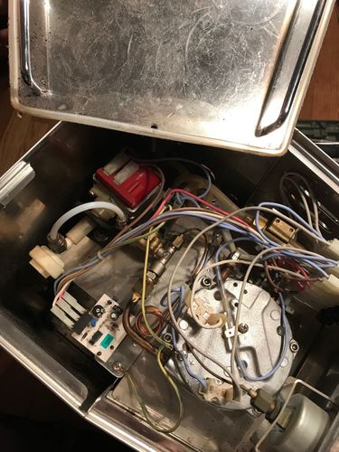

# Quick Mill Orione 3000

* [ein sehr guter Testbericht von Arne](https://www.coffeeness.de/quickmill-orione-test/)
* [Video von Arne](https://youtu.be/OdZTGzmaKwM)

Jahrelang hatten wir einen AEG Ca Famosa Vollautomaten im Einsatz. Die hat anfangs auch sehr gut gearbeitet, doch nach zwei bis drei Jahren zickte sie immer häufiger. Immer wieder mußte ich Fehler suchen und beheben ... das Ding aufzuschrauben stellte mich anfangs schon vor einige Probleme (dem Internet sei Dank). Irgendwann hatte ich aber keine Lust mehr und suchte nach einer ganz einfachen Kaffeemaschine ohne Schnick-Schnack, der dann doch irgendwann ausfällt und Probleme bereitet.

Meine Wahl fiel auf die Quick Mill Orione 3000.

## Puristisch

Die Orione verfügt nicht mal über einen Sensor für den Wassertank ... man hört es, wenn der Tank leer ist. Drei Schalter (An/Aus, Kaffee, Dampf), mehr nicht. Keine Mühle verbaut und dadurch innendrin auch sehr aufgeräumt und IMMER sauber (ganz im Gegensatz zu unserem Vollautomaten) - dadurch können auch schon keine harten Schmutzrückstände entstehen.

Da wir Trinkwasser mit einem geringen Kalkanteil verwenden (aus unserer Wasserleitung kommt sehr hartes Wasser), müssen wir die Maschine auch nie/selten entkalken.

Perfekt :-)

## Thermo-Block oder Boiler

Wir entschieden uns für den Thermoblock (funktioniert wie ein Durchlauferhitzer), weil wir morgens, mittags und abends jeweils 2-4 Tassen Kaffee trinken. Wir wollten die Maschine für die 5-10 Tassen Kaffee pro Tag nicht den ganzen Tag Heißwasser vorhalten lassen müssen (Energiekosten), sondern einschalten und loslegen. Bei der Orione dauert es keine 2 Minuten nach dem Einschalten und der erste Kaffee kann bezogen werden (bei einem Boiler dauert es i. a. 20 Minuten). Das paßt genau zu unserem Use-Case.

## Mühle

Die Mühle arbeitet perfekt (ist allerdings schon einmal kaputt gegangen und wir mußten sie einschicken) ... die Orione hat uns in den 7 Jahren noch nicht im Stich gelassen.

## Reparaturen

Glücklicherweise haben wir mit der Firma Kudlek (seit 2018 mit Hausgeräte Becker vereint) vor Ort, die bei größeren Problemen helfen können oder aber auch immer Ersatzteile sofort verfügbar haben.

* Dichtungsringe am Siebträger
  * die müssen alle 1-2 Jahre erneuert werden
    * Kosten: 5 Euro
    * Zeitaufwand: 2 Minuten
* Mai 2018: scheinbar ist die Wasserpumpe nun kaputt

## Nachteile

* Milchaufschäumer ist eher für geringe Mengen geeignet, funktioniert aber ganz gut
  * Tip: auf dem Steamer steckt ein Platsikteil - wenn das Milchaufschäumen nicht gut funktioniert, Plastikteil einfach abnehmen