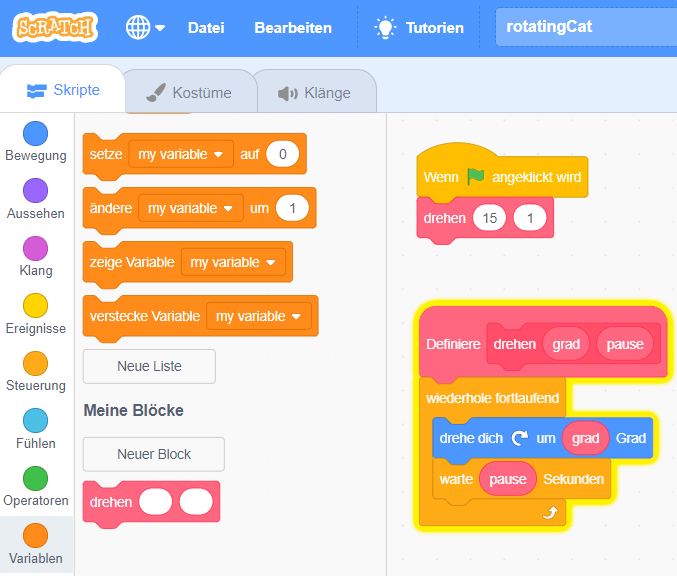

# Scratch - Programmierung

Mit Scratch lassen sich die Konzepte der Programmierung spielerisch und grafisch animiert kennenlernen. Man merkt im Grunde nicht mal, daß man programmiert. Das ist besonders für Kinder (müssen allerdings bereits lesen können) ein sehr guter Einstieg.

Da es auch Scratch-Projekt mit Mindcraft oder anderen für Jugendliche interessante Themen gibt, kann man so vielleicht einen guten Zugang und eine echte Motivation finden.

> Internetzugang oder nicht: Es klingt verlockend Scratch lokal zu installieren und auf den Internetzugang zu verzichten. Am Anfang ist das auch vollkommen in Ordnung - insbesondere bei kleineren Kindern. Allerdings gehört das Internet zu der Welt der Softwareentwicklung dazu. Die Software läuft heutzutage häufig in der Cloud, man nutzt Communities (um mit Gleichgesinnten per Chat oder Videokonferenz zu kommunizieren ... zumeist in Englisch), liest Dokumentation und Blogs (= Erfahrungsberichte) und nutzt Platformen wie YouTube, um sich weiterzubilden. Das Internet ist nicht PER SE schlecht - wenn man programmiert, dann nutzt man viele positive Aspekte dieses Mediums ... man konsumiert nicht mehr nur, sondern wird kreativ, um neue Inhalte zu erstellen.

---

## Motivation

Während es zu meiner Jugendzeit (80er Jahre des 20. Jahrhunderts) kaum Computer gab (kaum verbreitet, sehr teuer), hat heutztage jeder 10-jährige einen Power-Computer in der Tasche ... das Handy.

Alle sind gewohnt Computer in irgendeiner Form wie Handy, Tablet, Alexa, FireTV-Stick, Netflix, Smart-Watch, Playstation ... zu benutzen. Wissen über Programmierung kann heutzutage niemandem schaden und so beginnen dei Schulen schon systematisch mit der IT-Ausbildung in der weiterführenden Schule.

Ich bin selbst Softwareentwickler und kann mir keinen schöneren Job vorstellen. Wir sind kreativ, arbeiten im Team, verdienen sehr gut, können unsere eigenen Hobby-Projekte durchführen und teilweise entwickelt sich daraus auch ein Geschäftsmodell. Kurz: wir können die Zukunft mitgestalten.

Deshalb möchte ich meinen Kindern diesen Teil der Welt gerne mal zeigen und sie vielleicht dafür interessieren. Letztlich ist es aber ihre Entscheidung, ob sie daran weiterarbeiten/spielen oder einen anderen Weg einschlagen.

Bei Scratch handelt es sich um eine visuelle Programmiersprache. Man kann keine syntaktischen Fehler machen (hiermit verschwindet schon mal ein frustrierendes Element bei der Programmierung). Scratch bietet genügend Features, um im Bereich Algorithmen und Modularisierung die Konzepte der Programmierung zu verstehen. Eine gute Vorbereitung, um danach dann vielleicht zu einer nicht-grafischen Programmiersprache ([Python](python.md) oder [Go](golang.md)) überzugehen. Um das volle Spektrum an Hard- und Software kennenzulernen kann man einen Computer aus einem [Raspberry](raspberrypi.md) selbst zusammenbauen, ein Betriebssystem installieren und konfigurieren und anschließend Hardwareprojekte umsetzen, die durch Software zu echten Lösungen werden.

Mit einem 14-jährigen Schüler habe ich bereits im Zuge eines einwöchigen Berufspraktikums die [Spielekonsole Pico](https://github.com/mobi3006/pico) entwickelt und seitdem ist er von der Programmierung begeistert.

> Scratch bietet im Bereich Datenstrukturen nichts wesentliches - hier könnte [Snap](https://ddi.ifi.lmu.de/tdi/2013/upload/workshop-programmieren-mit-snap) eine Alternative sein. Vielleicht wechselt man dann aber auch schon zu einer textuelle Programmiersprache?!?

---

## Entwicklungsumgebung

### Online-IDE + Platform

Unter [scratch.mit.edu](https://scratch.mit.edu/) findet man einen Online-Editor (IDE) - man muß also nicht einmal Software installieren und kann somit JEDES Endgerät (auch Handy, Tablet oder auch einen [50 Euro Raspberry Pi](raspberrypi.md)). Es gibt also keinen finanziellen Grund, nicht mit dem Programmieren zu beginnen.

Die Online-IDE bietet den großen Vorteil, daß man dort seine Projekte zum Spielen und zur Weiterentwicklung mit anderen freigeben kann. So bleiben die Ergebnisse nicht zuhause auf dem Computer, sondern stehen der ganzen Welt zur Nutzung bereit (auf einer Vielzahl von Endgeräten). Man muß aber nicht gleich so groß denken - auch Programmier-Projekte innerhalb einer Stadt/Dorf sind so möglich und können eine unglaubliche Begeisterung im Team auslösen.

Außerdem kann man sich hier auch den Code der Projekte anschauen (erweitern/verändern), um so

* zu lernen
* neue Lösungsideen entdecken
* Best-Practices zu finden
* sich inspirieren zu lassen

Ich werde diesen Ansatz verfolgen ... durch den Community-Ansatz eröffnen sich viele Möglichkeiten. Es ist einfach viel inspierierender und kommt richtigen Software-Entwicklung (die IMMER im Team stattfindet) schon sehr nahe. Bei der Nutzung fühle ich mich schon sehr an [GitHub](https://github.com/) erinnert.

### Laptop/Computer

Eine lokale Entwicklungsumgebung aka *Scratch Desktop* läßt sich auf fast jedem Computer installieren: [Download](https://scratch.mit.edu/download)

Sehr schön finde ich, daß man lokal erstellte Projekte als Datei exportieren (leider in einem Binärformat) und im Online-IDE importieren kann. Die Integration hätte allerindgs noch besser sein können ... in der App kann man nicht auf seine Community zugreifen und ist somit eingeschränkt.

### Raspberry PI

Ein [Raspberry Pi](raspberrypi.md) mit dem Betriebssystem Raspbian bringt schon alles mit, was man für die lokale Entwicklung von Scratch-Projekten braucht. Hier braucht man dann nicht einmal einen Internet-Zugang.

---

## Getting Started

Ich verwende die [Online IDE](https://scratch.mit.edu/) und habe mir dort einen Account angelegt.

Das Spiel [Pong Starter](https://scratch.mit.edu/projects/10000036) hat mir gut gefallen. Ich habe es ein paar mal gespielt und jetzt schaue ich mir den Source-Code an (über *Schau hinein*).

Manche Code-Stellen verstehe ich nicht und ich möchte gerne mal die Parameter verändern, um die Auswirkungen zu sehen. Dazu erstelle ich einen [*Remix*](https://scratch.mit.edu/projects/378289380) (in GitHub-Projekten nennt man das *Fork*) - eine Kopie des Source-Codes in meinen Account und kann dann Änderungen vornehmen und das Spiel auch folgendermaßen erweitern:

* Geschwindigkeit des Balls verändern
  * Variable einfügen, damit ich den Code dafür nicht immer ändern muß
* aus dem Ball einen Fußball machen
* Größe des Paddels verändern
  * Variable einfügen, damit ich den Code dafür nicht immer ändern muß
* Punktestand hinzufügen
* Trefferzone oben - hierfür  gibt es noch einen Scorerpunkt
* links eine Trefferzone
  * bei Treffer zählen die Treffer für immer doppelt
    * nur für 30 Sekunden
* ab 50 Punkten ein Freileben
* Geschwindigkeit nimmt kontinuierlich zu

---

## Konzepte

* Bühne
  * Hintergrund-Bild des Programms
  * Bühnenbilder
    * Bibliothek vorhanden
    * lassen sich editieren
    * man kann neue erstellen
      * hochladen
      * malen
* Figuren
  * Figuren befinden sich auf der Bühne
  * Bibliothek vorhanden
  * lassen sich editieren (= Kostüm)
  * man kann neue erstellen
    * hochladen
    * malen
* Skripte (= Programmcode)
  * ist immer an eine Figur (= Objekt: Katze, Ball, ...) gebunden
    * verwendet man mehrere Figuren, dann kann jede ihre eigenen Aktionen ausführen
* Klänge
  * können im Code abgespielt werden
  * Bibliothek vorhanden
  * lassen sich editieren
  * man kann neue erstellen
    * hochladen
    * aufnehmen

### Skripte

* Programmierelemente aus (man kann auch Kommentare hinzufügen)
  * Bewegung
  * Klang
  * Ereignisse
  * Steuerung
  * Fühlen
  * ...
* aus Programmcode läßt sich ein parametrisierter Block (= Modul) erstellen

  

  * leider kann man Blöcke nicht projektübergreifend nutzen
* im Code können Variablen verwendet werden, um Zustände zu speichern und im Code zu verwenden (z. B. ein Punktestand)
* Konfiguration kann über Variablen erfolgen
