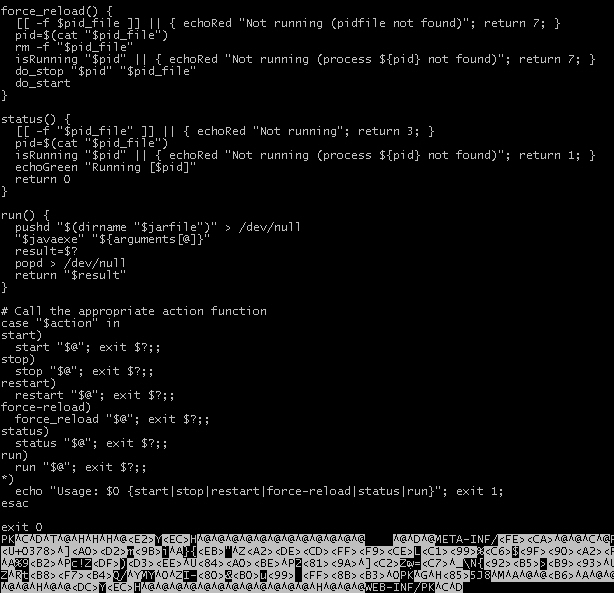

# Spring Boot

* [Offizielle Dokumentation](http://docs.spring.io/spring-boot/docs/current/reference/htmlsingle/)

... vereinfacht die Entwicklung von Java-Server-Applikationen indem ein ausführbares jar-File erstellt wird, das sich selbst in der jeweiligen Umgebung deployed. Das jar enthält in diesem Fall ALLE notwendigen Third-Party-Bibliotheken und zudem noch die notwendige Laufzeitumgebung. Handelt es sich um eine Web-Applikation, so ist ein Servlet-Container (Tomcat, Jetty) eingebettet, in dem die Web-Applikation deployed wird. Eine Spring-Boot-Applikation kann dann ganz einfach per

    java -jar my-application.jar

gestartet werden.

---

# Getting Started
* [YouTube Video](https://www.youtube.com/watch?v=p8AdyMlpmPk)

Über Spring Initializr kann man sich sehr schnell ein Maven/Gradle Projekt mit verschiedenen Spring (Boot, Cloud, ...) und nicht-Spring Technologien (ElasticSearch, JavaMail, ...)  zusammenstellen lassen (letztlich geht es beispielsweise im die pom.xml und ein paar weitere Getting Started Ressourcen). Es werden auch verschiedene Sprachen unterstützt (2015: sind es Java und Groovy).

## Spring Initializr => erstellt Maven pom.xml

* [Initializr Webapplikation](https://start.spring.io/)

Über die Weboberfläche des Initializr wählt man sich Eckpunkte (Sprache, Buildsystem, Frameworks, Technologien) aus, auf denen die Applikation basieren soll. Am Ende bekommt man ein Zip zum Download, das folgendes enthält:

* pom.xml
  * hier ist auch das Maven-Plugin ``spring-boot-maven-plugin`` referenziert, das für die Spring-Boot-Executable-jar-Erzeugung benütigt wird
  * je nach dem für welchen Typ von Spring-Boot-Applikation man sich entschieden hat, findet man unterschiedliche Parent-poms
    * reine Backend-Applikation: ``org.springframework.boot/spring-boot-starter-parent``
    * Webapplikation: ``org.springframework.boot/spring-boot-starter-web-parent``
      * hieraus ergibt sich eine Abhängigkeit zu einem Embedded-Servlet-Container wie Tomcat/Jetty ... die Abhängigkeit ist aber in dem Parent definiert
* Main-Class-Gerüst, so daß man mit der Business-Logik der Anwendung sofort loslegen kann

      @SpringBootApplication
      public class MyApplication 
        extends SpringBootServletInitializer {

        public static void main(String[] args) {
          MyApplication.run(MyApplication.class, args);
        }

        protected SpringApplicationBuilder configure(
          SpringApplicationBuilder application) {
          return application.sources(MyApplication.class);
        }
      }

* Beispiel-Konfiguration

## Build der Applikation
Das Kommando
    
    mvn package

erzeugt ein **Fat-Jar** (compilierte Klassen des Projekts + abhängige Libs), das ohne weiteres startbar ist.

## Start der Applikation

Der Start der Applikation erfolgt über 

    mvn spring-boot:run
    
oder (was hat welche Vorteile???)

    java -jar my-application.jar

Voila ... sehr schlank. Wir sind nun innerhalb weniger Minuten zu einer komfortabel deploybaren Server-Applikation gekommen. Jetzt kanns losgehen mit der Implementierung der Business-Logik.

## Eclipse-Integration der Applikation
Über

    mvn eclipse:eclipse

werden die Eclipse Artefakte ``.project`` und ``.classpath`` erzeugt. Danach kann das Projekt in Eclipse importiert werden. 

**ACHTUNG:** standardmäßig waren die Dateien ``application.properties`` und ``application.yml`` vom Build ausgeschlossen. Das sollte man ändern!!! Ansonsten  wandern diese Dateien (auch nach Änderungen) nie in den Runtime-Classpath der Applikation und somit funktioniert die Anwendung nicht richtig.

> Wenn man zufällig ein Build über Maven angestoßen hatte, dann wurden im ``target/classes`` Verzeichnis diese Dateien abgelegt ... Eclipse hätte aber niemals ein Update darauf gemacht. Hmmmm, schon strange ... will mich da jemand zu IntelliJ treiben?

---

# Build Tool Support
Spring Boot unterstützt die beiden Build-Tools

* maven
* gradle ... habe ich selbst noch nicht genutzt - deshalb beschränke ich mich im folgenden auf maven

durch Dependency-Management, Code-Generierung (z. B. pom.xml).

Andere Build-Tools (z. B. ant) können auch verwendet werden, doch wird es nicht von Spring unterstützt, d. h. der Einsatz ist weniger komfortabel.

## Maven: Starter POMs

* [Offizielle Dokumentation ... Using Starter-POMs](http://docs.spring.io/spring-boot/docs/current/reference/htmlsingle/#using-boot-starter-poms)

Im Initializr generierten ``pom.xml`` wird man u. a. folgendes finden:

    <parent>
        <groupId>org.springframework.boot</groupId>
        <artifactId>spring-boot-starter-parent</artifactId>
        <version>1.3.0.RELEASE</version>
        <relativePath/>
    </parent>

Das sorgt für zwei Dinge:

* das ``spring-boot-maven-plugin`` ist integriert, so daß ein ausführbares jar-File erstellt wird
* die ``spring-boot-dependencies`` (siehe [Maven Central Repository](http://search.maven.org/#artifactdetails|org.springframework.boot|spring-boot-dependencies|1.3.5.RELEASE|pom)) werden verwendet. In dieser sind Versionen von einer Vielzahl von Frameworks definiert, die zueinander passen (Spring übernimmt also das Dependency-Management (wenn man will).

Auf diese Weise kommt man schon mal sehr schnell sehr weit.

## Maven: Artefakt Typen jar vs. self-executable jar

Per Default (d. h. wenn das Default Parent-Pom verwendet wird) werden zwei Typen von jar-Artefakten erstellt:

* ausführbares JAR [mit folgendem Inhalt](http://docs.spring.io/spring-boot/docs/current/reference/htmlsingle/#executable-jar-jar-file-structure):
  * alle notwendigen Libs (als jars)
  * Laufzeitumgebung (z. B. Servlet-Container)
* normales JAR des Moduls, um in anderen Assemblies verwendet zu werden

## Maven: Artefakt-Typ: jar vs. war

* [How-To](https://spring.io/guides/gs/convert-jar-to-war/)

Will man eine Spring-Boot Anwendung dennoch in einem externen Application-Server deployen, so benötigt man ein War-Artefakt. Für diesen Anwendungsfall verwendet man 

    <packaging>war</packaging>
    
im ``pom.xml``.

Hat man nun ein War-Artefakt erzeugt, so kann man aber dennoch den Executable-Deployment-Ansatz nutzen:

    java -jar mySpringBootApp.war


## Maven: Dependency Version ändern

* [How-To customize Dependency Versions](http://docs.spring.io/spring-boot/docs/current/reference/htmlsingle/#howto-customize-dependency-versions)

Verwendet man das Spring-Dependency-Management (via ``spring-boot-dependencies``), so kann man folgendermaßen im ``pom.xml`` die Version einer Dependency ändern ... ohne Gewähr, daß dann noch alles funktioniert:

    <commons-collections.version>3.2.2</commons-collections.version>

## Maven: Interessante Properties

```xml
<project.build.sourceEncoding>UTF-8</project.build.sourceEncoding>
<java.version>1.8</java.version>
``` 

## Debug-Port einschalten

Über 

```xml
<build>
  <plugins>
    <plugin>
      <groupId>org.springframework.boot</groupId>
      <artifactId>spring-boot-maven-plugin</artifactId>
      <configuration>
        <jvmArguments>
            -Xdebug
            -Xrunjdwp:transport
              =dt_socket,server=y,suspend=n
              ,address=9000
        </jvmArguments>
      </configuration>
    </plugin>
  </plugins>
</build>
```

wird das Remote-Debugging der Applikation ermöglich, wenn sie über maven gestartet wird (``mvn spring-boot:run``).

Startet man hingegen das executable jar-Artefakt (erstellt durch ``mvn install``), dann kann dort das Debugging wie üblich per Java-Parameter beim Programmstart

```bash
java 
  -jar myapp.jar 
  -Xdebug 
  -Xrunjdwp:transport=dt_socket
    ,address=8000,server=y,suspend=n`` 
```

konfiguriert werden.

---

# Applicationscode

Spring-Boot verwendet - [Spring-typisch ... siehe auch Spring-Core](springCore.md) - Java-Annotation en-masse, um den ApplicationContext aufzubauen. Sie werden verwendet, um die Springinitialisierung durch den Spring-Boot-Loader zu ermöglichen. Beispiele:

* ``@SpringBootApplication``
* ``@EnableAutoConfiguration``
* ...

Zudem erhöht diese Vorgehensweise die Semantik der Klassen, so daß der Leser ein besseres Verständnis erhält (das ist aus meiner Sicht bei einer Trennung von Java-Code und XML-Code immer ein Problem gewesen).

> i. a. gibt es xml-basierte Alternativen zur Annotation aber die Spring-Macher empfehlen die Verwendung von Annotationen).

## Steuerung der Spring-Initialisierung

* http://docs.spring.io/spring-boot/docs/current/reference/htmlsingle/#using-boot-locating-the-main-class

### @SpringBootApplication
Convenience Annotation ... subsumiert die empfohlenen Annotationen 

* ``@EnableAutoConfiguration``
* ``@Configuration``
* ``@ComponentScan``

### @EnableAutoConfiguration

Ist diese Eigenschaft gesetzt, so versucht Spring sich die Spring-Konfiguration der Anwendung selbst zu erschließen. Hierin steckt schon eine Menge Magie ...

> Wenn eine JPA Dependency definiert ist und EnableAutoConfiguration gesetzt ist, dann sucht der Spring Boot (der Loader) nach entsprechenden ``@Entity`` Anntotaionen im Code

... solange das zuverlässig und intuitiv funktioniert ist alles gut ;-)

#### Auto-Configuration gezielt abschalten

Über Excludes lassen sich einzelne Ressourcen von der Auto-Configuration ausschließen:

    @EnableAutoConfiguration(
      exclude={DataSourceAutoConfiguration.class})

#### Auto Configuration Report

Durch den Start der Anwendung per ``--debug`` Option (``java -jar myapp.jar --debug``) wird ein sog. Auto-Configuration Report ausgegeben:


    =========================
    AUTO-CONFIGURATION REPORT
    =========================
    

    Positive matches:
    -----------------

     AuditAutoConfiguration.AuditEventRepositoryConfiguration matched
        - @ConditionalOnMissingBean (types:
              org.springframework.boot.actuate.audit.AuditEventRepository;
              SearchStrategy: all) found no beans (OnBeanCondition)
    ... blablabla ...
    
Dieser Report kann sehr hilfreich sein, wenn man der Spring-Magie auf die SChliche kommen will.

### @ConditionalOnProperty
Über 

```java
@ConditionalOnProperty(
  name = "deployment.environment", 
  havingValue = "DEV")
public class MyService{ ... }
```

wird die Integration der Klasse in die Initialisierung der Anwendung (durch Spring) von bestimmten Bedingungen abhängig gemacht.

Über die ``application.properties`` 

    deployment.environment=DEV

erfolgt die Konfiguration.

## Konfiguration von Applikationseigenschaften
* Spring Referenzdokumentation: http://docs.spring.io/spring-boot/docs/current/reference/htmlsingle/#boot-features-external-config
* https://blog.codecentric.de/2016/04/binding-configuration-javabeans-spring-boot/

Hier unterstützt Spring diese Ansätze

* Property Injection mit Spring-EL
* Type-safe @ConfigurationProperties
* Spring-Cloud-Config

### spring.config.location
Über das Property ``spring.config.location`` können Dateien definiert werden, in der die Property-Werte gesetzt werden (es kann eine Übersteuerung erfolgen). Das ist sehr praktisch, wenn man die Anwendnung in einem anderen Environment laufen lassen möchte (statt in der Developer-Umgebung in der Staging-Umgebung):

```bash
java 
  -jar myapp.jar 
  --spring.config.location=
      classpath:/default.properties,
      classpath:/override.properties
```
    
Hierzu muß die Spring-Boot-Applikation allerdings Command-Line-Parameter unterstützen (``SpringApplication.setAddCommandLineProperties(true)``), was aber per Default der Fall ist.

### Laufzeitänderungen
Ist der ``spring-boot-starter-actuator`` aktiviert (als Dependency vorhanden), dann wird ein Rest-Service bereitgestellt, über den die Konfiguration zur Laufzeit geändert werden kan

### Property Injection mit Spring-EL
Ganz ohne weiteres zutun unterstützt Spring bereits das Injecten von Property-Values in Beans per

    @Value("${de.cachaca.cloudProvider})
    private String cloudProvider;
    
Spring sucht in den Property-Dateien im Classpath nach entsprechenden Properties.

Über ``@ConfigurationProperties`` lässt sich dieser Prozess noch ein bisschen komfortabler gestalten.

### Type-safe @ConfigurationProperties
* Spring Referenzdokumentation: http://docs.spring.io/spring-boot/docs/current/reference/htmlsingle/#boot-features-external-config-typesafe-configuration-properties

Auf diese Weise werden typensichere Konfigurationen ermöglicht. ``@ConfigurationProperties`` kennzeichnet eine Klasse, die Konfigurationsmöglichkeiten einer Komponente abbildet.

Voraussetzung ist diese Dependency:

```xml
<dependency>
    <groupId>org.springframework.boot</groupId>
    <artifactId>spring-boot-configuration-processor</artifactId>
    <optional>true</optional>
</dependency>
```

Beispiel:

```java
@Component
@ConfigurationProperties(prefix = "de.cachaca.myapp")
public class CloudIntegrationConfiguration {

    private String cloudProviderName = "AWS";

    public void setCloudProviderName(String name) {
      cloudProviderName = name;
    }

    public String getCloudProviderName() {
      return cloudProviderName;
    }
}
```

Eine Anpassung des ``cloudProviderName`` ist über die ``application.properties`` möglich:

    de.cachaca.myapp.cloudProviderName = Microsoft Azure
  
Möchte man die Konfiguration in einer anderen Datei als ``application.properties`` vornehmen, dann geht das über ``@ConfigurationProperties(prefix="test", locations = "classpath:MyConfiguration.properties")``. Aus meiner Sicht besteht dafür i. a. kein Grund ... ich bevorzuge hier den Standardweg und mag es lieber eine einzige Datei zu haben.

Beim Maven-Build wird eine Datei ``spring-configuration-metadata.json`` generiert, die Metadaten für Spring-Boot bereitstellt.

> ACHTUNG: will man innerhalb der IDE bleiben (ohne maven builds anschmeißen zu müssen), dann muß die IDE die Generierung dieser ``spring-configuration-metadata.json`` unterstützen (z. B. m2e bei Eclipse) ... ansonsten wundert man sich warum Änderungen nicht sichtbar sind. 

IntelliJ bietet hier sogar die Möglichkeit zur Autovervollständigung. Willkommen im 21. Jahrhundert der Softwareentwicklung.

## Konfiguration über ``application.properties``/``application.yml``

* Standard-Konfigurationseinstellungen (für alle von Spring-Boot direkt unterstützte Komponenten): http://docs.spring.io/spring-boot/docs/current/reference/htmlsingle/#common-application-properties
* http://docs.spring.io/spring-boot/docs/current/reference/htmlsingle/#boot-features-external-config

Die Konfiguration der Anwendungskomponenten erfolgt in erster Linie über die Dateien

* ``application.properties``
* ``application.yml``

Das [YAML-Format](yaml.md) ist aus meiner Sicht bei komplexen Anwendungen besser geeignet, da die Struktur in YAML hierarchisch aufgebaut ist. Das erhöht die Lesbarkeit und erfordert auch sofort die richtige Eingliederung der Properties in die semantisch passende Ebene. 

Da der Application-Server in einem Executable-Jar auch Komponente der Anwendung ist, findet man dort also auch Konfigurationsmöglichkeiten.

---

# Integrationtest

* http://docs.spring.io/spring/docs/current/spring-framework-reference/html/integration-testing.html
* https://www.jayway.com/2014/07/04/integration-testing-a-spring-boot-application/

Eine typische Testklasse für eine Webapplikation sieht so aus:

```java
@RunWith(SpringJUnit4ClassRunner.class)
@SpringApplicationConfiguration(
        classes = MyApplication.class,
        locations = { "classpath:META-INF/test-context.xml" })
@WebAppConfiguration
@IntegrationTest("server.port:0")
public class MyApplicationTest {

    @Autowired
    private MyService service; 
    
    @Test
    public void testServiceCall() {
        service.method();
    }
    
}
```

## @RunWith(SpringJUnit4ClassRunner.class)
Dieser JUnit-Testrunner sollte grundsätzlich bei Spring-basierten Komponenten verwendet werden. Er stellt die Grundvoraussetzung dar - sonst darf man sich nicht wundern, wenn spring-spezifische Aspekte (z. B. der Aufbau des ApplicationContext aus xml-Dateien ``@ContextConfiguration(locations = { "classpath:mymodule-context.xml" })``) nicht funktionieren.

## @SpringApplicationConfiguration
Diese Annotation wird häufig in Spring-Boot-Tests eingesetzt, um den ApplicationContext aufzubauen. Es ist eine Erweiterung des Spring-Core Annotation 

```java
@ContextConfiguration(
  locations = { 
    "classpath:mymodule-context.xml" })
```

Hier werden i. a.  zentrale Klassen ausgeführt (z. B. die Spring-Boot-Application-Klasse), die dann weitere Spring-Komponenten anziehen. Ausserdem lassen sich darüber XML-basierte ApplicationContext-Eweiterungen anziehen:

```java
@SpringApplicationConfiguration(
        classes = MySpringBootApplication.class,
        locations = { "classpath:test-context.xml" })
```

## @IntegrationTest

## Remote Debugging ermöglichen

Um ein Remote-Debugging (z. B. über eine IDE) der Spring-Boot-Applikation zu ermöglichen, muß die Applikation folgendermaßen gestartet werden:

    java 
      -Xdebug 
      -Xrunjdwp:server=y,transport=dt_socket,address=8000,suspend=n
      - jar myapp.jar

Soll die Applikation aus der IDE gestartet werden, so müssen die ``-X``-Argumente im Launcher als VM-Argumente eingetragen werden.

Ist die Applikation gestartet, wird in der IDE ein Remote-Debug-Prozess gestartet, der sich an den Remote-Debug-Port der Anwendung verbindet (wie üblich, wenn Java-Applikationen remote gedebugged werden).

---

# HotSwapping
* Developer Tools: http://docs.spring.io/spring-boot/docs/current/reference/htmlsingle/#using-boot-devtools
* http://docs.spring.io/spring-boot/docs/current/reference/htmlsingle/#howto-hotswapping

Spring Boot bringt eine Warm-Restart-Funktionalität (siehe unten) mit. Hierzu müssen die Develeoper Tools aktiviert werden. Startet man die Anwendung aus der IDE, so führen Änderungen in der IDE automatisch zu einem Warm-Restart der Anwendung ... ein JRebel-Light (dafür aber kostenlos).

## Developer Tools (aka ``devtools``)
Über die Dependency

```xml
    <dependencies>
      <dependency>
        <groupId>org.springframework.boot</groupId>
        <artifactId>spring-boot-devtools</artifactId>
        <optional>true</optional>
      </dependency>
    </dependencies>
```

erfolgt die Integration der Developer Tools. 

### Cold-Start vs. Warm-Restart vs. Reload 

* Cold-Start:
  * gesamte Anwendung wird neu gestartet
  * diesen Ansatz verfolgen Application-Server i. d. R. out-of-the-box
  * dauert lang (je nach Anwendung mehrere Minuten)
* Warm-Restart: in Sping-Boot integrierter Ansatz (Developer Tools)
  * funktioniert mit zwei Classloadern. Einer ist für die unveränderbaren Third-Party-Ressourcen zuständig, einer für die veränderlichen eigenen Ressourcen.
  * funktioniert auch mit Remote-Deployments (http://docs.spring.io/spring-boot/docs/current/reference/htmlsingle/#using-boot-devtools-remote)
  * geht deutlich schneller
* Reload: 
  * hierbei wird die Anwendung nicht neu gestartet, sondern die Änderungen werden nachgeladen
  * geht am schnellsten (i. d. R. sofort bis wenige Sekunden) und funktioniert (aus eigener Erfahrung) ganz wunderbar!!!
  * Java-Bytecode HotSwapping: Moderne IDEs unterstützen alle Hot-Swapping von Byte-Code sofern die Klassen/Methoden-Signatur nicht geändert wird, d. h. bei Änderungen im Methoden-Body. Das funktioniert bei Spring-Boot somit 
  * [JRebel Ansatz](http://zeroturnaround.com/software/jrebel/)
  * [Spring-Loaded Ansatz](https://github.com/spring-projects/spring-loaded)

### Feature: Automatic Warm Restart

Die Developer Tools aktivieren per Default das Automatic Restart Feature. Sobald sich eine Ressource auf dem Filesystem ändert (z. B. durch eine Änderung in der IDE und der daraus folgenden Class-Generierung) erfolgt ein Warm-Restart (Erklärung siehe oben).

**ACHTUNG:** es muß sichergestellt werden, daß das von der IDE erzeugte Class-File auch tatsächlich im Classpath der gestarteten Anwendung landet. Ist die Anwendung in der IDE gestartet, dann geschieht das automatisch. Läuft die Anwendung über maven (``mvn spring-boot:run``), dann kommt es darauf an wohin die IDE die class-Datei compiliert. Läuft die Anwendung über das Executable-Jar (``java -jar myapp.jar``), dann kann es nicht funktionieren, weil die Klassen aus dem Jar-Artefakt gezogen werden.

### Feature: Reload Templates

* http://docs.spring.io/spring-boot/docs/current/reference/htmlsingle/#howto-reload-thymeleaf-template-content

In einer Produktionsumgebung ist das Caching von Templates eine sehr sinnvolle Vorgehensweise, weil sich die Templates nicht ändern. In Developer-Umgebungen will man hingegen die Änderungen am sofort sehen und nicht erst die Anwendung durchstarten müssen.

Über die ``application.properties`` kann das Caching ausgeschaltet werden:

    spring.velocity.cache = false
    
### Konfiguration

Die Konfiguration der ``devtools`` erfolgt Spring-Boot-like in der ``application.properties``. Da es sich aber schon um spezielle Entwickler-abhängige Einstellungen handelt, kann der Entwickler die Einstellungen per ``~/.spring-boot-devtools.properties`` dauerhaft übersteuern (siehe http://docs.spring.io/spring-boot/docs/current/reference/html/using-boot-devtools.html#using-boot-devtools-globalsettings).

---

# Production-Ready Features

## Spring Boot as a Service
* http://docs.spring.io/spring-boot/docs/current/reference/html/deployment-install.html

Spring Boot ermöglich die Installation der Anwendung als Service (``init.d`` und ``systemd``). Hierzu besteht der Vordere Teil der Datei aus dem Init-Skript und mittendrin beginnt dann der binäre Teil des War/Jar-Datei:



Unter CentOS und Ubuntu funktioniert diese seltsam anmutende Artefakt ... bei anderen hingegen muß evtl. ein Launch-Skript beigefügt werden.

## Actuator

* http://docs.spring.io/spring-boot/docs/current/reference/htmlsingle/#production-ready
* [Endpunkte](http://docs.spring.io/spring-boot/docs/current/reference/html/production-ready-endpoints.html)

Die sog. Production-Ready Features werden über die Dependency

    <dependencies>
      <dependency>
        <groupId>org.springframework.boot</groupId>
        <artifactId>spring-boot-starter-actuator</artifactId>
      </dependency>
    </dependencies>

aktiviert. Dadurch werden einige nützliche Webservice-[Endpunkte](http://docs.spring.io/spring-boot/docs/current/reference/html/production-ready-endpoints.html) exponiert.

Optional kann der ``/docs`` Endpunkt (http://IP_ADDRESS:PORT/docs) aktiviet werden:

    <dependencies>
      <dependency>
        <groupId>org.springframework.boot</groupId>
        <artifactId>spring-boot-actuator-docs</artifactId>
      </dependency>
    </dependencies>

## Custom application info

* http://docs.spring.io/spring-boot/docs/current/reference/htmlsingle/#production-ready-application-info

Features:

* Monitoring/Health-Checks

## Startup-Banner

* http://docs.spring.io/spring-boot/docs/current/reference/html/boot-features-spring-application.html

Beim Start der Applikation wird standardmäßig ein Banner angezeigt ... das ist konfigurierbar. Einfach eine ``banner.txt`` in den Classpath legen.

Solche Banner macht niemand selber ... http://patorjk.com/software/taag (die Fonts *Ogre*, *Doom*, *Standard*, *ANSI Shadow*, *CalvinS* sind meine Favoriten):

            _                    
      _ __ (_) ___ _ __ _ __ ___ 
     | '_ \| |/ _ \ '__| '__/ _ \
     | |_) | |  __/ |  | | |  __/
     | .__/|_|\___|_|  |_|  \___|
     |_|                         

---

# Fazit
Spring zeigt mit seinen neuen Projekten (Boot, Config, ...), daß es sich innovativ weiterentwickelt und echte Mehrwerte für die Nutzer schafft. Der Einstieg in die Java-Welt wird generell (und insbesondere mit Blick auf Microservices) extrem vereinfacht. Verteilte Systeme - wie ich sie bisher aus meinem Studium kannte - sind nun auch für Startups in greifbare Nähe gerückt. Und dazu muß man nicht 3 Monate auf Schulung gehen ...

Seit 2010 hat sich in den Bereichen Microservices, Cloud-Deployment, DevOps, Continous Delivery so viel getan, daß die Softwareentwicklung auf einem neuen Level angekommen ist.

Spring trifft den Nerv der Zeit ... Hut ab :-)

## Kritikpunkte
Auch wenn der Einstieg sehr leicht fällt ... ums Lesen von Dokumentation kommt man nicht rum ;-)
### Magie
Spring hat schon recht viel magic eingebaut. Beispielsweise kann Code compilierbar sein, aber durch eine fehlende Abhängigkeit verhält er sich zur Laufzeit einfach nicht wie erwartet, weil eben die zur Laufzeit ausgewertete Abhängigkeit fehlt. 

Es hat etwas von Pluggable-Extensions, wenn ich zur Applikation die Bibliothek ``spring-boot-starter-actuator-1.3.5.RELEASE.jar`` hinzufüge und dadurch weitere REST-Endpunkte vorhanden sind. Sehr komfortabel ... aber erst mal gewöhnungsbedürftig.

### Überblick über Unterprojekte
Zudem kann ist die Zuordnung einer Funktionalität zu einem Spring-Projekt nicht immer einfach. Dementsprechend fällt die Auswahl der richtigen Dependencies recht schwer. 

