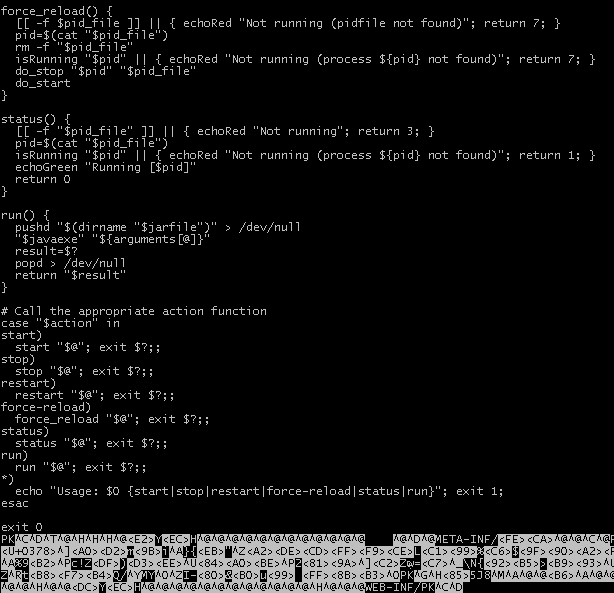

# Spring Boot Production Ready

---

## Externalize Configuration

* Spring Boot Dokumentation: http://docs.spring.io/spring-boot/docs/current/reference/htmlsingle/#boot-features-external-config
* Spring Boot Howto: https://docs.spring.io/spring-boot/docs/current/reference/html/howto-properties-and-configuration.html

Die im WAR/JAR verbackene ``application.properties`` muß in verschiedenen Deployment-Umgebungen entsprechend angepaßt werden.

### Übersteuern mit Aufrufparametern

```bash
java -jar myapp.jar --de.cachaca.myapp.host=www.cachaca.de
```

### Übersteuern mit externer ``application.properties``

Bei folgender Organisation

```
target/
  myapp.jar
    application.properties    # 3
      myprop1=A
      myprop2=D
      myprop3=F
  config/
    application.properties    # 2
      myprop1=B
      myprop2=E
  application.properties      # 1
    myprop1=C
```

Die Properties werden in der Reihenfolge #1, #2, #3 gezogen, d. h. die Properties haben zur Laufzeit folgende Werte:

```properties
myprop1=C
myprop2=E
myprop3=F
```

---

## Spring Boot as a Service

* http://docs.spring.io/spring-boot/docs/current/reference/html/deployment-install.html
* http://file.allitebooks.com/20151028/Spring%20Boot%20Cookbook.pdf

Spring Boot ermöglich die Installation der Anwendung als Service (unter Linux über ``init.d``, ``systemd`` und unter Windows). Die Installation als Service hat den Vorteil, daß sich das Betriebssystem um einen evtl. notwendigen Restart kümmert. 

Der vordere Teil des Jar/War-Artefakts besteht aus dem sog. Launch-Skript (das scheinbar auch unter Windows funktioniert) - mittendrin beginnt der binäre Teil des Artefakts:



Will man das Startskript nicht so seltsam vermischt haben[^1], [so muß man es beim Build entsprechend konfigurieren](http://docs.spring.io/spring-boot/docs/current/reference/html/deployment-install.html) ... unter Maven folgendermaßen (``executable``) - per Default steht diese Option auf ``true``:

```xml
<plugin>
    <groupId>org.springframework.boot</groupId>
    <artifactId>spring-boot-maven-plugin</artifactId>
    <configuration>
        <executable>false</executable>
    </configuration>
</plugin>
```

[^1] ACHTUNG: Nicht alle ZIP-Clients kommen mit dieser Art klar und werfen evtl. einen Fehler. 

Unter CentOS und Ubuntu funktioniert das Default-Launch-Sktipt bei der Einbindung als systemd-Service. Bei anderen Distributionen hingegen muß evtl. ein eigenes Launch-Skript geschrieben werden[^2]. Entweder bindet man es bereits im ``spring-boot-maven-plugin`` über ``embeddedLaunchScript`` (und evtl. ``embeddedLaunchScriptProperties``) ein oder man konfiguriert es in der systemd-Service Datei (liegt unter ``/etc/systemd/system/myapp.service``). Dort wird das Launcher-Script referenziert und die Variable ``JARFILE`` gesetzt:

```properties
[Service]
Environment="JARFILE=/opt/myapp.war"
ExecStart=/opt/myapp-launcher.sh
```

[^2] Hier findet man ein Skeleton für das Launch-Skript: https://github.com/spring-projects/spring-boot/blob/master/spring-boot-tools/spring-boot-loader-tools/src/main/resources/org/springframework/boot/loader/tools/launch.script

Will man die JRE-Einstellungen der Anwendung konfigurieren, so sollte man eine ``conf``-Datei verwenden (http://docs.spring.io/spring-boot/docs/current-SNAPSHOT/reference/html/deployment-install.html#deployment-script-customization-conf-file), die neben das war/jar-Artefakt gelegt wird. Alternativ könnte man das Launch-Skript anpassen.

### Linux: systemd

* http://docs.spring.io/spring-boot/docs/current-SNAPSHOT/reference/html/deployment-install.html#deployment-systemd-service

Systemd benötigt eine Service-Datei in ``/etc/systemd/system/myapp.service`` mit den Permissions 0644:

```properties
[Unit]
Description=MyApp
After=syslog.target

[Install]
WantedBy=multi-user.target

[Service]
User=pfh
Group=users
ExecStart=/opt/myapp.jar
Restart=always
```

In diesem Beispiel gehe ich davon aus, daß die Anwendnung in ``/opt/myapp.jar`` liegt.

Danach muß der systemd seine Konfiguration neu einlesen

```bash
sudo systemctl daemon-reload
```

und dann kann der Service gestartet werden:

```bash
sudo systemctl start myapp.service
```

### Linux: init.d

* http://docs.spring.io/spring-boot/docs/current-SNAPSHOT/reference/html/deployment-install.html#deployment-initd-service

### OS/X: launchd

... hab ich keine Ahnung

### Windows Dienst

Ein Doppelclick auf der Spring-Boot-jar/war-Artefakt reicht für die Installation als Dienst ... also ACHTUNG!!!

---

## Actuator

* http://docs.spring.io/spring-boot/docs/current/reference/htmlsingle/#production-ready
* [Endpunkte](http://docs.spring.io/spring-boot/docs/current/reference/html/production-ready-endpoints.html)

Die sog. Production-Ready Features werden über die Dependency

```xml
<dependencies>
  <dependency>
    <groupId>org.springframework.boot</groupId>
    <artifactId>spring-boot-starter-actuator</artifactId>
  </dependency>
</dependencies>
```

aktiviert. Dadurch werden einige nützliche Webservice-[Endpunkte](http://docs.spring.io/spring-boot/docs/current/reference/html/production-ready-endpoints.html) exponiert.

Optional kann der ``/docs`` Endpunkt (http://IP_ADDRESS:PORT/docs) aktiviet werden:

```xml
<dependencies>
  <dependency>
    <groupId>org.springframework.boot</groupId>
    <artifactId>spring-boot-actuator-docs</artifactId>
  </dependency>
</dependencies>
```

---

## Custom application info

* http://docs.spring.io/spring-boot/docs/current/reference/htmlsingle/#production-ready-application-info

Features:

* Monitoring/Health-Checks

---

## Startup-Banner

* http://docs.spring.io/spring-boot/docs/current/reference/html/boot-features-spring-application.html

Beim Start der Applikation wird standardmäßig ein Banner angezeigt ... das ist konfigurierbar. Einfach eine ``banner.txt`` in den Classpath legen.

Solche Banner macht niemand selber ... http://patorjk.com/software/taag (die Fonts *Ogre*, *Doom*, *Standard*, *ANSI Shadow*, *CalvinS* sind meine Favoriten):

            _                    
      _ __ (_) ___ _ __ _ __ ___ 
     | '_ \| |/ _ \ '__| '__/ _ \
     | |_) | |  __/ |  | | |  __/
     | .__/|_|\___|_|  |_|  \___|
     |_|                         
