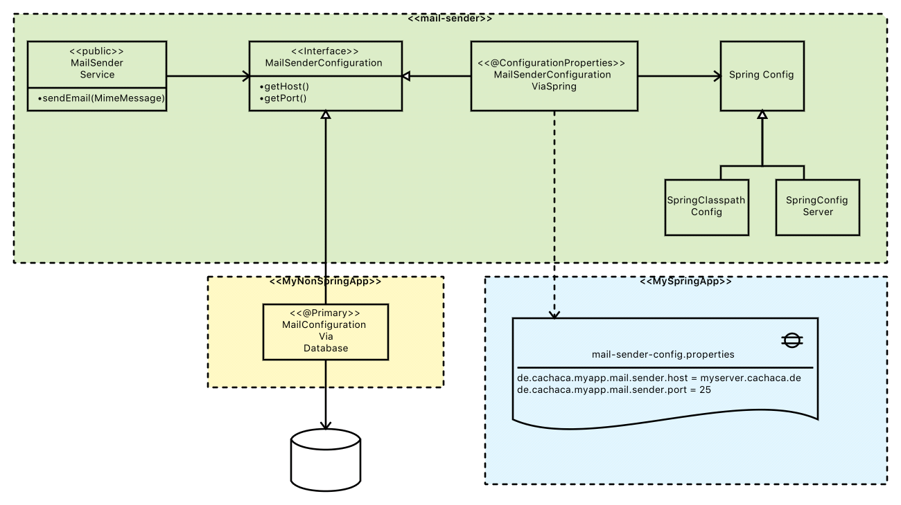

# Spring Core
Spring ist mit dem Inversion-of-Control-Ansatz (u. a. durch Dependency-Injection) groß rausgekommen.

Spring Core ist ein Factory-Ansatz, d. h. Spring kümmert sich um die Instanziierung der Klassen und um deren Lebenszyklus (Singleton, Prototype, Session, ...). Nimmt man im Java-Code selbst Instaziierungen vor (mit ``new``), dann läuft das 

---

# Wiring
## Implizites vs. explizites Wiring
Explizites Wiring (damit hat die Spring-Geschichte begonnen) erfolgt über XML-Dateien. Der Apring-ApplicationContext-Loader liest diese Dateien und erzeugt daraus zur Laufzeit den sog. ApplicationContext. 

Implizites Wiring kommt ohne xml-Konfiguration aus und basiert auf Java-Annotationen ... entweder spring-sepzifische (z. B. ``@Autowired``) oder mittlerweile auch Java-Annotationen (z. B. ``@Inject``). Aus meiner Sicht macht diese Vorgehensweise den Code besser lesbar, da die Rolle einer Java-Klasse durch die Spring-Annotation hervorgeht (z. B. ``@RestController``), aber dadurch wird Spring auch invasiv. 

> Aus meiner Sicht ist die Invasivität aber zu vernachlässigen, weil man dies leicht revidieren kann. Zudem wird man nicht ständig das Framework wechseln. Außerdem wird man vermutlich versuchen, den Business-Code in eine technologie-unabhängige Klasse zu verschieben und obendrauf nur einen dünnen technologieabhängigen Wrapper zu setzen.

Hybrid-Ansätze sind problemlos möglich, so daß beispielsweise ein ``@Autowired`` einer per Spring-Bean erfolgen kann, die per xml-Konfiguration instanziiert wird.

## Injection Varianten
### Setter Injection
Die setter-Injection ist die präferierte Methode in Spring
### Constructor Injection

### Injection by Reflection
Das funktioniert nur, wenn die Java-Policy dies nicht verbietet.

Für Tests, die die Beans mit Mocks befüttern wollen, muß der Test evtl. die Injection durchführen. Die Verwendung von Reflection Injection führt dazu, daß i. a. keine setter und keine Konstruktoren vorhanden. Reflection ist hier weniger lesbar. 

## @Primary
Bei der Entwicklung erweiterbarer Software steht man oft vor dem Problem, daß eine Komponente einerseits komfortable nutzbar sein soll (am besten ganz ohne zusätzliche Konfiguration) aber andererseits für andere Einsatzbereiche auch anpassbar sein muß.

In einem Projekt wollten wir von einer proprietären Konfigurationskomponente zu den SpringBoot-Konfigurationsmechanismen (``@ConfigurationProperties``) wechseln ... die alte Variante mußte aber weiterhin unterstützt werden (weil daran noch weitere Features hingen).

Wir haben uns für folgendes Design entschieden:

Das Modul ``mail-sender`` bietet ein ``MailConfiguration`` Interface. Zudem eine Implementierung dieses Interface auf Spring-Basis (mit ``@ConfigurationProperties``). Will ein Client diese Konfigurationsveriante nutzen, dann muß er nichts weiter konfigurieren.

Clients - wie unser proprietäres Legacy Module - können ihre eigene Implementierung des ``MailConfiguration`` Interface beisteuern (ist mit ``@Primary`` annotiert) und die Default-Implementierung dadurch übersteuern.

Genau so soll es sein ... das Open-Closed-Prinzip :-)