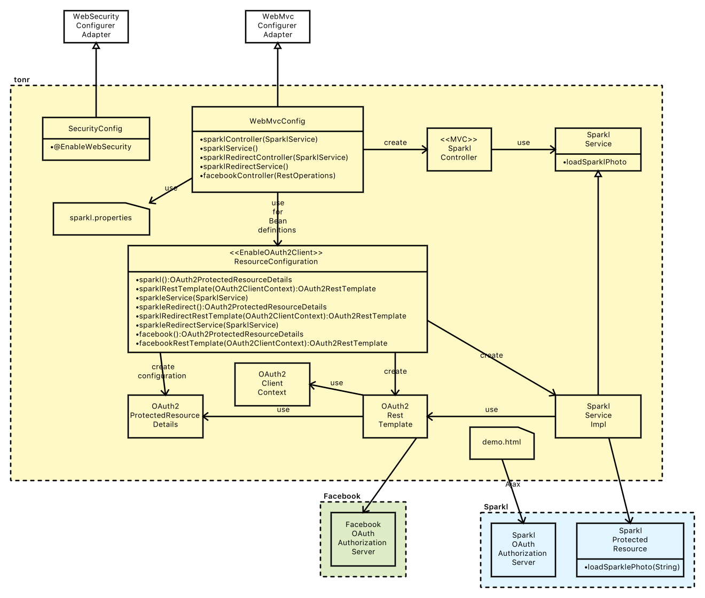
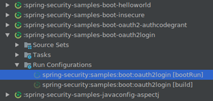
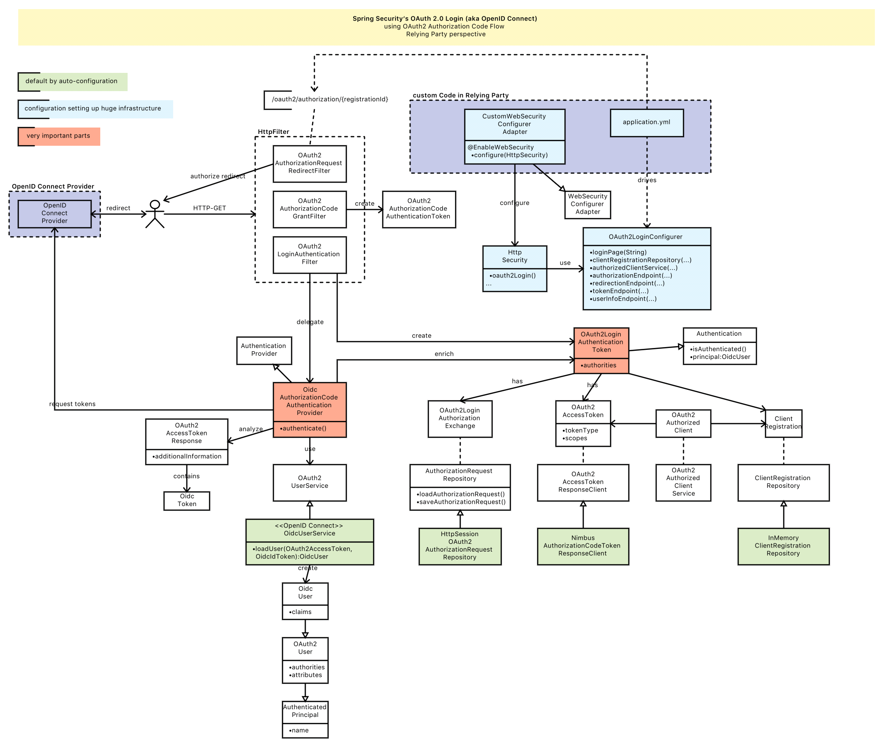

# Spring Security

* [spring.io Guides](https://docs.spring.io/spring-security/site/docs/current/guides/html5//index.html)
* [Konfiguration](https://docs.spring.io/spring-security/site/docs/current/reference/html/jc.html)

Spring bietet mit dem Projekt *Spring Security* schon entsprechende Komponenten, um auto-konfiguriert (Web-) Applikationen abzusichern.

## Aufbau

spring-security ist ein Major Spring Projekt (Artefakt-Gruppe `org.springframework.security`), d. h. es hat eine Vielzahl von Unterprojekten, die teilweise in eigenen Git-Repositories (z. B. `spring-security-saml`, `spring-security-kerberos`, `spring-security-oauth`, `spring-security-oauth-javaconfig`, `spring-security-oauth2-boot`) beheimatet sind. Die darüber bereitgestellten Artefakte sind zunächst mal überwältigend. Spring-Boot hat dies vermutlich erkannt und bietet mit den `foo-starter-bar` Artefakten Gruppen von Abhängigkeiten an (z. B. [spring-boot-starter-security](https://search.maven.org/remotecontent?filepath=org/springframework/boot/spring-boot-starter-security/2.0.1.RELEASE/spring-boot-starter-security-2.0.1.RELEASE.pom)). Wenn ich von Spring Security sprechen meine ich ALLE `spring-security` Git-Projekte und Artefakte.

In Spring Security 3.0 entschied man sich für eine stärkere Trennung der jars ... noch ist es bei mir nicht ganz angekommen - meine Verwirrung wird an diesem Beispiel sehr deutlich:

* Artefakt org.springframework.security/spring-security-oauth2-core
  * hier gehört oauth2-core zur Artefakt-Gruppe `org.springframework.security`, das derzteit in Version 5.0.4 existiert
* Artefakt org.springframework.security.oauth/spring-security-oauth2
  * hier gehört spring-security-oauth2 zur Artefakt-Gruppe `org.springframework.security.oauth`, das derzteit in Version 2.3.2 existiert

Meine Vermutung ist, daß unterschiedliche GIT-Repositories häufig unterschiedliche Artefakt-Gruppen verwenden, gelegentlich aber auch die gleiche.

Positiv zu erwähnen ist, daß bei Spring die Major-Projekte i. a. `docs` und `samples` Unterordner enthalten.

## Getting Started

Nach einer Erweiterung der `pom.xml` mit

```xml
<dependency>
    <groupId>org.springframework.boot</groupId>
    <artifactId>spring-boot-starter-security</artifactId>
</dependency>
```

greift die Auto-Konfiguration von Spring Boot und alle Web-Interfaces (Servlets, Webservices) sind automatisch Basic-Auth-geschützt (username/password des generierten In-Memory-Default-Benutzers werden beim Start der Anwendung im Log ausgegeben).

Eine Anpassung der Security erfolgt über einen `WebSecurityConfigurerAdapter` (mit `@EnableWebSecurity`), um hier beispielsweise

* einige Schnittstellen public zu machen, sinnvolle Ressourcen könnten sein
  * JavaScript Dateien
  * CSS Dateien
  * Login-Seite ... sofern das nicht über einen zentralen Identity-Provider (z. B. [OpenID Connect](openIdConnect.md)) abgebildet ist
* statt Basic-Auth ein Form-Based-Authentication zu implementieren
* ...

Der angemeldete User ist dann über `SecurityContextHolder.getContext().getAuthentication().getPrincipal()` verfügbar.

## Spring Social Security

Spring bietet bereits Projekte, um Identity-Provider wie

* Google ([OpenID Connect certified](openIdConnect.md))
* Facebook
* LinkedIn
* GitHUb
* ...

einzubinden.

Durch die Einbindung der entsprechenden Basis-Projekte in der `pom.xml`

```xml
<dependency>
    <groupId>org.springframework.social</groupId>
    <artifactId>spring-social-core</artifactId>
</dependency>
<dependency>
    <groupId>org.springframework.social</groupId>
    <artifactId>spring-social-web</artifactId>
</dependency>
<dependency>
    <groupId>org.springframework.social</groupId>
    <artifactId>spring-social-security</artifactId>
</dependency>
```

und Identity-Provider-specifischer Projekte (hier Facebook)

```xml
<dependency>
    <groupId>org.springframework.social</groupId>
    <artifactId>spring-boot-starter-social-facebook</artifactId>
</dependency>
```

die Auth-Konfigurationsmechanismen müssen dann nur noch vordefinierte Properties überschrieben werden (z. B. `facebook.appId` bzw. im OpenID Connect Fall  `security.oauth2.client.client-id`) und schon ist die Integration des Facebook-Logins in die Anwendung erledigt.

### Spring Social Security - OAuth2

* Subprojekt der Artefakt-Gruppe `org.springframework.security.oauth`
* [Spring OAuth2 Developers Guide](http://projects.spring.io/spring-security-oauth/docs/oauth2.html)

#### Blueprints: Tonr und Sparkl

> ACHTUNG: Tonr und Sparkl implementieren NICHT Authentifizierung per OpenID Connect (man muß sich in Tonr UND Sparkl einloggen ... jede Anwendung hat sein eigenes User-Management!!!) - im Spring-Sprachgebrauch *OAuth 2.0 Login* - sie zeigen nur OAuth in Action,

* [Source Code](https://github.com/spring-projects/spring-security-oauth)
* [make it running](http://projects.spring.io/spring-security-oauth/docs/tutorial.html)

spring.io liefert mit Sparkl und Tonr sehr gute Blueprints wie man Spring Security mit OAuth und OAuth2 einsetzen kann. Diese werden auch im [Spring Security OAuth2 Developer Guide](http://projects.spring.io/spring-security-oauth/docs/oauth2.html) explizit referenziert.

Rollen:

* Sparkl:
  * Authorization Server
  * Protected Resource
* Tonr:
  * Client

Tonr Übersicht:



### OpenID Connect Client (aka Spring OAuth 2.0 Login)

> "OAuth 2.0 Login is implemented by using the Authorization Code Grant, as specified in the OAuth 2.0 Authorization Framework and OpenID Connect Core 1.0." ([Spring Doku](https://docs.spring.io/spring-security/site/docs/current/reference/htmlsingle/#jc-oauth2login))
>
> ACHTUNG:
> * Spring unterscheidet hier stark zwischen dem Client (`spring-security-oauth2-client` - ist in der Artefakt-Gruppe `org.springframework.security` zuhause) und den Basis-Libs bzw. dem Server (ist in der Artefakt-Gruppe `org.springframework.security.oauth` zuhause)
> * das Artefakt `spring-security-openid` ist für *OpenID* und NICHT für *OpenID Connect* gedacht - *OpenID Connect* wird von `spring-security-oauth2-client` (Artefakt innerhalb `spring-security`) und ``spring-security-oauth2` (separates Git-Repository) abgedeckt. Verwirrung pur.
> * Spring nennt das *OpenID Connect Login* einfach mal *OAuth 2.0 Login*
>   * Spring OAuth 2.0 Login ist mehr als OpenID Connect, denn es werden auch nicht OpenID Connect zertifizierte Identity Provider (z. B. Facebook, GitHub unterstützt) - aber genauso OpenID Connect zertifizierte (z. B. Google).
> * verwendet man die Spring-Komponenten, dann beschreitet man einen bereits vorgedachten/funktionierenden Weg, den man "nur noch" konfugurieren und an den richtigen Stellen anpassen muß. Letztlich basieren die Implementierungen aber auf den HTTP-Standardtechnologien und können auch selbst implementiert werden (über HttpRequest-Filter) ... vielleicht ist es besser anfangs den beschwerlichen Weg zu nehmen, um die Vorteile eines Frameworks (wie hier Spring Security) besser erkennen zu können.

* Spring Doku
  * [OAuth 2.0 Login in Kurzform](https://docs.spring.io/spring-security/site/docs/current/reference/htmlsingle/#jc-oauth2login)
  * [OAuth 2.0 Login in Langform - Advanced Configuration](https://docs.spring.io/spring-security/site/docs/current/reference/htmlsingle/#oauth2login-advanced)
  * [OAuth 2.0 Login - Properties](https://docs.spring.io/spring-security/site/docs/current/reference/htmlsingle/#jc-oauth2login-boot-property-mappings)
  * [BEST - Sample Source Code / Blueprint - OAuth 2.0 Login für Relying Parties (Teil des spring-security Projekts)](https://github.com/spring-projects/spring-security/tree/5.0.4.RELEASE/samples/boot/oauth2login)
    * BTW: nur Gradle unterstützt (aber wenigstens wird ein Gradle-Wrapper bereitgestellt) - kein Maven
* [Baeldung - OpenID Connect Relying Party gegen Google OpenID Provider](http://www.baeldung.com/spring-security-openid-connect)
* [mein Abschnitt über OAuth](oauth.md)
* [mein Abschnitt über OpenID Connect](openIdConnect.md)

Das Versprechen von Spring:

> "Spring Boot 2.0 brings full auto-configuration capabilities for OAuth 2.0 Login." ([Spring 5 Release Notes](https://docs.spring.io/spring-security/site/docs/current/reference/htmlsingle/#jc-oauth2login))

Leider mußte ich LANGE suchen bis ich [dieses Beispiel im spring-security GIT Repository im Unterordner "samples"](https://github.com/spring-projects/spring-security/tree/5.0.4.RELEASE/samples/boot/oauth2login) und die passende Doku gefunden habe. Das Spring Ökosystem ist für mich undurchschaubar geworden ... vielleicht muß ich auch erst mal wieder warm werden damit. Zuvor hatte ich Zeit mit Tonr/Sparkl verbracht, die aber nur OAuth2 demonstrieren (Autorisierung) und kein OpenID Connect (Authentifizierung).

Erweiterung der `pom.xml` mit

```xml
<dependency>
    <groupId>org.springframework.boot</groupId>
    <artifactId>spring-boot-starter-security</artifactId>
</dependency>
<dependency>
    <groupId>org.springframework.security.oauth</groupId>
    <artifactId>spring-security-oauth2</artifactId>
</dependency>
```

#### Blueprint sample/oauth2login

Im spring-security Source Code (gehostet auf GitHub) findet man den [oauth2login Blueprint](https://github.com/spring-projects/spring-security/tree/5.0.4.RELEASE/samples/boot/oauth2login
spring-security/samples/boot/oauth2login).

Starten der Beispielanwendung mit GitGub Login (weitere out-of-the-box supportete Identity Provider sind Okta, Facebook, Google):

* in GitHub einen Client über https://github.com/settings/applications/new registrieren (z. B. `spring-security-oauth2login-sample`) - die nachträgliche Verwaltung (z. B. Löschung) läuft über https://github.com/settings/developers. Damit erhält man eine `client-id` und ein `client-secret`
* unter `/src/com.github/spring-security/samples/boot/oauth2login/src/main/resources/application.yml` die GitHub `client-id` und ein `client-secret` eintragen
* in [Idea IDE](idea.md) konnte ich die Anwendung über den Gradle Command `application:boot-run` starten

  

* über das CLI startete es über den Gradle-Wrapper auf diese Weise:

  ```bash
  cd ~/src/com.github/spring-security/samples/boot/oauth2login
  ~/src/com.github/spring-security/gradlew bootRun
  ```

Anschließend war die Landing-Page der `OAuth2LoginApplication` über http://localhost:8080/login erreichbar. Beim Click auf den [GitHub-Link - http://localhost:8080/oauth2/authorization/github](http://localhost:8080/oauth2/authorization/github) wurde ich dann wie erwartet auf die GitHub-OAuth2-Login-Seite weitergeleitet und nach der Eingabe meiner Credentials habe ich den Client für den Zugriff autorisieren müssen ... danach wurde ich wieder redirected auf die Beispiel-Anwendung, in der ich dann angemeldet war und meine UserInfo von GitHub abrufen konnte.

> ACHTUNG: die Identity Provider Google, GitHub, Facebook, Okta sind bereits vorkonfiguriert - hier sind schon enstprechende Default-Konfigurationen hinterlegt, so daß nur noch die `client-id` und das `client-secret` explizit konfiguriert werden muß (siehe [Doku](https://docs.spring.io/spring-security/site/docs/current/reference/htmlsingle/#jc-oauth2login-common-oauth2-provider))

Voila ... das `sample/oauth2login` funktioniert. Jetzt muß ich nur noch verstehen wie es funktioniert, denn ich möchte meinen eigenen OpenID Connect Provider einbinden.

Da viele Details (Kommunikation zwischen Relying Party und OpenID Connect Provider) im Spring-Framework ablaufen, nutzt man Spring hier als Black-Box. Natürlich sollte man die Doku lesen, doch die ist i. a. für Anwender geschrieben - für den Blick in die Implementierung hilft hier nur der Spring-Source-Code (da kann man natürlich auch debuggen) oder das Logging zu erhöhen:

```yml
logging:
  level:
    org.springframework.security: TRACE
```

So sieht die Architektur in etwa aus:



##### Reverse Engineering ... unmöglich

Leider war mir schon gar nicht klar wie der Endpunkt `/login` in diese Anwendung gelangt und warum für GitHub keine `spring.security.oauth2.client.provider.github.authorization-uri` angebgeben war. In der Doku wurden die Fragen beantwortet:

* `/login`: [Information in der Doku gefunden](https://docs.spring.io/spring-security/site/docs/current/reference/html/oauth2login-advanced.html#oauth2login-advanced-login-page).
* `provider.github`: ist ein vorderfinierter Provider (siehe `org.springframework.security.config.oauth2.client.CommonOAuth2Provider`)

> Ganz ehrlich ... ohne Dokumentation kommt man bei einem Convention-over-Configuration-Ansatz einfach nicht weiter - Reverse-Engineering ist mit zu großem Aufwand verbunden :-(

#### Runtime Konfiguration

Spring bringt schon die passenden Konfigurationsparameter (für die `application.yml`) für die IdentityProvider Google (OpenID Connect zertifiziert), GitHub (kein OpenID Connect - aber OAuth2 basiert), Facebook (kein OpenID Connect) ist nur die `clientId` und das `clientSecret` erforderlich ([siehe Sample Code](https://github.com/spring-projects/spring-security/tree/5.0.4.RELEASE/samples/boot/oauth2login)).

> [hier findet man die Konfiguration für Google](https://github.com/spring-projects/spring-security/blob/526e0fdd4fde023a7fa77dff70f4424e10b7dcba/config/src/main/java/org/springframework/security/config/annotation/web/builders/HttpSecurity.java#L959)

> Spring nennt die OAuth2 basierte Authentifizierung "OAuth2 Login" und nicht "OpenID Connect", da auch non-"OpenID Connect" Identity Provider wie Facebook und GitHub unterstützt werden!!!

Will man andere IdentityProvider anbinden, so müssen entsprechende `provider` konfiguriert werden:

```yml
security:
  oauth2:
    client:
      registration:
        github:
          clientId: 4711
          clientSecret: 0815
        my-iam:
          clientId: 4711
          clientSecret: 0815
          scope: openid
      provider:
        my-iam:
          authorization-uri: http://foo/oauth/authorize
          token-uri: http://foo/oauth/token
          jwk-set-uri: http://foo/oauth/jwk
          user-info-uri: http://foo/oauth/userinfo
```

### OpenID Connect Provider mit Spring

Spring selbst hat für OpenID Connect Provider Implementierungen noch keine out-of-the-box Lösung (im Gegensatz zum OpenID Connect Client). Da Spring aber OAuth2 Support anbietet ist der Weg zum OpenID Connect Provider nicht mehr sehr weit ... die Konfiguration/Bereitstellung der Endpunkte erfolgt über `@EnableAuthorizationServer` und programmatische Konfiguration (Fluent-APIs). Damit erhält man zumindest schon mal die Endpunkte `authorize` und `token`.

Dann fehlt "nur" noch der `id_token`, den man in eine Spring-Security-Implementierung als `OAuth2AccessToken.additionalInformation` einhängen kann (dort sucht ein Spring-Security OpenID Connect Client den Token).

### OpenID Connect Provider ohne Spring

* [MITREid Connect - Implementierung basierend auf Spring Security](https://github.com/mitreid-connect/OpenID-Connect-Java-Spring-Server)
  * sehr gute Quelle, wenn man seinen eigenen OpenID Connect Provider auf Spring-Security-Basis implementieren will
  * "MITREid Connect is a reference implementation of the OpenID Connect protocol server and client" ([Link](https://github.com/mitreid-connect/OpenID-Connect-Java-Spring-Server/wiki))
* [Connect2id Server - basierend auf Java-Projekt "Nimbus OAuth OpenID Connect" (Open-Source)](https://connect2id.com/)
  * [Source Code](https://connect2id.com/products/nimbus-oauth-openid-connect-sdk)
* [Java-Implementierung basierend auf Authlete](https://medium.com/@darutk/spring-oauth-2-0-openid-connect-3341a6ed1f92)
* [Clouway - non-Spring Java-Implementation](https://github.com/clouway/oauth2-server)

## spring-security-test-web-security

* [Verwendung MockMvc](https://spring.io/blog/2014/05/23/preview-spring-security-test-web-security)