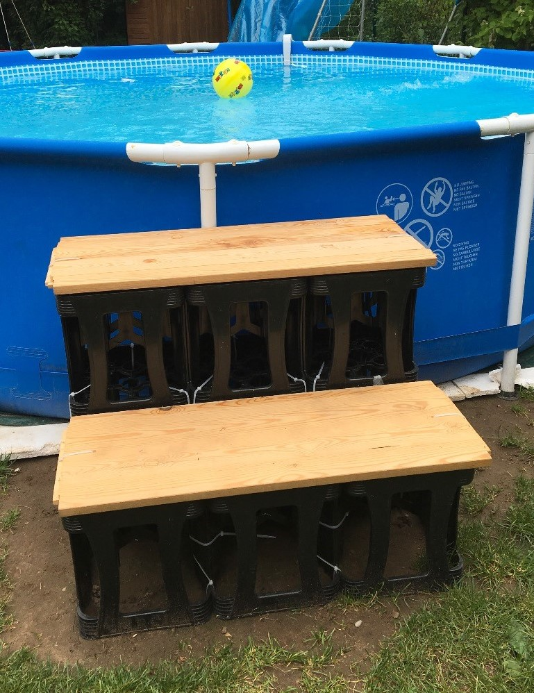

# Swimming Pool

Im Mai 2016 haben wir einen günstigen Pool bei Aldi für 129 Euro gekauft (8000 Liter) ... das sollte mal reichen, um erste Erfahrungen zu sammeln (und zu testen, ob es den Kindern und uns überhaupt Spaß macht oder wir doch lieber ins Schwimmbad gehen).

---

## Pflege

Links:

* sehr gute umfassende Brochüre: http://www.hornbach.de/cms/media/de/projektbereich/wellness_1/pool_1/poolwasser_pflegen/Broschuere_Pool_fachgerecht_pflegen.pdf
* http://www.hornbach.de/cms/de/de/projekte/wellness_zuhause/pool_bauen/poolwasser_pflegen/poolwasser_pflegen.html

### Motivation

Die Poolpflege ist sehr wichtig, um nicht durch Keime und Bakterien krank zu werden. Je höher die Temperaturen desto wichtiger ist die

* regelmäßige Poolkontrolle
* Filterung
* Zugabe von Chemikalien

um ein Umkippen des Wassers und somit eine Gesundheitsgefährung zu vermeiden.

### Gegner

* Keime und Bakterien
* Kalk
* Algen, da sie der Nährboden für Bakterien sind
* Schnaken - man entdeckt sie immer wieder: Schnakenlarven

### Tools

* Chemikalien:
  * pH-plus oder pH-Minus
    * Wasserpflegemittel wirken nur dann optimal, wenn der pH-Wert richtig eingestellt ist.
  * Chlor
    * Schockchlorierung (zumeist Granulat)
    * Dauerchlorierung (zumeist Tabletten)
    * evtl. kann auch ein Chlorgenerator eingesetzt werden, der aus Salz Chlor generiert
  * Algicid
  * Metall- und Kalkstabilisator
* Pumpe, um Dreck rauszuwaschen
* Skimmer
* Kescher
* Sauger
  * per Wasser - hier schließt man einen Wasserschlauch an, das Wasser wirbelt den Dreck vom Boden auf und ein Netz fängt ihn auf
  * per Pumpe - hier wird ein langer Schlauch an den Ausgang vom Skimmer angeschlossen, die andere Seite vom Schlauch kommt an eine Bodenbürste, so daß der Dreck in die Pumpe gesaugt und dort gefiltert wird
* Becken-Bürste, um den Boden und Rand abzubürsten und dadurch den Wirkungsgrad der Chemikalien zu erhöhen
* Abdeckplane (Algen brauchen Licht zum Wachsen)
* Spielereien
  * [Schwimmgürtel statt Gegenstromanlage](https://www.amazon.de/Schwimmtrainer-Gegenstromanlage-gepolsterter-Schwimmgurt-Schwimmtube/dp/B01GIMZV8O/ref=sr_1_1?__mk_de_DE=%C3%85M%C3%85%C5%BD%C3%95%C3%91&dchild=1&keywords=schwimmg%C3%BCrtel+body+cross&qid=1586710374&sr=8-1)
  * Wasserhängematte

### Vorgehensweise

Meine gesammelten Tipps aus verschiedenen Quellen:

* Poolaufbau:
  * auswaschen
* Poolnutzung
  * regelmäßig Chlor und PH-Wert kontrollieren (mind. 1 x pro Woche)
    * PH-Wert sollte zwischen 7,0 und 7,5 liegen - ansosten braucht man zu viel Chemie
    * Dauerchlorierung mit Tabs, die in einen Schwimmer kommen
    * Schockchlorierung mit Granulat, das wir in Wasser vorher auflösen
  * bei grünlichem Wasser Algicid reingeben und Pumpe länger laufen lassen
    * Filterballs vorher überprüfen ... evtl. rückspülen
    * VORHER: PH-Wert auf den richtigen Wert bringen
  * bei bräunlichem Wasser ... und Pumpe länger laufen lassen
  * bei milchigem Wasser ... und Pumpe länger laufen lassen
  * Skimmer verwenden, um groben Schmutz VOR der Pumpe rauszufiltern
  * bei Nichtnutzung die Plane drüberziehen:
    * Wasser heizt dadurch schneller auf (wir haben es innerhalb von 2 Tagen von 20° auf 30° geschafft)  
    * Algenwachstum braucht Licht ... weniger Licht = weniger Algenwachstum
  * Poolsauger nutzen
    * wir haben den: https://www.amazon.de/gp/product/B004FEER0Q/ref=oh_aui_detailpage_o05_s00?ie=UTF8&psc=1
  * Filterreinigung:
    * Kartusche: regelmäßig entnehmen und abspritzen
    * einmal wöchentlich rückspülen - gelegentlich die Filterballs prüfen (häufig setzen sich auch Algen ab)
    * Sand und Filter Balls: Rückspülen und Nachspülen sobald der Druck in den gelben Bereich wechselt (siehe Manometer), um den Dreck aus dem Sand zu waschen und abzulassen
* Wintereinlagerung:
  * Pool gründlich waschen (Putzmittel für Pools) und dann ausgiebig trocknen

---

## Pumpe

Die Pumpe hat folgende Aufgaben:

* Dreck rausfiltern (über Kartusche, Sand oder Filter Balls)
* Chemieverteilung im Pool

### Steinbach Poolpumpe Speedclean Comfort 50

Der [beiliegende Kartuschenfilter](https://www.amazon.de/Intex-28604GS-Kartuschenfilteranlage-2270GS-2-271/dp/B005FLOAZU/ref=sr_1_1?s=garden&ie=UTF8&qid=1472487778&sr=1-1&keywords=intex+filterpumpe) machte keinen besonders guten Eindruck, denn die Pumpleistung war an sich schon nicht groß und zudem wurde häufig Luft gezogen, so daß eine manuelle Entlüftung (geht schnell - Pumpe aus, Schraube aufdrehen, warten bis Wasser rausläuft, Schraube zudrehen, Pumpe an) erforderlich war, um zumindest diese schlechte Filterung zu bekommen.

Nachdem wir aus dem Urlaub zurückkamen war das Wasser - trotz minimaler Pflege durch unseren Aushilfspoolmeister - grün. Ende August wollten wir natürlich nicht nochmal das Wasser wechseln.

Auf der Suche nach Algenvernichter bin ich im Baumarkt auch an den Sandfilteranlagen vorbeigekommen. Spontan entschloß ich mich für den Kauf der _Speedclean Comfort 50_ von Steinbach für 200 Euro. Diese ist zwar mit 6.600 l/h Pumpvolumen für Pools bis 33.000 Liter ausgelegt (unserer hat nur 8.000 Liter) ... aber dadurch schafft sie, unseren Pool locker in einer guten Stunde einmal durchzuspülen. Mit der eingebauten Zeitschaltuhr kann ich die Pumpe dann nachts zwei Stunden laufen lassen und habe morgens schon wieder frisches Wasser.

Die Alternative im Baumarkt war die [Steinbach Speedclean Eco 30](https://www.amazon.de/Speedclean-Eco-30-Sandfilteranlage-40250/dp/B002ID575K), deren Pumpe allerdings AUF dem Sandfilter montiert ist. Da die Pumpe nicht über eine Ansaugung verfügt, müßte der Pumpeneinlaß unterhalb des Poolauslasses liegen. Ich hätte die Pumpe vergraben müssen ... dazu war ich nicht bereit (im Baumarkt wäre sie mit 170 Euro nur 30 Euro günstiger gewesen).

Achtung: die Pumpe kommt ohne Schläuche für den Poolanschluß und den Ablaß daher!!!

#### Aufbau und Inbetriebnahme

Der Aufbau gestaltete sich aufwendiger als erwartet. Erstens hatte ich noch keine Erfahrungen mit Sandfilterpumpen (und die Comfort 50 ist ein 7-Wege-Ventil-Gerät), zweitens war die [Bedienungsaufbauanleitung schlecht und drittens war sie noch für eine ältere Version der Comfort 50 geschrieben](http://www.steinbach.at/images_mam?ID=7585da68858@steinbach&rand=694abddbd449d2a3e16df6a4eade52ca&force=true&download=true&omitPreview=true) (zwar nur leichte Änderungen, aber es wurden zwei Teile nicht mehr benötigt). Nach ein paar verzweifelten Eigenversuchen entschied ich mich

* für ein Youtube Video vom Hersteller: https://www.youtube.com/watch?v=IXwv5fyoC0g
* diese hervorragende PDF-Anleitung: http://www.king-of-sports.de/res/steinbach_sandfilteranlage-speed-comfort_gebrauchsanleitung.pdf

So war es kein größeres Problem mehr und mit meinem jetzigen Wissen würde ich den Filter auch in 20 Minuten anschließen können.

**Ein paar Tipps:**

* Gewinde der Schläuche und Adapter zusätzlich mit [Gewindeband/Teflonband](https://www.amazon.de/mediPOOL-Gewindeband-Teflonband-Schwimmbad-Gartenpool/dp/B0084Y7LWE/ref=sr_1_2?s=garden&ie=UTF8&qid=1472499007&sr=1-2&keywords=Gewindeband) abdichten ... sonst könnte es schon mal tropfen
* in den Stellungen 5 - 7 sollte man die Pumpe nicht einschalten
* Während des Betriebs nicht den Modus wechseln (z. B. 1 auf 2)

#### Wie oft soll sie laufen?

Steinbach gibt hierzu [folgende Empfehlung](http://www.steinbach.at/info/detail.php?viewID=16344):

* Bis zu einer Wassertemperatur von ca. 20 °C:
  * Das Wasser soll mindestens 2 x täglich umgewälzt werden.
* Bis zu einer Wassertemperatur von ca. 24 °C:
  * Das Wasser soll mindestens 2 x täglich umgewälzt werden. + 2 Stunden
* Ab einer Wassertemperatur von ca. 24 °C:
  * Das Wasser soll mindestens 2 x täglich umgewälzt werden. + 4 Stunden

Pro Umwälzung braucht die Comfort 50 eine gute Stunde ... also 2 Stunden für 2 Umwälzungen. Obige Empfehlungen ergeben also folgende Laufzeiten:

* Bis zu einer Wassertemperatur von ca. 20 °C: 2 Stunden
* Bis zu einer Wassertemperatur von ca. 24 °C: 4 Stunden
* Ab einer Wassertemperatur von ca. 24 °C: 6 Stunden

Gut, daß ich mich für die leistungsfähiger Pumpe entschieden habe.

#### Filter Balls

* https://www.amazon.de/Steinbach-Filter-Balls-handels%C3%BCblichen-Sandfilteranlagen/dp/B01BVF66EG/ref=sr_1_1?s=garden&ie=UTF8&qid=1472486586&sr=1-1&keywords=filter+balls

Statt für Sand habe ich mich für sog. Filter-Balls entschieden. Vorteile:

* feinere Filterung (Filter Balls filtern viel kleinere Teilchen, so daß man sich auch Zusatzstoffe wie Flockfix sparen kann, die man einsetzt, um die Teilchen größer zu machen)
* geringes Gewicht (vielleicht muß man die Pumpe auch mal bewegen)
* Wiederverwendung - am Ende der Saison (oder auch mal mittendrin) kann man sie in die Waschmachiene stecken, trocknen lassen und im nächsten Jahr wiederverwenden. Sand müßte man jedes Jahr erneuern.
* kein Sand im Pool

Soweit die Theorie ... mal sehen wie es in der Praxis aussieht

#### Startwerte

Der Druck lag zu Beginn bei 0,5 bar ... wenn er in den gelben Bereich steigt, dann ist eine Rückspülung erforderlich

#### Bewertung

Die Pumpe war gar kein Vergleich zur Intex-Standardpumpe ... hat ja auch den 5-fachen Preis gekostet (die Pumpe war teurer als der ganze Pool inkl. Standardpumpe).

Ersatzteile scheinen kein Problem zu sein - [siehe hier](http://www.steinbach.at/info/detail.php?viewID=16344).

### Tipps

* während des Pumpenbetriebs sollte man aus Sicherheitsgründen nicht baden
* Druck am Manometer beobachten ... sobald im gelben Bereich: Rückspülen und Nachspülen, um den Dreck aus dem Filter zu waschen
* Rückspülen ist wichtig - sonst können die Filter Balls irgendwann keine Teilchen mehr binden ... evtl. auch mal austauschen!!!

---

## Tools

* Treppe
  * im Baumarkt wollten die für eine Plastiktreppe fast 100 Euro - das war ich nicht bereit zu investieren. Stattdessen habe ich mir eine Treppe aus Wasserkisten (Kabelbinder) selbst gebaut:

    

* Poolsauger und -kescher: https://www.amazon.de/gp/product/B004FEER0Q/ref=oh_aui_detailpage_o05_s00?ie=UTF8&psc=1
  * das Absaugen klappt erstaunlich gut :-)
* Löcher flicken
  * wir hatten mal ein kleines Loch im Pool und im Baumarkt habe ich mir ein Unterwasser-Flick-Set gekauft ... hat irgendwie gar nicht funktioniert. Ich habe dann stattdessen 1000 Liter abgelassen und dann hat es funktioniert.

---

## Bewertung Version 1.0

Es hat sich gelohnt ... der Garten ist nun zwar zu etwas anderem kaum noch zu gebrauchen (3,7m Durchmesser), aber er wird genutzt. Von den Kindern, den Eltern und den Großeltern. Das Schwimmbad wird zwar nicht ersetzt, aber wenn man mal nicht die Zeit/Muße fürs Schwimmbad hat oder das Wetter nur durchwachsen ist (wie im Sommer 2016 häufiger), dann ist der Pool perfekt. Im nächsten Jahr wird er wieder aufgebaut und sicherlich wird die ein oder andere Optimierung vorgenommen

* der Pool könnte tiefer sein ... von den 75cm bleiben 60cm übrig ... für kleine Kinder ok, aber für Jugendliche und Erwachsene ist das wirklich zu flach
* statt der blauen Außenwand wäre eine Rattan-Optik ganz angenehm, das würde sich weniger auffällig in den Garten einfügen

---

## Swimming-Pool 2.0

Nach 4 Saisons hatte der erste Pool einige kleine Löcher und die Stangen waren schon sehr verrostet - deshalb haben wir ihn nach der Saison 2019 entsorgt.

Eigentlich wollten wir für 2020 keinen neuen anschaffen, doch die Corona-Krise und die sportlichen Aktivitäten der Kinder hat uns umdenken lassen. Ins Schwimmbad wird man evtl. auf absehbare Zeit nicht kommen und die Kinder haben jeweils 2-3 Tage die Woche Fußballtraining und dann nach einem langen Schulatg auch keine Zeit, ins Schwimmbad zu gehen. Mit dem Pool im Garten kann man schnell mal eben 30 Minuten abkühlen und Spaß haben.

Diesmal sollte er tiefer sein - vielleicht eine Rechteckform statt rund - läßt sich zum Spielen und "Schwimmen" besser nutzen. Tiefer bedeutet allerdings - zumindest nach aktueller Recherche - auch größer in der Fläche ... und das wiederum bedeutet noch weniger Rasen, der dann bei 4 Monaten Nutzung für immer tot ist.

Pool 1.0 hatte einen Durchmesser von 366 cm (Brutto knapp 400 cm) und eine Tiefe von 75 cm (von denen gerade mal 60 genutzt werden konnten). Allerdings hatte er schon sehr gut in den eh gepflasterten Bereich im Garten gepaßt, der von Rasen umgeben ist.

### Rechteck-Pool Intex

Der [Intex Ultra XTR Frame Pool](https://www.intexcorp.com/ultraxtr/) mit einer Größe von 549 x 274 x 132cm (17.200 Liter ... doppelt so viel wie Version 1.0) einer grauen Außenhaut hat uns gut gefallen. Der Platzbedarf ist aufgrund der herausragenden Träger (4 auf der langen Seite, 2 auf der kurzen) allerdings größer:

Mit ca. 700 Euro ist er natürlich deutlich teurer als die Version 1.0, doch immer

[Aufbau](https://www.youtube.com/watch?v=tAkJzNG35qs)

### Rechteck-Pool Bestway

Der [Bestway Power Steel](https://www.bestwaystore.de/pools/power-steel-pools/ovale-power-steel-pools-mit-kartuschenfilter/967/power-steel-frame-pool-komplett-set-549-x-274-x-122-cm-mit-filterpumpe-oval-grau) im Vergleich zum Intex:

* ca. 100 Euro günstiger
* oval statt rechteckig
* 10cm flacher ... somit ist die Wasserhöhe wohl eher bei knapp über 110 cm
* 13.400 Liter statt 17.200 Liter

### Rund-Pool - 366

* 366 cm Durchmesser
* 122 cm Tiefe
  * den hatte ich ursprünglich übersehen - wurde in den meisten Shops nicht angeboten ... bis dann ein Freund von seiner Bestellung erzählte
* 8500 Liter
* ca. 200 Euro

### Rund-Pool - 457

* 457 cm Durchmesser
* 122 cm Tiefe - 46cm mehr als Pool 1.0
* 17000 Liter
* ca. 300 Euro

### Mitgelieferte Pumpen

Die mitgelieferten Pumpen taugen i. a. nicht viel ... am liebsten wäre mir eine Lieferung ohne Pumpe. Unsere Steinbach-Pumpe Speed Clean Comfort 50 ist auf 33.000 Liter ausgelegt - schafft 6.600 Liter/h ... braucht also 5 Stunden (kein Problem nachts), um das Wasser zweimal zu filtern.

Keine neue Pumpe erforderlich.

### Tips

* bei der Größe ist ein gerader Untergrund noch wichtiger
  * bei Stahlrahmenpool sollte das Gefälle auf 5m nicht größer sein als 3cm ... im schlimmsten Fall kippt der Pool um
  * bisher habe ich immer Styropor (3 cm) ausgelegt, um Unebeneheiten auszugleichen (ich habe kleine (8 x 8 x 8 cm Pflastersetine dort verlegt - eine gerade Fläche ist das nicht) und ein angenehmes Fußgefühl zu haben
    * vielleicht ist Styrodur besser als Styropor - weniger druckempfindlich ... bei mir hat bisher das druckempfindliche Stypropor die Unebenheiten super ausgeglichen ... deshalb gibt es für mich keinen Grund zur Änderung
    * zudem sollte man eine Folie zwischen Rasen und Pool legen, um zu verhindern, daß Feuchtigkeit zwischen Rasen und Pool kommt und das Rasen fault/stinkt
  * vielleicht sollte ich diesmal außerdem noch feinen Sand (Fugensand) ausbringen
    * am besten befeuchten vor dem drüberlegen der Folie damit der Sand bleibt wo er ist
* nach 2-3 Jahren waren die Stangen des ersten Pool stark verrostet - evtl. sollten man ihnen vor der Erstmontage Hohlraumversiegelung gönnen?!?
