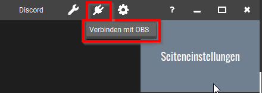

# Touch Portal

Das Touch Portal ist ein Open-Source Projekt, das ähnliche Funktionalität bietet wie das beliebte Elgato Stream Deck ... aus meiner Sicht allerdings viel besser (u. a. weil es auf Handys und Tablets läuft). [Hier ein Vergleich](https://www.youtube.com/watch?v=EsiJllg7fj4).

---

## Alternative

### Deckboard

* [Homepage](https://github.com/rivafarabi/deckboard)

Wenn man kein externes Steuergerät verwenden will, dann ist das vielleicht eine brauchbare Alternative. Funktioniert allerdings auch mit einem Android-Handy/Tablet zur Steuerung.

---

## Server

* [Einführung](https://www.youtube.com/watch?v=dtI81N-YQT8)

Der Touch Portal Server läuft auf einem Laptop und wird von einem Touch Portal App (Handy, Tablet) ferngesteuert. Es lassen sich so einfach alte Tablets wiederverwenden, um ein Touch Portal Server remote bedienen zu können. Das Tablet sendet somit einen Befehl an den Touch Portal Server (Laptop) und von dort dann weiter ... beispielsweise an ein laufenden OBS-Programm.

Die [Touch Portal Community](https://www.touch-portal.com/#section_createandshare) bietet schon

* [fertige Pages](https://www.touch-portal.com/assetsdb/show-all.php?cat=p)
* [Plugins](https://www.touch-portal.com/assetsdb/show-all.php?cat=pl)
* [Icon Packs](https://www.touch-portal.com/assetsdb/show-all.php?cat=i)

zum Download. Mit der OBS-Free Page kann man beispielsweise gleich loslegen, um sein OBS fernzusteuern.

Alternativ designed man seine eigenen Seiten, Icon-Packs oder Plugins ... und stellt sie bei Bedarf anderen zur Verfügung.

---

## Navigation

* [Einführung](https://www.touch-portal.com/blog/post/tutorials/navigating-multiple-pages.php)

Man hat eine `main`-Page, die die Root-Seite repräsentiert. Mit der Aktion `Go To Page` kann man dann auf eine beliebige andere Seite wechseln. Diesen Button sollte man auf jeder Seite platzieren, um zu anderen Seiten wechseln zu können ... aber natürlich kann man auch Buttons anbringen, um schnell zu Geschwisterseiten zu wechseln, ohne über `main` gehen zu müssen.

> Will man eine Seite teilen, dann sollte man aber immer auf `main` wechseln, da man ansosnten Abhängigkeiten einbaut, die evtl. auf dem Client-System nicht existieren. Allerdings kann man ja auch bei importierten Seiten die Aktionen verändern.

---

## Page OBS Free

Hiermit kann man [OBS](obs-studio.md) fernsteuern, um so beispielsweise per Knopfdruck, die Szene zu wechseln. Aus meiners sicht ist das deutlich professioneller (aus Content-Consumer-Sicht) und deutlich einfacher (aus Content-Producer-Sicht) als Umkonfigurationen per Maus vorzunehmen.

In OBS muß das [Palakis Websocket Plugin für OBS](https://obsproject.com/forum/resources/obs-websocket-remote-control-obs-studio-from-websockets.466/) installiert werden. Anschließend kann man im Tocuh Portal Menü "Einstellungen - OBS" die Verbindung zum OBS-Programm herstellen. Am besten verwendet man die Option "Automatisch verbinden" ... ansonsten muß man die Verbindung über

manuell herstellen.

Anschließend wird die Page "OBS Free" [runtergeladen](https://www.touch-portal.com/#section_createandshare) und ins eigene Touch Portal importiert.

## Page Voicemeeter

* [Einführung Voicemeeter](https://www.youtube.com/watch?v=FwvuX0QYKpQ)

Voicemeeter ist ein virtuelles Mikrofon, das verschiedene physische Mikrofone als Input verwendet und Einstellungsmöglichkeiten bietet, um die Soundqualität zu optimieren. Voicemeeter stellt den Output als Soundquelle zur Verfügung, so daß man es in Programmen wie ein Microfon verwenden kann.

Auch für dieses Programm gibt es eine Seite, die sich leicht importieren läßt.
