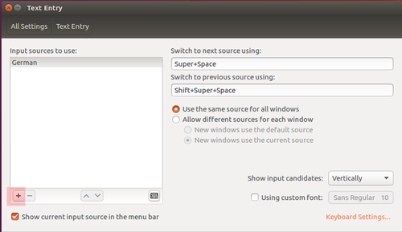

# Ubuntu 16.04 LTS

In den letzten beiden Jahren habe ich mit [Ubuntu 14.10 LTS](workbench/) sehr gute Erfahrungen gemacht. Durch einen Firmenwechsel wollte ich nun aber ein neues Image aufsetzen und das sollte nun teilweise auch mit Ansible gescriptet werden.

Während ich bei der Nutzung von Festplatten mit HardDrives (vor einigen Jahren) noch Performanceeinbußen gegenüber Windows 7 Nutzern hatte, hat sich das durch die Nutzung von SSDs ausgeglichen. Mittlerweile bin ich unter meiner VirtualBox Vm sogar schneller als der Windows 10 Kollege ... vielleicht ist die IO-Performance unter Windows wieder schlechter geworden oder es liegt an den Echtzeit-Virenscannern, die in Unternehmen i. a. unter Windows eingesetzt werden (auch wenn die Entwikler hier zumeist ein Verzeichnis erhalten, das der Scanner ignoriert).

Auf keinen Fall möchte ich wieder auf ein Windows-System wechseln und die vielen liebgewonnen Tools (ordentliche Shells wie bash/zsh mit Autovervollständigung ... sogar auf Tools wie docker/git/curl, GNU-Tools, [Docker](docker.md), [Ansible](ansible.md), automatische Softwareupdates auf selbstinstallierter Software, awesome, terminator, ...) hergeben. Nicht zu vernachlässigen ist die Tatsache, daß meine Software zumeist unter Linux läuft und ich dementsprechend ein gewisses Knowhow auf dieser Plattform benötgige und natürlich auch produktionsnäher arbeite.

---

## Basis-Installation und -Konfiguration

1. Download des ISO-Abbilds von http://releases.ubuntu.com/16.04/
2. ISO-Image (CD-ROM-Laufwerk) in ein neues VirtualBox-Image einbinden ... dann die Maschine starten.

### Deutsche Tastatur

* http://praxistipps.chip.de/ubuntu-auf-deutsch-umstellen_42440

Das Thema hat mich fast zur Verzweiflung gebracht, weil ich in dieser Unity-Oberfläche nicht gefunden habe wie ich ein deutsches Tastatur-Layout einstelle. Der TextEntry-Dialog 



war für mich nicht intuitiv bedienbar. Unter _Input sources to use_ hätte ich nicht die Umstellung des Layouts erwartet ... man muß hier das Pluszeichen drücken und dann das entsprechende Layout auswählen. Toll gemacht :-)

### System Upgrade

Da das ISO-Artefakt schon ein paar Wochen alt ist, sind die installierten Pakete mittlerweile schon veraltet. Über 

```bash
sudo apt-get install
sudo apt-get upgrade
```

wird es auf dem aktuellen Stand gebracht.

### Installation der Gasterweiterungen

Nach dem erfolgreichen Reboot (diesmal in die grafische Oberfläche) ist die Auflösung so klein, daß ich kaum was erkennen kann. Ich binde die VirtuialBox-Gasterweiterungen über das VirtualBox Menü ein und automatisch wird die CD eingebunden und das Skript zum Installieren der Gasterweiterungen startet. Nach der Installation werde ich noch auf die unvollständige Sprachunterstützung hingewiesen. Ich hätte das Update-Skript direkt per Maus starten können, doch leider ist meine Internetverbindung (Authenifizierung am Proxy) noch nicht fertig eingerichtet. Nach einem Reboot habe ich auch endlich eine ordentliche Auflösung :-)

### root User

Hmmm, daß ich das Root-Passwort nicht kenne und nur per sudo bash auf eine Root-Shell komme ... irgendwie gefällt mir das nicht. Ist aber Ubuntu-typisch ... ich kann mich noch dunkel erinnern ...

Ich ändere das per

```bash
sudo bash
passwd
```

ab und vergebe ein neues Root-Passwort.

### Shared Folder Zugriff

Ein Ordner vom Windows-Host (z. B. ``C:\transfer``) wird zum Austausch von Dateien benutzt. Virtualbox bindet den Shared Folder z. B. unter ``/media/sf__VirtualBox_transfer_`` ein. Die Gruppe ``vboxsf`` hat die notwendigen Rechte. Deshalb müssen alle User, die Zugriff auf das Verzeichnis haben sollen, in dieser Gruppe sein:

```bash
addgroup vboxsf myuser
```

Danach muß sich der User ab- und wieder anmelden.

### SSH-Server installieren und konfigurieren

* [siehe Kapitel "ssh"](ssh.md)

u. a. Ansible wird diese Vorarbeit später benötigen.

#### Public-Private-Key-Generierung

* [siehe Kapitel "ssh"](ssh.md)

#### ssh-Server: passwortlosen ssh-Zugriff erlauben

* [siehe Kapitel "ssh"](ssh.md)

Der im vorigen Abschnitt erzeugte Public-Key jedes zugreifenden Users muß im zugegriffenen User des Servers unter ``~/.ssh/authorized_keys`` abgelegt werden.

#### ssh-agent: interaktive Passphraseabfrage umgehen

* [siehe Kapitel "ssh"](ssh.md)

Das Ansible-Skript soll ohne Interaktion auskommen. Da man i. a. aber eine Passphrase über den Private-Key legt, müßte dem Ansible-Controller die Passphrase bekannt sein. Das will man aber eigentlich nicht ... deshalb kann man den SSH-Agent damit beauftragen. 

### sudo ohne Passwortabfrage

Für meinen Standarduser ``pfh`` (der später mal die Ansible-Playbooks ausführen wird) wird per ``visudo`` die sudo-Ausführung ohne Passwortabfrage konfiguriert:

```properties
pfh ALL=(ALL) NOPASSWD: ALL
```

Diese Einstellung ist werforderlich, weil ich in den Ansible-Skripten die Einstellung

```properties
remote_user: pfh
become: yes
```

verwende.

---

## Software Installation

### Java

Die Standard Java Installation als ``/etc/alternatives`` finde ich grottig, weil dabei folgendes entsteht:

```bash
/etc/alternatives/java -> /usr/lib/jvm/java-8-oracle/jre/bin/java*
/etc/alternatives/java.1.gz -> /usr/lib/jvm/java-8-oracle/man/man1/java.1.gz
/etc/alternatives/javac -> /usr/lib/jvm/java-7-oracle/bin/javac*
/etc/alternatives/javac.1.gz -> /usr/lib/jvm/java-7-oracle/man/man1/javac.1.gz
/etc/alternatives/javadoc -> /usr/lib/jvm/java-7-oracle/bin/javadoc*
/etc/alternatives/javadoc.1.gz -> /usr/lib/jvm/java-7-oracle/man/man1/javadoc.1.gz
/etc/alternatives/javafxpackager -> /usr/lib/jvm/java-7-oracle/bin/javafxpackager*
/etc/alternatives/javafxpackager.1.gz -> /usr/lib/jvm/java-7-oracle/man/man1/javafxpackager.1.gz
/etc/alternatives/javah -> /usr/lib/jvm/java-7-oracle/bin/javah*
/etc/alternatives/javah.1.gz -> /usr/lib/jvm/java-7-oracle/man/man1/javah.1.gz
/etc/alternatives/javap -> /usr/lib/jvm/java-7-oracle/bin/javap*
/etc/alternatives/javap.1.gz -> /usr/lib/jvm/java-7-oracle/man/man1/javap.1.gz
/etc/alternatives/javapackager -> /usr/lib/jvm/java-8-oracle/bin/javapackager*
/etc/alternatives/javapackager.1.gz -> /usr/lib/jvm/java-8-oracle/man/man1/javapackager.1.gz*
/etc/alternatives/java_vm -> /usr/lib/jvm/java-7-oracle/jre/bin/java_vm*
/etc/alternatives/javaws -> /usr/lib/jvm/java-7-oracle/jre/bin/javaws*
/etc/alternatives/javaws.1.gz -> /usr/lib/jvm/java-7-oracle/man/man1/javaws.1.gz
```

Wenn ich dann allerdings die Java-Version umschalten will, dann muß ich per (http://askubuntu.com/questions/121654/how-to-set-default-java-version)

```bash
sudo update-alternatives --config java
```

jedes einzelne Tool auf eine andere Location umschalten. Zudem bleibt davon die ``JAVA_HOME`` Variable unberührt ... die muß ich noch manuell umsetzen. Wer hat sich das ausgedacht????

#### I did it my way ...

Ich lege meine Java-Versionen unter ``/usr/lib/jvm`` ab (so macht es das Paket ``ppa:webupd8team/java``) und erzeuge einen Link auf die aktuelle Version:

```bash
java -> java-7-oracle/
java-7-oracle/
java-8-oracle/
```

Der symbolische Link ``java`` zeigt immer auf die aktuelle Version. 

Zudem setze ich ein paar Standard-JDK-Variablen auf eben diesen Link (``/ect/profile.d/jdk.sh``):

```bash
export J2SDKDIR=/usr/lib/jvm/java
export J2REDIR=/usr/lib/jvm/java/jre
export PATH=$PATH:/usr/lib/jvm/java/bin:/usr/lib/jvm/java/db/bin:/usr/lib/jvm/java/jre/bin
export JAVA_HOME=/usr/lib/jvm/java
export DERBY_HOME=/usr/lib/jvm/java/db
```

Dadurch erreiche ich, daß ich ALLEIN durch Umsetzen des Links ``/usr/lib/jvm/java`` die Version umschalten kann. Das verpacke ich noch in ein schönes Script ... voila.


### Installation ansible

Ich werde versuchen, die Installation und Konfiguration dieses Images zumindest teilweise scripten (das ist mein Einstieg in die Ansible-Welt) ... keine Ahnung, ob ich die Disziplin aufbringen werde, mein gesamtes Setup dauerhaft zu scripten.

Sollte ich [Ansible](ansible.md) dann doch nicht für meine Workbench nutzen, so dann zumindest als Ansible-Controller für zu managende Zielrechner. 

**Ergo:** eine Ansible-Installation in meiner Workbench macht auf jeden Fall Sinn.

```bash
apt-get install ansible
```

Danach muß die ssh-Infrastrukur (authorized_keys, prublic/private-Key, ssh-Agent) noch konfiguriert werden ... siehe [ssh](ssh.md). Weitere Details siehe [Abschnitt Ansible](ansible.md).

### Weitere Installationen über Ansible

Meine Erklärungen fallen hier recht kurz aus, weil der Code die Dokumentation ist.

* midnight-commander
* awesome Fenstermanager
* zsh und oh-my-zsh
  * mit der ``~/.zshrc`` von GRML
* Oracle-Java-Installation
  * http://www.webupd8.org/2012/09/install-oracle-java-8-in-ubuntu-via-ppa.html
  * es gibt kein offizielles Ubuntu-Paket des Oracle-Java. Stattdessen habe ich mich entschieden ein **P**ersonal**P**ackage**A**rchive zu verwenden, weil das - gegenüber der Installation eines Tar-Balls - den Vorteil vom Idempotenz bei Verwendung von Ansible und automatischer Updates hat. Der PPA-Anbieter ist Launchpad hinter dem die Firma Canonical steht. Außerdem komme ich so um die leidige Alternatives Konfiguration rum. 
  * das PPA ``ppa:webupd8team/java`` umfaßt nur einen interaktiven Installer, der das Original Oracle JDK als tar.gz vom Oracle-Server runterlädt und installiert. Es es somit auch möglich, das tar.gz selbst vom Oracle-Server zu laden und lokal unter ``/var/cache/oracle-jdk8-installer`` abzulegen ... dann wird es nicht mehr innerhalb des Installers vom Server runtergeladen. Es ist aus lizenzrechtlichen Gründen nicht erlaubt, ein Paket anzubieten, das das JDK bereits enthält!!! 
  * dieser Installer kann auch Java 7 installieren ... nach der Installation läßt sich per ``sudo update-java-alternatives -s java-8-oracle`` bzw. ``sudo update-java-alternatives -s java-7-oracle`` zwischen den beiden Versionen umschalten.
* Docker 
  * https://docs.docker.com/engine/installation/linux/ubuntulinux/

---

## FAQ

**Frage 1:** Ich bekomme beim Update des Systems die Meldung "Package System is broken". Irgenwie weiß ich nicht weiter ...

**Antwort 1:** Die Kommandos haben mir geholfen (http://askubuntu.com/questions/118749/package-system-is-broken-how-to-fix-it):

```bash
sudo apt-get clean
sudo apt-get install -f
sudo dpkg --configure -a
sudo apt-get update
```

---

**Frage 2:** Die UI einiger Java-Programme wird nicht angezeigt (z. B. JVisualVM).

**Antwort 2:** Bei mir lag es daran, daß ich ``awesome`` Windowmanager verwendet habe. Unter Gnome hat es problemlos funktioniert. Um es unter awesome nutzen zu können mußte ich ``/usr/bin/wmname Sawfish`` in die ``~/.bashrc`` eintragen (früher hatte ich mal ``/usr/bin/wmname LG3D`` verwenden - das hat unter LTS 16.04 nicht funktioniert).

--- 

**Frage 3:** Der Texteditor Atom von GitHub startet weder unter Gnome noch unter awesome in meinem Virtualbox Image vernünftig - es öffnet sich ein Fenster, aber das sieht aus wie ein Flickenteppich. Diese Fehlermeldung wird auf der Konsole ausgegeben:

```
[1328:1328:1028/132119:ERROR:gles2_cmd_decoder.cc(2291)] 
[.CompositorWorker-0x55f041201a70]GL ERROR :GL_INVALID_VALUE : 
ScopedTextureBinder::dtor: <- error from previous GL command
```

**Antwort 3:** Das Problem wurde durch den Parameter ``--disable-gpu`` in ``chromium-browser --disable-gpu`` behoben.  Weitere Details: https://forums.virtualbox.org/viewtopic.php?f=3&t=77404

---

**Frage 4:** Ich habe 9 GB Ram und ``top`` zeigt mir, daß 7,7 MB erst verbraucht sind. Dennoch habe ich 1,5 GB Swap-Space im Einsatz. Was soll das?

**Antwort 4:** Das hängt mit dem Swappiness-Faktor zusammen, der auf meinem System per Default auf 60 konfiguriert war (``cat /proc/sys/vm/swappiness``) - http://askubuntu.com/questions/157793/why-is-swap-being-used-even-though-i-have-plenty-of-free-ram. Linux verwendet den RAM auch für internes Caching (Inodes, Page Chache, ... siehe Angabe ``2083016 buff/cache``) - dieser Speicher kann aber bei Bedarf jederzeit freigegeben werden und ist somit potentiell auch frei. Insofern kann es bei einem System, das mal am Rande eines Speicherengpasses war, auch vorkommen, daß Swap-Space allokiert wurde und dann aber auch nicht mehr zurückgebaut wurde (Linux macht das schon sehr schlau und man sollte sich darauf verlassen und nur in äußersten Notfällen Änderungen vornehmen). Unter diesem Gesichtspunkt muß man die Ausgabe von ``top`` verstehen:

```
KiB Mem :  9073168 total,   774328 free,  6215824 used,  2083016 buff/cache
KiB Swap:  2097148 total,   153404 free,  1943744 used.  2453080 avail Mem
```

Will man den Swap-Space loswerden, dann kann man beispielsweise ``sudo swapoff -av`` verwenden (bzw. ``sudo swapon -av`` um es wieder rückgängig zu machen).

---

**Frage 5:** Ich bekomme bei `apt-get update` ein `The following signatures were invalid: KEYEXPIRED`.

**Antwort 5:** Ein PGP-Key für ein Package-Repository ist abgelaufen und muß erneuert werden. Zunächst per `apt-key list | grep expired` die entsprechenden Keys identifizieren (z. B. `pub   1024D/5072E1F5 2003-02-03 [expired: 2017-02-16]`) und dann per `apt-key adv --keyserver keys.gnupg.net --recv-keys 5072E1F5` oder - wenn eine Firewall den Port 11371 blockiert - `apt-key adv --keyserver hkp://keys.gnupg.net:80 --recv-keys 5072E1F5`.