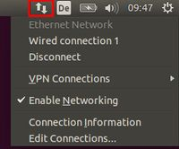

# Ubuntu 16.04 LTS

In den letzten beiden Jahren habe ich mit [Ubuntu 14.10 LTS](workbench/) sehr gute Erfahrungen gemacht. Durch einen Firmenwechsel wollte ich nun aber ein neues Image aufsetzen und das sollte nun teilweise auch mit Ansiblegescriptet werden.

---

# Basis-Installation und -Konfiguration

1. Download des ISO-Abbilds von http://releases.ubuntu.com/16.04/
2. ISO-Image (CD-ROM-Laufwerk) in ein neues VirtualBox-Image einbinden ... dann die Maschine starten.

## System Upgrade

Da das ISO-Artefakt schon ein paar Wochen alt ist, sind die installierten Pakete mittlerweile schon veraltet. Über 

    sudo apt-get install
    sudo apt-get upgrade

wird es auf dem aktuellen Stand gebracht.

## Installation der Gasterweiterungen

Nach dem erfolgreichen Reboot (diesmal in die grafische Oberfläche) ist die Auflösung so klein, daß ich kaum was erkennen kann. Ich binde die VirtuialBox-Gasterweiterungen über das VirtualBox Menü ein und automatisch wird die CD eingebunden und das Skript zum Installieren der Gasterweiterungen startet. Nach der Installation werde ich noch auf die unvollständige Sprachunterstützung hingewiesen. Ich hätte das Update-Skript direkt per Maus starten können, doch leider ist meine Internetverbindung (Authenifizierung am Proxy) noch nicht fertig eingerichtet. Nach einem Reboot habe ich auch endlich eine ordentliche Auflösung :-)

## root User

Hmmm, daß ich das Root-Passwort nicht kenne und nur per sudo bash auf eine Root-Shell komme ... irgendwie gefällt mir das nicht. Ist aber Ubuntu-typisch ... ich kann mich noch dunkel erinnern ...

Ich ändere das per

    sudo bash
    passwd

ab und vergebe ein neues Root-Passwort.

## Shared Folder Zugriff

Ein Ordner vom Windows-Host (z. B. ``C:\transfer``) wird zum Austausch von Dateien benutzt. Virtualbox bindet den Shared Folder z. B. unter ``/media/sf__VirtualBox_transfer_`` ein. Die Gruppe ``vboxsf`` hat die notwendigen Rechte. Deshalb müssen alle User, die Zugriff auf das Verzeichnis haben sollen, in dieser Gruppe sein:

    addgroup vboxsf myuser

Danach muß sich der User ab- und wieder anmelden.

## SSH-Server installieren und konfigurieren

* [siehe Kapitel "ssh"](ssh.md)

u. a. Ansible wird diese Vorarbeit später benötigen.

### Public-Private-Key-Generierung
* [siehe Kapitel "ssh"](ssh.md)

### ssh-Server: passwortlosen ssh-Zugriff erlauben
* [siehe Kapitel "ssh"](ssh.md)

Der im vorigen Abschnitt erzeugte Public-Key jedes zugreifenden Users muß im zugegriffenen User des Servers unter ``~/.ssh/authorized_keys`` abgelegt werden.

### ssh-agent: interaktive Passphraseabfrage umgehen
* [siehe Kapitel "ssh"](ssh.md)

Das Ansible-Skript soll ohne Interaktion auskommen. Da man i. a. aber eine Passphrase über den Private-Key legt, müßte dem Ansible-Controller die Passphrase bekannt sein. Das will man aber eigentlich nicht ... deshalb kann man den SSH-Agent damit beauftragen. 

---

# Software Installation

## Installation ansible
Ich werde die Installation und Konfiguration dieses Images zumindest teilweise scripten ... keine Ahnung, ob ich das wirklich gebrauchen

    apt-get install ansible
    
Danach muß ansible noch konfiguriert werden (ssh-keys, ssh-agent, ``~/.ssh/authorized_keys``) ... siehe [Ansible](ansible.md#).

## Weitere Installationen über Ansible
Meine Erklärungen fallen hier recht kurz aus, weil der Code die Dokumentation ist.
    
* midnight-commander
* awesome Fenstermanager
* zsh und oh-my-zsh
  * mit der ``~/.zshrc`` von GRML
* Oracle-Java-Installation
  * http://www.webupd8.org/2012/09/install-oracle-java-8-in-ubuntu-via-ppa.html
  * es gibt kein offizielles Ubuntu-Paket des Oracle-Java. Stattdessen habe ich mich entschieden ein **P**ersonal**P**ackage**A**rchive zu verwenden, weil das - gegenüber der Installation eines Tar-Balls - den Vorteil vom Idempotenz bei Verwendung von Ansible und automatischer Updates hat. Der PPA-Anbieter ist Launchpad hinter dem die Firma Canonical steht. Außerdem komme ich so um die leidige Alternatives Konfiguration rum. 
  * das PPA ``ppa:webupd8team/java`` umfaßt nur einen interaktiven Installer, der das Original Oracle JDK als tar.gz vom Oracle-Server runterlädt und installiert. Es es somit auch möglich, das tar.gz selbst vom Oracle-Server zu laden und lokal unter ``/var/cache/oracle-jdk8-installer`` abzulegen ... dann wird es nicht mehr innerhalb des Installers vom Server runtergeladen. Es ist aus lizenzrechtlichen Gründen nicht erlaubt, ein Paket anzubieten, das das JDK bereits enthält!!! 
  * dieser Installer kann auch Java 7 installieren ... nach der Installation läßt sich per ``sudo update-java-alternatives -s java-8-oracle`` bzw. ``sudo update-java-alternatives -s java-7-oracle`` zwischen den beiden Versionen umschalten.
* Docker 
  * https://docs.docker.com/engine/installation/linux/ubuntulinux/

## Eclipse IDE Spring Source Tool Suite (STS)

Ich hatte immer mal wieder mitbekommen, daß es Probleme mit Ubuntu und Eclipse gab. Vor der weiteren Konfiguration meiner Entwicklungsumgebung wollte ich das mal prüfen.

Ich verwende seit einiger Zeit die SpringSourceToolSuite (STS) - die gibt es in zwei Varianten:

    basierend auf Eclipse 3.8.2
    basierend auf Eclipse 4.3.2

jeweils in 32- und 64-Bit.

Ich probier es zunächst mit der 4.3.2 ... und bekomme irgendwann nur ein graues Fenster zu sehen ... das bleibt gefühlte 5 Minuten dort stehen und dann erblicke ich die gewohnte Benutzeroberfläche. Nicht ganz, denn das Menü ist nirgends zu sehen :-( Ich mach mal einen Restart von STS ... der sollte ja schneller gehen, weil der Workspace nun ja initialisiert ist. Denkste ... es dauert wieder sehr lange. Ob genauso lang soll ein erneuter Restart zeigen ... Ich habs nicht gestoppt ... aber unter 3 Minuten war es nicht :-( Die CPU war während der Zeit aber im idle Mode ... auf der Konsole sehe ich - kurz bevor sich die STS-Oberfläche tatsächlich mal präsentiert - ein paar OpenGL Warnings (glCombinerParameterfvNV not found in mesa table ... und weitere) und die Fehlermeldungen:

    libGL error: core dri or dri2 extension not found
    libGL error: failed to load driver: vboxvideo

Vielleicht liegt es an dem noch nicht installierten ExtensionPackage (weil VirtualBox mit dem authentifizierenden Proxy seine Probleme hat) oder es liegt an der aktivierten 3D Beschleunigung (siehe compiz-Problem oben) oder es liegt an der Proxy-Konfiguration in Eclipse (auf den Marketplace kann ich nämlich auch nicht zugreifen). 

Zumindest ist das Menü jetzt sichtbar :-) Man muss allerdings zugeben, daß die Menüs in Ubuntu nicht mehr im Fenster direkt angezeit werden, sondern ganz oben am Bildschirm. Wenn man das Fenster nicht auf Vollbild hat, dann ist das auch schon mal leicht zu übersehen ... ich bin mir jetzt also nicht mehr 100% sicher, daß es beim ersten mal nicht zu sehen war.

Auch unter dem Fenstermanager awesome ist der Start genauso langsam (nicht, daß ich was anderes erwartet hätte).

Ich installiere auch mal die STS basierend auf Eclipse 3.8.2. Es startet auch nicht besonders schnell (aber zumindest ein bissl schneller) - auch nicht beim zweiten und dritten Mal. Im Gegensatz zu 4.3.2 sieht der Splash-Screen beim Start kaputt aus (die Schrift ist abgeschnitten).

schon irgendwie frustrierend ...

## PgUp und PgDn fürs Autovervollständigen über die History

Dieses sehr praktische Feature war out-of-the-box nicht vorhanden. Aber wozu gibts denn Google (http://superuser.com/questions/600430/linux-page-up-key-to-browse-through-history) ...einfach

    "\e[5~": history-search-backward
    "\e[6~": history-search-forward

in die ``~/.inputrc`` packen.

## VPN

Ich verwende eine Bridged-Netzwerkverbindung. Die Netzwerkverbindung muss stehen, damit ich darauf aufsetzend den VPN-Tunnel starten kann.

Über das Tool ``nm-applet`` konfiguriere ich eine OpenVPN-Verbindung. Die Konfiguration bekomme ich von der IT meines Vertrauens über eine ``.ovpn`` Datei, die mir zusammen mit ein paar Zertifikaten und einem User Private Key zur Verfügung gestellt werden. Diese entpacke ich in ein Verzeichnis ``~/.openvpn``, auf das nur ich Zugriff habe (chmod 500).

Über die Gnome-Oberfläche kann man das komfortabel über den Network-Manager durchführen. Sollte man einen spartanischeren Fenstermanager verwenden, der keine Mausbedienung ermöglicht, so geht das durch Starten des Tools ``nm-applet`` (oder auch ``nm-connection-editor``):

Dieses Tool kann man aus anderen Fenstermanagern auch per Console starten. Mit der rechten Maustaste gelangt man in den Konfigurationsassistenten, mit der linken Maustaste baut man anschließend die VPN-Verbindung auf.

Es wird eine neue Connection mit dem Connection Type per *Import a saved VPN configuration* angelegt. Die Konfiguration steckt in der ``.ovpn`` Datei, die man dann auswählt. Die Zertifikate/Keys sollten dann auch schon eingetragen sein, so daß nur noch ein Username einzutragen ist.

Nach Initiierung der VPN-Verbidnung muss man die Credentials eingeben (in meinem Falle Passwort und Yubikey) und dann wird die Verbindung aufgebaut. Der Tunnel ist als ``tun`` per ``ifconfig`` sichtbar.

### Historie: seit Dezember 2014 geht es ohne Probleme

Unter einem frühen Ubuntu 14.04 schlug der Import meiner OpenVPN-Einstellungen kommentarlos mit einem Segmentation-Fault fehl ... Herr Google liefert einen Bug in Ubuntu 14.04:

* https://bugs.launchpad.net/ubuntu/+source/network-manager-openvpn/+bug/1294899

Ein Workaround (http://askubuntu.com/questions/450493/openvpn-cant-import-configurations-on-new-14-04-installation) und auch die manuelle Konfiguration schlagen leider fehl.

## LVM-Manager 

Hier fehlte mir ein grafisches Tool. Hier (http://wiki.ubuntuusers.de/Logical_Volume_Manager) fand ich:

* system-config-lvm (Gnome): das stürzte bei mir gleich wieder ab mit einem BadAlloc
* kvpm (KDE): funktionierte bei mir

Ich habe schon ein paar mal mein VirtualBox-Image vergrössern müssen (mit Virtualbox-Command-Line-Tools ``clonehd``, ``modifyhd``). Nachdem das Image vergrössert war, musste ich den neuen Plattenplatz noch ins Ubuntu integrieren. Hierzu habe ich den ``kvpm`` verwendet:

* unter Storage Devices den neuen freien Bereich anklicken (*Type: freespace*) und mit der rechten Maustaste *Add Disk Partition*.
* unter ubuntu-vg (VolumeGroup) ein neues Logical Volume anlegen (Create logical Volume)
* die neue Partition (z. B. ``/dev/sda3``) unter *Storage Devices* anklicken, rechte Maustaste und *Extend Volume Group ubuntu-vg*.

## Lombok-Eclipse-Extension

Die normales Lombok-Implementierung (leider verwenden wir das) führte zu sehr hohem Speicherverbrauch und hoher CPU-Auslastung ... im Prinzip war Eclipse so nicht nutzbar, es gab immer wieder folgende Fehlermeldungen (ohne Lombok keine Probleme) .. und das mit ``-Xmx1500m``:

    Lombok annotation handler class lombok.eclipse.handlers.HandleEqualsAndHashCode failed
    GC overhead limit exceeded

Ich habe rausgefunden, daß das ein gängiges Problem ist und es von Lombok eine sog. Edge-Version gibt. Die scheint tatsächlich besser zu sein.

Dennoch kommt mein Loboked-Eclipse dann nicht mehr mit 20-30 Projekten zurecht. Es wird deutlich flüssiger, wenn ich mich auf einige wenige beschänke (aber insgesamt wird mein Eclipse dadurch deutlich schneller - auch mein SVN-Plugin ist schneller). 

## Gnome-Keyring

Dieser Passwort-Speicher ist automatisch dabei und auch eingeschaltet. Er speichert alle Passwörter, die man nach der Anmeldung am System noch so braucht (z. B. svn-Passwort).

Der Keyring ist auch mit einem Passwort geschützt, das allerdings nicht automatisch mit dem Linux-User-Login-Passwort synchronisiert ist. Ändert man das Linux-Passwort des Users, so macht es evtl. Sinn, das Keyring-Passwort auch gleich zu ändern. Hierzu startet man ``seahorse`` von der Kommandozeile und drückt auf *Passwords - Login* die rechte Maustaste und dann *Change Password*.

## Postfix Mailserver

* http://wiki.ubuntuusers.de/Postfix

Von meinen Suse-Distributionen war ich gewohnt, dass ein Mailserver (bin mir nicht sicher ob es Sendmail oder Postfix war) vorhanden war, um zumindest intern zwischen Usern (z. B. nach Cronjobs) Mail zu verschicken. Dort waren auch standardmässig die Tools ``mail`` und ``mailx`` installiert.

Als ich dann mal einen Mailserver für die Applikationsentwicklung brauchte, musste ich ihn nachrüsten. Ich entschied mich für Postfix (statt Sendmail) - ist ja mittlerweile Standard:

    su -
    apt-get update
    apt-get install postfix

hier öffnet sich dann auch gleich ein Konfigurationstool ... ich entschied mich für den local Use-Case (mit Mailboxen im mbox-Format, weil ich ``mailx`` als Mailclient verwenden wollte). Nach 3 Minuten war die Installation/Konfiguration erledigt,        anschließend waren auch die Tools ``mailq`` und ``sendmail`` installiert, mit denen mal die Mail-Queue des Servers überwachen kann. Der Postfix wurde dann auch gleich ins Runlevel 3 eingetragen und war gestartet.

Nach einem 

    apt-get install bsd-mailx

sind auch die Tools ``mail`` und ``mailx`` vorhanden, um Emails von der Kommandozeile aus zu senden und das eigene Postfach zu verwalten.

Schreiben der ersten mail:

    i000921@myMachine:~/> mail -s "testSubject" i000921
    Hallo User i000921, das ist ein Test.
    Cc: 
    
Anschauen des Postfachs:

    i000921@myMachine:~/> mail
    Mail version 8.1.2 01/15/2001.  Type ? for help.
    "/var/mail/i000921": 1 message 1 new
    >N  1 i000921@myMachine  Fri Aug 29 15:16   14/485   testSubject

Die Mails befinden sich dann in der Datei ``/home/i000921/mbox`` ... und können natürlich auch per less gelesen werden

Das ging wirklich sehr einfach :-)

## Apache 2.x

Gute Links:

* Core + SSL: https://help.ubuntu.com/10.04/serverguide/httpd.html
* SPDY:
  * https://developers.google.com/speed/spdy/mod_spdy/install
  * http://www.howtoforge.com/using-mod_spdy-with-apache2-on-ubuntu-12.04

Mein Vorgehen:

* Basis-Installation: ``sudo apt-get install apache2``
* SSl-enabling:
      sudo a2enmod ssl
      sudo a2ensite default-ssl
      service apache2 restart
  * test https://localhost im Browser
* SPDY enabling
      wget https://dl-ssl.google.com/dl/linux/direct/mod-spdy-beta_current_amd64.deb
  * leider funktioniert dieses Modul nur mit Apache 2.2 ... mein LTS 14.04 kommt aber nur mit Paketen für Apache 2.4 ... deshalb habe ich es erst einmal aufgegeben ... vielleicht eine Chance, den Apache im Docker-Container laufen zu lassen.

---

# Fazit

Die Installation und Konfiguration war nahezu problemlos und hat 4-6 Stunden gedauert (inkl. vollständiger Entwicklungsumgebung). Auf den ersten Blick bin ich mit Ubuntu sehr zurfieden ... zumal es ja doch einige Konfigurationswizards mitbringt und man nicht immer nur in Konfigurationsfiles rumhantieren muss (als Linuxer ist aber auch das kein Problem ... solange die Daten nicht redundant über das System verstreut sind).

Nach nun 2 Monaten täglicher Nutzung (8-10 Stunden) bin ich weiterhin sehr zufrieden ... der erste Kernel wurde auch schon getauscht ... alles problemlos :-)

Nach 2 Jahren bin ich weiterhin zufrieden ... jetzt werde ich auf Ubuntu 16.04 LTS umsteigen.

