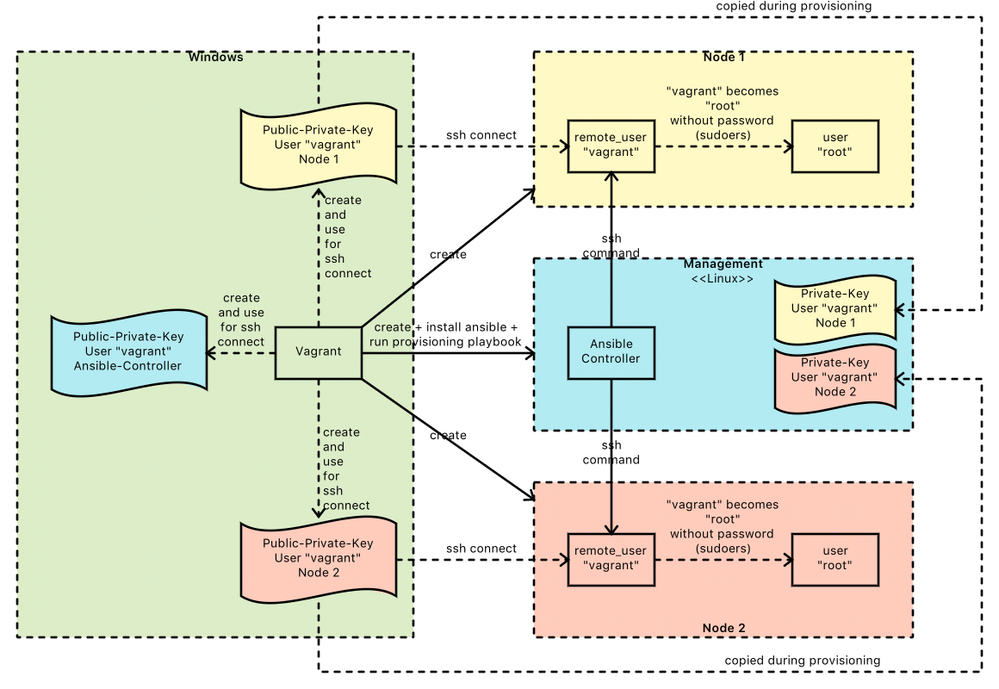

# Vagrant-Ansible-Integration

Vagrant erlaubt das Provisioning von Maschinen über die Provider

* ``ansible``: das ist der typische Remote-Ansatz
* ``ansible_local``: hierbei erfolgt die Ausführung des Playbooks lokal auf dem Guest-System

---

## Windows-Host

Für eine komplette Automatisierung meiner [Workbench (VirtualBox-Linux-Image)](workbench.md) hatte ich die Idee, mittels Vagrant und Ansible ein komplett automatisiertes Setup zu scripten.

### Remote Ansible Provider ... funktioniert nicht

* http://docs.ansible.com/ansible/guide_vagrant.html

Der typische Ansible-Ansatz ermöglicht die Ausführung von Kommandos via ssh. Insofern paßt es perfekt in ein Vagrant-Host/Guest-Szenario - der Host sendet via ssh (wird von Vagrant eh schon konfiguriert) die entsprechenden Shell-Kommandos zum Guest.

Einzige Voraussetzung ist die Installation von Ansible auf dem Host-System. Leider wird diese Einschränkung für Windows-Host-Systeme zum Ausschlußkriterium, denn Ansible wird für Windows nicht unterstützt. Für mein Workbench-Szenario kam diese Lösung demnach nicht in Frage.

### Local Ansible Provider

In diesem Fall muß Ansible nicht auf dem Host-System, sondern auf dem Guest-System (= Linux-System) installiert werden. Das erfolgt ...

* entweder automatisch durch die Option ``install`` (ACHTUNG: funktioniert nicht mit Vagrant 1.8.1, wohl aber mit 1.8.4 ... https://github.com/mitchellh/vagrant/issues/6858):

    config.vm.provision "ansible_local" do |ansible|
       ansible.playbook = "playbook.yml"
       install = true
    end

* oder per Shellscript-Provisioning im Vagrantfile - vorher muß natürlich das entsprechende Repository im Guest-System eingetragen sein (beim ``install_mode = default``) oder Ansible wird über den Python-Paketmanager installiert (beim ``install_mode = pip``):

    config.vm.provision "shell", inline: <<-SHELL
        sudo apt-get install -y ansible
    SHELL

Die ``ansible_local`` Variante hat den Charme, daß Ansible auf dem Host-System nicht installiert werden muß und am Ende hat man auf dem Guest-System einen vollwertigen Ansible-Controller. Das hat folgende Vorteile:

* das Host-System wird nicht verändert
* das Ansible-Provisioning einer Vagrant-Maschine kann auch unter Windows KOMPLETT automatisiert (scriptbasiert) erfolgen
* über den Ansible-Controller können weitere Zielsysteme gesteuert werden. Dieses Setup entspricht dann beispielsweise

Das abzuspielende Playbook wird vom Guest über den den Shared-Folder. Die Location ist über ``provisioning_path`` konfigurierbar. Die Defaulteinstellung gilt ``provisioning_path=.``, d. h. das Playbook liegt parallel zum ``Vagrantfile`` und ist dann unter ``/vagrant/`` ins Gast-System eingebunden.

#### Blue-Print: zentraler Ansible-Controller

Ich halte den Aufbau eines zentralen Ansible-Managment-Knotens für empfehlenswert. Dieser Management-Knoten wird per ``ansible_local`` mit ``ansible.install = true`` komfortabel aufgebaut. Von dort aus wird das Playbook wie üblich gegen die Zielsysteme (per ssh-Kommando) abgespielt.

So könnte das dazu passende Vagrantfile aussehen (https://www.vagrantup.com/docs/provisioning/ansible_local.html):

    Vagrant.configure("2") do |config|

      config.vm.box = "ubuntu/trusty64"

      config.vm.define "node1" do |machine|
        machine.vm.network "private_network", ip: "192.168.1.10"
      end

      config.vm.define "node2" do |machine|
        machine.vm.network "private_network", ip: "192.168.1.20"
      end
      
      config.vm.define 'management' do |machine|
        machine.vm.network "private_network", ip: "192.168.1.99"

        machine.vm.provision :ansible_local do |ansible|
          ansible.playbook       = "myPlaybook.yml"
          ansible.install        = true
          ansible.inventory_path = "inventory"
        end
      end

    end

Dabei werden drei Maschinen aufgebaut. Zuerst die beiden Knoten ``node1`` und ``node2`` (als Repräsentaten beliebiger Solution-Komponenten), auf denen zunächt kein weiteres Provisioning definiert ist. Zum Schluß wird der  Ansible-Controller ``management`` erzeugt, von dem aus das Provisioning aller Knoten über das Playbook ``myPlaybook`` getriggert wird.

In dem Beispiel (https://www.vagrantup.com/docs/provisioning/ansible_local.html) wird versucht, die Private-Keys des User ``vagrant`` auf den jeweiligen Maschinen (``node1``, ``node2``) für den ssh-connect des Ansible-Controllers (``management``) zu verwenden. Das ist prinzipell eine exzellente Idee, weil man sich so spart den Public-Key des Users ``vagrant`` auf den beiden Knoten zu hinterlegen. ABER: ssh-clients verhindern die Nutzung der Private-Key-Authentifizierung, wenn die Permissions falsch gesetzt sind (Stichwort 600/700 ... siehe [ssh-Kapitel](ssh.md)). Deshalb müssen die Zugriffsrechte für den Shared-Folder folgendermaßen gesetzt sein:

    config.vm.synced_folder "./", "/vagrant", 
        id: "vagrant-root", 
        owner: "vagrant", 
        group: "vagrant", 
        mount_options: ["dmode=700,fmode=600"]

Aus meiner Sicht ist das eh die beste Konfiguration, denn niemand soll den Shared-Folder ``.`` (in dem das ``Vagrantfile`` und weitere Skripte/Konfigurationen für das Provisioning liegen) ändern können (**Vorsicht: Seiteneffekte**). Sollte der Gast Daten mit dem Host austauschen wollen, dann kann ein weiterer Shared-Folder konfiguriert werden.

---

## Fehlersuche

### vagrant up --debug

Der Standard Vagrant-Mechanismus.

### ansible.verbose = true

Das leidige Thema ... auf jeden Fall sollte man den Schalter ``ansible.verbose = true`` im Vagrantfile setzen:

    machine.vm.provision "ansible_local" do |ansible|
        ansible.install  = true
        ansible.playbook = "playbook.yml"
        ansible.limit = "all"
        ansible.verbose = true
    end        

Dadurch werden die auf dem Guest ausgeführten Befehle auf der Konsole angezeigt. Sieht ein wenig komisch aus:

    MANAGEMENT: Running ansible-playbook...
    cd /vagrant/management/ansible &&
      PYTHONUNBUFFERED=1 
      ANSIBLE_FORCE_COLOR=true 
      ansible-playbook 
      --limit="all" 
      --inventory-file=
        /vagrant/management/ansible/ansible-inventory 
      -v 
      playbook.yml
    Using /vagrant/management/ansible/ansible.cfg as config file

Mit diesen Informationen lässt sich die Suche fortsetzen. Per ``vagrant ssh`` anmelden und das Kommando ausführen lassen ... allerdings mit der Ansible-Option ``-vvvv`` (sehr geschwätzig!!!) ... also das:

    cd /vagrant/management/ansible &&
      PYTHONUNBUFFERED=1 
      ANSIBLE_FORCE_COLOR=true 
      ansible-playbook 
      --limit="all" 
      --inventory-file=
        /vagrant/management/ansible/ansible-inventory 
      -v 
      playbook.yml
      -vvvv

Das erspart zumindest mal das teure Neuaufsetzen des gesamten Deployments.
