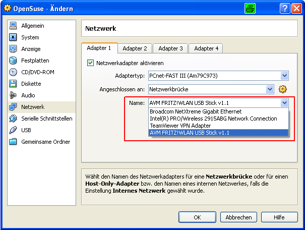
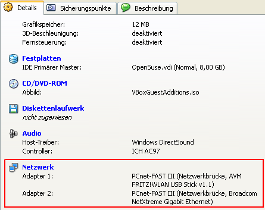

# VirtualBox
Sun's kostenlose Virtualisierungssoftware, deren Installer mit 70 MB erstaunlich klein ist (ein Adobe Reader hat heutzutage schon 25 MB, ein Druckertreiber hatte letzhin 50 MB).

Der Nahtlos-Modus macht die Integration in das Wirtsbetriebssystem nahezu perfekt - einzig: die Taskumschaltung innerhalb der VM (mit Alt-Tab) berücksichtigt nur die Programme der VM und im Wirt ist berücksicht nur seine eigenen Programme. Vielleicht ist das auch besser so, doch für eine richtig nahtlose Integration wäre das vielleicht ein nettes Feature. Ich bin mir aber nicht ganz sicher, ob ich das selber wollte - derzeit fällt es mir aber immer wieder auf und ich muss dann erst meine Maus aus dem Focus des VM-Fensters bewegen, um an die Windows-Programme zu kommen.

Nach jetzt 6-monatiger Nutzung bin ich immer noch begeistert von VirtualBox und weine VMWare keine Träne hinterher. Das hat sich auch nach einigen Jahren nicht geändert :-)

---

# Basis-Installation
verlief problemlos - click and go

---

# Image-Container anlegen
Hinsichtlich Zuordnung von Plattenplatz kann man es wohl sehr komplex treiben, doch hält man sich an die Anfänger-Vorgaben (die physische lokale Platte zu verwenden), dann ist der erste Image-Container nach 2 Minuten fertig :-)

Per Default wird ein Verzeichnis ``~/.VirtualBox`` angelegt, in dem sich zwei Unterverzeichnisse ``Machines`` und ``HardDisks`` befinden. In ``HardDisks`` liegen die eigentlichen Daten des Images in einer einzigen Datei (die Festplatte des Gastes sozusagen), in ``Maschines`` befindet sich die Konfiguration, LogFiles und Snapshots.

---

# Shared Folder
Über Shared Folder kann man Verbindung zum Wirtssystem aufnehmen. In einem Linux-Gastsystem mounted man den Shared-Folder per

```bash
mount -t vboxsf $SHARED_FOLDER_NAME $DIRECTORY
```

Allerdings müssen die Gasterweiterungen installiert sein, sonst steht das VBoxSF-Filesystem (VirtualBoxSharedFilesystem) nicht zur Verfügung.

Man kann auch die Option Automatisch einbinden wählen, dann wird das Verzeichnis automatisch als

```bash
/media/sf_<ORDNER_NAME>
```

gemounted. Allerdings hat man dann nicht soviele Konfigurationsmöglichkeiten wie über das "manuelle" (bzw. auch hier kann man das automatische Mounten bei Systemstart aktivieren) Mounten in Linux.

## Symbolische Links und HardLinks
Leider unterstützt das VBoxSF-Filesystem in Version 3.1.2 keine symbolischen Links und auch keine HardLinks im SharedFolder - das schränkt die Nutzung von einem Linux-Gastsystem deutlich ein :-( Mehr dazu siehe hier: http://www.virtualbox.org/ticket/818 - das Anlegen eines solchen Links wird mit der Meldung ``Operation not permitted`` quittiert.

## Owner und Group
Beim mounten per ``mount -t vboxsf SHARED_FOLDER_NAME MOUNTPOINT`` werden alle Dateien dem User Root zugeschlagen. Durch Verwendung folgender Mountoptionen lässt sich das ändern:

```bash
mount -t vboxsf -o uid=1000,gid=100 WINDOWS_C /mnt/WINDOWS_C/
```

``uid`` und ``gid`` kann man aus ``/etc/passwd`` erfahren. In der ``/etc/fstab`` sieht das dann folgendermassen aus:

```
WINDOWS_C     /mnt/WINDOWS_C     vboxsf     uid=1000,gid=100      0 1
```

---

# VM per Skript starten
Um eine VM per Skript oder per Mausklick zu starten (ohne das VirtualBox-GUI zum Auswählen des Images zu starten:

```
VBoxManage startvm "NAME_DER_VM"
```

---

# Netzwerkkonfiguration
## NAT
Bei der Verwendung von NetworkAddressTranslation fungiert die VirtualBox-Software als Router (der das Gastnetzwerk mit dem Hostnetzwerk verbindet - beide haben ganz unterschiedliche IP-Adressen). Das Gastbetriebssystem erhält von VirtualBox eine IP-Adresse (z. B. 10.0.2.15), die nichts mit der IP-Adresse des Hostsystem (z. B. 192.168.1.1) zu tun hat. Virtualbox leitet die Nachrichten dann an die physische Netzwerkkarte des Hostsystems weiter.

Das Gastbetriebssystem

* kann DHCP verwenden (der DHCP-Server wird dann von VirtualBox bereitgestellt)
* kann vom VirtualBox-Software-Router eine statische IP-Adresse erhalten ... dann sollte man aber [private IP-Adressen](http://de.wikipedia.org/wiki/Private_IP-Adresse) verwenden (keine öffentlichen)

In beiden Fällen sind die Gastbetriebssysteme und deren Services nicht von aussen nutzbar - Antworten auf vom Gastsystem initiierten Requests kommen aber an - über NetworkAddressTranslation. Über Port-Forwarding kann man Ports des Gastbetriebssystems (z. B. Port 80) an das Host-Betriebssystem (z. B. Port 8080) weiterleiten, so daß der Service des Gastbetriebssystems per ``localhost:8080`` (oder ip_address_host_machine:8080) erreichbar ist.

### Port-Forwarding mit NAT
Da bei NAT die Services des Gastbetriebssystems für den Host und auch andere Rechner im Netz nicht sichtbar sind (weil eben das Gastbetriebssystem nicht direkt adressiert werden kann - keine eigene IP-Adresse!!!), kann man sich per Port-Forwarding behelfen, um einzelne Services freizugeben.

Besonders interessant für meine Bedürfnisse ist das Port-Forwarding vom Wirtssystem an das Gastsystem, wenn kein richtiges Netzwerk vorhanden ist. Ich nutze ein Linux-Gastsystem in einem Windows-Wirtssystem und gebe den ssh-Server, den Webserver (mit diesem CMS-System) und die Datenbank meines Linux-Gastsystems an das Windows-System weiter. Auf diese Weise kann ich dann per

http://localhost:1701/exponent-0.96.3/index.php

vom Browser des Hostsystems auf den Webserver innerhalb meines Gastbetriebsystems zugreifen.

**Version 4:**

Über die Administrationsoberfläche von VirtualBox lässt sich die Portweiterleitung komfortabel konfigurieren. In Version 3.x war das noch ein bisschen umstädnlicher (s. u.)

**Version 3:**

So wurden die Ports freigeschaltet (ACHTUNG: in Abhängigkeit der eingerichteten Netzwerkkarte muss "pcnet" durch "e1000" oder "e100" ersetzt werden):

```
VBoxManage setextradata "MY_VM_NAME" "VBoxInternal/Devices/pcnet/0/LUN#0/Config/mysql/Protocol" TCP
VBoxManage setextradata "MY_VM_NAME" "VBoxInternal/Devices/pcnet/0/LUN#0/Config/mysql/HostPort" 3306
VBoxManage setextradata "MY_VM_NAME" "VBoxInternal/Devices/pcnet/0/LUN#0/Config/mysql/GuestPort" 3306

VBoxManage setextradata "MY_VM_NAME" "VBoxInternal/Devices/pcnet/0/LUN#0/Config/ssh/Protocol" TCP
VBoxManage setextradata "MY_VM_NAME" "VBoxInternal/Devices/pcnet/0/LUN#0/Config/ssh/HostPort" 22
VBoxManage setextradata "MY_VM_NAME" "VBoxInternal/Devices/pcnet/0/LUN#0/Config/ssh/GuestPort" 22

VBoxManage setextradata "MY_VM_NAME" "VBoxInternal/Devices/pcnet/0/LUN#0/Config/httpd/Protocol" TCP
VBoxManage setextradata "MY_VM_NAME" "VBoxInternal/Devices/pcnet/0/LUN#0/Config/httpd/HostPort" 1701
VBoxManage setextradata "MY_VM_NAME" "VBoxInternal/Devices/pcnet/0/LUN#0/Config/httpd/GuestPort" 80
```

**Wissenswertes:**
* diese Konfiguration wird in der Konfigurationsdatei der VM (VM_NAME.xml) gespeichert und lassen sich da natürlich auch bequem editieren (und vor allem in einer Versionsverwaltung wie Subversion versionieren)
* die Parameter von VBoxManage sind hier dokumentiert: http://www.virtualbox.org/manual/UserManual.html#vboxmanage
* die Änderungen an der VM per VBoxManage-Tool wirken sich erst nach einem Neustart bzw. Warmstart (Aufwachen aus dem Suspend-Modus) aus.
* Will man die aktuellen Einstellungen der VM erfahren: ``VBoxManage getextradata "MY_VM_NAME" enumerate``
  * ACHTUNG: VirtualBox sollte bei Eingabe dieser Befehle nicht laufen (und dementsprechend soll auch das Image MY_VM_NAME nicht laufen - es muss nicht komplett runtergefahren sein, der Suspend-Mode genügt). Bei VirtualBox 3.1.2 hatte ich einen BlueScreen nach Eingabe obiger Befehle und Neustart von VirtualBox. Nach dem Rechner-Restart klappte der Start von VirtualBox allerdings und auch das Port-Forwarding funktionierte. 

## Netzwerkbrücke aka Bridged-Mode
Hier nutzt das Gastbetriebssystem die von VirtualBox emulierte Hardware - deshalb muss man auch die zu verwendende Hardware (Ethernet, WLAN) auswählen (und natürlich auch umstellen, wenn physisch auf ein anderes Interface gewechselt wird). Für das Gastbetriebssystem erscheint das Interface dann immer wie ein Ethernet-Anschluss, auch wenn es sich physisch um eine WLAN-Verbindung handelt.
Das Gastbetriebssystem bekommt eine eigene IP-Adresse vom DHCP-Server, den auch das Hostsystem verwendet. Auf diese Weise verhält sich das Gastbetriebssystem wie jeder andere Rechner im Netzwerk. Das Gastbetriebssystem ist von anderen Rechnern im Netz über diese IP-Adresse erreichbar (bei NAT geht das nicht ohne weiteres - hier kann man Port-Forwarding konfigurieren).

---

# Gast-Betriebssystem installieren - allgemein
Mein OpenSuse liegt als ISO-File auf der Platte - deshalb konfiguriere ich das CD-Laufwerk mit diesem ISO-File und starte das Image. Es wird von der gebundenen CD (in Form der ISO-Datei) gebootet und ich kann mein System installieren.

## Gasterweiterungen installieren
Zunächst startet das Image nur mit 800 x 600 Pixel und lässt sich auch nicht vergrössern (das Fenster wird schon größer, aber leider nicht der Gastbetriesbsystem-Bildschirm). Ein bisschen googeln zeigt, dass in den Gastbetriebssystemen der VirtualBox (wie bei VMWare auch) Gasterweiterungen installiert werden müssen. Hierzu wählt aus dem VM-Menü "Geräte - Gasterweiteerungen installieren" - im Hintergrund wird ein Image VBoxGuestAdditions.iso in den Manager für virtuelle Medien (Menüpunkt: Geräte - CD/DVD-ROM einbinden - CD/DVD-ROM-Abbild ... - CD/DVD-Abbilder) eingebunden (Achtung: im Linux-System findet noch kein Mounting dadurch statt - einzig: das ISO-File mit den Gasterweiterungen ist im Manager für virtuelle Medien eingetragen). Anschließend muss man es noch über den Manager für virtuelle Medien auswählen und mounted es (mkdir tools; sudo mount /dev/cdrom tools) und dann führt man das Installationsskript aus (cd tools; ./VBoxLinuxAdditions-x86.sh). Bei meinem Opensuse musste ich noch die Kernel-Sourcen und noch ein anderes Paket nachinstallieren und schon konnte ich im Gastbetriebssystem (über Yast) eine höhere Auflösung einstellen :-)

### Problem: Gasterweiterungen werden nicht geladen
Ich hatte mal das Problem, dass ich plötzlich nicht mehr auf den Shared Folder zugreifen konnte. Ich rebootete das System und versuchte den Shared Folder zu mounten (mount -t vboxsf sharedFolderName myMountPoint ODER mount.vboxsf sharedFolderName myMountPoint), doch ich bekam die Nachricht

```
/sbin/mount.vboxsf: mounting failed with the error: No such device
```

Da ``lsmod | grep vbox`` weder ``vboxadd`` noch ``vboxvfs`` lieferte und auch ``modprobe vboxadd`` und ``modprobe vboxvfs`` nicht funktionierte, entschied ich mich, die Gasterweiterungen erneut zu installieren. Und das klappte tatsächlich :-) Warum die Gasterweiterungen plötzlich weg waren - ich weiss es nicht (vielleicht ein Linux-Update, das etwas zerstört hat ...).

## VPN im Gastbetriebssystem
Ich habe das bisher in der Variante "Bridge-Mode über Ethernet/WLAN" in einem Ubuntu-Gastbetriebssystem betrieben. Im Gastbetriebssystem muss zunächst eine normale Netzwerkverbindung hergestellt sein. Darauf aufesetzend wird dann ein VPN-Tunnel per ``nm-applet`` gestartet. Über das ``nm-applet`` erfolgt auch die Konfiguration. Siehe [hier](http://localhost:1701/exponent-0.96.3/index.php?section=466).

## Resizing der Festplatte
### Resizing mit Bordmitteln: FEHLGESCHLAGEN
Ich hatte gerade ein Problem in meinem Haupt-Image ... es lief immer wieder voll und ich konnte nur mit Mühe immer mal wieder ein bisschen Platz freigeben, um die Updates einzuspielen. Früher oder später müsste ich mich mit der Vergößerung beschäftigen, aber alles was ich bisher darüber gelesen hatte schien mir aufwendig (z. B. http://www.dedoimedo.com/computers/virtualbox-shrink-expand-disks.html). Leider hatte ich auch kein LVM auf diesem Linux-System verwendet, sonst hätte ich einfach eine weitere virtuelle Festplatte eingehangen und die Partition vergrößert :-(

Glücklich las ich von VirtualBox 4.0, das angeblich eine Resize-Funktion out-of-the-box besaß ...

Nach der Installation (sicherheitshalber fertigte ich mir eine Kopie des Festplattenfiles an) musste ich allerdings erst mal ein paar Probleme aus dem Weg räumen:

* in der Konfigurtaion per GUI wurde mir immer wieder angezeigt, daß die MAC-Adresse ungültig sei (ich verwendete NAT). Die automatische Generierung einer neuen hat nicht funktioniert. Ich konnte den Konfigurationsdialog nicht mal normal beenden - kill process war die einzige Lösung. Ich stellte auf andere Netzwerkkonfigurationen um (nicht NAT), das funktionierte, aber Netzwerk hatte ich dennoch keins :-( Nach einem Neustart des VirtualBox-Launchers (das Programm, das alle VMs anzeigt), konnte ich dann auch irgendwann mal NAT einstellen. Das Netzwerk in meinem VM-Image funktionierte aber trotzdem nicht. In meinem Suse-System zeigte ein rcnetwork restart, daß die vorhandene Netzwerkkarte (eth1) im System nicht konfiguriert sei. tatsächlich war bei mir nur eth0 konfiguriert. Ich hatte zwar die erste Netzwerkkarte im VirtualBox konfiguriert, doch das war scheinbar nicht mehr eth0, sondern eht1. Also schnell mal per Yast konfiguriert und schon klappts mit dem Nachbarn. Meine Port-Freigaben musste ich dann allerdings auch umkonfigurieren ... ich änderte (in der XML-Konfigurationsdatei)

```
VBoxManage setextradata "MY_VM_NAME" "VBoxInternal/Devices/pcnet/0/LUN#0/Config/httpd/Protocol" TCP
```

nach

```
VBoxManage setextradata "MY_VM_NAME" "VBoxInternal/Devices/pcnet/1/LUN#1/Config/httpd//Protocol" TCP
```

Das erhoffte Disk-Extending blieb jedoch aus ... ein

```
VBoxManage modifyhd myHardDiskFile.vdi --resize 2000
```

zeigte mir die lange Nase mit der Fehlermeldung

```
Progress state: VBOX_E_NOT_SUPPORTED
VBoxManage.exe: error: Resize hard disk operation for this format is not implemented yet!
```

Tja, eigentlich sollte es seit 4.0 supported sein, aber nur für dynamisch wachsende VDI-Formate. Ich bin mir zwar sicher, dass ich eine dynamisch wachsende Platte habe, aber ...

Vorerst komme ich noch mit dem bisschen Platz aus ... vielleicht klappt es ja dann irgendwann auch mit meiner VirtualMachine :-)

Die neue Version startet deutlich schneller aus dem Suspend-Mode ... ich bin jedenfalls bisher sehr zufrieden.

### Resizing über Cloning: ERFOLGREICH
Meine Platte war mal wieder voll und modifyhd resize funktionierte wieder nicht (siehe oben). Deshalb probierte ich ein clonehd, um anschließend ein modifyhd zu machen (siehe hier: http://brainwreckedtech.wordpress.com/2012/01/08/howto-convert-vdis-between-fixed-sized-and-dynamic-in-virtualbox/). Vielleicht besaß ich ja tatsächlich ein Image fester statt dynamischer Größe.

Das folgende ``clonehd`` sorgt dafür, daß eine Disk mit dynamisch wachsender Größe erzeugt wird ... solche lassen sich dann per ``modifyhd``-resize vergrößern.

**clonehd:**

```
$ /cygdrive/c/Program\ Files/VirtualBox/VBoxManage.exe clonehd
      OpenSuseIcw_20130517.vdi suseIcw.vdi --variant Standard
    0%...10%...20%...30%...40%...50%...60%...70%...80%...90%...100%
    Clone hard disk created in format 'VDI'. 
    UUID: b6462b06-3e89-496f-aa6f-009977a75e1c
```

Ich habe hier schon mal folgende Fehlermeldung bekommen:

```
VBoxManage.exe: error: Cannot register the hard disk 
  '...UbuntuIncreased.vdi' {f9030452-7e4c-4eef-b833-2d86dad01111}
because a hard disk 'C:\Dev\UbuntuIcwIncreased.vdi' with 
  UUID {f9030452-7e4c-4eef-b833-2d86dad01111} already exists
VBoxManage.exe: error: Details: code E_INVALIDARG (0x80070057), 
  component VirtualBox, interface IVirtualBox, callee IUnknown
VBoxManage.exe: error: Context: "OpenMedium(Bstr(pszFilenameOrUuid).raw(),
  enmDevType, enmAccessMode, fForceNewUuidOnOpen, pMedium.asOutParam())"
        at line 178 of file VBoxManageDisk.cpp
```

Das lag daran, daß die zu erweiternde Festplatte noch als Virtuelles Medium eingetragen war und keine neue Platte mit der gleichen UUID hinterlegt werden kann. Ich habe die alte Platte dann einfach vom Image abgemeldet und aus den virtuellen Medien gelöscht. Dann hat der clonehd-Befehl funktioniert.

**modifyhd:**

```
pfh@WDF-LAP-1103 /cygdrive/c/Dev
$ /cygdrive/c/Program\ Files/VirtualBox/VBoxManage.exe modifyhd 
    suseIcw.vdi --resize 30000
    0%...
Progress state: VBOX_E_NOT_SUPPORTED
VBoxManage.exe: error: 
  Resize hard disk operation for this format is not implemented yet!
```

Also auch net ... und das obwohl es sich um ein dynamisches VDI-Format handelt:

```
pfh@WDF-LAP-1103 /cygdrive/c/Dev
$/cygdrive/c/Program\ Files/VirtualBox/VBoxManage.exe showhdinfo suseForIcw.vdi
UUID:                 c0e044f8-44ce-4cb5-b423-40695b1cafc4
Accessible:           yes
Logical size:         30985 MBytes
Current size on disk: 21856 MBytes
Type:                 normal (base)
Storage format:       VDI                       <------
Format variant:       dynamic default           <------
Location:             C:\Dev\suseForIcw.vdi
```

Was ist da los?

Komisch ... ich hab jetzt an die neue Größe einfach mal eine 0 drangehangen und jetzt hats geklappt (vorher war die Platte logisch 21856 MB groß - 30720 wäre also auch schon größer gewesen):

```
pfh@WDF-LAP-1103 /cygdrive/c/Dev
$ /cygdrive/c/Program\ Files/VirtualBox/VBoxManage.exe modifyhd suseForIcw.vdi --resize 30720
0%...
Progress state: VBOX_E_NOT_SUPPORTED
VBoxManage.exe: error: Resize hard disk operation for this format is not implemented yet!
```

```
pfh@WDF-LAP-1103 /cygdrive/c/Dev
$ /cygdrive/c/Program\ Files/VirtualBox/VBoxManage.exe modifyhd suseForIcw.vdi --resize 307200
0%...10%...20%...30%...40%...50%...60%...70%...80%...90%...100%
```

Mir scheint Sun ... eh Oracle müsste mal das ExceptionHandling überarbeiten - die Fehlermeldungen scheinen echt keine große Hilfe zu sein :-(

Ich schätze, daß der Erfolg jetzt nicht unbedingt am Cloning lag, sondern an der deutlich erhöhten Größe - vielleicht interpretiert er die Zahl in einer anderen Einheit ...

## Resizing auf die harte Tour: ERFOLGREICH
Im groben:

* neue (größere) virtuelle Festplatte erzeugen und ins Image einhängen
* Inhalt der alten (kleinen) Festplatte per dd auf die neue (große) Festplatte kopieren
* nicht genutzten Platz der großen Festplatte durch Resizing (per GParted) verwenden

Im Detail:

* Einbindung von ``gparted-live-0.11.0-7.iso`` als Linux-Live-System in das Image (dieses Live-Image soll später gestartet werden - also evtl. Boot-Reihenfolge so ändern, daß von CD gebootet wird)
* Anlage und Einbindung einer größeren virtuellen Festplatte ins Image
* Booten des GParted-Live-Systems
* Prüfung, welche Festplatte über welchen Device-Treiber erreichbar ist. Ich hatte die alte Festplatte am primären Master (``dev/sda``) und die neue Festplatte am primären Slave (``dev/sdb``).
* Kopieren der Daten von der alten Festplatte auf die neue:
  * ``sudo bash``
  * ``dd if=/dev/sda of=/dev/sdb``
* Reboot des GParted-Systems (damit die neue Festplatte richtig eingebunden wird - entscheidend sind hier die ``/dev/disk/by-id/*`` Informationen)
* Prüfung welche ID (im folgenden ID_NEUE_FESTPLATTE genannt), die neue Festplatte hat. Hierzu in ``/dev/disk/by-id/`` die ID der neuen Festplatte herausfinden und eintragen in
* neue Festplatte konfigurieren
  * mounten der neuen Festplatte
    * ``sudo bash``
    * ``mkdir neueFestplatte``
    * ``mount /dev/sdb2 neueFestplatte``
  * Bootvorgang der neuen Festplatte anpassen
    * ``vi ./neueFestplatte/boot/grub/menu.lst``
    * hier ID_NEUE_FESTPLATTE an alle relevanten Stellen eintragen (also dort wo bisher die ID der alten Festplatte stand)
    * ``vi /./neueFestplatte/etc/fstab``
    * hier ID_NEUE_FESTPLATTE an alle relevanten Stellen eintragen (also dort wo bisher die ID der alten Festplatte stand)
* per GParted-Tools die relevante Partition der neue Festplatte um den nicht genutzten Bereich erweitern
* System runterfahren
* GParted entfernen
* alte virtuelle Festplatte entfernen
* System neu starten
* Prüfung, ob nun mehr Platz frei ist: df -h

## Resizing ausserhalb von VirtualBox-Features:
Wenn man das Linux-Gastsystem mit einem Logical-Volume-Manager aufgesetzt hat, dann kann man auch eine weitere Festplatte zum virtuallen Image hinzufügen und in den LVM einhängen.

---

# Windows-Wirtssystem und Linux-Gastsystem - die perfekte Console für Windows
Verwendete Komponenten:

* VirtualBox Linux-Gastsystem
* Nicht-Fangen des Mauszeigers durch das Gastsystem (hierzu müssen die Gasterweiterungen installiert sein)
* Festplatten des Windows-Wirtssystems als Shared-Folders bereitstellen und in das Linux-Gastsystem einbinden
* Optional:
  * ssh-Server auf dem Linux-Gastsystem mit Port-Forwarding von VirtualBox
  * ssh-Client (z. B. Putty) mit X11-Forwarding
  * Xming (X-Server) auf dem Windows-Wirtssystem

So kann man die Konsole des Linux-System verwenden, um auf der Festplatte des Windows-Systems zu arbeiten. Durch die optionalen Komponenten kann man die Integration weiter optimieren, so dass die Konsole tatsächlich seamless in das Windows-System integriert ist (der eingebaute seamless-Mode von VirtualBox arbeitet noch nicht so gut). Als Goody erhält man die Möglichkeit per ssh-Client remote auf den Windows-Partitionen zu arbeiten.

Wenn jetzt noch die symbolic-Links bzw. HardLinks auf SharedFolders funktionieren würde (siehe oben), hätte man eine perfekte Konsole für das Windows-System. Ein Grund [cygwin](cygwin.md) zu nutzen bestünde dann nicht mehr.

---

# Erfahrungsberichte verschiedener Gastbetriebssysteme
## Gast-Betriebssystem installieren - OpenSuse 11.1
Ein wenig problematischer gestaltete sich die Netzwerkkonfiguration. In VMWare hatte alles out-of-the-box funktioniert und jetzt hatte ich doch Probleme. Man muss hier nämlich das Image umkonfigurieren, in Abhängigkeit davon, ob man eine Netzwerkverbindung per WLAN oder Netzwerkkabel aufbauen möchte. Es hatte zwar direkt nach der Installation über mein Netzwerkkabel funktioniert, doch als ich einen Tag später über den WLAN-Stick ins Internet gehen wollte klappte das nicht mehr und frustrierte mich doch sehr :-(

Schließlich hatte ich doch den piep-einfachen Bridged-Mode verwendet, der bei VMWare doch auch immer klappte. Nach mehrmaligem RTFM fand ich doch noch heraus, dass man den virtuellen Netzwerkadapter an ein physisches Gerät binden muss - in den VirtualBox Administrationstools:



So schaffte ich zumindest, aus dem Gastsystem wieder aufs Internet zugreifen zu können. Um beim Wechsel auf meine kabelgebundene Netzwerkverbindung nicht immer wieder das Image runterfahren zu müssen, habe ich einen Adapter für die kabelgebundene Variante und einen Adapter für die wireless-Variante konfiguriert:



Doch leider klappte der Zugriff vom Host-System auf mein im Gastsystem mittlerweile wieder laufendes Exponent-CMS (LAMP - Linux, Apache, MySql, PHP) nicht. Da der Firefox 3.5 im Gastsystem doch sehr, sehr langsam mit meinem Exponent-System kommunizieren wollte (der Seitenaufbau war schnarch-lahm - keine Ahnung warum) war ich extrem frustriert und hielt schon Ausschau nach einem Ersatz-Laptop (oder gar einer fetten Workstation) - zugegeben: ich wollte mir auch endlich mal wieder was gönnen und nahm das Problem jetzt zum Anlass ...
Nachdem ich dann doch ein wenig ziellos bei der Rechnersuche war, widmete ich mich doch ein wenig entspannter dem Problem und gleich meine erste Vermutung stimmte: die Linux-Firewall verhinderte den Zugriff. Schnell eine Ausnahme eingebaut (Zugriff auf den HTTP-Server) und schon konnte ich die Seiten aus meinem Hostsystem (Windows XP) in gewohnter Geschwindigkeit editieren :-)

## Gast-Betriebssystem installieren -Ubuntu 14.04 LTS
Hier musste ich die 3D-Beschleunigung in den VM-Setting aktivieren, weil ansonsten der compiz-Prozess eine ganze CPU gebraucht hat und mein System extrem zäh war.

---

# VirtualBox 4.x
Mit 4.0.2 hat sich die Folderstruktur geändert ... eigentlich eine gute Sache, denn alle Dateien eines Images sind nun in EINEM Ordner vereint.

## Upgrade 4.0.0 -> 4.1.8: FEHLGESCHLAGEN
Beim Wechsel von 4.0.0 auf 4.1.8 kam es bei mir unter einem Windows XP Wirtsystem zu einem Absturz (BlueScreen mit fw.sys ...) am Ende der Installation. Nach ein paar Abstürzen hintereinander wurde das System wieder stabiler ... nur leider hatte ich keine WLAN-Verbindung mehr. Erst nach einer Rückkehr auf 4.0.0 lief das WLAN wieder und die Bluescreen verschwanden. Auf einem anderen Rechner hatte ich eine laufende/stabile 4.1.8 und ich versuchte leider vergeblich, mein unter 4.0.0 laufendes Image zum Laufen zu bringen. Weder direkt noch über einen Export/Import.

## I/O-Performance
Die "normale virtuelle Plattenperformance" ist ganz ok ... nicht so gut wie nativ aber durchaus so gut, daß ich meine Entwicklungsumgebung innerhalb meine Gast-Linux ohne deutlichen Zeitverlust laufen lassen kann (z. B. auch maven builds die sehr viele Dateien erzeugen und dementsprechend viel I/O-Last erzeugen).

Die I/O-Performance sowohl über Shared Folders als auch über USB 2.0 ist sehr schlecht. Ein paar Beispiele:

* im Zuge meiner GIT-Recherchen habe ich feststellen müssen (siehe hier - Abschnitt Performance), daß ein git status über ein Shared Folder bzw. USB 2.0-Stick 30 Sekunden bzw. 0 -60 Sekunden (sehr schwankend) statt 1 Sekunde.
* ein ``mvn clean install`` auf der "normalen virtuellen Platte" dauerte 2 Minuten - auf einem Shared Folder 11 Minuten.

## USB 2.0
Vorab: hat man einen USB-Stick eingebunden, dann ist er für das Wirtsystem nicht nutzbar. Wer das nicht möchte, sollte den USB-Stick über SharedFolder einbinden.

Für USB 2.0 Support muss man das Extension-Pack installieren, in der VM-Konfiguration USB 2.0 aktivieren und einen Filter einrichten (ohne Filter hat es bei mir nicht funktioniert ... ich bin mir aber nicht ganz sicher, ob es wirklich daran lag, denn ich habe viel rumspielen müssen, um einen USB-Stick einzubinden - hat nicht sofort funktioniert). Nach einem Restart sollte man über das VM-Menü den USB-Stick aktivieren können - es poppt dann ein Fenster hoch.

---

# VMs zwischen Maschinen austauschen
Hierzu gibt es u. a. folgende Möglichkeiten

* VM als Appliance exportieren (z. B. im OVA-Format) und dann importieren
* VM anlegen und nur die Festplatte wiederverwenden 

---

# FAQ
**Frage 1:** 

seit 4.3.20 habe ich das Problem, daß ich mein Gastbetriebssystem (Ubuntu 14.04 mit installierten Gast-Erweiterungen) nicht mehr über zwei Bildschirme ziehen kann ... es zieht sich immer wieder auf einem Bildschirm zusammen oder das Fenster ist zwar über zwei Bildschirme gezogen, aber das Gastbetriebssystem nutzt nicht beide Bildschirme (Ränder an den Seiten). Was ist da los?

**Antwort 1:** 

Dieses Problem hat mich fast in den Wahnsinn getrieben. Ich war schon drauf und dran downzugraden. Jetzt habe ich einen verlässlichen Weg gefunden:

* Automatische Anpassung der Gastanzeige: ABSCHALTEN
* Fenster über zwei Bildschirme ziehen (rechts und links sind dann weisse Bereiche)
* Automatische Anpassung der Gastanzeige: ANSCHALTEN - dadurch schrumpft das Fenster auf einen Bildschirm zusammen
* Automatische Anpassung der Gastanzeige: ABSCHALTEN
* Fenster über zwei Bildschirme ziehen ... Voila

**Frage 2:** 

Meine Images werden nicht mehr im VirtualBox-GUI angezeigt, aber ich habe sie nicht gelöscht. Wie bekomme ich die da wieder rein?

**Antwort 2:** 

Mir ist das mal probiert als ich mit Vagrant (mit VirtualBox als Provider) rumgespielt habe. Die .vbox Dateien, in der sich die Konfiguration des Images befindet, war noch vorhanden (``$HOME/VirtualBox VMs/...``) - und die dort eingehangene Festplatte auch.
Durch einen Doppelclick aus dem Windows-Explorer auf die vbox-Datei erscheint das Image auch wieder im GUI.

**Frage 3:** 

Wenn ich auf meinem Image NAT eingestellt habe und Port-Forwarding mache, dann komme ich nicht auf den forgewardeten Webserver (http://HOST_IP:FORWARD_PORT/application). Ich habe schon überprüft, ob der forgewardete Port vielleicht nur an das Localhost-Interface gebunden ist ... aber das ist nicht der Fall.

**Antwort 3:** 

Ich habe noch keine Antwort gefunden ... mein Workaround ist die Änderung von NAT auf Bridged, so daß das Image eine eigene addressierbare IP hat und ich dann auch mit dem Standardport zugreife: http://IMAGE_IP:80/application.

**Frage 4:** 

Ich habe Virtualbox 5.0.20 installiert. Zudem noch das Extension Pack. In meiner Ubuntu 14.04 LTS habe ich die Gästeerweiterungen installiert. Ich bekam zwar den Hinweis, daß die Kernel-Header-Dateien fehlten, aber die Installation klappte ohne Fehlermeldung. Nach dem Neustart war mein Bild aber noch immer in 640 x 480 Auflösung. Das war mir bisher noch nicht untergekommen ... bisher starteten die Maschinen dann immer in einer ordentlichen Auflösung. Wie bekomme ich eine normale Auflösung?

**Antwort 4:**

Mit "Anzeige - Automatische Anpassung der Gastanzeige" hat es funktioniert ... es hat dann aber 3-4 Sekunden gedauert bis die grauen Balken um den Screen weggingen ... puh

**Frage 5:** 

Seit dem Update auf 5.0.20 habe ich Probleme mit der Genauigkeit der Maus. Wenn ich einen Test markieren will, dann wird die Zeile drüber markiert. Die Gästeerweiterungen sind installiert und up-to-date. Auch ein Restart des Systems hat nichts gebracht.

**Antwort 5:** 

Bei mir hat es geholfen im Menü "Eingabe - Mauszeiger-Integration" kurzzeitig zu aktivieren und wieder zu deaktivieren. Danach war alles gut. Seltsam ... vielleicht ein Initialisierungsproblem???

**Frage 6:**

Ich wollte eine Appliance zwischen zwei Rechnern durch Neuanlage einer VM und Einbinden der Festplatte transportieren. Beim Start der Vm bekomme ich aber einer Fehlermeldung ``Could not find /dev/disk``.

**Antwort 6:**

In meinem Fall hatte ich die Festplatte als SATA-Platte eingebunden ... die Platte war in der alten VM aber als IDE-Platte eingebunden. Nachdem ich sie als IDE-Platte eingebunden habe, hat es einwandfrei funktioniert.